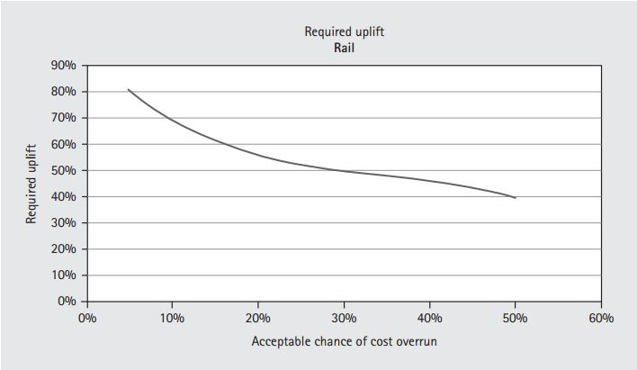

```{r, echo=FALSE, include=FALSE}

library('knitr')
library('ggplot2')
library("plyr")
library("dplyr")
library('magrittr')
library('reshape2')
library("rpart")
library('car')
library('e1071')
library('party')
library('randomForest')
library('RColorBrewer')
library('pwr')
library('scales')


# detect OS
if(.Platform$OS.type == 'windows'){
        # setwd("C:/Users/n9232371/Documents/Consultbusiness/data")
        opts_knit$set(root.dir= "C:/Users/n9232371/Documents/github/consult/finalwriteup/report_data")
} else{
        # setwd("~/OneDrive/shared files/Bligh Tanner/masters/data")
        # setwd("~/Documents/github/consult/finalwriteup/report_data")
        opts_knit$set(root.dir= '~/Documents/github/consult/finalwriteup/report_data')
}

opts_chunk$set(fig.width=6.7, dpi = 300, warning = FALSE, message = FALSE, echo = FALSE)
```

Originality Statement

'I hereby declare that this submission .... look up QUT'

Signed .................
Date....................

# Abstract

* Abstracts allow readers to quickly decide whether the research is relevant to their own interests
* get at your main argument quickly
* explain the purpose, goal methods, and results


* why did you do the study?, what is the problem
performing loss-making jobs for fixed fees is a major problem in the consulting, particularly in the competitive construction industry. 

* why is it important?
affects the porfitability of a company which impacts the careers, internal morale, and even viability of a company.

* why should someone read your essay?
learn if a company's passively collected data could help them avoid loss making jobs or tactfully enforce strictier contracts.

* what is your main claim?
improve profitability by 9% by avoiding ~4% of projects is a possible way to interpret the agorithm output. other ways are possible.

* discuss variables and your approaches
variables: main employee, % time by each type of employee, team size, client charactersitcs, project characteristics (size, type of work, length)
approaches: complex data with mnay variables, thousands of data points. tried regression as well as machine learning algs: randomf roest and boosted trees, bayesian networks, naive bayes.

* describe evidence to support your claim
hundred of cross validated trials using the 5 methods, as well as 5 blending methods. obtained a 95% confidence interval for each method and simple logistic regression of three models outperformed the others, closely followed by simple averaging. the 95% confidence interval across all cross validated trials was __ to __ profit improvement.

* overview of most important sources


* Results: answer , was hypothesis supported
hypothesis was supprted: CAN improve bottom line of business by mobilising their passively collected data into mL algorhtms.

* implications of your work, meaning
more work to be done on testing the user interface and user ailities further. could assist managers in making better decisions about which projects they should reject or develop a more careful contract structure to improve profits.


# Table of Contents

# Table of Figures

# List of Tables

# Acronyms

**ANOVA** - Analysis of Variance. A statistical test that can be applied to find whether there is a significant difference between the means of more than two groups. 

**B2B** - Business to Business. Commerce transactions between two businesses.

**CBR** - Case based reasoning. A method of estimating by using the results of similar cases. 

**CRM** - Customer Relationship Management. Refers to a common type of software used by businesses to record client and project details as well as employee timesheet records. Generally accessable to each employee in a company. 

**DAG** - Directed acyclic graph. A graph consisting of vertices connected by edges, where each edge directs a vertex to another vertex. The arrangement of the edges is such that a vertex cannot follow a path that loops back to itself. 

**IT** - Information technology. The use of computers for storing, retrieving and processing information. 

**BIM** - Building Information Modelling. A digital representation of physical characteristics of an object or structure. 

**ROC** - receiver Operating Characteristic. An ROC curve plots the performance of a binary classification algorithm its scoring threshold is varied.

**AUC** - Area under the curve. In this project, the area refers to the area under an ROC curve. Areas greater than 0.5 indicate predictions performing better than random chance while an area of 1 indicates perfect predictions.

**TP** - True positive. The case where a case marked 'positive' in a dataset is correctly predicted 'positive' by an algorithm. Generally, 'positive' is assigned to categories for which the use case needs to be alerted. 

**FP** - False positive. A case marked 'negative' in a dataset is incorrectly predicted 'positive' by an algorithm.

**TN** - True negative. A case marked 'negative' in a dataset is correctly predicted 'negative' by an algorithm.

**FN** - False negative. A case marked 'positive' in a dataset is incorrectly predicted 'negative' by an algorithm.

**TPR** - True positive rate. The proportion of positives that were correctly identified (true positives).

**FPR** - False positive rate. The proportion of positives that were incorrectly identified (false positives).

**DA** - Discriminant analysis. Statistical analysis to predict a categorical response variable. 

**CLV** - Customer Lifetime Value. Prediction of the profit a customer will bring over the course of a business' relationship with the customer.

**IQR** - Interquartile range. A measurement of spread or variability for a continuous variable. When the data is ordered numerically and divided into four equally sized portions, the values that divide the portions are called quartiles (first, second, third and fourth quartiles). The first quartile has the highest value of the lowest quarter. The interquartile range is the third quartile value minus the first quartile.

**ESS** - Error sum of squares. The sum of squared errors from a set of predictions.

**RMSE** - Root mean squared error. The square root of the mean of the ESS.

**FWLS** - Feature weighted linear stacking. A linear combination of model results which are interacted with original variables. This allows certain models to be weighted heavier for certain values of the original features.


# Acknowledgements

# Publications

Cook, A., Wu, P., & Mengersen, K. (2015, September). Machine Learning and Visual Analytics for Consulting Business Decision Support. In Big Data Visual Analytics (BDVA), 2015 (pp. 1-2). IEEE. 

# Chapter 1: Introduction

Predicting how long it will take a person to do something is a notoriously tricky task. People make mental calculations of this sort every day - estimating how long it will take to drive to meet someone on time, how many tasks you can check off in a day, or how long it will take to cook a dish. As most people have experienced, these estimates can be particularly inaccurate if the individual is attempting the task for the first time. These errors are trivial in everyday activities, but they have more meaning for businesses that sell their time as their chief revenue. 

Consulting businesses give expert advice to other professionals, in exchange for a fee for the amount of time a consultant spent on the problem. The delivery of 'expert advice' is generally in the form of a document (which could be anything from a report to hundreds of drawings) and can range from an hours advice to thousands of hours work. Before a project commences, the client and consultant must agree on a fee for the expert advice, or at least a fee structure. The nature of how a fee is formulated can be as creative as the engaged parties wish, however a couple of simple examples are as follows: the client agrees to pay for the consultants time by the hour until the task is complete, or the consultant provides a fixed fee to complete the project in full, regardless of their hours spent. Both contracts assign financial risk to one party which must then mitigate the risk to ensure profitability.

This thesis focuses on the risk taken by a consulting company when agreeing to a fixed fee. Clients commonly collect fixed quotes from several consultants before settling with one or negotiating further so fees must be competitive. The way a consulting manager calculates their fixed fee varies from industry to industry and even company to company. Typically a consulting manager has experience in the type of project they are quoting and can use a combination of intuition, rules of thumb (such as a fraction of the entire project cost), and comparison to past projects. Such methods can result in a range of profit margins which ultimately depend on how well the manager predicts the amount of time a project demands. 

This thesis examines the problem of cost prediction via a case study on a company's internal project performance data for the previous twelve years. Statistical models based on historical project data were tested for their ability to predict profitability of projects using characteristics available at the beginning of a project. Furthermore, the potential for a model's predictions to improve a company's bottom line is investigated. This could be achieved with a strategy for how the model's predictions should change managers' fee proposals for risky projects. Due to the commercially sensitive nature of the data used, the source is not disclosed in this dissertation. Variables have also been renamed to ensure confidentiality is maintained, however, no such obfuscation has been applied in the methods used – which are presented with integrity.


# Chapter 2: Problem Description

In this chapter the research motivations are explained along with the goals of the project and the specific research hypotheses. Finally the contributions of this body of work are outlined along with the structure of the thesis.

## Research Motivation

**Problem Description:**

Project managers have struggled with forecasting project costs accurately for decades, across many industries. A study on large-scale infrastructure projects over the past seventy years revealed that cost forecasts consistently underestimated the cost of rail projects by 44.7%, the cost of bridge and tunnel projects by 33.8% and the cost of road projects by 20.4% [@Flyvbjerg2007]. A study across 1471 IT projects showed that 27% of projects ran over budget, and one in 6 of those projects were more than 200% over budget on average [@Flyvbjerg2011]. These statistics cast a concerning light on projects' hidden financial stories which can cause job losses, ruin private businesses, and shrink government balance sheets. 

Although complex projects are more likely to run over budget, they reflect the complexities and priveleges of modern society - from major infrastructure, to housing, websites, and movies. All have functional and/or statutory requirements which are defined by a client, and are discharged through contracts to companies via a financially competitive process. Consulting companies who complete portions of these complex projects accept the financial risk that is contractually transferred to them. More specifically, the risk of the project owner is often transferred to their sub-consultant by mandating fixed flat fee structures to complete a given amount of work. The subconsultant commits to completing their role in a project for a nominated price, regardless of whether the work takes less or more time than initially anticipated. For privately owned businesses, mitigating this risk would increase the chances of the business surviving as well as growing and succeeding.

The ramifications of unprofitable projects are multifold. Employee morale deteriorates and employees may view themselves incompetent if they are responsible for the project's delivery. Employees also experience elevated stress attempting to complete underestimated projects within a disappearing budget and may compromise quality of work in exchange for speed. This experience is unfortunate if in reality, the project fee was under-estimated. Unprofitable projects also limit a business' ability to invest money into marketing, training, and business development which would foster growth. The financial risk taken on fixed flat fee projects may also discourage businesses from taking other, more calculated risks, such as expanding the business into a new area. Logically, improving the prediction of project profitability could positively affect business growth opportunities and staff morale.

**Why It's Not Easily Solvable:**

The challenge for consultants to reduce budget blowouts, in terms of hours spent, is not easily solved. Complex projects always differ from one another - similar work may demand significantly different amounts of time. For example, an ad filmed in a remote location will cost significantly more than an ad filmed on an existing set, even though the effect of the final advertisement could be identical. Therefore, a constant fixed price to produce an advert is clearly inappropriate, but some kind of fixed price is often demanded by the client before a project is awarded. Charging clients by the hour is not competitive enough in many industries. Other consultancies are often willing to offer a fixed flat fee for the same work, luring the client with reduced financial risk on their part. 

Another strategy to mitigate risk is to agree to track employee hours, and stop work once the fixed consulting fee has been depleted. Then, negotiate further fees, or variations, with the client. This approach may satisfactorily reduce a consultant’s financial risk, however, may cause friction between the client and the consultant and affect potential repeat custom. Especially if the project followed a predictable process but the hours inflated beyond expectation (a common situation), consultants may prefer to wear losses or endure marginable profits to preserve their client relationship. Consultants may believe it is in their best interest to maintain a reliable, trustworthy reputation in their industry above creating financial friction. Clearly, there is not a straightforward contractual solution to reducing the financial risk taken on by consultant's who offer fixed fees in complex projects. In many industries, the reality of fixed flat fee structures are unavoidable and businesses conform to survive.

**Current Practice:**

Limited research is available on complex-project cost estimation techniques performed by industry. However, two surveys are available from 2000: one on construction projects, the other on IT projects. The construction cost estimation study by @Akintoye2000 surveyed 84 UK construction contractors, ranging from small to medium to large, about their estimating practices. They found that the main method for cost estimation was breaking the project into detailed parts and adding up the cost of each item. The next two most popular methods were 'comparison with similar projects based on documented facts', and 'comparison with similar projects based on personal experience'. These can all be classified as experience based models [@Akintoye2000].

A survey by Moores and Edwards in 1992 of 54 software developing companies found that detailed project planning tools were used by most companies as opposed to cost estimation tools, suggesting that projects were priced based on an analysis of a detailed breakdown of tasks within a project. In the same survey, 91% of software companies cited cost estimation as a problem. Although recent literature is limited,  cost estimation was identified as a problem and it was hypothesised that inexperience and lack of time were chief contributors [@Akintoye2000].

**Cost Estimation and Human Nature**

@Lovallo2003 tackled the psychology behind the high failure rates of executives in predicting costs of projects such as manufacturing plant construction, mergers and acquisitions, large infrastructure and software development. Their theory stems from Kahneman's work on decision-making that won him the Nobel Prize for economics in 2002. His research argues that a person's natural optimistic view of their own skills leads to consistent underestimation of the time and risks involved in a project. A manager optimistically sees challenges in a project as something that can be overcome by the team's high skill level, and downplays or ignores the risk of problems that are out of the team's control. It is for this reason that it does not matter if the project is broken down to the highest level of detail for cost prediction, all complex projects are at risk of encountering a multitude of problems that the manager could never foresee. Each problem has a low chance of occurring, but in combination the risk is much greater [@Lovallo2003]. 

@Lovallo2003 call the practise of analysing a project based on project details and its unique complexities the 'inside view'. This contrasts with an 'outside view' where a subject is analysed by comparison to other subjects and disregarding specific subject details. For example, research has shown that if people make predictions about their skills after being exposed to an 'outside view' (a summary of other people's skills), their predictions are significantly more accurate. According to @Lovallo2003, this 'outside view' can be applied to complex projects, and stipulates that the details of the current project are ignored in favour of analysing outcomes of several similar projects. Mobilising the outside view in this way is called reference class forecasting [@Lovallo2003]. One method @Lovallo2003 recommend is to obtain correlation statistics from past similar projects - the correlation between the forecast cost and the actual cost. The correlation for the current project can then be estimated via a statistical model, which is then used to adjust the forecasted cost made by detailed analysis (the inside view) [@Flyvbjerg2011]. Managers rarely analyse data from similar projects even though it could significantly improve cost predictions [@Flyvbjerg2011]. This tendency led to a formalised introduction of 'outside view' methods into some institutions. 

The implementation of reference class forecasting began in project management for the first time in 2004. It was endorsed by the American Planning Association in 2005, and is now used in some governments and private companies in Europe, South Africa, and Australia. An example of the type of output from a reference class statistical model is a plot showing the relationship between the acceptable chance of cost overrun and the required uplift to the original forecasted cost [@Flyvbjerg2011]. An example reading from this chart would be "If the chance of a cost overrun of 20% is acceptable, the estimated cost should be increased by 55% from original calculations.". This builds past experiences of cost overruns into the initial cost estimation.



The visualisation presents a powerful communication tool for influencing decision makers and improving forecast cost accuracy, however, access to credible data for a sufficient number of projects can be a challenge [@Flyvbjerg2011]. Overall, the theory of optimism bias is a credible explanation for the problem of persistant underestimation of project costs. The accompanying solution of reference class forecasting presents a promising solution given enough accurate data.

The theory of reference class forecasting was first definitively published in 2003, however, the idea of predicting project costs from previous data has been the subject of research for many preceding years and continues to this day. Although research results have often been promising, industry uptake of the idea is not yet established. 

### Further Reference Class Forecasting Models and Industry Uptake

In the following section, an overview of several attempts to integrate reference class forecasting will be presented followed by published theories for the lack of industry uptake.

#### Existing Models

A substantial amount of research on project cost prediction has been dedicated to the fields of software development and construction projects, along with some work in the film industry. These analyses have generally used project information from 15 to 20 large projects. A single dataset may consist of projects completed in different countries with different clients and project teams. The mathematical methods used to predict project costs vary from statistical regressions to deep-learning Neural Networks [@Love2005][@Kim2004]. Most studies report their predictive models perform well and that generally Neural Networks are more accurate than Linear Regression.

A McKinsey study outlined a case in the film industry where a motion picture company used reference class forecasting of movie revenue (cases were weighted by similarity) to decide which movies should be heavily promoted. This model improved forecasts on financial return by 135% relative to comparison of a movie to a single past case [@Flyvbjerg2014].

The existing models have shown predictive success, however the data and intention from this case study differs from previous studies. Prediction of construction cost is a different problem from consulting effort estimation and uses different variables (except the variables describing the construction project since the consulting company works in the construction industry). Software effort estimation projects are estimating time, however past studies have compared projects across many companies (obtained by surveys etc) while the case study company has access to their data only. Additionally, their data contains a rich variety of variables which cannot be exctracted from surveys. The use of their own data would also improve trust in model outputs.

#### Industry Uptake of Existing Models and Current Practices

A survey of the construction industry in the UK in 2000 found that a manager's experience and intuition is still the dominant method for construction cost calculation [@Akintoye2000]. Surveys on current industry practice in cost estimation are scarce, however, another study on the IT industry by @Jorgensen2007 argued that previously developed parametric models were not comprehensive enough to be used in industry and that expert judgment was not mobilised enough in the process of developing these tools. 

Although the surveys reveal reference class models have not gained traction in either the software or construction industry, it is worth outlining their current practices in cost estimation, fee structures, and the reasons behind these. In the construction industry, infrastructure and building projects follow a traditional process, where contractual norms have developed over many decades [@Badenfelt2011]. The industry is so large, broad and well established that it has inertia in the way projects are estimated, and contractually bound. The contractor (builder) first reviews the drawings and if the plans are not detailed enough, they offer a temporary budget price. Once they feel that the drawings are sufficiently detailed, they will offer a fixed price [@Badenfelt2011]. As the job progresses however, if additional work on top of the detailed drawings is required, the builder maintains the right to charge a variation [@Badenfelt2011]. A dual source of income therefore exists, the initial proposed fee for construction along with variations due to additional materials (and time required to install the materials) that were not explicitly specified on drawings. Variations fees are generally calculated after completion the work, but the initial construction fee contains risk. Material costs are forseeable but labour and time estimates can still be under calculated, even from detailed drawings. For large infrastructure projects, small percentage miscalculations can be exceedingly expensive. 

The builders' procedure of calculating a fixed price from detailed drawings and charging for variations does not translate to other consultants in the construction industry involved with the design of structures, such as engineers and architects. These consultants develop the detailed plans for the builders, and must therefore offer fixed price contracts based on low-detail preliminary drawings that sum up the client's expectations. It is also much harder for a consultant to charge variations for portions of their time spent on items that were not included in the original simple plans. Time is less tangible than physical additional materials required, and often is shrugged off by consultants for the sake of client relationships. This is despite the real and common instance of budget blow outs due to overspent time [@Harris1999]. One method of creating a variation opportunity is by stipulating a percentage fee of the final building cost that can overrule the original fixed price contract. If a consultant has spent time beyond their fixed price budget, this may account for some or in the best case, all, of their overspent time.

Construction projects generally are completed more on time and on budget when compared to IT projects as the greatest cost is the project is building materials [@Badenfelt2011]. Unlike time, building materials can be accurately calculated from detailed design drawings. Again, this omits data from consultants who are part of the building industry but charge based on their time only.

In contrast to construction, IT projects are a relatively new practise where alternative contractural arangements have been trialed. Through experimentation with contracts, the Agile movement was developed. In summary, the method treats both cost and time as fixed quantities for a project, and any change or additional work can only be accommodated if another, less important requirement is excluded [@Badenfelt2011]. Furthermore, the project outcomes are continually adjusted ad revised based on frequent progress review points that assesses unexpected problems. This agile attitude has become ingrained in many IT practices and the flexible upfront arrangement with clients often forges better long term relationships [Cockburn2001]. 

It is not completely clear why industry uptake of cost estimation tools using the outside view has been weak, and it may be the case that in modern industries such as the IT industry, problems associated with cost estimation can be innovatively designed out of the contract. Possible reasons that parametric reference class forecasting models developed by researchers have not been incorporated into industry practice include: 

* lack of appropriate data
    * if a project is unique, such as a national infrastructure project, it many not feel appropriate to gather sufficient data points from other countries and time periods.
* lack of understanding from industry decision makers - the prediction process was not explained well in marketing of the tools
* models were not developed in collaboration with industry
* does not feel intuitive to price from an 'outside view' of a project which disregards small project details
* insufficient time allocated to pricing that makes change burdensome

In fact, a study by @Moores1992 concluded that a lack of framework to support use of the outside view model and a failure in marketing were the two most common explanations for lack of uptake of parametric cost estimating tools. This is unfortunate as almost all research in the area indicates an outside view analysis of a job substantially improves cost estimation accuracy for fixed price projects [@Moores1992]. 


### Case Study

This research explored the potential for reference class forecasting to improve cost estimation in the context of an engineering consulting company in the construction industry. In this field, labour is the chief cost and the long traditional history of this industry mandates fixed price projects as the norm. In recent years, the size of losses from unprofitable projects in the case study equalled up to 25-30% of the profits from profitable projects. This demonstrates substantial room for improvement and the possiblity of multitude positive flow on effects. 

Cost estimation is currently performed by first carefully reviewing preliminary drawings for a project where time costs will be calculated using a manager's personal experience with similar projects. This is often cross-checked with a value based off a percentage of the estimated final cost of construction (generally the client budget). No formal mathematical method of comparison to similar projects is performed. This is the case for a number of possible reasons: 

* lack of time to interrogate past project data
* clunky data availability offered by the current database software
* lack of awareness of similar projects performed by other managers

A Customer Relationship Management software package (CRM) was employed by this company to collect and store project data. A CRM is a popular type of software used by businesses to record client and project details as well as employee timesheet records. In the case study business, the CRM is available to all employees over the company intranet, and each employee completes daily timesheets alotting their hours to certain projects. Additionally, information is recorded against each project as well as each client, client contact, and each invoice. 

Reference class forecasting in this study differs from previous research in that statistical analysis was performed on internal past company project data that had been progressively recorded in the company's CRM. This presented an opportunity to evaluate reference class forecasting in a unique situation, where the 'reference' projects were all internal and a comparatively large number of cases (over 2,000 projects) were available.

The CRM data stood as an untapped source of information within the case study organisation. It stores a rich variety of data including:

* employee timesheet hours with dates
* other project costs (taxis, printing)
* client information/characteristics
* client identification code
* invoiced amounts for each project and dates
* employee costs
* employee charge out rates
* project description

A statistical or machine learning model predicting a measure of project financial success was developed using the available project information and by trialing numerous machine learning algorithms and statistical methods. The company uses well established CRM software which readily provides simple output statistics, however, analytical capabilities were limited to:

* simple scatter plots and bar charts of the raw data
* summaries such as overall hours spent vs. invoiced amount for each project

The company had a wealth of data but limited means to extract insight. This study will exploit the CRM data by performing more sophisticated statistical analysis with the intention of building a predictive model for cost estimation. The benefits of this study in comparison to previous cases are that thousands of past data points are available, when previous studies used on average 15-20 cases and at most 300 [@Finnie1997][@Pai2013][@Shin2015]. This improves the potential for accurate predictions. If successful, the model also has higher potential for managerial uptake as the algorithm will be directly built and trained on company data. Managers can interrogate 'similar' data points and relate to the actual projects or speak to a colleague who was involved. This has the potential to give the 'outside view' stronger influence on the final decision.

    
### Case Study Limitations

The case study provided a framework to test the value of a consulting company's CRM data in assisting project cost estimates. However, it was important to be aware of limitations when reviewing outcomes and framing the problem. The most obvious limitation is that a single company is being disected in a specific industry, which limits the ability to state conclusions applicable to a broad range of companies. This can be overcome with future studies, once a range of optimal methods and variables have been determined. Other constraining factors include various forms of missing data and human data entry error. 

The data set from this case study includes scarce information on the overall cost of entire construction projects. For example, managers commonly price jobs based on the budget for the entire project, of which the consultant is a minor part. The manager might typically moderate his fee by say 1% of the entire project cost. The value of the entire project has typically not been recorded although there is an allotted space in the project database for this. It would be even more beneficial for managers to record the expected total project cost at the beginning of a project versus the concluding completed cost. Another piece of data not recorded was the external factors influencing the fixed price quote including competition from similar firms that clients may have played against the case study company.

In addition to the missing data mentioned above that could be entered by workers in the future, the database also excludes the detailed information about projects that contribute to final pricing. Such details include the preliminary drawings describing the project (square meterage, number of storeys), and project summaries provided by the client to enable a quote. This level of information will never be recorded in a CRM and in many ways contradicts the purpose of the 'outside view', the intention of which is to present similar projects without being over-influenced by the finer details. Given this lack of detailed information, it was not reasonable for an algorithm to predict the numeric fee for a project. It appeared much more effective to predict the profitability of a project (ie return per dollar) based on available data. This profitability is a ratio between amount invoiced and business costs. The algorithm therefore would predict the ratio of these two values based on fees and costs generated using the established method of fee proposals and time expenditure in historical cases.

Finally, CRM data is entered by employees manually as time passes, jobs are invoiced, and projects are finally completed. Because the data is input by people, it is susceptible to input error. Many errors were detectable during data cleaning, however it is possible that a low number of undetectable human errors exist in the data and marginally influence predictions. 

Although this case study presented an opportunity to test the predictive power held within the organisations' existing CRM data, limitations exist which must be understood and built into the framework of the problem. These include missing data that could have been entered for each project, but historically has not been required, missing data that is very detailed and will never be available, and the potential for a small degree of human error to be embedded within the data. 

### Research Motivation Summary

Fixed price cost estimation for complex projects is a difficult task and when performed incorrectly, can have devastating affects on businesses and governments. Many theories have delved into human nature and our tendency to optimistically assess our capabilities with respect to a given task. In this case, the optimism often results in negative business consequences affecting employee morale and the capacity of a company to flourish and grow. Over the past few decades, significant research has been dedicated to creating predictive models that present the 'outside view' of a project, by statistically comparing a new project to a collection of similar projects and their characteristics. It has been shown that these models improve the cost estimation, however industry uptake has not been successful. It has proven to be a challenging task persuading managers to use reference class forecasting models in practice and remove themselves from summaries based on intricate details of the completed project. This may be due to a number of reasons including lack of understanding, time, and lack of collaboration with industry in development of these models. This research examines the potential for a company's internally generated CRM data to be used in creating a reference class forecasting model. Familiarity with the data has the potential to influence managers' decisions in the company more, however its limitations must be understood in order to create a valid model.


## Thesis aims

For the reasons explained above, the aim of this research is as follows:

**General Aim** Use statistical techniques to model the profitability of projects for consulting businesses using their internal CRM data. Research will focus on a case study Engineering consulting company that offers their expert advice (in the currency of time) to business clients. 

The project outcomes are intended to assist the business in predicting project profitability before engagement. Several statistical and machine learning techniques were tested, compared and refined.

**Hypothesis 1**
A statistical or machine learning model based on historical project data can predict the profitability of a new project.

**Hypothesis 2**
The predictive model built from Hypothesis 1 can be shown to have a positive impact on the bottom line of the case study business.


## Thesis Contributions

Past research has tackled cost estimation in various industries, from different angles and with a range of data, however the problem has rarely been addressed using a single company's internal data. In the literature, dozens of projects from other companys and even countries are collected and analysed. This thesis uses the internal CRM data from a company which contains over 2,000 past job cases - far more than the usual cost estimation study. Furthermore, the problem of cost estimation is applied to a consulting company in the construction industry that estimates and must stand by their fixed fees before a project is won. This differs from other studies estimating actual construction costs of projects and is likened more to software development effort estimation although the nature of the work differs considerably.

In addition to addressing cost estimation with a different kind of dataset and different industry sector, ensemble tree methods will be applied which have been minimally tested on this problem. To date, Linear Regression, Neural Networks, case based reasoning, and SVM's have been used to predict cost/effort even though ensemble tree methods can perform as well as Neural Networks in some cases and generally outperform Linear Regression. Another benefit of ensemble trees is the output types available, such as partial dependency plots and variable importance plots provide insight into the model's calculations. This is in contrast to Neural Networks and support vector machines (SVM's) which are 'black-box' predictors. Providing insight to a user is a major benefit in this case as past research has demonstrated issues with user trust and uptake of models, even if the models were successful. It is anticipated that using internal data only also improves user trust and creates tangible meaning for users. Blending multiple machine learning and statistical models was trialed which has not yet been applied to the cost estimation problem.

Finally, this study takes the model one step further than previous studies and analyses concrete profit improvements for the company if the model output were to be used in certain decision-making scenarios. A few possibilities are presented as ways to take model results into account with business decisions and where possible, final profit calcuations are presented. It is anticipated that this kind of thought experiment would further push industry to seriously consider the worth in adopting statistical cost estimation models. 

## Thesis Structure

The remainder of this thesis has the following structure: the next chapter is a thorough review of the literature relating to this thesis to date. This covers work solving the cost-estimation problem, studies on statistical and machine-learning models in business applications, and a review of effective statistical and machine learning methods. 

The following chapter, Chapter 4, describes the method followed throughout the research process. It includes first how the data was obtained, the lengthy cleaning process, followed by variable importance analysis, variable selection, trials of selected predictive algorithms and problem constructs. The cost estimation problem was attempted first as a regression problem predicting return per dollar, followed by a simpler binary classification problem predicting profit or loss. Once the best methods were selected, they were blended in numerous ways, using both simple averaging techniques and sophisticated machine-learning algorithms. These were compared against individual models and the best constructs were selected. Finally the impact of the algorithm on the overall profits of the case study company was analysed via decision making scenarios. Further applications were also considered.

The stages of research outlined in the method were divided into four stages, each of which was assigned a chapter containing the results and discussion of that portion: 

* Chapter 5: Variable Selection
* Chapter 6: Regression Models
* Chapter 7: Binary Classification Models
* Chapter 8: Model blending,
* Chapter 9: Extended Analysis including overall profit analysis, research limitations and future work

The results section in each chapter presents key charts and tables that progressively answer the research question: can a statistical or machine learning model based on a company's internal historical project data predict the profitability of a new project and have a positive impact on the bottom line of the business? Then, a discussion finalises each chapter, where the results are examined deeply and analysed in a broader context. The nature of the results are also debated in terms of how surprising they were, their impact on the research hypotheses and limitations as well as suggested future work. The final chapter, the Conclusion, summarises the findings of the project, how the research answered the hypotheses and how the work could be viably applied in industry.

# Chapter 3: Literature Review 

This chapter provides an overview of the literature available in current cost estimation methods, use cases of CRM data, as well as machine learning algorithms and statistical business prediction models. The most prominent statistical and machine-learning models developed for business applications shall be reviewed along with models applied to business cases that can be related to this project. Gaps in past research will also be highlighted.

## Project Cost Estimation Methods

The application for this project is the task of estimating fixed fees for complex consulting projects. It is therefore prudent to understand what research has been performed to date and how this project contributes to the body of work. The task of estimating fixed fees can be likened to the terms 'cost estimation' or 'effort estimation' in the literature. The bulk of research to date has been performed with project data in either the construction industry or software development. Research into cost estimation in each of these industries is reviewed below, detailing different methods and outcomes. Finally a gap in the literature will be highlighted which this research aims to fill. 


### Cost Estimation in the Construction Industry

Research on cost estimation in the construction industry has primarily focused on predicting the final building cost of construction. Various studies have surveyed methods for cost estimation while others have investigated new methods such as building information modelling (BIM) analyisis, case based reasoning, and predictive algorithms. The cost estimation methods of detailed analysis (inside view), case based reasoning, and predictive algorithms are reviewed in this section.


#### Detailed Analysis in the Construction Industry

Detailed analysis refers to the process of an engineer or builder in the construction team carefully reviewing construction drawings to sum the cost of materials, labour, machinery hire, overheads, and profit etc. [@Akintoye2000].  @Akintoye2000's study based in the UK found that this is the most popular method for pricing amongst contractors. The second most popular method was to carry out an additional comparison with similar projects and make judgments based on personal experience. Note that this does not involve a mathematical model. 

@Elfaki2014 discusses how much detailed cost estimates for construction projects can vary from estimator (engineer) to estimator, which contributes to the lack of accuracy in predicting final cost of a project. He argues that an engineer's expertise is not documented or measured in any way and therefore their expertise and, in turn, their estimate is prone to subjectivity. @Shane2009 theorises that final cost can be subject to so many different unpredictable parameters, such as weather, unexpected ground conditions, duration or sub-contractor issues, that it is almost impossible to achieve an accurate cost prediction manually.

Groundbreaking methods into calculating construction costs by @Ma2014 mobilise the data from BIM models, although this method is still technically a detailed analysis of the costs. The idea is to quantify the cost of building a structure directly from a three dimensional model created by the design consultants (engineers and architects). @Ma2014's first trial was to automate the cost calculation of a reinforced concrete structure. His chief contribution was to program his algorithm to intelligently establish construction techniques for each element as this is not provided by architectural or engineering models. From the construction technique and material, a cost can be derived for each element. This was successful and @Ma2014 aims to further his work so that more construction information can be intelligently obtained from BIM models. A system like @Ma2014's would definitely accelerate the cost estimation process and reduce human error, however it is still an 'inside view' and could be prone to innaccurate estimates similarly to detailed analysis by a person. The detailed view does not 'step back' and take into account set backs in construction that may have affected similar projects in the past. There is potential for this innovation to be combined with an outside-view system but @Ma2014's is still in early stages of development.

Surveyed information on the latest techniques for cost estimation is limited, however what is available indicates that cost estimation through detailed analysis (inside view) remains the most prevalent method. This is despite construction having a long history of projects running over time and over budget using the same cost estimation technique [@Shane2009]. There is even current research on how to automate this way of cost estimation using BIM. The method of detailed sums shall be compared to the results of studies using parametric algorithms and case based reasoning ('outside view') in the following sections.


#### Statistical and Machine Learning Models in the Construction Industry

As the problem of cost estimation in construction projects is well recognised, dozens of studies have built predictive models of these projects using machine learning and statistical models. The aim is to test whether a mathematical comparison of many similar projects, using meaningful descriptive variables, can predict the cost of construction. This section will first review the previous studies and most accurate algorithms and finally summarise industry uptake of the methods.

@Elfaki2014 completed a study on cost estimation techniques and research from 2004 to 2014. They found that artificial Neural Networks and SVM's were the most common machine learning techniques used. He highlighted that these two machine learning techniques deal well with uncertainty, however lack technical justification to the decision maker (known as a black box). Neural networks are also time consuming to train, and must be re-trained and re-tested with each additional piece of data [@Kim2004]. Nevertheless, Neural Networks and SVM's received a significant amount of attention in the 1990's for their ability to accurately predict construction costs with limited detailed information [@Shin2015][@Kim2004].

@Shin2015 pioneered the application of Boosted Trees to cost estimation in construction projects. This is surprisingly late given the rapid uptake of Boosted Trees over the past decade. In the study, data from 234 school building construction projects in Korea were used. Boosted trees were compared to Neural Networks, which are one of the most popular algorithms to apply to this problem. Boosted trees were found to predict costs slightly more accurately than Neural Networks, but not statstically significantly (p value < 0.05). Even though the two algorithms performed similarly, the output from Boosted Tree models provide insight into the structure of the model such as variable importance and variable partial dependence plots. This additional insight may mean Boosted Trees are preferable over Neural Networks because of their potential to engage decision makers.

A notable amount of literature has studied the predictive power of Multiple Linear Regression in the construction cost estimation problem. Often, Linear Regression is the only model assessed, without comparison to other methods such as Neural Networks, which first started appearing in literature in the 1990's [@Kim2004]. However, even post-1990, many studies focused on Linear Regression only. This may be because the technique is straightforward, easy to use and widely available in statistical packages [@Chan2005]. Out of those that have compared regression to Neural Networks, the studies have shown that Neural Networks outperform regression, however other studies established they are approximately equal [@Kim2004][@Attalla2003]. @Dissanayaka1999 found that Neural Networks outperformed multiple Linear Regression models, however regression models could be performed first to determine variable importance and condense the number of variables. It can be argued that Boosted Trees could perform as well as Neural Networks while providing additional insights (even more so than regression models) such as variable importance and partial dependence of variables against the independent variable, cost. 

Despite Neural Networks typically outperforming Linear Regression models, it is interesting to note some of the outcomes of regression studies in cost estimation. Different studies tended to produce a wide range of variables that contribute at fluctuating levels in the models. This is likely because construction projects are multidisciplinary and involve a range of different parties such as the clients, consultants, contractors and suppliers, each of which contribute varying levels of input [@Chan2005]. @Chan2005's study on 87 building projects in Singapore included special, complex projects. Therefore, variables such as contractor's specialised skills, who the client was (public vs. private), the client level of experience, and the contractor's financial management highly influenced final cost of the project. Other studies found variables such as project complexity, duration, team experience, information availablility, site requirements, and labour climate to contribute most [@Akintoye2000][@Trost2003][@Pinto1988]. As these studies obtained information from questionnaires, the available variables also largely depended on the questions in the questionnaires, and therefore each study produced a range of different important variables. Despite the differences in qualitative outcomes, the studies all generally reported their mean absolute error or a similar metric from the tested models. Similar result structures are useful, however there is a gap in the literature in how to translate the improved errors from the model into a well justified argument for industry to reduce losses by integrating a parametric model into their business. 

Surveys into construction industry uptake of these algorithmic models are sparse, however a survey by @Akintoye2000 showed that parametric estimating methods have not been adopted by contractors, despite the research into this area over the 20 prior years. The majority of contractors use experience based methods. @Akintoye2000 hypothesises that this could be due to a lack of familiarity and knowledge about the techniques, doubts whether these techniques are applicable to the construction industry, and the availability of sound data to ensure confidence. This presents a clear gap in the literature on how to assess the models in terms of the end user's goals and limitations.

The literature on cost estimation for building projects does not break down the cost estimation task into smaller components, even though a construction project is completed by dozens of consultants and sub-contractors. Many of the consultants, such as engineers and architects, produce their own cost estimates for their effort that contributes to the project. Their contracts are often fixed price, with minimal room for movement, which means they wear the risk of over-spending their time to meet fixed cost contracts [@Harris1999]. Furthermore, the existing studies collect data from a wide range of projects that have certain characteristics in common, such as country or building type, and information is obtained through surveys. This leaves a gap in research exploring a single contractor's history of projects, which would be available in their company database.

#### Case Based Reasoning in the Construction Industry

Case based reasoning (CBR) is a method of estimation that uses the results of similar cases. The idea is that in the case of a new project, similar projects are chosen, before generalisations about the data are made. This contrasts to algorithmic models that are built from the entire set of data [@Elfaki2014]. Research into the application of case based reasoning to construction cost estimation began in the 1980's [@Kim2004]. The general procedure involves:

1. Storing a collection of projects with key variable values
2. Once a new project or case arrives, similar cases are retrieved. This can be achieved either algorithmically with a distance function applied to the variables, or manually by users reviewing past cases. The nearest neighbour algorithm has been used to find the distance between cases in previous studies. It is programmed to calculate the Euclidean distance in n-dimensional space between cases, where each variable is a dimension [@Kumar2007].
3. The cost of the new project is estimated by extrapolating characteristics of the similar cases to the new case. This can also be done either algorithmically or manually by an experienced decision maker.

A study by @Kim2004 compared CBR to Neural Networks and Linear Regression in the construction cost estimation problem. For CBR, the ESTEEM software package was used which algorithmically calculated the similarity of variables, weighted the variables using gradient descent, and deduced the cost using the most similar cases (the specific method for this last step was not explained). The discussion compared mean absolute error rates of the three methods and showed that CBR was more accurate than regression, but less accurate than Neural Networks in cost estimation. Despite Neural Networks outperforming CBR, CBR maintained significant advantages over Neural Networks which have been referenced in other studies as well.

Advantages of CBR include algorithmic efficiency as well as user engagement. In @Kim2004's study, it was noted that CBR models were simple to update with new data in comparison to Neural Networks, which must be slowly re-trained and re-tuned. New cases also did not need to have every variable completed which can occur often in real, messy data. Neural networks on the other hand require complete data. Another significant advantage of CBR is the ability for users to review chosen similar cases and make sense of the predicted cost, as opposed to Neural Networks which are a black box [@Kim2004][@Elfaki2014][@Kumar2007]. One disadvantage is that accuracy can be highly dependent on the number of selected cases [@Elfaki2014]. Overall, CBR may provide prediction accuracies between regression and Neural Networks but the results can be justified by the user - a valuable asset.

CBR can be described as a systematic method of expert judgment, where the decision maker manually compares similar projects from his or her experience [@Shepperd1996]. CBR that is performed manually through personal experience, without the assistance of algorithms, was the second most popular method for construction estimation in @Akintoye2000's survey in the UK. This indicates it is quite an intuitive method that allows decision makers to cross check their detailed cost estimates, although an algorithmic version of CBR has not found success in industry. 

#### Summary of Cost Estimation in the Construction Industry 

In summary, research into cost estimation in the construction industry has trialed a variety of methods ranging from detailed manual analysis, algorithmic models, and case based reasoning. Neural networks generally outperformed all other systematic methods, such as regression and case based reasoning, but had the significant disadvantage of being a black box. Alternative methods such as Boosted Trees have the potential to perform as well as Neural Networks and provide insight into the structure of the algorithm. This is true for CBR as well, although it has not been shown to predict as accurately as Neural Networks. There exists a gap in the research in ways to intelligently combine CBR with machine learning methods that could predict well, provide insight to the structure, and engage the user in reviewing similar projects. Also, as stated previously, there exists a gap in the application of cost estimating in the construction industry to smaller components of the project, such as consulting and contracting companies who each face a similar problem in estimating their fixed fee. These companies could mobilise information in their internal project databases, as opposed to the current body of literature that used data from dozens of companies.

### Effort Estimation in the IT Industry

Like the construction industry, the software industry faces the challenging task of estimating the cost of a project before formal engagement by their client. However, unlike construction projects, the major cost associated with the project is *effort* as opposed to the cost of building materials. A parallel can be drawn between software development effort estimation and consultants' effort estimation in the construction industry - which was highlighted as a gap in the research of the previous section. 

Effort estimation is indeed a problem, and was demonstrated by a review of 6 surveys of IT projects between 1984 and 1994 by @Molokken2003. It revealed that 60-80% of IT projects encountered effort and/or schedule overruns, where the average overrun was by 30 to 40%. A survey of software managers asked whether they saw effort estimation as a problem, and 91% responded 'yes', while only 9% answered 'no' [@Moores1992]. The most popular response for the supposed reason for cost overruns was over-optimistic estimates (51%), which falls squarely within the theory of optimism bias, or the 'inside view' [@Flyvbjerg2011]. Given this widespread problem in the industry, plenty of research has been dedicated to the problem of effort prediction, with methods that can be categorised similarly to the construction industry: detailed analysis, algorithmic modelling, and case based reasoning.


#### Detailed Analysis in the IT Industry 

Similar to the construction industry, expert judgment or detailed analysis, is the most widely practised method for effort estimation [@Shepperd1996][@Molokken2003]. This is despite many years of research being dedicated to developing algorithmic models and industry tools that, in the research context, outperform expert judgment. A survey by @Moores1992 found that software tools assisting a software project were in significant use, but only the project planning tools, not the cost estimating tools. This suggests a mental link for project managers to price jobs based on *details* of the software project as opposed to taking an outside view. Another study by @Heemstra1992 found that there was no evidence estimation accuracy improved when estimation tools were used. @Bergeron1992 similarly found jobs that used algorithmic models were actually associated with less accurate estimates. However, this trend may be coincidental due to a lack of cases where estimation tools were used [@Molokken2003]. The scarcity of real project evidence that algorithmic estimation tools improve estimations and an unintuitive mental jump could be reasons contributing to detailed expert analysis remaining the most widespread technique for effort estimation. This trend mirrors what was found in the construction industry.


#### Algorithmic Methods in the IT Industry

Algorithmic methods to predict effort for IT project costs has been a popular subject of research. This section will assess the details and performance of the algorithmic models, important variables, applications and finally gaps in the literature.

Multiple studies have shown that Neural Networks definitively outperform regression models in effort estimation, although regression is the most popular method in the literature [@Finnie1997][@Pai2013][@Matson1993]. Interestingly, several studies have found that even if 15 or so variables are included, often only one variable contributes significantly to the models accuracy: size [@Shepperd1996][@Finnie1997][@Pai2013]. Size can refer to the expected number of lines of code in the software package or function point. Function point refers to the amount of business functionality expected from an information system product. This is easier to guess correctly at the beginning of a project than lines of code, and therefore leads to more accurate predictions [@Finnie1997]. One study used a single variable approach (size) with a linear coefficient and an exponential coefficient as follows:

$$
\begin{aligned}
 effort &= \alpha*size^{\beta} \\
 \alpha &= productivity \ coefficient \\
 \beta &= economies \ of\ scale\ coefficient \\
 size &= estimated \ lines \ of \ code
\end{aligned}
$$

This model was compared to CBR, which outperformed the model [@Shepperd1996]. 

There are disadvantages to algorithmic methods, similar to the construction industry. First, there are often not enough cases to create a good model in the software industry, particularly if the cases must be from within the company [@Finnie1997][@Pai2013]. A study by @Mendes2004 demonstrated using 67 web projects that cross-company models were significantly less accurate than a within company model, so it is in the company's interest to create an in-house model. This means that effort estimation tools should use in-house data and must be adapted by statistical experts to each company [@Shepperd1996].

Algorithmic estimation tools have not been successfully adopted by the IT industry. This may be because no model has proved to be outstandingly successful at consistently predicting required effort [@Finnie1997]. Also, Neural Networks (the most accurate algorithm) lack the ability to capably explain its results and instill trust in decision makers which is another parallel to research from the construction industry [@Finnie1997]. 

As alluded to previously, studies on effort estimation as opposed to project cost estimation are concentrated in the software industry. This leaves a gap in studies for effort estimation in other industries such as the construction industry. Infrastructure projects do not have a function point variable and would need to utilise other information such as expected total project cost (which is notoriously hard to predict based on the previous section), client characteristics, and other project characteristics. 


#### Case Based Reasoning in the IT Industry

In the IT industry, CBR applications have been researched using similar methodologies to the construction industry. The procedure is described as algorithmically finding similar projects using measurements of Euclidean distance in n-dimensional space, where each dimension corresponds to a variable [@Shepperd1996]. Then, the similar cases are used to predict effort for the new case. In @Shepperd1996's study, Linear Regression was employed. 

The literature found CBR to perform approximately equally to algorithmic methods such as Neural Networks which contrasts findings in the construction industry [@Shepperd1996][@Finnie1997]. It was also highlighted that CBR is intuitively similar to how an expert thinks about pricing projects and provides insight into the prediction that Neural Networks do not [@Finnie1997].


#### Summary of Effort Estimation in the IT Industry

Research into effort estimation in the software industry has followed a similar path to cost prediction studies on construction projects. Expert judgment via detailed analysis is still the predominant method for effort/cost estimation. Case based reasoning and algorithmic methods such as Neural Networks have found some success in effort estimation (at similar levels) but have not been successfully adopted by industry. It was noted that case based reasoning resonated more with decision makers because its predictions could be better justified by the model. The visibility of model structure is very important for future work if the results are to be translated to industry. Effort estimation remains a problem, however agile methods of project management and effort management are changing the contractual approach of consulting in the software industry [@Badenfelt2011]. This innovative method keeps delivery times short (and therefore more predictable effort) and defines projects as something with a fixed cost and time. Therefore, if a change occurs, other less important elements must be discarded to maintain the fixed amount. Software development is a relatively new field in comparison to the construction industry and was able to quickly adopt this new model. In contrast, effort estimation in the construction industry faces a long tradition of fee structures that is difficult to reinvent. This leaves a gap in research of algorithmic models that predict effort (and not construction cost) for consulting companies in the construction industry. From findings in previous literature, the models should reveal their predictive structure to decision makers and be based on internal company data. Review of the literature as a whole reveals a lack in analysis of overall profit improvement a model could provide to a business. This could persuade industry adoption and provide a framework around how models should affect decisions.

## Statistical and Machine Learning Methods

### Introduction

AS stated, the aim of this project is to use statistical and machine learning techniques to model the profitability of projects. Therefore, in order to optimise the model, several statistical and machine learning techniques will be tested and it is prudent to review the range of algorithms that have been successfully applied in the literature. These vary from simple methods such as Linear Regression to complex, deep learning Neural Networks. The previous section highlighted the use of Linear Regression, Neural Networks, SVMs and in one case Boosted Trees for prediction, however research on other business problems utilised a wider range of methods. These include Naive Bayes, Random Forests, and machine learned Bayesian Networks. The following section presents each method's advantages and disadvantanges and an example of a past successful application. 

### Linear Regression

Linear regression is one of the simplest and most popular statistical prediction methods [@Hastie2009]. An equation for a line is learned, which is defined by a constant and a coefficient times the value of each variable. The coefficients are chosen to minimise the residual sum of squares (least squared) [@Hastie2009]. The reason this method is popular is that it is simple, provides stable predictions, and can be adapted for categorical variables [@Seng2010]. The integration of categorical variables is called Analysis of Variance (ANOVA) Linear Regression, and the algorithm compares group mean variances within the categorical variables. 

There are several drawbacks to Linear Regression. For example assumptions must be made about the structure of the data. Predictor variables are assumed to be linearly related to the response variable and the variables to be normally distributed. Many real world phenomena do not correspond to these assumptions which can make it difficult, sometimes impossible, to produce useful results [@Hastie2009][@Putler2012]. Furthermore, response variables must be continuous numeric variables and if two or more predictor variables are correlated, the values of their coefficients are highly unstable. On the other hand, correlated variables do not impact the predictive accuracy of the model. A final drawback is that the variable coefficients cannot be used to compare variable importance unless the variables have all been standardised to one another (i.e. scaled to the same mean and standard deviation) [@Putler2012]. This limits the amount of insight that can be drawn from a Linear Regression model.

Despite limitations of Linear Regression models, they have widespread business applications due to their simplicity and ease of application. Regression is used to predict risk in the finance and insurance industries, predict who to target in marketing exercises, and predict consumption spending in the field of economics [@Harrell2013]. Its simplicity and widespread application make Linear Regression a good starting point for analysis and can serve as a performance benchmark against complex models.


### Logistic Regression

The method behind Linear Regression can be adapted to predict a binary response variable (1 or 0). A linear equation is fit to the log of the odds of the binary response variable against each of the explanatory variables. The response variable (log odds) in the linear equation can then be translated back to odds by taking the inverse of log, the exponential. Finally the odds is converted to probability by the following equation:

$probability = \frac{odds}{1 + odds}$ 

[@Lowry2016]

This translates the original log odds response variable to a probability S curve bounded by 0 and 1. An example of this translation is graphically shown below:

![Plot of log odds vs. an 'x' variable and probability vs. the 'x' variable. To convert log odds to probability, an exponential transformation is first made followed by the transformation from odds to probability [@Lowry2016].](images/lit_review/logreg.JPG) 
 

The result of this linear fit and logistic translation is a model that predicts the probability (between 0 and 1) that an input case will result in a 0 or 1 (i.e. success or failure) [@Moore1989]. Similar pros and cons exist for Logistic Regression as Linear Regression, and it can also be used as a benchmark to compare other binary predictive models due to its speed and simplicity. Many business problems have binary response variables, such as yes/no, male/female, buy/do not buy, success/failure, or survival/death [@Moore1989]. 

### Naive Bayes

The Naive Bayes method works by making conditional independence assumptions about the explanatory variables in order to greatly simplify probability calculations for the response variable (the response variable must be categorical). More specifically, it is assumed that each variable is conditionally independent given the response class, without considering other predictor variables. Mathematically this means that each variable's probability contribution can be simply calculated by looking at the probability of a response class given a single predictor value. A probability of each response class can be calculated for each explanatory variable. These are then combined for each possible response class using Bayes theorem, and the response class with the highest probability is chosen [@Provost2013]. 

The advantages of this method are that the conditional independence assumption enables very fast calculations and predictions. The method can perform very well for real world tasks because the assumption of independence does not damage predictions significantly. This is because if multiple variables are related, the variables independently still direct the prediction in the correct direction. The correlated variables will double or triple their emphasis on the predicted response variable, however this does not necessarily impact classification accuracy as the final step is to simply choose the class with the *highest* probability [@Provost2013]. This is fine for ranking. On the other hand, the output probabilities are not realistic, and the values themselves should not be used [@Caruana2006]. Another disadvantage is that in order to calculate the class probability from a numeric variable, a distribution must be assumed (often Gaussian) which the numeric data may not fit into neatly [@Caruana2006]. Finally, Naive Bayes classifiers are known to not perform well in binary classification [@Caruana2006].

A real world success story for Naive Bayes classifiers hinged on their ability to be refined incrementally with each piece of new data, as opposed to re-calibrating the entire model. Naive Bayes was used in a complex spam detection system where new spam emails or toxic text themes could be quickly added to the filtering model. The Naive Bayes method provides a good benchmark to compare against more complex models that should outperform it [@Caruana2006].


### Decision Trees/ Ensemble Trees

Decision trees are one of the simplest and most intuitive machine learning methods. There are several brands of basic decision tree algorithms including ID3, C4.5, CART, and CHAID with CART and C4.5 being the most popular [@Kabra2011]. Ravi Kumar and Ravi [@Kumar2007] recommended the CART algorithm as it is capable of solving both classification and regression problems whereas the remaining decision trees solve classification problems only. Single decision trees tend to overfit the data and provide low predictive accuracy but have favourable characteristics such as creating intuitive rules that a decision maker can follow in real-life scenarios. In addition, their results do not depend heavily on the skill of the data analyst [@Kabra2011][@Putler2012].

To combat the problems of low predictive accuracy and instability, ensemble tree methods were pioneered in the 1990's with success [@Breiman1996]. Three examples of these ensemble decision tree methods are boostrap aggregating (bagging), boosting, and Random Forests. Bagging creates multiple trees by sampling a different training data set (*with* replacement) for each tree and then combining tree results [@Breiman1996]. Random forests is an advanced form of bagging and builds on the idea of training multiple trees from the same data by sampling bootstrapped training sets with replacement. However, when creating each tree, a random subset of attributes (variables) is considered at each split. The reduced subset of attributes is resampled for each split in the tree. This allows dominant variables to be suppressed for a fraction of the splits, allowing the algorithm to explore signals in weaker variables. It also prevents the trees from becoming too correlated [@Breiman2001a]. The boosted decision tree approach applies gradient descent theory to a series of decision trees. The trees are limited to a certain depth to maintain simplicity, and each tree models the residuals (or errors) of the preceding tree. The limited depth of each tree prevents overfitting at each stage and the combined result of up to thousands of trees is very powerful [@Elith2008]. 

Ensemble decision trees have a different foundation to traditional statistical prediction methods such as regression. For this reason, there are some advantages and disadvantages. Decision trees use a progression of binary splits which means the data is first split by one variable at a certain value, then these subsets are split by another variable and so on in order to partition the response variable values into groups with similar values. The aim of each split is to achieve the most 'pure' split of the response values in a greedy fashion. If this process is visualised graphically, it is clear that non-linear relationships can be captured.

![Graphical illustration of non-linear splits derived from a decision tree with two variables [@Jeevan2015].](images/lit_review/dec_tree.JPG) 


In contrast to Linear Regression, the predictor variables do not need to be transformed as no assumptions are made about the data's statistical distributions [@Louppe2014][@Radenkovic2010]. Other advantages are that the ensemble methods are very fast in comparison to SVM's and Neural Networks but perform just as well and provide insights such as variable importance and variable relationships [@Sealfon2012]. Random forests in particular have the benefit being unaffected by noise in the data as well as the capacity to handle a large number of variables [@Sealfon2012]. Caruana [@Caruana2006] tested Boosted Trees, Random Forests, Neural Networks, SVM's, Logistic Regression and Naive Bayes on 11 binary classification problems and found that Boosted Trees performed best, followed by Random Forests. This demonstrates ensemble tree methods are capable of competing with high level machine learning algorithms.  

Ensemble trees have numerous advantages however it is important to be aware of their limitations. Trees are not built on a probabilistic framework, and therefore their results can not be provided in this framework. For example, statistical confidence intervals for predictions are not available for standard ensemble methods [@Louppe2014]. This may or may not be required depending on the nature of the problem. Also, variable importance tables provided by Random Forests and Boosted Trees can be biased towards variables with many categories and another type of ensemble method, conditional forests, should be used [@Radenkovic2010]. The methods can also be prone to overfitting if not tuned carefully. Ensemble trees have many advantages particularly predictive power, but it is important to recognise that the best method for a problem often depends on the type of problem [@Louppe2014][@Caruana2006].

### Bayesian Networks

A Bayesian Network is a graphical probabilistic model that illustrates the conditional dependencies between variables in a data set. The model is visually represented by a DAG (directed acyclic graph) and is capable of linking the conditional dependency between any variable to another variable or via other variables. The links are graphically represented by arcs or edges [@Heckerman1998]. This kind of conditional relationship is Bayesian, where the probabilities in one node are conditional upon values in nodes directed to it as well as preceding nodes. Bayesian networks have found success in combining deterministic models with observed data as well as expert knowledge. The statistical relationships between variables can be determined from separate sources and manually combined into a single model [@Kragt2009]. 

Bayesian networks are excellent at representing knowledge from different origins, and then visually communicating results well to decision makers [@Kragt2009]. Therefore Bayesian Networks have become an excellent decision support tool. Network relationships can be machine learned, however this is not widely included as part of the suite of machine learning methods and is usually recommended for modelling complex networks. Drawbacks of Bayesian Networks include their inability to handle continuous numeric variables (all continuous variables must be discretised). This ensures all variable relationships are categorical [@Kragt2009]. Popular applications of Bayesian Networks are modelling uncertainty in natural resource management and modelling complex business network structures such as airports [@Wu2013]. 


### SVM's and Neural Networks

Neural networks were inspired by biological Neural Networks of the human nervous system and require a lot of training data relative to other methods. They are flexible in the range of relationships they can mimic and are not greatly dependent on the skills of the analyst (Putler & Krider, 2012). A disadvantage is that although the results are accurate, the algorithm is a black box - meaning the data is input and the results output without providing the user with insight into the methodology. Neural networks can perform high level tasks as a result of deep learning such as hand writing recognition, vehicle control, face recognition, and cancer detection [@Haykin2004].

The simplest type of SVM's calculate the linear boundary between two categories in feature space so that the category of future cases may be determined depending on which side of the boundary they fall. The location of the boundary is determined by the position of the widest clear margin that can be drawn between data points from the two categories, while allowing a certain number of misclassifications. The simple plot below demonstrates this concept and has no misclassifications:

![Linear boundary with the widest clear margin between data points of different categories [@Provost2013].](images/lit_review/svm.JPG)


This concept can be adapted to nonlinear boundaries by performing kernel transformations on prior variables as well as regression problems by introducing loss functions [@Auria2008]. Advantages of SVM's include the ability to model nonlinear relationships in data, and that no assumptions about the distributions of the data must be made as the model is non-probabilistic. They are also known to be robust over different samples and perform well in high-dimensional feature space [@Auria2008]. On the other hand, the output is in the form of distance to the boundary (as opposed to probability) and results are not transparent (similar to Neural Networks) [@Caruana2006]. Also, SVM's are known to be very slow to train and therefore often not suitable for industry purposes [@Auria2008]. Because SVM's perform well in high-dimensional space and can form non-linear rules they have been applied to protein classification (medicine) and text and image recognition [@Byun2002].


### Summary

This section reviewed the advantages and disadvantages of statistical and machine learning techniques that have been successfully applied to business problems. These included Linear Regression, Logistic Regression, Naive Bayes, decision trees and ensemble trees, Bayesian Networks, Neural Networks, and SVM's. Linear/Logistic Regression and Naive Bayes are computationally very fast with a simple concept that make broad assumptions about the data, but work well as baseline models against which to compare complex models. In certain cases these simpler models are significantly outperformed by complex models however it is important to compare both. Neural networks and SVM's are excellent machine learning predictors which can perform well with messy data and no distributional assumptions, however they are slow and do not provide insight into the results of analysis. This is not appropriate for the effort estimation problem in this project because communication of the reasoning behind predictions is crucial for uptake of the model by decision makers. 

On the other hand, ensemble tree methods are capable of performing as well as Neural Networks and SVM's and make no assumptions about the structure of the data, but provide insights into the model such as variable importance and variable relationships. Bayesian networks are excellent for presenting the structure and reasoning behind the predictive model, however are very slow to train and have generally been excluded from the machine learning literature in comparison to the other methods. This may be due to low awareness of learned Bayesian Networks or lower performance. In conclusion, simple models such as linear/Logistic Regression and Naive Bayes are good baseline models to implement, while ensemble tree methods and Bayesian Networks may handle messy 'real world' data better than the simpler models while still providing insight to decision makers.


## Review of Statistical and Machine Learning Applications to Business Problems

The aim of this research project is to create a predictive model for the profitability of a company's consulting projects using their internal CRM data. The literature pertaining closely to the cost prediction topic has been reviewed in the first section of this chapter, however it is relevant to broaden the critique of the literature on advanced machine learning techniques that have been applied to general business problems. This is to research whether the broader literature found success in methods that cost estimation had not put to the test. The simpler statistical methods have been covered already, so the focus of this section is the machine learning prediction methods developed for business decisions. Popular applied topics include predicting stock fluctuation, customer churn analysis, fraud prediction, customer classification, market segment analysis, product success prediction, and recommendation systems (Seng & Chen, 2010). This section will first discuss the use and merits of the advanced machine learning methods applied to these problems, followed by a case study of employee-churn prediction.

### Summary of Advanced Methods

According to Breiman [@Breiman2001b], simple theoretical models such as Linear Regression are informative but often provide unsatisfactory accuracy for modelling real life data. This data is often messy and does not necessarily align with the rules of statistical theory. As this project has a large quantity of messy data, it is worthwhile reviewing the algorithmic machine-learning predictive models that have developed in recent years. They have found success because they were able to fit real-life data with more accuracy than theoretical models [@Breiman2001b]. 

Ravi Kumar and Ravi [@Kumar2007] performed a detailed review of statistical and machine learning techniques that were applied over 37 years in the context of bankruptcy prediction in banks. The most widely used model was Neural Networks, however logistic and Linear Regression, decision trees, SVM's, discriminant analysis (DA), and statistical clustering techniques (such as K Nearest Neighbour) were also popular. Supporting @Breiman2001b's statements, it was found that DA and Linear Regression techniques were not preferred due to their low accuracy. The overall assessment was that SVM's outperformed Neural Networks (back propagation Neural Networks were used most extensively), which sometimes outperformed decision trees, and the rest of the methods were generally inferior. Although SVM's performed the best, as discussed, they are often extremely complex and slow, requiring a great deal of memory [@Kumar2007]. In further support of SVM predictive performance, a study by Davenport and Harris [@Davenport2007] concluded that many statisticians experienced in predictive machine learning algorithms generally agree that SVM's yield the highest predictive accuracy compared to other machine learning algorithms. 

As SVM's are often computationally too expensive and advanced for smaller scale business applications, which this research project would fall into, it is useful to further compare Neural Networks and decision trees which are simpler than SVM's but are also capable of achieving very accurate predictive models. Ravi Kumar and Ravi [@Kumar2007] found that Neural Networks and decision trees were both capable of out-performing the other, depending on the context - which is limited to bankruptcy prediction in Kumar's study. Both have advantages and disadvantages to consider, however as derived in the previous section, @Tsai2009's study on earnings management prediction found the most notable drawback for Neural Networks is the difficulty in interpreting the reasoning behind the algorithm. Earning's management is influenced by managers' choices and insight into the model structure could provide explanations for human behaviour - a valuable output in business problems. On the other hand, trees are known to be intuitive to understand and have been argued to function similarly to how the human mind thinks [@Carrizosa2010].

Ravi Kumar and Ravi's [@Kumar2007] study concludes that ensemble techniques, which refers to combinations of two completely different algorithms, can often outperform individual techniques. For example, combining the contrasting advantages of Neural Networks and decision trees is a worthwhile ensemble technique. @Tsai2009's study eventually combined these two methods after trialing each one. They were run successively and the Neural Network ran first because it had a higher rate of prediction accuracy via its complex non-linear learning properties. Then, to resolve the lack of explanatory qualities that Neural Networks are notorious for, decision trees were employed. The 81% of cases that were correctly predicted by the Neural Network were used to generate decision trees, and in turn useful decision rules [@Tsai2009]. This strategy is a promising way to benefit from the strengths of well performing complementary techniques.

### Employee Churn Case Study
 
The literature on predictive business models is generally limited to applications on product sales, customer behaviour, or overall performance of large businesses. There are far fewer studies that assist with internal business decisions dealing with employees, teams, and delivering projects which is what this research project aims to achieve. An exception is @Saradhi2011's study on employee churn, where 'churn' refers to the number of individuals moving out of a group within a certain time. @Saradhi2011 applied popular customer churn predictive models to employee churn - a novel application that focused internally on employees rather than externally on customers. The project tested three machine learning classification algorithms that were commonly applied to customer churn. The reasoning behind this was that the variables and model behaviour of employee churn could be related to customer churn. The associated costs of losing customers and finding new customers can also be connected to the costs of losing staff and hiring new staff. 

Naive Bayes, Random forests (an ensemble decision tree method) and SVM's were built. All three models performed at similar levels for overall accuracy at around 80% (the general ranking was Random Forests, followed by SVM then Naive Bayes). However, when the true positive rates (accuracy in  predicting of employee resignations) of the models were compared, the SVM model far out performed Random Forests and Naive Bayes by achieving 81% TP vs. 51% and 55% respectively. This was attributed to the ability of SVM's to incorporate class penalties whereas the other two methods were limited by the class imbalance problem [@Saradhi2011]. This means that SVM's had an effective method of increasing the importance of 'positive' cases in the data set which was skewed towards the majority of employees who kept their job versus the minority who left (25% churn). It should be noted that the Boosted Tree ensemble method performs a similar task of weighting misclassified cases or outliers and it would have been worthwhile comparing this method to SVMs. Furthermore, Boosted Trees provide insight into the predictive model which could build trust in the company's decision makers. Nevertheless, it is noteworthy that their study proved employee churn models for customers could be translated to predicting internal churn of employees.

Another idea @Saradhi2011 adopted from customer churn methods was the value models. Company's calculate customer lifetime values (CLV's) in order to structure which potentially churning customer's should be acted upon. Then the optimal number of customers to reach out to (reaching out incurs a cost) that prevents the most financial loss from churn can be determined. @Saradhi2011 developed a system for determining the value of each employee in terms of the importance of the projects they were on and their monthly chargeability. This allowed them to rank the employees identified as 'high risk of churn' by value and provides a clear direction for manager's to act upon. Manager's can then start brainstorming what they can do to prevent high value, high risk of churn employees from leaving. This extension of the study provided a comprehensive analysis of how business managers could adopt their findings to improve their business operations. It was a valuable addition which is absent from most cost estimation and effort estimation research.

### Gap

The limited literature on analysis similar to @Saradhi2011's Employee Churn study highlights a gap in the application of predictive techniques to model internal performance in businesses. This is particularly relevant to consulting companies that tackle complicated discrete projects with set timelines. In this research, internal consulting project data will be used to predict a new project's profitability in terms of internal employee structure as well as client characteristics. A review of the literature in machine learning applied to business problems revealed that SVM's were found to be the most accurate technique followed by Neural Networks and ensemble tree methods. As discussed in the previous section, Neural Networks and SVM's do not provide insight into the predictions to the decision maker. A gap exists in applying these cutting edge machine learning techniques to the wide range of internal decisions that businesses make.

## Conclusion

The literature pertaining to the aim of this research project, cost prediction using internal consulting CRM data, has been extensively reviewed. The problem of cost prediction has been addressed in many studies beforehand which have generally been limited to prediction of construction costs for buildings and infrastructure as well as effort estimation for IT projects. The prediction models consisted of case based reasoning, Linear Regression, Neural Networks and in one or two instances an ensemble tree or SVM. This leaves a gap in the literature in effort estimation for consulting companies in the construction industry in combination with trialing a broader range of prediction methods. 

A comprehensive list of machine learning and statistical models were reviewed theoretically as well as practically in the broader scope of business problem prediction. It was determined that Bayesian Networks and ensemble tree methods have potential to perform estimation as well as complex algorithms such as Neural Networks while providing the additional benefit of insights into the reasoning behind model predictions. These insights are very important as they address the lack of industry uptake - a major issue identified by numerous studies in both industries. Other considerations and strategies will be developed to address this issue as well.
 
# Chapter 4: Method

The aim of this project is to determine whether the profitability of projects for consulting businesses can be predicted using statistical and machine learning techniques. As stated in the literature review, a couple of gaps exist in this research space including working with internal CRM data from a consulting company in the construction industry, trialing ensemble tree methods against the more popular regression and Neural Networks, and analysing the impact model results could have on business decisions. This section will explain the chosen methodology for fulfilling the research aim using a case study engineering consulting company that charges for their time spent on project delivery.

## Obtaining data

An assessment of the literature revealed that the capacity of internal timesheet data (extracted from a company's CRM software) to predict project profitability has not yet been tested in the context of consulting companies in the construction industry. Project data can be extracted from the CRM, interviewing project team members, emails, accounting records, and project drawings and calculations. As the internal CRM data in this case study houses a detailed account of time spent on each project (timesheet data) along with client information and invoicing records for the preceding twelve years, it was clear that this source of data was not only the most accessible and suitable for statistical analysis, but had the potential to reveal information not typically investigated by the company. 

The complete twelve years of project timesheets and invoices was extracted via the CRM software interface, which described 4169 projects. The projects varied from total invoiced amounts of \$500 to over \$1,000,000 and were divided between four internal disciplines in the company. During data extraction, it was not clear whether the full twelve years were necessary and relevant to predicting future project profitability but this was determined later in the analysis.

Once the data was extracted from the CRM, an employee from the case study company performed the task of de-identification. This is an important step before research commences as the privacy of project employees, clients, and project names must be removed for ethical reasons. In the case of employee names, professional titles replaced the names, and client codes replaced client names. Project names and addresses were removed, and each project was identified by a number. The resulting de-identified datasets were three .csv files of different data structures which are described in the next section.

## Cleaning and variable engineering

The data contained a rich source of project information and a lengthy process of cleaning the data followed by engineering potentially useful variables was then required. The three initial datasets described:

* Invoicing records: dated invoiced amounts and sizes for each project and whether the invoice had been paid or written off

    **Example Invoicing Data Structure** - Note data is fabricated 

| Job Number | Date Issued | Amount Invoiced | Amount Paid | Invoice Status |
|------------|-------------|-----------------|-------------|----------------|
| 1.2.300    | 2014/09/01  | \$5,000         | \$5,000     | Paid           |
| 1.2.300    | 2014/10/02  | \$2,000         | \$2,000     | Paid           |
| 1.2.300    | 2014/11/04  | \$3,000         | \$3,000     | Paid           |
| 1.2.300    | 2014/12/02  | \$4,000         | \$4,000     | Paid           |
| 1.2.300    | 2015/02/02  | \$5,000         | \$0         | Outstanding    |
| 1.2.400    | 2014/08/05  | \$20,000        | \$20,000    | Paid           |
| 1.2.400    | 2014/09/01  | \$2,100         | \$0         | Outstanding    |
| ...        | ...         | ...             | ...         | ...            |\
\\
\


* Timesheet entries: the number of hours spent on each project and on which day. Entries were input by individual employees, but names for each entry had been replaced with employee positions (such as mid-level technical)

    **Example Timesheet Data Structure** - Note data is fabricated 

| Date    | Hours | Charge Amount | Cost Amount | Created By | Discipline | Job No. | Reconciled | Scope       |
|---------|-------|---------------|-------------|------------|------------|---------|------------|-------------|
| 1.2.300 | 4     | 640           | 400         | P12        | Civil      | 1.2.300 | Yes        | Concept     |
| 1.2.400 | 4.5   | 720           | 450         | P12        | Civil      | 1.2.300 | Yes        | Preliminary |
| 1.2.500 | 2     | 480           | 320         | P34        | Civil      | 1.2.300 | Yes        | Preliminary |
| 1.2.600 | 7     | 1120          | 700         | P12        | Civil      | 1.2.300 | Yes        | Preliminary |
| 1.2.700 | 1     | 160           | 100         | P12        | Civil      | 1.2.300 | Yes        | Preliminary |
| 1.2.800 | 3     | 390           | 240         | P3         | Structural | 1.2.400 | Yes        | Site        |
| ...     | ...   | ...           | ...         | ...        | ...        |         | ...        | ...         |\
\\
\


* Project summary data: information describing each project such as client code, client contact code, discipline, subject, post code, director code, and suburb

    **Example Project Summary Data Structure** - Note data is fabricated 

| Job Number | Job Address      | Director | Job Name    | Discipline | Post Code | Client | Project Engineer | Further Job Details.. |
|------------|------------------|----------|-------------|------------|-----------|--------|------------------|-----------------------|
| 1.2.300    | 1 Apple St.      | D1       | "Disguised" | Civil      | 4002      | C5030  | P12              | ...                   |
| 1.2.400    | 33 Rogue Rd.     | D2       | "Disguised" | Structural | 4122      | C2000  | P24              | ...                   |
| 1.2.500    | 4 Window Dr.     | D3       | "Disguised" | Water      | 4230      | C2045  | P30              | ...                   |
| 1.2.600    | 864 Hamilton St. | D2       | "Disguised" | Structural | 4004      | C3001  | P1               | ...                   |
| 1.2.700    | 2 Shark St.      | D3       | "Disguised" | Water      | 4570      | C3020  | P5               | ...                   |
| 1.2.800    | 24 Campbell Rd.  | D3       | "Disguised" | Water      | 4222      | C4010  | P1               | ...                   |
| ...        | ...              | ...      | ...         | ...        | ...       | ...    | ...              | ...                   |\
\\
\


These three sources needed to be compiled into a single dataset that detailed one project per row as the model was to predict the overall profitability of a project. Before compilation could begin however, thorough cleaning was required where the data was plotted and statistically assessed so that outliers could be visually or statistically discovered. Outliers were then investigated for data entry errors. Many such errors were encountered. For example, a common glitch in the data collection process translated a user entering a 123 kilometer drive in a car as 123 hours. Or an expense printing claim of $9.50 would be translated to 9.5 hours spent on that job. Once these errors were detected, they were discussed with the company directors and appropriate corrective action was taken. Mistakes in data entry were often able to be converted into correct data by notes that a user had entered into the system. It is possible that some data entry errors were not detected and this is a problem that must be dealt with in implementation of the model as well.

### Variable Engineering

Although dozens of variables were available from the initial dataset, it was advantageous to engineer further descriptive variables to trial in the models. This was particularly true for the invoicing dataset and timesheet dataset where a project could have thousands of rows of relevant data that needed to be converted into a single row per project. All variables would eventually be tested for variable importance and predictive power with respect to project profitability. Examples of these engineered variables include:

**Timesheet Data**

* Percent of hours performed by each professional role over the course of a project
* Timespan of the entered project hours
* Percent of hours performed by 'professional' employees as opposed to 'technical' employees
* Position of the employee who completed the most hours on each project
* Percent of hours done by the majority contributor to a project
* Total cost of employee hours per project
* Total cost of external subcontractors or disbursements per project
* Total number of users that entered hours on each project
* Mean number of hours per day entered on a project
* Number of disciplines active in a project 
\ 
\ 

**Invoicing data**

* Total amount invoiced and remunerated per project
* Mean invoice size per project (for example if a project had four invoices totaling \$10,000, the mean invoice size would be \$2,500)
* Mean invoice per client, i.e. the average invoice size across all invoices sent to a client. This gives an indication of whether the client generally does fast paced big jobs which would result in large monthly invoices for example or small jobs with small monthly invoiced amounts.
* Invoice frequency per project. This indicates how drawn out a project was.
* Client invoice frequency which gives an indication of how much work the company does for that client. 
\ 
\ 

**Project Data**

* text analysis of project descriptions detected a list of key words that could classify projects into 16 categories. This key word analysis was done in conjunction with a company employee and the resulting classifications were reviewed by the employee to ensure accuracy.
* number of projects completed with each client and client contact

With the engineered variables, all three data sources could be represented in the format of a single row per project. They were hten combined and further variables were engineered using combinations of variables across the three data sets:

* Profit

    $project\ profit = total\ invoiced\ amount - cost\ from\ employee\ hours$

* Return per dollar as the measure of profitability 

    $return\ per\ dollar = \frac{project\ profit}{cost\ from\ hours}$

Besides the engineered variables, additional variables included in the project summary dataset were client industry, internal company discipline, job description, and post code. Once numerous potentially important variables were engineered, the most important ones could then be narrowed down. This practice improves the accuracy of a model because unnecessary or irrelevant variables add noise to the prediction of target values. Variable selection also increases computational efficiency by reducing the number of calculations and enhances understanding of the prediction structure [@Weisberg2005].

## Variable Selection

Once variables were engineered, the value each variable could contribute to the predictive model was assessed. As previously stated, variable selection can enhance model accuracy by reducing noise from irrelevant variables and increase simplicity which in turn improves interpretability for the user. To assess variable importance, models predicting 'return per dollar' were built using all available explanatory variables. The models then output which variables contributed significantly or most improved results. Different types of predictive models have different methods of calculating variable importance and since it was not known which model would best predict return per dollar, a few models' variable outputs were reviewed. These included ANOVA Linear Regression and two ensemble tree methods. Before models assessing variable importance were built, outlier cases were deleted to prevent distortion of valuable explanatory variables.

### Outlier Deletion

Case study projects with extreme 'return per dollar' values were likely the result of special scenarios which the model is not intended to predict. For example, many projects appeared wildly profitable but on closer inspection these were all very small jobs. After discussion with the case study company, it was concluded that for those outliers, the small jobs most likely required so little time that busy employees did not bother writing down their hours for that job. Outliers were initially defined as return per dollar values sitting outside 1.5x the interquartile range (IQR) from the upper and lower quartiles. This rule was initially practised by Tukey, the inventor of the box plot [@Tukey1977]. All outlier projects determined by this method were reviewed with an employee from the case study company and based on their domain knowledge and assessment of the outlier cases, reasonable cut-off values for the range of return per dollar values were determined. In summary, projects with 'return per dollar' values greater than 3 or below -2 were removed.

### Variable Selection Methods

Three methods which output variable importance were trialed and compared to test whether they highlighted different variables as valuable. This was anticipated as each method models data using distinct theoretical foundations. The tested methods were ANOVA Linear Regression, conditional inference forests (cForests), and Random Forests. It was expected that Random Forests would favour variables that had more categories, a well-known bias; which is also a bias that cForests have overcome [@Strobl2007]. ANOVA is based on linear theory which contrasts conditional forest and Random Forest's free-form structure. Therefore, it is beneficial to compare the methods' assessments of variable importance.

When running variable importance tests, the dependent variable must be clearly defined. For this problem, the response variable could be continuous or categorical i.e. *how* profitable a project was (continuous) or whether a project was profitable or not (binary classification). The continuous response variable was chosen for the variable importance models as the *degree* of profitability also gives the binary classification (profitable or unprofitable).

#### ANOVA

ANOVA is closely related to linear fit models but incorporates the analysis of differences in group means (i.e. categorical variables) [@Lunney1970]. The method is simple and fast but assumes variables are normally distributed and linearly related. The variables must therefore be normalised before analysis to achieve a statistical distribution as close to Gaussian as possible. A disadvantage of this method is that linear relationships and normally distributed variables do not necessarily represent real world data accurately [@Breiman2001b].

In order to compare variable importance, two types of output from the model are assessed which include the linear coefficients for each variable and the p-values for the coefficients [@Markham2016]. The magnitude of a coefficient does not indicate importance relative to the other variables because its value is directly reflects the values within the variable. The sign of the coefficient however indicates whether the variable is directly or inversely related to the response variable. A p-values for each variable coefficient is output as the result of a significance test for whether the coefficient equals zero. Therefore, if the null hypothesis is rejected (p value < 0.05), it indicates that changes in the explanatory variable are related to changes in the response variable. P-values are a good indication of whether variables have a relationship with the target variable, however they do not necessarily rank importance. If a variable is measured more precisely, it will have a smaller p-value, whereas a variable measured roughly will have a higher p-value. This does not necessarily make the more precisely measure variable is more important than the other. It is also important to keep in mind that, with a dozen variables, chance alone can produce a variable with a p-value < 0.001 7% of the time [@Rice1989].

The p-value output from ANOVA models gives a good indication of which variables have a statistically significant relationship with the target variable. However, the values should not be used to rank the variables against one another, and significant p-values can occur by chance.
     
#### Random Forest

The Random Forest algorithm can produce a permutation variable importance for each variable as part of its output. Variable importance is represented as a score, which is calculated by performing permutations on each variable in the test data for each tree and re-running the test data through the trees. More specifically, consider a single variable. The values of this variable in the out-of-bag sample (the test data that the Random Forest algorithm partitions before building each tree) are randomly permuted (reordered) for each tree. The purpose of permuting is to mimic the absence of that variable. The trees in the Random Forest are then run again. Variable importance can now be derived by comparing the results of the forest where the covariate has been permuted to the original Random Forest. If the accuracy of the permuted forest is much less than the original forest, then that variable was important. Permutation importance scores are calculated as the mean decrease in accuracy over all trees for that permuted variable in the Random Forest [@Breiman2005].

The Random Forest variable importance provides valuable insight as
it addresses the impact of each predictor variable individually as well as in multivariate interactions with other predictor variables [@Strobl2007]. However, a severe disadvantage of Random Forest variable importance is that it is not reliable for variable selection where explanatory variables vary in their scale of measurement or their count of categories. Also, the importance of correlated predictors is overestimated and the algorithm tends to favour variables that have many possible splits or many missing values [@Strobl2007]. The intuition behind this is that if a variable has more points to split the data, there are more opportunities for it to split the response variable favourably, however this does not necessarily indicate the variable impacts the response variable most. Overall, the Random Forest permutation importance is useful as it is able to compare variables in a machine learning environment and can include multivariate interactions, but the current Random Forest importance measure overestimates the importance of variables with many categories and some numeric variables.
    
#### Cforests

Cforests are an alternative ensemble tree method to Random Forests that overcome the aforementioned shortfalls of Random Forest variable importance measures. It is built from cTrees which are decision trees based on a conditional inference framework. The key difference between cTrees and standard decision trees is that a significance test is used for splitting instead of a purity measure such as the Gini coefficient, which is centered around information gain. 

The procedure behind the significance test at each split in a cTree is as follows. To determine which explanatory variable should be used at each split, each variable is permuted in every possible way, and a correlation value is calculated between the tested variable and response variable, for each permutation. The unchanged variable correlation is then compared with the correlation values for all permutations of that variable. From this, a p-value for the true correlation value compared to the permuted correlation values can be calculated. The predictor variable with the lowest p-value is then selected as the splitting variable [@Hothorn2006]. Using an ensemble forest of these trees, variable importance is then calculated in the same fashion as Random Forests, via permuting a variable, re-running the forest and comparing the decrease in response variable accuracy. Several sources recommend cForests variable importance methods because its statistical p-value tests at each split removes the bias present in other tree ensemble variable importance outcomes such as Random Forests (as discussed) as well as Boosted Trees [@Strobl2007][@Strobl2009][@Hothorn2006].

#### Variable Selection Summary

Limiting the predictive model to a concise set of meaningful variables reduces noise and improves predictions. Less variables means that a simpler model is being used for prediction which in turn is easier for stakeholders to understand [@Weisberg2005]. For these reasons, a subset of the most important variables were chosen before modelling which entailed first eliminating outliers, then comparing important variables from ANOVA as well as Random Forests and cForests. It can be inferred from the literature that cForests would suit the case study data best as it is unbiased and not limited to linear theory [@Strobl2007]. 


 
## Model selection

Previous studies predicting project profitability in software and construction projects were predominantly limited to case-based reasoning, regression and Neural Networks. There is a need to test other sophisticated machine learning algorithms that are as powerful as Neural Networks but provide insight into the reasoning behind predictions. Ensemble trees (Boosted Trees and Random Forests) and Bayesian Networks fit these criteria. Regression and Naive Bayes models were also included as simple baseline models. Complex models should be measured against simple models that can be built at a fraction of the computational cost. The complete list of models tested in this study is:

* Regression - baseline model
* Naive Bayes - baseline model
* Bayesian network
* Random forest
* Gradient Boosted Trees


Some models have limitations and required additional data processing steps such as normalising numeric variables (Bayesian Networks and Regression) and discretising continuous variables (Bayesian Networks). Discretising numeric variables was performed by generating a hierarchical dendrogram of each variable to visualise the clusters. Between four and six clusters were chosen and summarised to find the maximum and minimum values within each cluster. For example, the diagram below illustrates the hierarchical dendrogram for timespan with 6 clusters boxed.

![Hierarchical dendrogram of the Timespan variable with 6 clusters highlighted [@stats]](images/method/dendrogram.png) 

The number of clusters was determined both visually from the dendrogram and experimentally. Visually, the height of the dendrogram 'branches' indicates the change in 'tightness' of the data points to their cluster centroids as the number of clusters increases. Tightness in the case of Ward's method is the sum of squared distances of each data point to the centroid of its respective cluster (ESS). For example, the height of the top horizontal bar indicates the ESS for one cluster and the height of the second from top horizontal bar is the ESS for two clusters. The height of the vertical branch between the two bars indicates the improvement in ESS by adding a cluster [@Putler2012]. As more clusters are added, decreases in ESS are less significant and the aim is to choose the number of clusters at an optimal level in this process.  After initial comparisons of prediction methods had been trialed, the number of clusters for each discretised variable was re-assessed by trialing one more or one less cluster and comparing model output.

Once the number of clusters had been decided, each case was assigned a cluster label to replace its numeric variable. It was decided that for timespans and invoiced amounts, the discretised variables should be applied to all models (not just Bayesian Networks) because managers must guess these values initially when operating the model. It is easier for a manager to predict a timespan category than the exact number of days a project will last. For example, a small job could be confidently assigned to less than three weeks and a large job could be assigned to 1.5 - 3 years.

The revised discretised categories for timespan and total amount invoiced were as follows:


Timespan Categories

* 1 day - 3 weeks
* 3 weeks - 2.5 months
* 2.5 - 9 months
* 9 months - 1.5 years
* 1.5 - 3 years
* more than 3 years

Total Invoiced Amount Categories

* \$100 - \$600
* \$600 - \$2,500
* \$2,500 - \$8,000
* \$8,000 - \$60,000
* \$60,000 - \$1.8m

### Missing Data Imputation

All methods except gradient Boosted Trees could not handle missing data. Therefore, preliminary runs of each method used subsets of the data which had complete data. It was possible that if missing data was imputed, predictions from the models that were limited by missing data could improve. Also, a complete data set allows for complete sets of predictions from each method, which can then be blended to further improve results. First, imputation methods were trialed against gradient Boosted Tree results since Boosted Trees can handle missing values and should perform equally well with imputed data. 

The MICE Random Forest method was chosen because it has been proven to work well with complex data sets [@Shah2014]. It first performs a standard Random Forest imputation of missing values which are treated as initial 'place holders'. Random forest imputation is a complex process which works by first doing a rough imputation of the missing values. Then a ten-tree forest is run to calculate proximities between all cases. Proximities between two cases represent the number of trees in a forest where the two cases were assigned to the same end node in a tree. Once proximities are calculated, missing values for a variable (say variable m) are filled by an average of the other complete m values weighted by the proximity of the case representing each m value.


After the initial Random Forest imputation is complete, the MICE process continues. The imputations for one variable are deleted and the remaining full variables are used to impute the missing values from the single variable again using Random Forest imputation. This is repeated for each variable and their 'place-holder' imputations are replaced by an imputation targeted at the single variable. This cycle is repeated five times by default [@Azur2011]. 

The final imputed dataset was fed into a Boosted Tree algorithm and if similar predictive results were obtained using Boosted Trees imputed data and unimputed data, the imputed data must be reasonable. The imputed dataset was then trialed on the remaining methods and compared to un-imputed trials.


## Model Comparison

To compare the models, root mean squared error (RMSE) statistic was used for regression models and the area under the receiver operating characteristic (ROC) curve (AUC) statistic was used to measure binary classification. For binary classification, AUC is a more useful statistic than classification accuracy when output is available as a probability which can be applied to the problem. This is pertinent when it is useful to rank the outcomes and trial probability thresholds that will optimise the rates of true positives and true negatives [@Huang2005]. Note the 'probability' outputs from the models are not true statistical probabilities, but a score the model has assigned to a case using its own measure of certainty.

An ROC graph visualises the curve from which an AUC score is calculated. Its two axes are the false positive rate (FPR) on the x-axis and true positive rate (TPR) on the y-axis. In this problem a 'positive' is a loss-making job so a true positive (TP) is a case when the model predicts a job will be loss making, and it did indeed lose money. A false positive (FP) is when the model predicts a job will be loss making but in reality it was profitable. These values are calculated as follows:

$$TPR = \frac{Count of TP}{Count of Positives}$$

$$FPR = \frac{Count of FP}{Count of Negatives}$$

Only predictions made on the test data should be entered into the equations above, therefore after a model must be first created using a training set, then the test data is input. From the test data, the model outputs probability values between 0 and 1 for each case, which cannot be entered into the equations above. In order to classify each case in the test set as 0 or 1, a probability threshold must be chosen. That is, if a probability threshold is chosen to be 0.6, each case in the test set can then be classified as 0 or 1 depending on whether the probability calculated by the model is greater or less than 0.6. Once the classifications have been made, the TPR and FPR can be calculated for that model and threshold. This is plotted as a single point on the ROC curve, say point C. Refer the diagram below:

![Points with TPR's and FPR's as coordinates for different probability thresholds [@Provost2013]](images/method/ROC1.JPG) 

A model that is perfectly classified would have all positives correctly classified (1.0 True Positive Rate) and no incorrectly classified positives (0.0 False Positive Rate). If a model has a 1.0 TPR and 1.0 FPR (top right corner) this means it is correctly classifying all positives at the expense of incorrectly classifying all negatives as positive. It is 'dumbly' classifying all cases as positive. If a model classifies 0.8 of its positives as TP but also 0.8 of its negative cases as positive it is 'dumb' in a similar way to the previous example. There is an 80% chance *any* case will be classified as positive. Therefore, models that lie on the diagonal line classify cases as well as random chance. 

To plot the curve in an ROC, a series of points and their coordinates are first calculated. This is done by choosing numerous threshold probability values between 0 and 1, then applying each threshold point to the probability outcomes in the test set, and calculating the TPR and FPR for that threshold point. Once enough points are plotted, a curve can be drawn. The closer the curve reaches toward the top left hand corner, the closer the algorithm is to perfectly predicting positive and negative cases at some optimal threshold. This would give an AUC of 1. An AUC of between 0.5 and 1 means the model is performing better than random chance (as previously stated the diagonal line represents a model randomly assigning positives to all cases at a certain rate).

![An ROC defined by data points calculated from 5 probability thresholds [@Provost2013]](images/method/ROC2.JPG) 

In order to compare which models performed significantly better than others, an adequate sample size of results statistics was required. Multiple models could be made by using different data in the training vs. testing sets, each providing a resulting test statistic (RMSE or AUC). 5 fold cross validation was used, which created 5 models, then the division of 5 folds was repeated using a different random seed to create another set of 5 training/testing data sets. Initially, 20 models of each method were created in this fashion. Then a two-sample power calculation was run using the two sets of 20 results to determine the sample size to achieve a statistical power of 0.8. Once the number of required samples was determined, more models were built via 5 fold cross validation to obtain additional results statistics. The highest performing models were advanced to the next stage where various methods of combining, or blending, methods were tested.

## Model Blending

Several research groups involved in the high profile data science competition, Netflix Prize, developed sophisticated methods of model stacking, otherwise known as ensemble methods or model blending [@Sill2009]. In this document, the term 'blending' will be used to avoid confusion with ensemble tree methods. The idea behind model blending is to combine predictions from several models derived from different methods that have different theoretical foundations. In this way, the strengths of each method can be combined. Historically, in statistics this was called model averaging and since the 1990's research has shown that averaging results from different methods provides better predictive accuracy than any single model [@Madigan1994]. New methods of model blending were developed for the Netflix Prize that applied sophisticated machine learning techniques to big, messy data. The prize-winning solution was a complex blend of sub-blends which interacted results of individual models with the original variables. When original variables are used in blending they are called meta-features [@Sill2009]. The multiple layers of blending gave incremental improvements in predictive accuracy, but the computational cost of all the complex layers did not justify the benefits for Netflix in practice and a simplified model was adopted. Therefore, in this project just a single layer of blending was trialed.

Six blending methods, ranging from simple to complex, were tested using predictions from the top performing individual models. These included simple averaging of the individual model results, building a regression model using the individual model results only, a Boosted Tree model using individual model results only, feature weighted linear stacking (FWLS), Random Forests, and Boosted Trees. The first three models are simply the average, weighted average, of the three individual model predictions. The last three methods take advantage of potentially meaningful interactions between an individual model's predictions and meta-features (the original variables). For example, if the Boosted Tree model predicted profitability better than the other models for Water projects, the blending model would take advantage of this interaction. Boosted tree predictions would be weighted higher than the other model predictions for Water projects. 

A simplified explanation of FWLS is as a Linear Regression where meta-features as well as model predictions from individual models are included as explanatory variables. Then, each meta-feature is interacted with each set of model results [@Sill2009]. A Linear Regression is performed to weight each term's contribution to the final predictive accuracy. Random forests and Boosted Trees were also used to blend meta-features with output from the best models. Feature interaction is performed passively due to the nature of how trees are built. A split in a node determined by one variable is conditional upon the preceding split which was based on another variable and so on. 

The five blended model types were built on training and testing data sets multiple times in a similar fashion to the individual models. A single training set for a blended model must be built from the test results of the individual models. Therefore, fivefold cross validation was performed using each individual model to create a full dataset as a compilation of test data results. The complete test data predictions were then added to the complete original dataset, and training and testing data could be partitioned to test the blended models. A maximum of five blended models were created from a complete set of test results (built from the individual models), then a new set of test results were created for the next five blended models. This ensured the blended models were trained on a thorough mix of the complete data set.

20 models of each blending method were initially created. Then, a two-sample power calculation was performed to calculate the number of samples required to achieve statistical power of 0.8. The specified number of models was then developed so that the highest performing blended model could be tested against the others for statistical significance. The next step was to assess the blended models' performance in terms of improving overall profits for the company. This analysis differed from accuracy in predicting profitability, so several blended models as well as individual models were carried forward for this analysis.

## Profit Curve

Although predictive power of the final model was important, for the method to be integrated into a company's decisions, the effect on a business' bottom line was tested. This was done using a profit curve - a chart that plots the amount of profit the company earns on the y-axis vs. the probability threshold on the x-axis. 

A simple approach was taken for this analysis, where projects with a probability to be a loss-making job greater than the threshold were rejected entirely. Therefore all profits and losses from jobs above the threshold were discounted. If the threshold was zero, all jobs were rejected and the profit would be $0. If the threshold was 1.0, all jobs were accepted and the profit would be the same as the profit the company actually experienced since the data is a sample of historic projects. The aim was to find the optimal threshold point where saying 'no' to a job above that level would result in higher profits, because jobs that were likely to make a loss were being rejected. This chart will clarified what percentage of profit increase the company could expect by integrating the algorithm into decision making. It also provides a clear way to implement the algorithm and promote industry uptake of the research.

Finally, since a profit curve is made from a single training/testing instance of the data, the curve varies with different divisions of the data. Therefore, in order to understand the uncertainty around the profit curve and to determine which blended or individual model performed statistically better than others, a large sample size of curve was required. Again, 20 curves of each method were built and a power calculation was performed to achieve a power of 0.8. This determined the required sample size which was achieved by repeating 5-fold training/testing splits. This enabled the highest points of each curve to be statistically compared to one another. A 95% confidence interval also be determined around the highest point on each curve. The final expected increase in profit and the percentage of projects to be rejected presented a clear scenario that the case study business managers could assess in terms of their business strategy.


<!-- ## Method Conclusion -->

<!-- In summary, to determine whether a  -->
<!-- * obtained data: 4169 jobs from a single case study company over 12 years. Data was de-dentified by an employee of the company -->
<!-- * the data was all from the company CRM. There were three chief sources: -->
<!--     * invoicing data -->
<!--     * timesheet data -->
<!--     * project summary data -->
<!-- * the data was cleaned from mistakes which were generally discovered as outliers  -->
<!-- * many new variables were engineered from the data, often by summarising time series data into a value that is relevant to a final data set of a single job per row -->
<!-- * variable selection: dozens of variables available which were condensed to the most important 10-12. variable importance methods were ANOVA, random forest, and cforests. the overlapping important variables were chosen first as well as some others -->
<!-- * 5 models were tested: baseiline: log reg, Naive Bayes. -->
<!-- * sophisticated ML: boosted reg, random frest, Bayesian networks -->
<!-- * best were comapred to a model averaged version -->
<!-- * Analysis of impact on bottom line for business if model is integrated into decision making -->
<!-- * link: results -->


# Chapter 5: Variable Selection

To create the best possible model, only important variables were selected in order to reduce the effect of noisy explanatory variables and enhance simplicity and model comprehension. Initially there were 34 explanatory variables for the single response variable, return per dollar, i.e. the chosen measure of profitability for a project. By the end of variable selection, only 11 explanatory variables remained. As stated in the previous chapter, three predictive methods were selected which output variable importance scores which differ due to their unique theoretical foundations. These were Linear Regression, Random Forests, and cForests.

## Linear Regression

Linear Regression must be fed complete datasets but the case study data set only had a core set of 13 complete variables (including the response variable). If an incomplete variable was added to the core variables, the 'complete' data set would shrink to the size of the incomplete variable. If another incomplete variable was added, the complete set of data would shrink again. Therefore, to make the most of the available data, each incomplete variable was added to the core variables one at a time, where a Linear Regression model was built for each. That meant a model was made for each incomplete variable, resulting in 21 separate ANOVA models. The p-values for the F-statistic of each variable is plotted below. The core variables received p-values in all 21 models, while 'add.variable' represents p-values for the additional incomplete variable in each model.

```{r, echo=FALSE, fig.height=4.7, fig.cap = c("P-values of an ANOVA regression's F-statistics used to interpret variable importance")}

plot.pvals = readRDS("AOV_varimp_plot.rds")

ggplot(plot.pvals, aes(x = mod.vars, y = p.val)) + geom_boxplot() +
        theme(axis.text.x = element_text(angle = 45, hjust = 1),
              panel.background = element_rect(fill = 'gray95')) +
        geom_hline(yintercept = 0.05, colour = 'red', linetype = 2) +
        scale_y_continuous(breaks = c(0, 0.05, .25, .5, .75, 1)) +
        labs(y = "P-value of F-statistic", x = "Independent Variables",
             title = "Summary of variable F-statistic P-values from ANOVA models")


```

The ANOVA models indicated that the following variables have a median p-value below 0.05 and therefore significantly contribute to the rejection of the null hypothesis:

* number of employees on the project team (no.users)
* Percent of hours completed by a professional as opposed to technical employee (pc.pro)
* Business category of the client (Business) 
* Internal discipline (Discipline)
* Number of internal disciplines involved in the project (Num.disc)
* Timespan of the project from first hours to final hours entered in timesheets (timespan)
* Total amount invoiced for the project (inv.mlsto)

Four of the added incomplete variables (represented as 'add.variable') had F-statistic p-values below 0.05 in their ANOVA models:

* Client id (code.client)
* Internal project category (JD.Second)
* Position of the main professional working on the project, ie mid-level, senior etc. (ProjEng.Pos)
* Id of the main professional working on the project (code.ProjEng)

The variables listed above had p-values below 0.05, meaning the null hypothesis, that the continuous explanatory variables have no linear relationship with the response variable or that categorical variables have the same mean response values for each group, could be rejected. The important variable relationships found in linear ANOVA regression shall be compared to output from Random Forests and cForests below. 

## Random Forests

The randomForest algorithm can process datasets with missing values, however it does so by automatically imputing missing values [@randomForest]. This was not desirable in the early stage of variable selection. Instead, the completeness of the variables was assessed and it was decided that all variables with at least 2300 overlapping complete cases would be chosen. Additionally, the Random Forest algorithm cannot process categorical variables with more than 53 categories. This eliminated more variables and the resulting 'core' dataset contained 15 variables and 2364 cases. Because of the Random Forest algorithm's known biases and limitations with numbers of categories, a briefer approach to variable importance analysis was taken in comparison to regression and cForests. 

Each tree in a Random Forest is created with a bootstrapped training sample of the data. The random sampling means the results of each forest are slightly different. To cater for the variation in results, 10 forests were run and the mean rank of each variable was recorded. Variable importance output from a single forest is simply a ranked list of the variables where rank 1 indicates the most important variable:  

```{r, echo = FALSE}

#dataset created in var_select.rmd
rf.rank = readRDS("RF_var_rank_subbed.rds")
kable(rf.rank, format = 'markdown')

```

## Cforest

Cforests were also run with the core 15 complete variables with 2364 complete cases. Incomplete variables were added to the core variables individually, each with their own separate run. Variables with an unlimited number of categories can be included in the cForest function which is an advantage over randomForests [@Hothorn2006; Strobl2007; Strobl2008]. Cforests compute a variable importance ranking which is a number relating to the reduction in error the variable provides (similar method to the permutation importance in Random Forests). The variable importance rankings for the core 15 variables are as follows:

```{r, echo = FALSE, fig.height = 4.5, fig.cap = c("Variable importance output from a cForest built from 15 core variables")}

cfor.varimp = readRDS("cfor_varimp.rds")
# how did pc.director sneak in there?
cfor.varimp = cfor.varimp %>% filter(! var == "pc.director")

ggplot(data=cfor.varimp, aes(x=var, y=imp)) +
        theme(axis.text.x=element_text(angle=45,hjust=1),
              panel.background = element_rect(fill = 'gray95')) +
        geom_bar(stat='identity') +
        labs(y = "Relative Variable Importance Value", x = "Independent Variables", title = "cForest Variable Importance Rankings of Complete Variables") +
        theme(panel.background = element_rect(fill = 'gray95'))


```


Four incomplete variables that were added indpendently ranked in the top 6 most important variables in their model:

* Percent of Hours completed by the main employee on the project (pc.majpos)
* Client id (code.client)
* Client contact id (code.contact)
* Project category (JD.Second)

Once several methods of variable importance analysis had been completed, the separate results were rationalised and final variables were selected for the predictive models.

## Variable Selection Results Summary

Based on the results of the three methods for variable importance, 11 explanatory variables were selected for predictive modelling. They are listed in the table below along with the methods that highlighted each variable as important (randomForest = RF, cForest = CF):

| Variable Description                                                 | ANOVA | RF | CF |
|----------------------------------------------------------------------|-------|----|----|
| % of Hours Completed by a Professional-level Employee                | x     | x  | x  |
| Timespan                                                             | x     | x  | x  |
| Number of Employees on Project                                       | x     | x  | x  |
| Amount Invoiced for Project                                          | x     | x  | x  |
| Business Category of Client                                          | x     | x  | x  |
| Project Category                                                     | x     |    | x  |
| Total Amount Invoiced from the Client - Past Jobs                    |       | x  |    |
| Discipline                                                           | x     |    |    |
| Position of Main Project Employee - new variable from ANOVA findings | x     |    |    |
| % of Hours by Main Project Employee                                  |       |    | x  |
| Billing Type (requested by case study company)                       |       |    |    |


## Variable Selection Discussion

The variable importance results from the three types of models: ANOVA regression, randomForest, and cForest showed more similarities than differences. All three models ranked five variables highly:

* percent of hours by a professional
* project timespan
* number of employees in project team
* total amount invoiced
* business category of client

This was not necessarily expected, particularly between ANOVA and the ensemble tree methods as ANOVA measures linear relationships in contrast to non-linear ensemble trees. Random forests favour variables that are numeric or have many categories and this held true for the analysis. The 6 highest-ranked variables were numeric with one categorical variable, Business category of client, which had 28 categories. The two lowest ranking variables had only 4 categories. It was expected that cForests would rank the categorical variables with only 4 categories more fairly. This was the case with Discipline and it received a mid-level ranking. Business category of the client and Broad business type however, were ranked similarly to randomForests. 

The qualities of the higher ranked variables were not surprising, and were generally centered around who did how much of the work internally, general client characteristics, project timespan, and project category. It was expected that Billing Type would play a more important role in predicting profitability as it describes the structure of the incoming fees. For this reason, and with advice from the case study business, the Billing Type was kept in the model.

For construction projects and IT software projects, the literature indicated size was the most important variable predicting effort. Size could mean size of a building or function point (level of functionality of the software) [@Shepperd1996][@Finnie1997][@Pai2013]. In this case study, profitability is the dependent variable, not total effort and the size variable plays a different role. Instead of contributing to predicting the total effort, it is describing whether the size of a project correlates with how profitable the project is. The closest estimate of size in this case study is the invoiced amount variable which did rank as very important. The exact invoiced amount is difficult to guess before a project begins, and is part of the problem this study is addressing. Therefore, the invoiced amount was binned into categories that a manager could much more confidently choose as an estimate. The other variables indicated as important in this study  (including the number of employees on a project, client business type and percent of hours by certain types of employees) have not been strongly represented in the literature to date. This is because the variables were easily calculated from internal CRM data but would not be easily obtained externally from projects across many companies or regions.

The 11 explanatory variables from table __ were progressed to the next stage where they were used to build predictive models. The outcomes of the regression and categorical models are summarised and discussed in the following two chapters.

# Chapter 6: Regression Models

Prediction of 'return per dollar' as a regression problem was attempted first followed by prediction of profit or loss as a binary classification problem. Linear Regression, Random Forests and Boosted Tree methods were applied to both problems with varying success.

## ANOVA

In ANOVA, categorical and continuous explanatory variables are treated differently. For categorical variables, differences in the mean values of the response variable in each group are tested. In contrast, linear relationships are examined between continuous explanatory variables and the response variable. Since linear relationships are being tested, continuous variables are assumed to be normally distributed. Therefore, where appropriate, numeric variables were normalised via logarithmic or cube root transformations. Trials of various variable interactions revealed that interactions between:

* total amount invoiced * percent of job by professional level employee
* total amount invoiced * client id
* project category * number of employees on the job

were statistically significant. Two types of ANOVA models were run. The first used only a 'core' list of 6 variables that were largely complete and any relevant interaction terms.

* Total amount invoiced 
* Discipline 
* Timespan
* Team size
* % of hours completed by a professional level employee
* Client business category

The second method was developed to overcome the problem of missing data. When all variables were combined, only 15% of the project cases had complete data and therefore the ANOVA test would eliminate 85% of the data upon execution. Imputing the missing data was not desirable at that stage due to the volume of missing categorical data and an inability to ensure the imputed data was not hampering results. The second method was a more complicated procedure that required dozens of models but allowed variables with missing data to be included. First, a project was randomly selected (a row in the dataset) which would have certain variables complete. The data was then filtered for all projects that had at least the same columns complete, and an ANOVA model was built on this reduced data set. This method allowed variables with a larger proportion of missing data to be included while not attempting to analyse all variables at once. 

```{r insert_data}
# load function for determining number of required samples for 0.8 power
n.samples = function(data = results.core$diff, type.calc = 'one.sample', alt = 'greater'){
        if(type.calc == "one.sample"){
              d.calc = abs(mean(data))/sd(data)
              pow_pow = pwr.t.test(n = NULL, d = d.calc , sig.level = 0.05,
                                   power =.8, type = c(type.calc), 
                                   alternative = alt)
              return(ceiling(pow_pow$n))  
        }
        
        if(type.calc == 'two.sample'){
                d.calc = abs(mean(data[[1]])-mean(data[[2]]))/
                        (sqrt((sd(data[[1]])^2+sd(data[[2]])^2)/2))
                pow_pow = pwr.t.test(n = NULL, d = d.calc , sig.level = 0.05,
                                   power =.8, type = c(type.calc), 
                                   alternative = 'two.sided')
                return(ceiling(pow_pow$n)) 
        }
        
}

results.core = readRDS("reg_lm_core.rds")
# n.samples(data = results.core$diff)

results.A2 = readRDS("reg_lm.rds")
results.A2 <- dplyr::filter(results.A2, diff>-15)
# n.samples(data = results.A2$diff)


```


The results of the ANOVA models were assessed using the root mean squared error (RMSE) statistic of the return per dollar predictions. These were compared against a baseline RMSE which was the RMSE of the predicted return per dollar values against the mean return per dollar of all projects. Then, the RMSE from each model was subtracted from the RMSE using mean return per dollar. If the models were effective, the RMSE should be lower for ANOVA model predictions, so the difference would be greater than 0. Below is a histogram of this difference across 50 models run on randomly sampled 75% train and 25% test sets using core variables only (method 1 using ANOVA). Note, only `r n.samples(data = results.A2$diff)` samples (models) were required for a statistical power of 80% [@pwr].

```{r, fig.height = 4.3, fig.cap = c("Distribution of the difference in RMSE between ANOVA model predictions (built on 6 core variables) and a base line predictor that uses the mean return per dollar as its prediction. If the ANOVA model is effective, the difference should be greater than 0.")}

#plot histogram to show differences
results.core %>% ggplot(., aes(x =diff, y = ..density..))+ 
        geom_histogram() + geom_density() +
        labs(x = "Difference in RMSE (Mean RMSE - Model RMSE)", title = "Density Plot of change in RMSE for 100 ANOVA models \nCore Variables Only") +
        theme(panel.background = element_rect(fill = 'gray95'))


```

A student t-test indicates the difference is significantly above 0 with a p-value of `r t.test(results.core$diff, alternative = "greater", mu = 0)$p.value %>% format(digits = 2)`. Therefore, the null hypothesis that the difference is less than or equal to zero can be rejected. In other words, the ANOVA model improved estimates of return per dollar over using the mean return per dollar to a statistically significant degree. However, the mean difference is only \$`r mean(results.core$diff) %>% format(digits = 1)`. Furthermore, the mean RMSE in return per dollar is \$`r mean(results.core$final.RMSE) %>% format(digits = 2)` which is unacceptably high. Almost 50 cents is a large mean error when the value is estimating the profit from \$1 spent.

Results from 100 models using method 2, which captures incomplete variables, are shown below.

```{r, fig.height = 4.3, echo = FALSE, fig.cap = c("Distribution of the difference in RMSE between ANOVA model predictions (built on all variables) and a base line predictor that uses the mean return per dollar as its prediction. If the ANOVA model is effective, the difference should be greater than 0.")}

#plot histogram to show differences
results.A2 %>% ggplot(., aes(x =diff, y = ..density..))+ 
        geom_histogram() + geom_density() +
        labs(x = "Difference in RMSE (Mean RMSE - Model RMSE)", title = "Density Plot of change in RMSE for 50 ANOVA models \nAll Variables Sampled") +
        theme(panel.background = element_rect(fill = 'gray95'))


```

A student t-test indicates the difference is not significantly above 0 which is clear from the plot (p-value = `r t.test(results.A2$diff, alternative = "greater", mu = 0)$p.value %>% format(digits = 3)`). This method clearly performed poorly in comparison to the core variables. A reason for this could be that the mean number of cases in the dataset was `r results.core$test.nrow[1]*4` for the core variables but averaged only `r (mean(results.A2$test.nrow)*4) %>% round(0)` for the sampled set of all variables. Regression results from ANOVA models were poor - the randomForest algorithm was trialed next.

## Random Forests

```{r load_rf_results}
results.rf.core = readRDS("reg_rf_core.rds")
# n.samples(data = results.rf.core$diff)

results.rf2 = readRDS("reg_rf.rds")
# n.samples(data = results.rf2$diff)

```

Numeric predictions of return per dollar were attempted first with core variables that were largely complete followed by a method of sampling a mix of core and less complete variables in every run (similar to the two ANOVA methods). The randomForest parameters were first tuned using the caret package and optimal values mtry = 5 (the number of randomly selected explanatory variables to consider at each split) and ntree = 500 (the number of decision trees to ensemble) were determined [@caret]. A density plot of 50 models of the core variables using different training/test sets is shown below. The plot was created using the same procedure used in the ANOVA models where the x-axis measures the RMSE obtained by using the randomForest model subtracted from the RMSE using the mean of all project return per dollar values. Note, only `r n.samples(data = results.rf2$diff)` samples (models) were required for a statistical power of 80% [@pwr].

```{r, fig.height = 4.3, echo = FALSE, fig.cap = c("Distribution of the difference in RMSE between randomForest predictions (built on 6 core variables) and a base line predictor that uses the mean return per dollar as its prediction. If the ANOVA model is effective, the difference should be greater than 0.")}

#plot histogram to show differences
results.rf.core %>% ggplot(., aes(x =diff, y = ..density..))+ 
        geom_histogram() + geom_density() +
        labs(x = "Difference in RMSE (Mean RMSE - Model RMSE)", title = "Density Plot of change in RMSE for 50 randomForest models \nCore Variables Only") +
        theme(panel.background = element_rect(fill = 'gray95'))


```

This plot shows a mean return per dollar RMSE improvement of \$`r mean(results.core$diff) %>% format(digits = 1)` which is the same as the ANOVA model. The p-value for the null hypothesis that the difference is less than or equal to zero is `r t.test(results.rf.core$diff, alternative = "greater", mu = 0)$p.value %>% format(digits = 2)` and could be rejected. Results from 100 randomForest models using method 2 are shown below:

```{r, fig.height = 4.3, echo = FALSE, fig.cap = c("Distribution of the difference in RMSE between randomForest predictions (built on all variables) and a base line predictor that uses the mean return per dollar as its prediction. If the ANOVA model is effective, the difference should be greater than 0.")}

#plot histogram to show differences
results.rf2 %>% ggplot(., aes(x =diff, y = ..density..))+ 
        geom_histogram() + geom_density() +
        labs(x = "Difference in RMSE (Mean RMSE - Model RMSE)", title = "Density Plot of change in RMSE for 50 randomForest models \nAll Variables Sampled") +
        theme(panel.background = element_rect(fill = 'gray95'))


```

The p-value for these models and the afore-mentioned null hypothesis is `r t.test(results.rf2$diff, alternative = "greater", mu = 0)$p.value %>% format(digits = 2)`. The null hypothesis was rejected which contrasted the matching ANOVA test. On the right hand tail of the graph above, the RMSE is improved by almost \$0.20 but also worsens by over \$0.10 per dollar on the left tail. A density plot of the RMSE for the models is shown below:

```{r, fig.height = 4.3, echo = FALSE, fig.cap = c("Distribution of RMSE's of 'return per dollar' from 100 randomForest models built on random subsamples of the variables")}

#plot histogram of RMSE's
results.rf2 %>% ggplot(., aes(x =final.RMSE, y = ..density..))+ 
        geom_histogram() + geom_density() +
        labs(x = "RMSE", title = "Density Plot of RMSE for 100 randomForest models \nVariables Randomly Sampled") +
        theme(panel.background = element_rect(fill = 'gray95'))

```

Although the randomForest algorithm performed better than ANOVA when incorporating less complete variables, the spread of RMSE for return per dollar was wide and the mean RMSE was high (\$`r mean(results.rf2$final.RMSE) %>% round(2)`).

The two regression models predicting 'return per dollar' resulted in high mean RMSE's ranging from \$`r mean(results.rf.core$final.RMSE) %>% round(2)` to \$`r mean(results.A2$final.RMSE) %>% round(2)`. The next section discusses possible reasons for the poor results and the decision to halt progression of regression models. 

## Regression Models: Discussion

Both ANOVA and randomForest models produced a similar lowest RMSE value, but performed differently when directly comparing models built on the same list of variables. Both methods predicted at best within an average of \$0.48 for the response variable, 'return per dollar', using either core variables or a sample of core and less complete variables. Random Forest predictictions were much more accurate than ANOVA's with a mix of core (almost complete) and less variables while randomForest and ANOVA performed similarly with the core variables only. There was much less data available for training the models that used less-complete variables so it was interesting that randomForest performed considerably better (RMSE of \$0.50 for randomForest vs. \$2 for ANOVA). The main difference between ensemble tree methods and ANOVA is that ANOVA assumes linear relationships between variables (some of which are normalised) whereas trees are capable of capturing non-linear relationships. It is possible the less complete variables had non-linear relationships with the response variable. Random Forest is also an ensemble method while ANOVA is not. Each randomForest is the average of 500 single trees, whereas each ANOVA model is a single model only. 50 randomForest models produce 500 times more models than 50 ANOVA models so the averaging effect may have eliminated outliers for better overall performance.

If the best RMSE achievable at that point was \$0.48, what does that imply in terms of the business decision? The magnitude of the RMSE can be evaluated from the end-user's perspective (the manager who is proposing fees for new projects). To give a feel for typical project performance, refer the plot below of historical 'return per dollar' values:

```{r, fig.cap = c("Distribution of 'return per dollar' for all projects")}

if(.Platform$OS.type == 'windows'){
        all8a<- read.csv('C:/Users/n9232371/Documents/Consultbusiness/data/all8a.csv' )
} else{
        all8a<- read.csv('~/OneDrive/shared files/Bligh Tanner/masters/data/all8a.csv')
}
ggplot(all8a, aes(x = return.pdol, y = ..density..)) + 
        geom_histogram() + geom_density() +
        labs(x = "Return per Dollar ($)", title = "Density Plot of Return per Dollar - All Projects") +
        theme(panel.background = element_rect(fill = 'gray95'))

```

The 95% confidence interval for this data is \$`r (mean(all8a$return.pdol)- qnorm(0.975)*sd(all8a$return.pdol)) %>% round(2)` to \$`r (mean(all8a$return.pdol) + qnorm(0.975)*sd(all8a$return.pdol)) %>% round(2)`. If a project returns \$0 for every dollar spent (return per dollar = \$0), the project has earned only enough to cover the cost of doing the project (salary costs and business costs). If the return per dollar is -\$0.50, the project has earned enough to cover half of the costs of doing the job. Finally, if the return per dollar is \$1, the project earned double what it cost to perform. Using this reasoning, if model predictions have an average error of \$.50 for return per dollar, this represents an error in revenue of half what the project cost to complete. Unfortunately, this is clearly not informative enough to bring into the business decision-making process. 

Further regression methods could have been pursued, however randomForest is a high-performing algorithm and was far from providing usable results. It is likely that either not enough data was available or that the given variables did not capably explain all the factors affecting return per dollar. Each row of data is a project, which can take the company from a few weeks to sometimes years to complete. Therefore, more data cannot be easily accessed or created. It was decided categorical predictions should be pursued next as predicting whether a job will be profitable or not is a simpler task and could more effectively leverage the limited data.

This conclusion differs to case studies in the literature which tend to predict total cost/effort as a regression problem [@Kim2004][@Chan2005][@Akintoye2000]. This is likely because the literature dealt with substantial projects which are rarer and impact governments and large companies. A simple profit or loss prediction would not be useful. The case study company on the other hand may find a profit/loss binary prediction useful because they complete hundreds of small projects a year. If binary classification is successful, applications of the predictions must be explored along with contributions to the company decisions and profits. 

In summary, because of the poor results when predicting return per dollar, further development of regression models was deferred in favour of binary classification models. Binary classification is a simpler task than regression because it requires less precision. The challenge is how to gainfully apply the results to the business scenario.


# Chapter 7: Binary Classification Models

The cost estimation problem analysed in the literature review had been converted to a profitability estimation problem and was finally converted to a binary profit/loss prediction. The predictive formula was re-structured so that the 11 explanatory variables predicted a new response variable: profitable project (or not). The original 'return per dollar' response variable was transformed by converting all 'return per dollar' values less than or equal to zero to 'loss making' jobs and 'return per dollar' values greater than 1 to 'profitable' jobs. The following section summarises results from the trialed methods.

## Results from Five Methods

The five prediction methods, Boosted Trees, Naive Bayes, Logistic Regression, Random Forests and Bayesian Networks, were initially developed without imputing data, using the maximum amount of data possible depending on the method. Boosted Trees and Naive Bayes are able to process data with missing values, so all data could be input [@gbm; @e1071]. Logistic Regression, Random Forest and Bayesian Networks require datasets without missing values so a subset of complete data was used. It was expected that Boosted Trees would perform best as they are known to have powerful predictive capabilities and can use incomplete data. For this reason, 4 x 5-fold runs of each method were performed (20 models each) and statistically compared against Boosted Trees' results. A power calculation was then used to calculate the number of runs required to achieve a statistical power of 0.8.

The models were compared using the AUC test statistic calculated from the ROC as this gives a good indication of model performance under binary classification [@pROC][@Putler2012]. An example plot of five ROC's built from 5-fold cross validation using the Boosted Tree algorithm is shown below.

Before the plot could be made, the Boosted Tree algorithm parameters were tuned to optimise the AUC outcomes. The caret package was used to tune the following parameters [@caret]:

* shrinkage = 0.001
* number of trees = 10,000
* minimum terminal node size = 20
* maximum tree depth = 5

<!-- image below generated from file rf_log_naiive_auc.rmd -->
<!-- lines 683 to 689 -->


![ROC's for five boosted tree models built on different train/test partitions of the dataset [@pROC]](images/boosted tree/5_fold_ROC.png) 


In the plot above, the average AUC was 0.763 which indicated that altogether, taking into account a range of possible thresholds, the model was predicting profit/loss better than random chance (AUC = 0.5) but not perfectly (AUC = 1). 20 models and their resulting AUC statistics from each method were initially determined. These were used to calculate how many models were required to achieve a minimum statistical power of 0.8 when compared to the Boosted Tree results. The comparison of logistic regression required 100 models, while randomForest required over 700 because the AUC distributions were close. Bayesian Networks and Naive Bayes did not perform as well and the power calculation revealed only 5 and 8 models were required respectively. Bayesian Networks were then dropped as Naive Bayes performed slightly better and were faster and simple enough to work as a baseline comparison to the higher-performing methods.

It was finally decided that randomForest and Boosted Trees would likely not be distinguishable since the power calculation indicated that 700 models were required. Hence, 100 models of each method were built as calculated for logistic regression. 10-fold cross validation was performed 10 times. The violin plot below summarises the AUC values produced by each method. The 'violins' are coloured according to whether the distributions significantly vary to Boosted Trees using a critical value of 0.05.

```{r reduced_violin, fig.height = 5.5, fig.cap = c("Violin plot vertically illustrating the distribution of AUC values from each of the methods when predicting profit/loss. Subsets of the data were used for Logistic Regression and randomForests in order to provide datasets without missing values.")}

reduc.totAUC <- readRDS("reduc_df_auc.rds")

#significant difference??
index = c(1,3,4)
pvals = data.frame("method" = c('log','rf','naiive'), 'p_value' = NA)
for(i in seq_along(index)){
        pvals$p_value[i] = t.test(reduc.totAUC[[2]], reduc.totAUC[[index[i]]])$p.value %>%
                format(digits = 2) %>% as.numeric
}

signif = pvals %>% filter(p_value < 0.05) %>% .$method
reduc.totAUC = melt(reduc.totAUC)
reduc.totAUC$sigdiff = ifelse(reduc.totAUC$L1 %in% signif, TRUE, FALSE)


ggplot(reduc.totAUC, aes(x= factor(L1), y= value)) + 
        geom_violin(aes(fill = sigdiff, colour = sigdiff)) + 
        geom_jitter(alpha = 0.2, shape = 16, colour= 'gray70') +
        stat_summary(fun.y="mean", geom="point", colour = "gray60", shape =3) +
        scale_fill_manual(values = c('sienna1','navajowhite'),
                          name = "Significantly different from boosted trees") +
        scale_colour_manual(values = c('sienna1','navajowhite'),
                          name = "Significantly different from boosted trees") +
        labs(x = "Method", y = "Area Under Curve (AUC)",
             title = "AUC Distribution from 100 models of each Method") +
        scale_x_discrete(labels = c("boost" = "Boosted Trees", 
                         "log" = "Logistic Regression",
                         "naiive" = "Naive Bayes", "rf" = "Random Forest")) +
        theme(legend.position = "bottom")
        

        
```


The AUC performance of Logistic Regression and the randomForest algorithms cannot be statistically differentiated from Boosted Trees. 

Next, data imputation methods were trialed which would make the complete data set available to Logistic Regression and randomForests. It was possible this would improve AUC results and the same process as above could be repeated. Imputation was done using the MICE method with randomForest imputation [@mice]. Again, 100 models were required to achieve a power of 0.8 although this could not be achieved for Random Forest unless over 450,000 models were made.

```{r mice_violin, fig.height = 5.5, fig.cap = c("Violin plot vertically illustrating the distribution of AUC values from each of the methods when predicting profit/loss. Each method was fed the same imputed full dataset.")}

mice.totAUC <- readRDS("mice_df_auc.rds")

#significant difference??
index = c(1,3,4)
pvals = data.frame("method" = c('log','rf','naiive'), 'p_value' = NA)
for(i in seq_along(index)){
        pvals$p_value[i] = t.test(mice.totAUC[[2]], mice.totAUC[[index[i]]])$p.value %>%
                format(digits = 2) %>% as.numeric
}

signif = pvals %>% filter(p_value < 0.05) %>% .$method
mice.totAUC = melt(mice.totAUC)
mice.totAUC$sigdiff = ifelse(mice.totAUC$L1 %in% signif, TRUE, FALSE)

ggplot(mice.totAUC, aes(x= factor(L1), y= value)) + 
        geom_violin(aes(fill = sigdiff, colour = sigdiff)) + 
        geom_jitter(alpha = 0.2, shape = 16, colour= 'gray70') +
        stat_summary(fun.y="mean", geom="point", colour = "gray60", shape =3) +
        scale_fill_manual(values = c('sienna1','navajowhite'),
                          name = "Significantly different from boosted trees") +
        scale_colour_manual(values = c('sienna1','navajowhite'),
                          name = "Significantly different from boosted trees") +
        labs(x = "Method", y = "Area Under Curve (AUC)",
             title = "AUC Distribution from 100 models of each Method - Imputed Data") +
        scale_x_discrete(labels = c("boost" = "Boosted Trees", 
                         "log" = "Logistic Regression",
                         "naiive" = "Naive Bayes", "rf" = "Random Forest")) +
        theme(legend.position = "bottom")
```


Boosted Trees, Logistic Regression, and randomForest all performed significantly better than the baseline algorithm, Naive Bayes, however none outperformed Boosted Trees. The results from each method using reduced data sets (to cater for missing values) alongside results using imputed complete data are shown below. 

```{r all_violin, fig.height = 4.6, fig.cap = c("Combined violin plots comparing AUC results for each method predicting profit/loss using subsets of data vs. the full imputed data set.")}

reduc.totAUC$Data_Source = "Original"
mice.totAUC$Data_Source = "Imputed"
combine.micer <- rbind(reduc.totAUC, mice.totAUC)

combine.micer$Data_Source <- factor(combine.micer$Data_Source, 
                                    levels=c("Original", "Imputed"))


ggplot(combine.micer, aes(x= factor(L1), y= value)) +
        geom_violin(aes(fill = Data_Source, colour = Data_Source)) +
        geom_jitter(alpha = 0.2, shape = 16, colour= 'gray70') +

        # stat_summary(fun.y="mean", geom="point", colour = "gray60", shape =3) +
        scale_fill_manual(values = c('sienna1','navajowhite'),
                          name = "Data Source") +
        scale_colour_manual(values = c('sienna1','navajowhite'),
                          name = "Data Source") +
        labs(x = "Method", y = "Area Under Curve (AUC)",
             title = "Comparison of Original Data vs. Imputed Data") +
        scale_x_discrete(labels = c("boost" = "Boosted Trees", 
                         "log" = "Logistic Regression",
                         "naiive" = "Naive Bayes", "rf" = "Random Forest")) +
        theme(legend.position = "bottom")
        
        
```


## Binary Classification: Discussion

Testing Boosted Trees, Random Forests, Naive Bayes, Logistic Regression and Bayesian Networks on the binary classification problem showed that Boosted Trees, Logistic Regression and Random Forests performed best (according to AUC). Bayesian Networks are not particularly popular and require discretised variables so it was expected that this algorithm would not perform as well as highly regarded methods such as Boosted Trees and Random Forests. Naive Bayes and Logistic Regression were included as baseline models and it was expected that the more complex models would outperform these. Therefore it was surprising that results from 100 Logistic Regression models were not statistically lower than Boosted Trees. 

A possible explanation for this, according to the literature, is that there was not enough data for the ensemble trees to learn the complex decision rules at which they excel. Trees tend to overfit the patterns in a smaller training set. Logistic regression on the other hand is capable of only one decision boundary (which does not have to be parallel to the variable axes) and is not prone to overfitting [@Perlich2003]. This may explain Logistic Regression's comparitively high performance on the case study's smaller dataset with many variables.

Boosted trees, Random Forests and Logistic Regression all had mean AUC values around 0.775. The tests were repeated using imputed data and again the means sat around 0.775. The variables were not particularly well suited for imputing so this result is logical and could have even diminished the mean AUC. For example, many of the imputed variables were categorical such as job category, percent of job completed by a professional level employee, and the position of the majority worker on a job. The benefit of having an imputed dataset that performs acceptably well is that each model is fed the full data set and therefore produces predictions for the full data. Beforehand, randomForest and Logistic Regression models were limited to a complete set of original data which implied a reduced data set. With complete model predictions, the high performing models could be blended to test whether better predictions were possible. For this reason, the imputed data models were propagated forward to the development of blended models. 

In summary, the individual binary classification models performed well above random chance (AUC = 0.5) and it can be expected that implementing a model would improve a manager's ability to predict whether a new job will be profitable or loss-making. Whether the model is worth implementing in the work place is dependent on the extent to which the algorithm would improve 'bottom line' profits for the business and if the model actually affects decisions in practice. Results from model blending and overall profit impact are presented and discussed in the next chapter.

# Chapter 8: Model Blending

## Blended Models

Blended models combine the predictions from each higher-performing individual model to create averaged or 'blended' predictions. In this case, the randomForest, Boosted Trees, and Logistic Regression models were chosen and as outlined in the method, 6 techniques for model blending were trialed ranging from simple to complex. The simplest way averaged the probability output (a number between 0 and 1) of all three models. The next two simplest methods consisted of building a Logistic Regression and Boosted Trees model from the three individual model outputs only. Feature Weighted Linear Stacking (FWLS), randomForest and Boosted Trees were also tested as blending methods in a more complex scenario where the predictions from each model became additional variables to the original explanatory variables (meta-features). The model predictions were interacted with each original variable so that models that performed more strongly under certain meta-feature conditions could be weighted as such. Some meta-features may have been dispensable in the blending process, so in order to maintain simple comprehensible models, a variable importance study was conducted again.

### Variable Selection: Blended Model

Variable assessments were completed and compared using cForests, Logistic Regression, randomForests and Boosted Trees. Cforests have the favourable characteristic of being unbiased while the remaining methods were used for the blending process. The results are summarised in the sections below.

#### Variable Importance: cForest

```{r, fig.height = 4.5, fig.cap = c("Variable importance output from a cForest blended model. The results from the three best performing models were added as explanatory variables.")}

cfor.varimp = readRDS("cfor_blend_varimp.rds")

ggplot(data=cfor.varimp, aes(x=var, y=imp)) +
        theme(axis.text.x=element_text(angle=45,hjust=1),
              panel.background = element_rect(fill = 'gray95')) + 
        geom_bar(stat='identity') + 
        labs(title = "Cforest Variable Importance: Blended Model",
             x = "Variable", y = "Variable Importance Score")


```

The cForest highlighted the results from the Logistic Regression and Boosted Trees as the most important variables. This was followed by the results from the randomForest model and the project team size, project category, total invoiced amount (category) and timespan (category). 

#### Variable Importance: Logistic Regression

```{r}

log.varimp = readRDS("logblend.rds")

log.varimp = summary(log.varimp)$coefficients %>% as.data.frame
colnames(log.varimp)[names(log.varimp) %in% 'Pr(>|z|)']<-'P_value'
log.varimp = add_rownames(log.varimp)
log.varimp = log.varimp %>% filter(P_value <= 0.05) %>% 
        select(rowname, Estimate, P_value) %>% arrange(P_value)

# order levels
log.varimp$rowname <- factor(log.varimp$rowname,
                               levels= log.varimp$rowname)

#plot p values
# ggplot(data=log.varimp, aes(x=rowname, y=P_value)) +
#         theme(axis.text.x=element_text(angle=45,hjust=1)) + 
#         geom_bar(stat='identity') +
#         labs(title = "LogReg variable importance: blend")


```

An ANOVA regression found the F-statistics from the following variables were significant in rejecting the null hypothesis for p-value < 0.10:

Interaction term between:

* Timespan * results of logistic regression model
* Total amount invoiced * results of logistic regression model
* Total amount invoiced * results of randomForest model
* Client Business type * results of Boosted Tree model 
\ 
\ 

Single variables that were not also in interaction terms:

* Total amount invoiced for the job
* Timespan
* Team size
* Client business category
* Project category
* Results from each individual model 
\ 
\ 


#### Variable Importance: randomForest

```{r, fig.height = 4.5, fig.cap = c("Variable importance output from a randomForest blended model. The results from the three best performing models were added as explanatory variables.")}

rf.varimp = readRDS("rfblend.rds")
rf.varimp = importance(rf.varimp, type = 1) %>% as.data.frame
rf.varimp = add_rownames(rf.varimp)
rf.varimp = arrange(rf.varimp, desc(MeanDecreaseAccuracy))
# order levels
rf.varimp$rowname <- factor(rf.varimp$rowname,
                               levels= rf.varimp$rowname)

#plot p values
ggplot(data=rf.varimp, aes(x=rowname, y=MeanDecreaseAccuracy)) +
        theme(axis.text.x=element_text(angle=45,hjust=1),
              panel.background = element_rect(fill = 'gray95')) +
        geom_bar(stat='identity') +
        labs(title = "randomForest Variable Importance: Blended Model")

```

Permutation importance by randomForest rated all three prediction models as most important followed by team size for the project, percent of hours done by the chief employee on the project, timespan (category), project category, and client business type.

#### Variable Importance: Boosted Trees

```{r, fig.height = 4.5, fig.cap = c("Variable importance output from a Boosted Tree blended model. The results from the three best performing models were added as explanatory variables")}

boost.varimp = readRDS("boostblend.rds")
boost.varimp = add_rownames(boost.varimp)
# order levels
boost.varimp$rowname <- factor(boost.varimp$rowname,
                               levels= boost.varimp$rowname)

#plot p values
ggplot(data=boost.varimp, aes(x=rowname, y=rel.inf)) +
        theme(axis.text.x=element_text(angle=45,hjust=1),
              panel.background = element_rect(fill = 'gray95')) +
        geom_bar(stat='identity') +
        labs(title = "Boosted Trees Variable Importance: Blended Model")

```
Boosted Trees ranked output from all three individual prediction models highest (Logistic Regression ranked highest) followed by Project category, Client Business type, and timespan (category).

#### Variable Importance Summary

Upon reviewing important variables ranked by cForest and each method of model blending, the following variables were deemed important by at least two methods and were used in the development of blended models:

* All three results of prediction models, particularly logistic regression
* Project category
* Client business type
* Total amount invoiced for a project (category)
* Team size on a project
* Timespan

Random Forests and Boosted Trees passively interact explanatory variables, but for logistic regression, these must be manually input. Only interaction terms with statistically significant F-statistics from the ANOVA test were included in order to reduce noise.


### Comparison of Blended Models

Only three of the model blending techniques used the 8 variables determined above. These were FWLS, randomForest, and Boosted Trees. The remaining 3 techniques used only the predictions of the three individual models. All six methods were compared against the original logistic regression model. Initially 100 train/test runs were performed for each blending method by running 20 iterations of 5-fold cross validation. The AUC results of these iterations are displayed below:

```{r blend_violin, fig.height = 5.5, fig.cap = c("Violin plot vertically illustrating the distribution of AUC values from each of the blending methods when predicting profit/loss. 100 models were built for each method.")}

auc.list <- readRDS("blend_auc2.rds")
means = lapply(auc.list, mean) %>% unlist
greater = means[means> means["orig.log"]] %>% names
auc.melt = melt(auc.list)
auc.melt$greater = ifelse(auc.melt$L1 %in% greater, TRUE, FALSE)


ggplot(auc.melt, aes(x= factor(L1), y= value)) + 
        geom_violin(aes(fill = greater, colour = greater)) + 
        geom_jitter(alpha = 0.2, shape = 16, colour= 'gray70') +
        stat_summary(fun.y="mean", geom="point", colour = "gray60", shape =3) +
        theme(axis.text.x=element_text(angle=45,hjust=1)) +
        labs(x = "Method", y = "Area Under Curve (AUC)",
             title = "AUC Distribution from 100 Blended Models of each Method") +
        scale_x_discrete(labels = c("boost" = "BT Blend", 
                         "log" = "FWLS", 
                         "average" = "Simple Average Blend",
                         "orig.log" = "Orignal LR", 
                         "rf" = "RF Blend",
                         "simp.boost" = "Simple BT Blend",
                         "simp.log" = "Simple LR Blend")) +
        scale_fill_manual(values = c('navajowhite','sienna1'),
                          name = "Mean AUC greater than Original Logistic Regression") +
        scale_colour_manual(values = c('navajowhite','sienna1'),
                          name = "Mean AUC greater than Original Logistic Regression") +
        theme(legend.position = "bottom")


```

The above plot shows that 4 methods had a higher mean AUC than the original logistic regression model: 

* the simple blended logistic regression 
* the simple average 
* and the two Boosted Tree models. 

To achieve a power of 0.8, a two-sample power analysis was performed on the 100 AUC results from each blended model against the AUC results from the original logistic regression. The boosted models required over 1000 samples while the simple averaged and simple logistic regression models required only 120. Therefore, 50 more iterations of the simple averaged and simple logistic models were performed. The Boosted Tree models would not achieve a statistical power of 0.8 with only 150 samples when compared to the original logistic regression and were therefore dropped from the next stage of analysis.

```{r}
#load results from 150 iterations
auc.150 = readRDS("blend_auc150.rds")

```


The results of the 150 iterations are shown in the plot below. Simple model averaging resulted in a p-value of `r t.test(auc.150[['orig.log']], auc.150[['average']])$p.value %>% format(digits = 2) %>% as.numeric` while the simple logisitc regression blended model had a two-sample t-test p-value of `r t.test(auc.150[['orig.log']], auc.150[['simp.log']])$p.value %>% format(digits = 2) %>% as.numeric`.

```{r, fig.height = 5.5, fig.cap = c("Violin plot illustrating the distribution of AUC values from the best three blending methods when predicting profit/loss. 150 models were built for each method to achieve a statistical power of 0.8.")}


index = c(2:3)
pvals = data.frame("method" = names(auc.150)[c(2:3)], 'p_value' = NA)
for(i in seq_along(index)){
        pvals$p_value[i] = t.test(auc.150[[1]], auc.150[[index[i]]])$p.value %>%
                format(digits = 2) %>% as.numeric }

signif = pvals %>% filter(p_value<0.05) %>% .$method
auc.150 = melt(auc.150)
auc.150$signif = ifelse(auc.150$L1 %in% signif, TRUE, FALSE)


ggplot(auc.150, aes(x= factor(L1), y= value)) + 
        geom_violin(aes(fill = signif, colour = signif)) + 
        geom_jitter(alpha = 0.2, shape = 16, colour= 'gray70') +
        stat_summary(fun.y = "mean", geom="point", colour = "gray60", shape =3) +
        theme(axis.text.x=element_text(angle=45,hjust=1)) +
        labs(x = "Method", y = "Area Under Curve (AUC)",
             title = "AUC Distribution from 150 Blended Models of Best Methods") +
        scale_x_discrete(labels = c( 
                         "average" = "Simple Average Blend",
                         "orig.log" = "Orignal LR",
                         "simp.log" = "Simple LR Blend")) +
        scale_fill_manual(values = c('navajowhite','sienna1'),
                          name = "Mean AUC significantly greater than Original Logistic Regression") +
        scale_colour_manual(values = c('navajowhite','sienna1'),
                          name = "Mean AUC significantly greater than Original Logistic Regression") +
        theme(legend.position = "bottom") 


```


The simple Logistic Regression blend and simple averaging of the individual models (logistic regression, Boosted Trees and Random Forests) gave virtually the same distribution of results, where both AUC distributions were signficantly greater than the original logistic regression model. The p-values from the two-sample t-tests were `r pvals$p_value[1]` and `r pvals$p_value[2]` for simple average and simple Logistic Regression methods respectively. It was encouraging that blended models produced higher AUC values than the original logistic regression model, however for the case study business, the real measure of success is the model's impact on the business' overall profits. It was not guaranteed higher AUC values directly related to improvements in profit so several methods, including original individual models as well as blended methods, were progressed to the profit analysis. 

## Blended Models Discussion

Trials of different methods of blending model results demonstrated that again, the simplest methods worked best with the data. In this case, averaging the results of the best three single models (Logistic Regression, Random Forests, and Boosted Trees) or taking a Logistic Regression of the three models outperformed more complex Boosted Trees, Random Forests, and Logistic Regression blends that facilitated interaction of the individual model results and original variables (meta-features). 
It was plausible that simple blending models would perform better than complex methods because the data was not big enough for complex models to learn intricate patterns. This was observed in the single method models (previous chapter) when Logistic Regression performed as well as Random Forests and Boosted Trees. The literature does not extensively cover blended machine learning methods however their success in the 2009 Netflix competition generated some publications. The Netflix data set comprised of almost 3,000,000 observations, so the size of the data could have enabled the success of complex blending methods such as FWLS [@Sill2009]. That being the case, it was still surprising that simple averaging of probabilities from the individual models performed almost as well as blending results using Logistic Regression. It was expected that Logistic Regression would have an advantage over model averaging due to its ability to weight the prediction variables while maintaining a simple model structure. 

The Logistic Regression blending model did indeed weight predictions from the original models differently. A summary of the resulting coefficients from an example blended Logistic Regression model is shown in the table below.

| Model Results as Variable | Coefficient (Log Odds) | Odds  | Increase in Variable Input | Increases in Odds |
|---------------------------|------------------------|-------|----------------------------|-------------------|
| Logistic Regression       | 1.7223                 | 5.60  | 0.1                        | 56%               |
| Random Forest             | 1.4753                 | 4.37  | 0.1                        | 43.7%             |
| Boosted Trees             | 2.7943                 | 16.35 | 0.1                        | 163.5%            |

As shown in the table, if the predicted probability from the original Logistic Regression model increased by 0.1, the odds of the model prediciting a loss-making job increased by 56.0%. The weightings contrasted the other simple model that averaged the original probabilities (i.e. weighted them equally) but still managed to produce similar AUC results. It was not clear why this was the case, however both simple models were compared again in the analysis of the impact each model could have on the company's overall profits. The analysis of overall profits did not directly relate to AUC measurements, so a range of models were carried forward for comparison. These included the three original individual models, three simple blended models and three complex blended models.

# Chapter 9: Extended Analysis

## Profit Curve Analysis

The first research question, whether machine learning and statistical techniques can predict project profitability based on historic data, has been answered. The measure of profitability could not be modelled but simplifying the profitability prediction to a binary (profit/loss) model was successful. To answer the second research question, whether the model would improve the business' profitability, a profit analysis was performed. 

The models output a 'probability' between 0 and 1 that each project will be a loss-making job (probability = 1 indicates a loss-making job). This leaves the question, at what probability would a decision-maker round the probability up to 1 or down to 0? And what business decision would then be made? To find the threshold point for rounding, an experimental business-scenario was tested. At a given threshold, all projects calculated above the threshold were considered too risky, and were rejected. All profits and losses from these projects were forfeited, while the profits from the remaining jobs (below the threshold) were summed to give a revised total profit. 

```{r power_profit_curve}

# How to achieve statistical power of 0.8?
finance.plot = readRDS("plot_finance.rds" )
fin.summary.1 = finance.plot %>% group_by(threshold, method) %>% 
        summarise_each(funs(mean_profit_ratio = round(mean(.), 1), 
                            sd_prof_ratio = round(sd(.), 1)),
                       profit.ratio)

#for each method find max mean 
best.fin.1 = fin.summary.1 %>% group_by(method) %>% 
        filter(mean_profit_ratio == max(mean_profit_ratio)) %>% 
        arrange(desc(mean_profit_ratio))

#two sample power test between each method and its % data points at its threshold
finance.plot$threshold <- as.factor(finance.plot$threshold)
power.fin = finance.plot %>% filter(threshold == '0.55' & method == "average"|
                                    threshold == '0.6' & method == "orig.boost"|
                                    threshold == '0.75' & method == "orig.log"|
                                    threshold == '0.55' & method == "orig.rf"|
                                    threshold == '0.6' & method == "simp.log")

# test each sample against "average" because it's the best
# n.samples function is defined in 'draft.rmd'
index = c("orig.boost","orig.log", "orig.rf","simp.log")
ns = NULL
for(i in seq_along(index)){
        temp = n.samples(data = list(power.fin %>% filter(method == index[i]) %>% .$profit.ratio, power.fin %>% filter(method == 'average') %>% .$profit.ratio), type.calc = 'two.sample', alt = 'two.sided')
        ns[i] = temp
}
# ns

# orig.boost needs 6, orig.log needs 4, orig.rf needs 9 and simp.log needs 64 : ) do 100!

```

Using this logic, if the threshold was 0, all projects were rejected and the total profit would equal \$0. If the threshold was 1, all projects were accepted and the total profits would be the same as historical figures. This profit calculation was made on a range of thresholds between 0 and 1 at 0.05 increments. The total profits were plotted for each threshold and joined to make a profit curve where at an optimal threshold, the total profits were highest (refer plot below).

Profit curves for the three simple blended models as well as the three individual models were calculated. However, the total profit coordinates were based on probability outputs in test data sets. This means that the profit curve for the simple logistic regression blend (for example) would be different for different training/testing data divisions. I.e. the total profits at each point in the profit curve depend on the model parameters that were calculated using the training data and which projects were analysed in the test data. Therefore, the process of training a blended model, then calculating the profit curve from the test data was repeated multiple times to create a distribution of profit curves for each method (blended and individual). 

To start, 10 curves for each method were calculated (2 x 5-fold cross validation). Two-sampled power calculations (for a power of 0.8) were performed between the results of each method at their optimal threshold against the best performing method (simple average blend). For example, the optimal threshold for the simple average blended model was 0.55 while the optimal threshold for the original Boosted Tree model was 0.60. The 10 'total profit' values at these two thresholds were compared in the two-sample power calculation to determine the number of samples required to achieve a power of 0.8. The maximum required number of samples was 64 so 100 models were of each method were built (20 x 5 fold cross validation).

The plot below illustrates the results of each model at each threshold with a line joining the mean value at each threshold for each method. The grey ribbon illustrates the 95% confidence interval for the profit improvement ratio at each threshold for the 100 models.

```{r profit_curve, fig.height = 6, fig.cap = c("Profit Curves summarising results from 100 models of 9 methods: 3 simple blends, 3 complex blends, and the original 3 best methods.")}

finance.plot = readRDS("plot_finance_100_4.rds" )
finance.plot$method <- factor(finance.plot$method, 
                                    levels=c("average", "simp.log","simp.boost",
                                             "comp.boost","comp.rf", "FWLS","orig.log",
                                             "orig.rf","orig.boost"))

ggplot(finance.plot, aes(x= threshold, y= profit.ratio, colour = method)) + 
        # geom_point(alpha = 0.005, shape = 16, size = 1) + 
        geom_hline(yintercept = 100, colour = "darkgray", linetype = 2) + 
        geom_hline(yintercept = 0, colour = "darkgray", linetype = 1) +
        stat_summary(fun.y = mean, 
                     fun.ymin = function(x) mean(x) - 1.96*sd(x),
                     fun.ymax = function(x) mean(x) + 1.96*sd(x),
                     fill = "gray", geom= "ribbon", alpha = 0.7, colour = NA) +
        stat_summary(fun.y = mean, geom="line") +
        scale_y_continuous(breaks = seq(0,110, by = 20)) + 
        scale_x_continuous(breaks = seq(0,1, by = .2)) +  
        theme(legend.position = "none",
              panel.background = element_rect(fill = 'gray95')) +
        labs(x = "Probability Threshold", 
             y = "Ratio of Model Profit to Historical Profit (%)",
             title = "Profit Curve for Blended and Individual Models") + 
        facet_wrap(~method, 
                   labeller = labeller( method = c("average" = "Simple Average Blend",
                                       "orig.boost"= "Orig. Boosted Trees",
                                       "orig.log" = "Orig. Logistic Regression",
                                       "orig.rf" = "Orig. Random Forest",
                                       "simp.log" = "Simple Log. Reg. Blend",
                                       "simp.boost" = "Simple Boosted Tree Blend",
                                       "comp.boost"= "Complex Boosted Tree Blend",
                                       "comp.rf"= "Complex randomForest Blend",
                                       "FWLS" = "FWLS"
                                       )))

```

Two blended models clearly outperformed the individual models as shown in the plot above with higher profit ratios as well as tighter confidence intervals. The table below denotes each models' optimal thresholds and the corresponding increase in total profits:

```{r profit_table}

finance.plot$method = as.factor(finance.plot$method)
# want mean and sd for each method at each threshold

fin.summary = finance.plot %>% group_by(threshold, method) %>% 
        summarise_each(funs(mean_profit_ratio = round(mean(.), 1), 
                            sd_prof_ratio = round(sd(.), 2)),
                       profit.ratio)
#for each method find max mean 

best.fin = fin.summary %>% group_by(method) %>% 
        filter(mean_profit_ratio == max(mean_profit_ratio)) %>% 
        arrange(desc(mean_profit_ratio), sd_prof_ratio) %>% 
        slice(1) %>% ungroup() %>% 
        arrange(desc(mean_profit_ratio), sd_prof_ratio)

best.fin <- best.fin %>% mutate(lower_bound_95CI = (mean_profit_ratio - 1.96*sd_prof_ratio)%>% round(1))
best.fin <- best.fin %>% mutate(upper_bound_95CI = (mean_profit_ratio + 1.96*sd_prof_ratio)%>% round(1))

kable(best.fin)
# saveRDS(best.fin, "best_fin.rds")

best.mean = best.fin %>% filter(method == "simp.log") %>% .$mean_profit_ratio
best.sd = best.fin %>% filter(method == "simp.log") %>% .$sd_prof_ratio
best.t = best.fin %>% filter(method == "simp.log") %>% .$threshold

```

The simple logistic regression blend performed best with the highest mean profit ratio at `r best.mean`% with a standard deviation of `r best.sd`%. This means that for the simple blended logistic regression model, if all jobs above the probability threshold `r best.t` were rejected, the profits would increase on average by `r best.mean - 100`% in comparison to historical profits.

For clarity, the plot for the simple blended logistic regression model is shown below:

```{r av_profit_curve, fig.height = 4.5, fig.cap = c("Profit Curve of the best performing method: the simple Logistic Regression Blended Method")}

ggplot(finance.plot %>% filter(method == "simp.log"), 
       aes(x= threshold, y= profit.ratio, colour = method)) + 
        geom_hline(yintercept = 100, colour = "darkgray", linetype = 2) + 
        geom_hline(yintercept = 0, colour = "darkgray", linetype = 1) + 
        geom_point(alpha = 0.1, shape = 16) +
        stat_summary(fun.y = mean, 
                     fun.ymin = function(x) mean(x) - 1.96*sd(x),
                     fun.ymax = function(x) mean(x) + 1.96*sd(x),
                     fill = "gray", geom= "ribbon", alpha = 0.7, colour = NA) +
        stat_summary(fun.y = mean, geom="line") +
        scale_y_continuous(breaks = seq(0,110, by = 10)) + 
        scale_x_continuous(breaks = seq(0,1, by = .1)) + 
        theme(legend.position = "none", 
              panel.background = element_rect(fill = 'grey95'),
              panel.grid.minor = element_blank()) +
        labs(x = "Probability Threshold", 
             y = "Ratio of Model Profit to Historical Profit (%)",
             title = "Profit Curve for Simple Logistic Regression Blended Model")

```


```{r}
# Results - over 5 pages, up to 20 pages
# 
# Guidelines:
# * Outlines what you found out in relation to your research questions or hypotheses, presented in figures and in written text.
# * Results contain the facts of your research. Often you will include a brief comment on the significance of key results, with the expectation that more generalised comments about results will be made in the Discussion section.
# 
# Which results to discuss
# * restate research questions and hypotheses. can we predict profitability? ofocurse you can make a prediction, 
# real question might be is it worthwhile for the business to engage in this activity? we will look at this as a bottom line analysis. acknowledge that it may be worthwhile for other reasons such as confidence and transparency in historic projects.
# 
# * bottom line analysis - run 1000 times to get confidence interval around the line.
#     * should the business adopt the model?
#     
# * to address the problem of trust and create insight to the past data - nearest neighbour algorithm. This also mimics the case based reasoning approach
```


## Profit Analysis: Discussion

```{r}
simp.l <- readRDS("finance_average_model.rds")

```

### Highest Profit Curves

The simple average blend and logistic regression blended models outperformed the complex blended models, which is rational because their AUC values were significantly higher than the others. The simple average of Logistic Regression, Random Forests, and Boosted Trees results produced a profit curve with an almost identical profit improvement (and standard deviation) to the Logistic Regression that blended the same three variables. The blended Simple Logistic Regression produced a `r best.mean-100`% increase in profit by rejecting jobs with a probability of loss over `r best.t`. To put this in context, if the company's yearly profits were \$1,000,000, the mean yearly increased profit would be \$`r comma_format() ((best.mean-100)/100*1000000)` by rejecting all jobs with a probability higher than `r best.t`. In the data, projects assigned a probability higher than `r best.t` represent only `r ((simp.l %>% filter(mean.iter>best.t) %>% nrow)/nrow(simp.l)*100) %>% round(1)`% of all projects.

The plot below illustrates this proportion of projects as well as the proportion of profits and losses assigned to a range of probability levels by the simple logistic regression blend. The red line sits at its optimal threshold point, i.e. projects greater than the threshold point would be rejected:

```{r, fig.height = 5.5, fig.cap = c("Distribution of projects according to the probability outputs from a typical simple Logistic Regression blended model. A bargraph of counts and relative profits are shown.")}

reject.plot <- readRDS('reject_plot.rds')

profs <- reject.plot  %>% .$balance.mlsto %>% abs %>% sum
simp.l2 <- reject.plot %>% filter(compare == 'full') %>% select(simp.log, balance.mlsto, inv.mlsto.log)
# simp.l2 <- mutate(simp.l2, invoiced.ratio = exp(inv.mlsto.log)/sum(exp(inv.mlsto.log))) 
simp.l2$profit.ratio <- ifelse(simp.l2$balance.mlsto>0, simp.l2$balance.mlsto/profs,
                              simp.l2$balance.mlsto/profs)
simp.l2 <- rbind(simp.l2,simp.l2)
simp.l2$faceter <- c(rep("hist", 2364), rep("profs",2364))
simp.l2$prob.bin <- cut(simp.l2$simp.log, seq(0,1,by = 0.05), labels = seq(.05,1,by = 0.05))


ggplot(simp.l2, aes(x = prob.bin)) + 
        facet_grid(faceter~., scales = "free_y",
                   labeller = labeller(faceter = c("hist" = "Count of Projects",
                                       "profs"= "Relative Profits/Losses"
                                       ))) +
        geom_bar(data = simp.l2 %>% filter(faceter == "hist")) + 
        geom_bar(data = simp.l2 %>% filter(faceter == "profs"),
                 aes(x = prob.bin, y = profit.ratio), stat = "identity") +
        # geom_bar(data = simp.l2 %>% filter(faceter == "inv"),
                 # aes(x = prob.bin, y = invoiced.ratio), stat = "identity") +
        labs(x = "Probability Score", 
             y = "",
             title = "Distribution of Project Counts and Project Profits Against Probability") +
        geom_vline(xintercept = 10.5, colour = hcl(h = 15, l = 65, c = 100), linetype = 1,
                   alpha = 0.8) +
        theme(panel.background = element_rect(fill = 'gray95'))


```

### Comparison of All Profit Curves

The tested profit curve models can be divided into three categories: original individual methods, simple blends of the individual methods, and complex blends of the individual methods that employed interactions with original features. All original methods did achieve improvements of profit at their optimal thresholds, but did not necessarily consistently improve profits across all cross-folded models. The shaded grey 95% confidence intervals in the Profit Curve plot shows that with the 100 sample models that were analysed, none of the lower bounds for the original methods' were above 100% on the y-axis. That is, it cannot be said with 95% confidence that the original methods' would produce a profit higher than historical profits if projects higher than the optimal thresholds (jobs that are likely to be loss-making) were rejected. Clearly this is not helpful for the case-study business to adopt.

The complex blended models had mixed results. FWLS and randomForests performed more poorly than the individual methods while Boosted Trees produced a marginally higher profitability ratio (`r best.fin %>% filter(method == "comp.boost") %>% .$mean_profit_ratio`) but the lower bound of its confidence interval was `r best.fin %>% filter(method == "comp.boost") %>% .$lower_bound_95CI`, i.e. not above original profits. 

The simple blended models performed more favourably, as already discussed, particularly the simple average and Logistic Regression. The Boosted Tree's lower bound confidence interval was `r best.fin %>% filter(method == "simp.boost") %>% .$lower_bound_95CI`% at its optimal threshold point. This is not above 100%, and again does not make a convincing argument for the case-study to adopt it. 

It is not clear why simple linear models and the averaging model outperformed ensemble tree blending methods. It may be that there was not enough data for the ensemble trees to adequately learn the complex series of rules they develop as previously stated. It was also surprising FWLS was ineffective given the success it had in the Netflix Prize competition [@Sill2009]. The only differences between FWLS and the simple Logistic Regression (that performed best) were two additional explanatory variables and four interaction terms. The number of variables was not high for the amount of data. According to @Peduzzi1996, 10 events per explanatory variable or more avoids the risk of biased estimation of variable coefficients in logistic regression. The data contained 315 events per explanatory variable and did not pose that risk. Nevertheless, the additional variables must have added misleading noise to the model. The performance of the models so far has been concerned with AUC and profit, however insight into the differences in model performance may be gained by reviewing confusion matrix statistics such as TPR and FPR.


### Comparison of Confusion Matrix Statistics

To investigate method performance further, confusion matrix statistics were scrutinised. For each method, 100 full data sets of results were generated via 5-fold cross validation. Each data set of probability results differed to the next because of the random division into the five-fold data sets used for training and testing. Nine full data sets of results was chosen that produced the mean profitability ratio at each of the nine method's optimal threshold points. These were deemed a 'typical' set of predictions for each method. Then, the confusion matrix for each set of results at their respective thresholds could be calculated. The plot below shows the breakdown of predictions by each method on actual loss-making projects. If the project was predicted correctly as loss-making, this was a true positive, and the job was rejected (in the fabricated scenario). If it was predicted incorrectly as a profit-making job, this was a false negative, and the project was completed, resulting in a loss for the business. 

```{r TP_plot, fig.height = 5, fig.cap = c("True positive and false negative rates for each blended method using a typical model from each - displayed as a bar graph.")}

conf.plot <- readRDS("conf_plot.rds")

#if model.pred = loss, this is TP
conf.plot$model.pred <- ifelse(conf.plot$actual == "loss" & 
                                       conf.plot$model.pred == "loss", "TP", "FN")
# reorder levels in method to suit TP 
conf.plot$method <- factor(conf.plot$method, 
                           levels= conf.plot %>% filter(actual == "loss", model.pred == "TP") %>%
                                   arrange(desc(pc)) %>% .$method)

ggplot(conf.plot %>% filter(actual == "loss"), 
       aes(x = method, y = pc, fill = model.pred)) +
        geom_bar(stat = "identity", position = "stack", alpha = 0.7) +
        scale_fill_manual(values = c('red2','dodgerblue2'),
                          labels = c("FN: predicted as profit", "TP: predicted as loss"),
                          name = "Confusion Matrix Reference") +
        labs(x = "Method (Original or Blended)", y = "Percent of All Loss-Making Projects (%)",
             title = "Breakdown of True Positives and False Negatives for Loss-Making Jobs") +
        scale_x_discrete(labels = c("average" = "Simple Av",
                                      "orig.boost"= "Orig. BT",
                                      "orig.log" = "Orig. LR",
                                      "orig.rf" = "Orig. RF",
                                      "simp.log" = "Simple LR",
                                      "simp.boost" = "Simple BT",
                                      "comp.boost"= "Complex BT",
                                      "comp.rf"= "Complex RF",
                                      "FWLS" = "FWLS")) +
        theme(axis.text.x=element_text(angle=30, hjust=1),
              legend.position = "bottom")

```

Choosing the right probability threshold point is about finding the right balance point in an imperfect model. In this case, projects above a threshold point will include profitable and loss-making jobs. The optimal point is where the savings from rejecting loss-making jobs (TP) outweigh the lost profits from rejecting profitable jobs (FP) the most. All models were capable of different TP and FN ratios at alternate threshold points.

The plot above shows the Complex Boosted Tree Blend has the highest TPR followed by the Simple Logistic Regression Blend and the Simple Averaged Blend. All of these TPRs are below 25% which shows it was not worth catching a large percentage of loss-making jobs in comparison to the losses in rejected profitable jobs (FP's) that accompanied the TP's. This implies the models were not able to very cleanly divide loss-making jobs from profitable jobs. 

A summary of predicted results on actual profitable jobs is shown below at each method's optimal threshold point. If a job was predicted to be profitable, and was therefore accepted, it was classified TN. If a job was loss-making but labelled profitable, the business would complete the job and make a loss (FN). 

```{r TN_plot, fig.height = 5, fig.cap = c("True negative and false positive rates for each blended method using a typical model from each - displayed as a bar graph.")}

conf.plot <- readRDS("conf_plot.rds")

#if model.pred = loss, this is TP
conf.plot$model.pred <- ifelse(conf.plot$actual == "profit" & 
                                       conf.plot$model.pred == "profit", "TN", "FP")
# reorder levels in method to suit TP 
conf.plot$method <- factor(conf.plot$method, 
                           levels= conf.plot %>% filter(actual == "profit", model.pred == "TN") %>%
                                   arrange(desc(pc)) %>% .$method)

conf.plot$model.pred <- factor(conf.plot$model.pred, 
                           levels= c("TN","FP"))

ggplot(conf.plot %>% filter(actual == "profit"), 
       aes(x = method, y = pc, fill = model.pred)) +
        geom_bar(stat = "identity", position = "stack", alpha = 0.7) +
        scale_fill_manual(values = c('dodgerblue2','red2'),
                          labels = c("TN: predicted as profit", "FP: predicted as loss"),
                          name = "Confusion Matrix Reference") +
        labs(x = "Method (Original or Blended)", y = "Percent of All Profitable Projects (%)",
             title = "Breakdown of True Negatives and False Positives for Profitable Jobs") +
        scale_x_discrete(labels = c("average" = "Simple Av",
                                      "orig.boost"= "Orig. BT",
                                      "orig.log" = "Orig. LR",
                                      "orig.rf" = "Orig. RF",
                                      "simp.log" = "Simple LR",
                                      "simp.boost" = "Simple BT",
                                      "comp.boost"= "Complex BT",
                                      "comp.rf"= "Complex RF",
                                      "FWLS" = "FWLS")) +
        theme(axis.text.x=element_text(angle=30, hjust=1),
              legend.position = "bottom")

```

The complex Boosted Tree method had the highest TPR, but also had a high FPR. The increased number of FP (i.e. rejected profitable jobs) offset the more accurate rejection of loss-making jobs so much that the simple averaged blend and simple logisitc regression blend outperformed it. The afore-mentioned simple blends performed similarly, with a higher than average TPR and average FPR in comparison to other methods. The complex Random Forest blend and FLWS both had lower TPRs than the simple blends but higher TN rates. In the end, the improved TN rate did not outweight the lower TPR, i.e. the higher rate of accepting profitable jobs did not outweight the lower rate of accurately rejecting loss-making jobs.

All individual original methods used substantially lower TPRs at their optimal thresholds, while their TN rates were spread out. This means, as the trialed threshold values moved, and the TPR improved, the increasing lost profits from FP's was too great to justify a TPR higher than 4.6%. Blending the individual methods has made use of their unique strengths and seems to have clustered the probabilities of the actual loss-making jobs more accurately towards 1, and the profitable jobs towards 0. This allowed for higher TPRs with lower FPRs at the blended methods' optimal thresholds.

### Review of Jobs Rejected by Simple Logistic Regression

The profit curves and TP/FP rates give a good indication of overall performance of the methods, however an analysis of the characteristics of the predicted loss-making projects can provide more detailed insight.

All below plots and comments summarise results from one Simple Blended Logistic Regression Model. The results from this model were chosen because it represented the mean for improvement in profits output by this blending method. The plot below illustrates how the ratio of profitable to unprofitable jobs compare in the full project population vs. the rejected projects.

```{r, fig.cap = c("Proportion of profitable and loss-making jobs in the full data set of projects vs. the rejected projects only. Predictions from a typical simple Logistic Regression were used.")}

reject.plot <- readRDS('reject_plot.rds')

ggplot(reject.plot, aes(x = f.rpdol)) +
        geom_bar(aes(y = (..count..)/tapply(..count..,..PANEL..,sum)[..PANEL..])) +
        facet_wrap(~compare,
                   labeller = labeller(compare = 
                                        c("full" = "All Projects",
                                       "reject"= "Rejected Projects Only"))) + 
        scale_y_continuous(labels = scales::percent) +
        labs(x = "Project Performance", 
             y = "Relative Frequency",
             title = "Ratio of Profitable vs. Loss-Making Projects") +
        theme(panel.background = element_rect(fill = 'gray95'))

```

Originally, 25% of projects were loss-making. The model rejects a population of projects which are over 60% loss-making. This represents a significant swing in proportions, but is not perfect. The class imbalance towards profitable jobs in the initial dataset may have weakened the model's ability to classify losses. @Saradhi2011 took advantage of SVM's ability to adjust class penalties to address class imbalance, however SVM's were avoided because of their black box predictions in this work and the remaining methods cannot accommodate class penalties. 

The plot below illustrates the monetary size of profits and losses from rejected projects. The different coloured bands indicate different projects and it can be observed that the magnitude of rejected profits and losses vary greatly. They range from profits/losses of just \$`r reject.plot %>% filter(compare == "reject") %>% arrange(desc(abs(balance.mlsto))) %>% .$balance.mlsto %>% tail(1) %>% round(0)` to losses of \$`r reject.plot %>% filter(compare == "reject") %>% arrange(desc(abs(balance.mlsto))) %>% .$balance.mlsto %>% head(1) %>% round(-3)`.

```{r, fig.height = 5, fig.cap = c("Proportion of the absolute value of profits and losses from profitable and loss-making jobs in the rejected projects only. Colours are alternated between different jobs to indicate profit/loss magnitude. Predictions were from a typical simple Logistic Regression.")}

ggplot(reject.plot %>% filter(compare == "reject") %>% arrange(desc(abs(balance.mlsto))), 
             aes(x = f.rpdol, y = abs(balance.mlsto), fill = mlsto)) +
        geom_bar(stat = "identity") + 
        theme(legend.position="none") +
        scale_fill_manual(values = rep(c('dodgerblue4', 'darkolivegreen1'), 59)) + 
        scale_y_continuous(labels = scales::dollar) +
        labs(x = "Project Performance", 
             y = "Cumulative Profits/Losses",
             title = "Magnitude of Profits/Losses from Rejected Projects") +
        geom_text(data = NULL, x = .5, y = 720000, size = 3, 
                  colour = "gray60", hjust = 0,
                  label = "Alternate Colours \nIndicate Different \nProjects")


```


The variable 'percentage of hours completed by a professional level employee' had an interesting contrast in the statistical distribution of all projects vs. the rejected projects (refer plot below).
    
```{r, fig.cap = c("Distribution of the percentage of hours completed by a professional level employee in the full data set of projects vs. the rejected projects only. Predictions from a typical simple Logistic Regression were used.")}

ggplot(reject.plot, 
             aes(x = pc.pro)) +
        geom_density() + 
        facet_wrap(~compare,
                   labeller = labeller(compare = 
                                        c("full" = "All Projects",
                                       "reject"= "Rejected Projects Only"))) +
        labs(x = "% of Hours Completed by Professional Level Employee", 
             y = "Density",
             title = "Density of Percentage of Hours by Professional Level Employees") +
        theme(panel.background = element_rect(fill = 'gray95'))

```

The algorithm tended to accept projects which were completed 100% by a professional level employee and rejected more projects with 0-60% of hours by a professional employee. This could either indicate that professional level employees complete projects more efficiently or that the types of projects that do not require technical employees are more profitable.

The distribution of timespans of rejected projects differed significantly to the timespan distribution of all projects. The chart below shows that proportionally very few short jobs were rejectd, i.e. projects that lasted between 1 day and 2.5 months. These projects are likely small and may be easier to estimate fixed fees. A much higher relative proportion of projects lasting 1.5 - 3 years were rejected. They may face an opposite challenge to the small projects. On the other hand, large projects can provide long term security for a small business and it is unlikely the company would want to reject them. It may make more sense to adjust the contract structure of large projects that have been highlighted as a risk. Alternate uses of the algorithm results are discussed in the next section. 

```{r, fig.cap = c("Proportion of each timespan category for projects in the full data set vs. the rejected projects only. Predictions from a typical simple Logistic Regression were used.")}

ggplot(reject.plot, 
             aes(x = b.timespan.cbrt)) +
        geom_bar(aes(y = (..count..)/tapply(..count..,..PANEL..,sum)[..PANEL..])) + 
        facet_wrap(~compare,
                   labeller = labeller(compare = 
                                        c("full" = "All Projects",
                                       "reject"= "Rejected Projects Only"))) +
        labs(x = "Timespan", 
             y = "Relative Frequency",
             title = "Relative Frequency of Project Timespans") + 
        theme(axis.text.x=element_text(angle=30, hjust=1),
              panel.background = element_rect(fill = 'gray95'))

```

The statistical distribution of return per dollar in the rejected projects is skewed towards negative returns. This means the algorithm has identified a proportionally much higher percentage of loss-making projects which is not surprising given previous results.

```{r, fig.cap = c("Distribution of 'return per dollar' in the full data set of projects vs. the rejected projects only. Predictions from a typical simple Logistic Regression were used.")}

ggplot(reject.plot, 
             aes(x = return.pdol)) +
        geom_density() + 
        facet_wrap(~compare,
                   labeller = labeller(compare = 
                                        c("full" = "All Projects",
                                       "reject"= "Rejected Projects Only"))) +
        labs(x = "Return per Dollar", 
             y = "Density",
             title = "Density Plots of Return per Dollar") +
        scale_x_continuous(labels = scales::dollar) +
        theme(panel.background = element_rect(fill = 'gray95'))

```    

    
There were a couple more revealing differences between the full set of projects and the rejected projects. The first was that rejected projects had disproportionately more projects with mid-level and senior-level technical employees as the main worker on a project. The second was that a comparatively high percentage of rejected projects were subdivisions, sewerage, or civil building works. 

The detailed analysis of rejected project characteristics gave insight into the characteristics of projects that are likely to be loss-making as well as the accuracy of the algorithm. While it is interesting to observe characeristics of rejected projects, a complex combination of all the features contribute to the final probability of loss prediction.   

### Alternate Interpretations of Blended Model Results

Alternative strategies exist for how to deal with projects that are marked with a probability of loss greater than `r best.t`. For example, contracts for these projects could be changed to hourly rate contracts without exception. This means that each hour booked on the project will definitely be charged to the client for each stage of the project. Another example would be to increase fixed fees for projects above the threshold by a nominal percentage. However, this method seems less practical as the case study projects above `r best.t` would need to increase fees by 46% in order to generate a 15% profit. A proposed fee increase of that magnitude may not be as palatable as an hourly rate contract depending on the project and client. Contracts could be adjusted in many other creative ways to reduce risk in high probability projects. The threshold of `r best.t` was optimised based on the accept/reject strategy but different courses of actions could be developed for specific clients or project sizes via similar analyses of threshold scenarios.    

To conclude, because of the promising AUC results, it was logical that the models translated into financial benefits for the company. The `r (best.mean-100)`% improvement in profits looks reasonable, and may be high enough to trigger further cost-benefit analyses before finally introducing the model into business decisons. Development of the user interface as well as some further data analyses are recommended before implementation of the model and are described in the 'User Interface and Engagement' and 'Limitations and Future Work' sections below.


### User Interface and Engagement

Industry's lack of uptake of cost estimation models was marked as a significant issue in the literature [@Akintoye2000]. Decision makers did not sufficiently trust the model output which were not directly connected to their experiences. In many studies, case-based reasoning had more traction than more accurate models because decision makers could justify the output. Clearly this is an important aspect of the study to address. The user interface should do two things well: 

* Communicate the model results practically and clearly
* Create trust via a connection to the user's experiences

User interfaces also allow input values to be tweaked and re-run so the decision maker can test different scenarios. A prototype user interface was developed using the Shiny package in R where a strategy was developed for how the input options and results would be communicated [@shiny]. 

 

The manager selects the charactersitics that describe their new job in the top panel. Then once the 'Calculate' button is clicked, the blended Logistic Regression model works behind the scenes to generate a probability score between 0 and 1 where 1 represents a loss-making job. This output is not intuitive to understand for a manager because the probability score does not represent a statistical probability, rather a score the algorithm generated using its own measures. The optimal threshold analysis found that scores below 0.6 should be classified as profitable jobs and scores above 0.6 are loss-making. 

The scores were re-scaled to a more intuitive numbering system where scores between 0 and 0.6 were scaled between 0 and 10, and scores higher than 0.6 were scaled between 0 and -10. The shaded confidence interval was calculated from the distributed spread of probability outputs from the 100 models calculated in the Profit Curve Analysis. The 100 models gave 100 probability outputs for each project, and the 95% confidence interval for these outputs was calculated. A typical spread for the 95% confidence interval is shaded in the graphic which is relative to the 'bin' that the score fell into (i.e. 6-8). This provides an intuitive feel for the model's uncertainty.

This graphic is an initial suggestion for how to communicate model results to industry. Many variations are possible which could depend on how the business wants to act on the output; for example whether they plan to reject risky projects outright or adjust the fee structure. Additional methods built on top of the current model may be able to produce statistical probabilities instead of probability scores. This may be achieved using Bayesian methods such as Bayesian additive regression trees, however it is uncertain whether this would improve practical effectiveness.

Two strategies were adopted to facilitate user trust in the model's output: illustration of the model structure and a nearest neighbour graph. Algorithms were originally selected that could reveal their predictive structure by either variable importance and/or variable relationships. The first tab in the application displays several variable dependency plots extracted from a typical Boosted Tree model. Understanding the plot would require some training. The y-axis represents the probability a project will be loss-making after taking into account average effects from variables other than the x-axis variable.

 

 

Secondly, the nearest neighbour algorithm is automatically run with the predictive model and its results are displayed in the second main tab. The aim was to provide the user with a cross check of the algorithm's results by finding projects with the most similar features to the one currently being assessed. This triggers memories from the user's past experiences on similar projects and promotes communication with other managers who delivered the 'nearest neighbours'. Some screen shots of the nearest neigbhour graphic are presented below.

 

 

 


Tables detailing specific details of the most similar projects are also provided below the chart:

 


The similar projects are calculated using a different method from the blended algorithm but it is important to have a form of cross-checking and engage the user's own experiences. Further development and testing is required to assess how intuitive the results are for users to interpret, how much users trust the algorithm output given the variable plots and nearest neighbour charts, and finally how trustworthiness may be further improved.

## Limitations and Future Work

The `r (best.mean-100)`% improvements in profit sound promising, however it is important to consider limitations in the data and implementation process, which in turn motivates future research. This includes how accurately users of the algorithm would be capable of guessing input values and how to integrate new data into the model.

First, succesfully estimating project variables is critical in translating this research into tangible business benefits. The data represents the company's records of *completed* projects so initially expected variable values were not documented. For example, if a project was originally expected to last 1.5 years but instead took 2, the company data only retains the two year timespan. This prompts the question, how well could a user predict the variables before beginning a project? Uncertainty has been managed by binning variables such as 'total amount invoiced' and 'timespan' to 5 or 6 broad categories (i.e. "1 day - 3 weeks", "3 weeks - 2.5 months", etc). However, two remaining categories: team size and percent of project completed by professional level employees were left as continuous variables. It would be interesting to test how well business managers could guess the aforementioned four variables at the start of a project. 

The process of initially guessing variable values and then checking them upon project completion is time consuming. However, it would be worthwhile integrating into the pre-existing data-collection system. When a new project is entered into the database, it could be mandated that the project manager guesses the time-span (1 of 6 categories), total amount invoiced (1 of 5 categories), team size and percent by professionals. Over time, this estimation data could contribute to a revised version of the algorithm.

<!-- The strategy for updating the algorithm as new data is generated should be developed in future work.  -->
<!-- A lot of data cleaning in past data -->
<!-- need to build a pipeline of cleaning - only 11 variables now, not too hard -->
<!-- * re run algorithm monthly? does not take long, maybe 1 minute. -->
<!-- * repeat validation every few months -->


<!-- The Discussion section: -->

<!-- comments on your results; -->
<!-- explains what your results mean; -->
<!-- interprets your results in a wider context; indicates which results were expected or unexpected; -->
<!-- provides explanations for unexpected results. -->
<!-- The Discussion should also relate your specific results to previous research or theory. You should point out what the limitations were of your study, and note any questions that remain unanswered. The Discussion CAN also include Conclusions/Future Research. -->


# Chapter 10: Conclusion

The objectives of this research consisted of a general aim and two research hypotheses, all of which have been fulfilled and tested. The findings made a significant contribution to the present body of literature and highlighted areas of future work that would refine the outcomes. 

The general aim was to use statistical techniques to model the profitability of projects for a case study consulting business using their internal CRM data. This was rigorously completed by approaching the prediction of 'profitability' in two ways: as a regression problem predicting the degree of profitablility and as a binary classification problem predicting simply profit or loss. Several statistical and machine learning approaches were applied to both problems including Naive Bayes, Bayesian Networks, Linear Regression, Random Forests, gradient Boosted Trees and multiple methods of blending the individual models. 

Hypothesis 1 stated a statistical or machine learning model based on the CRM data could predict the profitability of a new project. Testing this hypothesis revealed that the degree of profitability (the regression problem) could not be accurately predicted but whether a job would be profitable or not (binary classification) could be predicted to a level significantly better than random assignment (AUC = 0.76). This was achieved by 3 individual methods while various techniques that blended the individual methods improved results further (AUC = 0.77). It is likely the simpler task of binary classification suited the complex yet small data set better.

Lastly, hypothesis 2 proposed that the best predictive model developed from hypothesis 1 could be shown to improve the overall profitability (bottom l ine) of the case study business. This theory was tested on a range of predictive models because AUC scores were not directly linked to profitability once the models were applied to a business scenario. The models output a probability, so an optimal probability threshold needed to be found that would dictate whether a job was classified 'profitable' or 'loss-making'. A range of threshold were trialed, and a decision framework was created where if a project was scored below the threshold it was accepted while projects above the threshold were rejected. If a project was accepted, the profits and losses were summed while if a project was rejected the profits and losses were forfeited. A perfect model would reject all loss-making jobs and accept all profitable jobs, thereby improving overall profits. Final results showed the Logistic Regression blend of the individual Logistic Regression, Random Forest and Boosted Tree models improved profits the most. The 95% confidence interval for these improvements were between `r best.fin %>% filter(method == "simp.log") %>% .$lower_bound_95CI - 100`% and `r best.fin %>% filter(method == "simp.log") %>% .$upper_bound_95CI - 100`% using a probability threshold of `r best.t` (approximately `r ((simp.l %>% filter(mean.iter>best.t) %>% nrow)/nrow(simp.l)*100) %>% round(1)`% of projects). 

These results contribute significantly to the research in cost estimation in three ways: the applied methods, the decision framework, and the appeal to user trust. Ensemble tree methods and blending have been applied minimally to cost estimation. Past research tested regression models and to some extent Neural Networks and case based reasoning. The advantage of ensemble tree methods is that they provide insight into the model's structure while predicting as well as Neural Networks. Next, a clear framework for how a business can tangibly improve profits was developed and proven successful. Previous studies have verified predictive accuracy but stopped short of how the algorithm would affect decisions and what the measured benefits would be. Lastly, the decision framework was progressed even further into a prototype application where user trust was addressed. Previous studies had shown that despite decades of promising research in cost estimation, decision maker's still mainly use an 'inside view' during fee estimation. This was addressed by providing intuitive plots of the model structure and a parallel nearest neighbour graph of similar internal projects. Further work is required to test user confidence in the output.

Another topic identified for future research was to test how well managers estimate project input variables. Estimation of the timespan, team size, total invoiced amount, and percentage of hours completed by professionals in particular should be tested. Initial estimates of input variables could also be kept in the database for future analysis. Overall, this project has successfully demonstrated a mathematical blend of Logistic Regression, Random Forest, and Boosted Tree models could guide managers in rejecting loss-making projects and improve net profitability. 

# References


