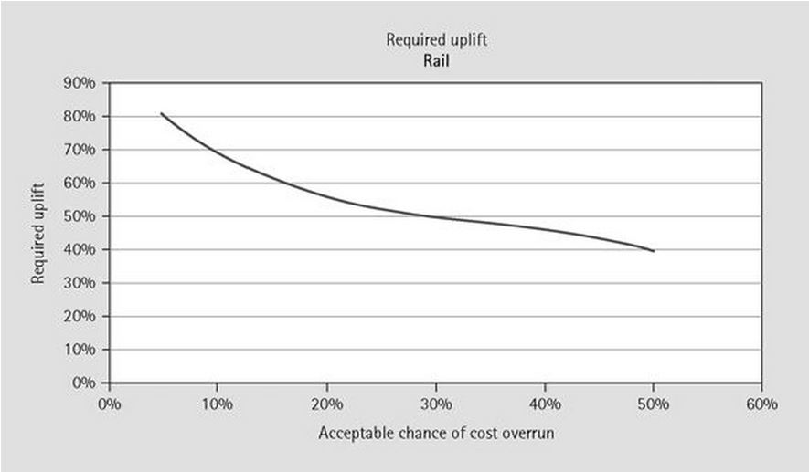
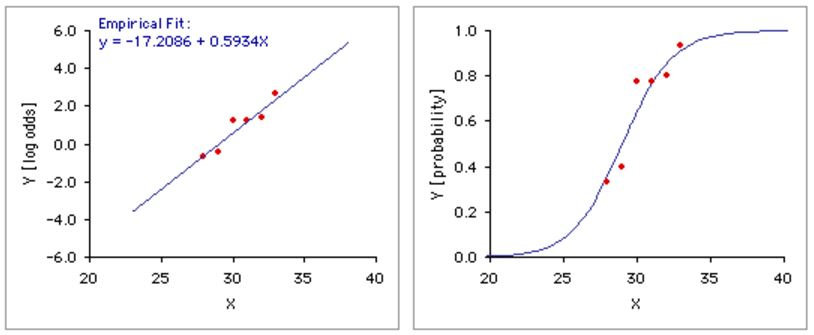
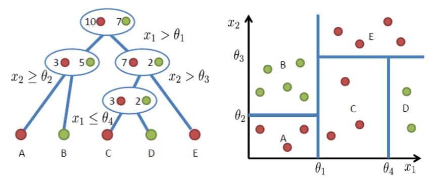
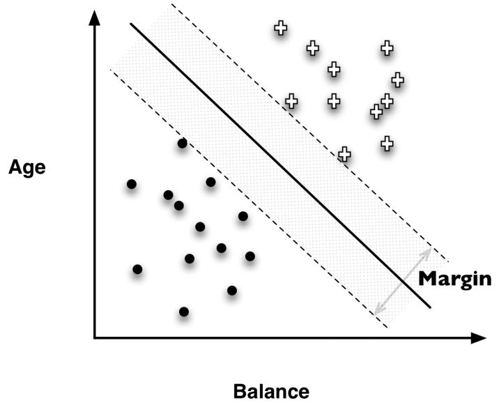
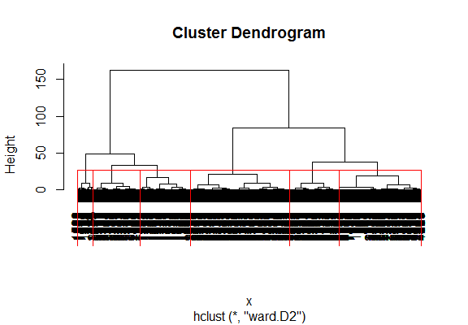
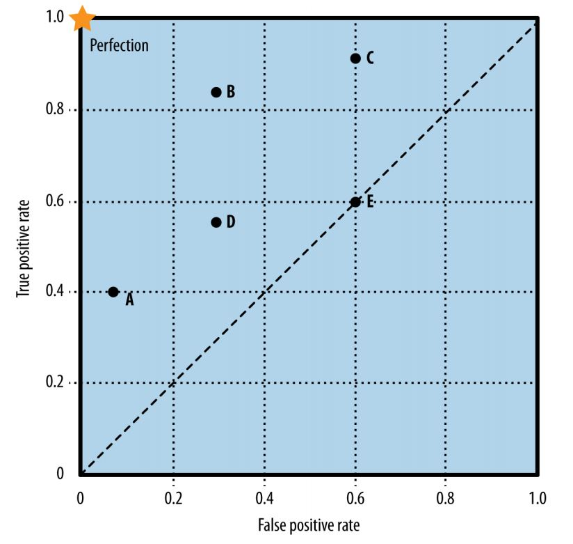
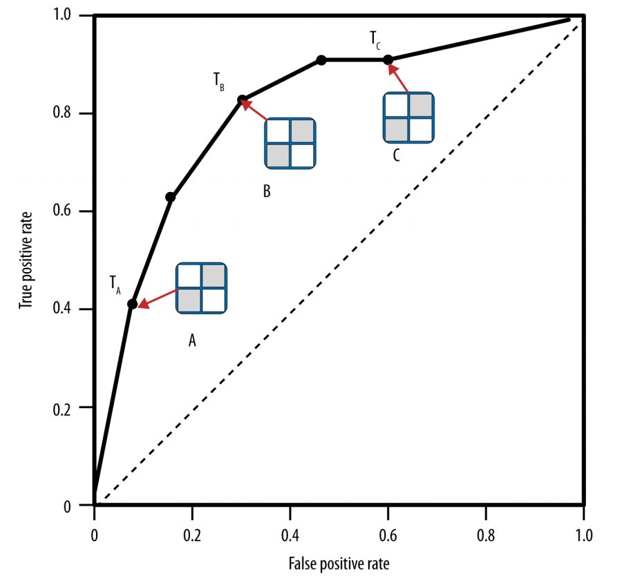
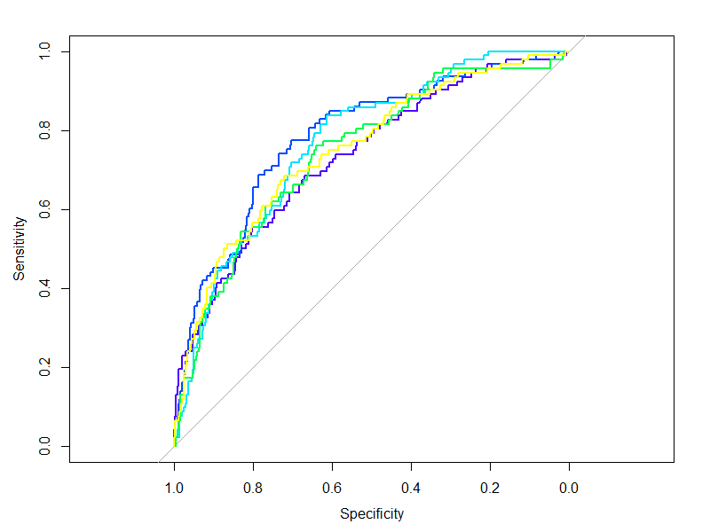
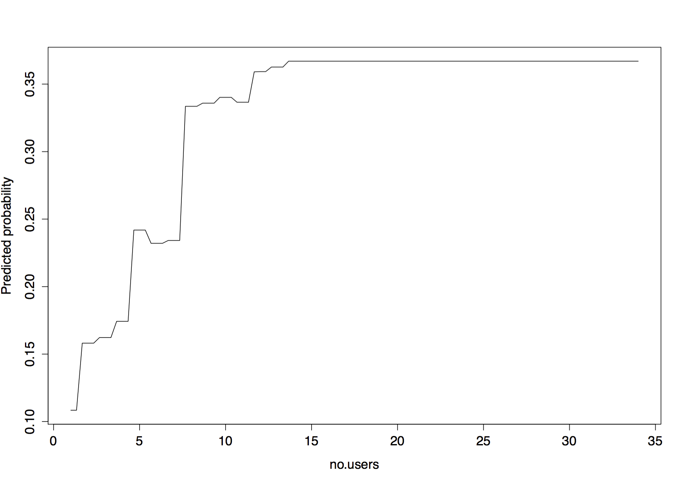
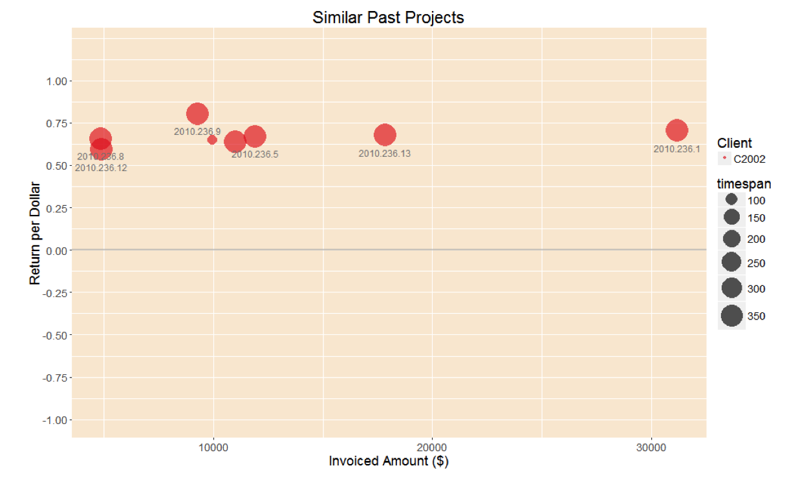

```{r, echo=FALSE, include=FALSE}

library('knitr')
library('ggplot2')
library("plyr")
library("dplyr")
library('magrittr')
library('reshape2')
library("rpart")
library('car')
library('e1071')
library('party')
library('randomForest')
library('RColorBrewer')
library('pwr')


# detect OS
if(.Platform$OS.type == 'windows'){
        # setwd("C:/Users/n9232371/Documents/Consultbusiness/data")
        opts_knit$set(root.dir= "C:/Users/n9232371/Documents/github/consult/finalwriteup/report_data")
} else{
        # setwd("~/OneDrive/shared files/Bligh Tanner/masters/data")
        # setwd("~/Documents/github/consult/finalwriteup/report_data")
        opts_knit$set(root.dir= '~/Documents/github/consult/finalwriteup/report_data')
}

opts_chunk$set(fig.width=8, fig.depth = 8, dpi = 300, warning = FALSE, message = FALSE, echo = FALSE)
```

Originality Statement

'I hereby declare that this submission .... look up QUT'

Signed .................
Date....................

# Abstract

# Contents

# List of Figures

# List of Tables

# Glossary

ANOVA - Anaylis of Variance. A statistical test that can be applied to find whether there is a significant difference between the means of more than two groups.
B2B - Business to Business 
CBR - Case based reasoning. A method of estimating by using the results of similar cases.
CRM - Customer Relationship Management. Refers to a common type of software used by businesses to record client and project details as well as employee timesheet records. Generally accessable to each employee in a company.
DAG - directed acyclic graph. A graph consisting of vertices connected by edges, where each edge directs a vertex to another vertex. The arrangement of the edges is such that a vertex cannot follow a path that loops back to itself.
IT - Information technology
BIM - Building Information Modelling. A digital representation of physical characteristics of an object or structure.
ROC - Reciever Operating Characteristic
AUC - Area under the curve. In this project, the area refers to the area under an ROC curve
TPR - True positive rate
FPR - False positive rate
TP - true positive
FP - false positive
DA - Discriminant analysis
CLV - Customer Lifetime Value
IQR - Interquartile range
ESS - error sum of squares
RMSE - root mean squared error


# Acknowledgements

# Publications

Cook, A., Wu, P., & Mengersen, K. (2015, September). Machine Learning and Visual Analytics for Consulting Business Decision Support. In Big Data Visual Analytics (BDVA), 2015 (pp. 1-2). IEEE. 

# Introduction - 2 pages

Predicting how long it will take a person to do something is a notoriously tricky task. People make mental calculations of these sort every day- guessing how long it will take to drive to meet someone on time, how many tasks you can check off in a day, or how long it will take to cook a dish. As most people have experienced, these estimates can be particularly inaccurate if the individual is attempting the task for the first time. These errors are trivial in everyday activities, but they have more meaning for businesses that sell their time as their chief revenue. Consulting businesses give expert advice to other professionals, in exchange for a fee for the amount of time a constultant spent on the problem. The delivery of 'expert advice' is generally in the form of a document (which could be anything from a report to hundreds of drawings) and can range from an hours advice to thousands of hours work on a substantial project. Before a project commences, the client and consultant must agree on a fee for the expert advice, or at least a fee structure. The nature of how a fee is formulated can be as creative as the engaged parties wish, however a couple of simple examples are as follows: the client agrees to pay for the consultants time by the hour until the task is complete, or the consultant provides a fixed fee to complete the project in full, regardless of their hours spent. Both contracts assign financial risk to one party which they must then mitigate to the best of their abilities.

This thesis focuses on the risk taken upon by a consulting company when agreeing to a fixed fee. Clients commonly collect fixed quotes from several consultants before settling with one or negotiating further so fees must be competitive. The way a consulting manager calculates their fixed fee varies from industry to industry and even company to company. Typically a consulting manager has experience in the type of project he is quoting and can use a combination of intuition, rules of thumb (such as a fraction of the entire project cost), and comparison to past projects. Such methods can result in a range of profit margins which ultimately depend on how well the manager predicts the amount of time a project demands. This thesis examines the problem of cost prediction via a case study on a company's internal project performance data for the previous twelve years. The study tests whether a statistical model based on historical project data can predict the profitability of a project using characteristics available at the beginning of a project. Furthermore, this thesis investigates how the model's predictions could impact a consulting manager's determination of a fixed fee and the resulting impact on the company's bottom line. 

# Problem Description

In this chapter the research motivations are explained along with the goals of the project and the specific research hypotheses. Finally the contributions of this body of work are outlined along with the structure of the thesis.

## Research Motivation - 4.5 pages

**Problem Description:**

Project managers have struggled with forecasting project costs accurately for decades, across many industries. A study on large-scale infrastructure projects over the past seventy years revealed that cost forecasts consistently underestimated the cost of rail projects by 44.7%, the cost of bridge and tunnel projects by 33.8% and the cost of road projects by 20.4% [@Flyvbjerg2007]. A study across 1471 IT projects showed that 27% of projects ran over budget, and one in 6 of those projects were more than 200% over budget on average [@Flyvbjerg2011]. These statistics reveal a concerning glimpse at projects' hidden financial stories which can cause job losses, ruin private businesses, and churn through government balancesheets. Complex long term projects are necessary for modern society producing infrastructure, houses, websites, and movies. This research focuses on the companies who complete portions of these complex projects and the financial risk that is contractually transferred to them. Specifically, the risk of the project owner is transferred to their sub-consultant by mandating fixed flat fee structures to complete a given amount of work. The subconsultant commits to completing their role in a project for a nominated price, regardless of whether the work takes less or more time than intially anticipated. In a similar way to infrastructure and IT project budgets, consultants are susceptible to underestimating the amount of time a project will demand, and eventually wear the cost of extra employee hours spent. For privately owned businesses, mitigating this risk would increase the chances of the business surviving as well as growing and succeeding.

The ramifications of unprofitable projects are multifold. Employee morale deteoriates and employees may view themselves as incompetent if they are responsible for the project's delivery. Employees also experience stress attempting to complete the project within a disappearing budget and may produce lower quality work in exchange for speed. This experience is unfortunate if in reality, the project fee was under-estimated. Unprofitable projects also limit a business' opportunity to invest money into marketing or staff training, which would foster growth and futher profits. The financial risk taken on fixed flat fee projects may also discourage business' from taking other, more thought-out risks, such as expanding the business into a new area. Logically, predicting fixed fee project costs more accurately could positively affect business growth opportunities and staff morale.

**Why It's Not Easily Solvable:**

The challenge for consultants to reduce budget blowouts, in terms of hours spent, is not easily solved. Complex projects always differ from one another, and similar work may demand significantly different amounts of time. For example, an ad filmed in a remote location will cost significantly more than an ad filmed on an existing set, even though the effect of the final advert could be identical. Therefore, a constant fixed price to produce an advert is clearly inappropriate for film projects, but some kind of fixed price is often demanded by the client before a project is awarded. Charging clients by the hour is not competitive enough in many industries. Other consultancies are often willing to offer a fixed flat fee for the same work, luring the client with reduced financial risk on their part. 

Another strategy to mitigate risks could be to track employee hours, and stop work once the fixed consulting fee has been depleted. Then, negotiate further fees, or variations, with the client and persuade them to accept. This satisfactorily reduces consultant financial risk, and in some cases, depending on the nature of the work or uncontrollable changes, this method can be effective. However, if the project has been following a predictable process but the hours are nevertheless inflating beyond expectation (a common situation), consultants may prefer to wear losses or endure marginable profits to preserve the relationship with their client. Consultants may believe it is in their best interest to maintain a reliable, trustworthy reputation in their industry above creating financial friction. Clearly, there is not a straightforward contractual solution to reducing the financial risk taken on by consultant's who offer fixed fees in complex projects. In many industries, the reality is fixed flat fee structures are expected and business' must conform to survive.

**Current Practice:**

Limited research is available on complex-project cost estimation techniques performed by industry. However, two surveys are available from 2000: one on construction projects, the other on IT projects. The construction cost estimation study by @Akintoye2000 surveyed 84 UK construction contractors, ranging from small to medium to large, about their estimating practises. They found that the main method for cost estimation was breaking the project into detailed parts and adding up the cost of each item. The next two most popular methods were 'comparison with similar projects based on documented facts', and 'comparison with similar projects based on personal experience'. These can all be classified as experience based models [@Akintoye2000].

A survey by Moores and Edwards in 1992 of 54 software developing companies found that detailed project planning tools were used by most companies as opposed to cost estimation tools, suggesting that projects were priced based on an analysis of a detailed breakdown of tasks within a project. In the same survey, 91% of software companies cited cost estimation as a problem. Although limited recent literature is available on industry cost estimation practises, historically it can be observed that for complex construction and software projects, cost predictions are chiefly made with a mixture of experience, project comparisons, and an analysis of the project details and tasks. It is also acknowledged that cost estimation is a problem and hypothesised that inexperience and lack of time are chief contributors [@Akintoye2000].

**Cost Estimation and Human Nature**

@Lovallo2003 tackled the psychology behind the high failure rates of executives in predicting costs of projects such as manufacturing plant construction, mergers and acquisitions, large infrastructure and software development. Their theory stems from Kahneman's work on decision-making that won him the nobel prize for economics in 2002. His research argues that a person's natural optimistic view of their own skills leads to consistent underestimation of the time and risks involved in a project. A manager optimistically sees challenges in a project as something that can be overcome by the team's high skill level, and downplays or ignores the risk of problems that are out of the team's control. It is for this reason that it does not matter if the project is broken down to the highest level of detail for cost prediction, all complex projects are at risk of encountering a multitude of problems that the manager could never foresee. Each problem has a low chance of occurring, but in combination the risk is much greater [@Lovallo2003]. 

@Lovallo2003 call the practise of analysing a project based on project details and its unique complexities the 'inside view'. This constrasts with an 'outside view' where a subject is analysed by comparison to other subjects and disregarding specific subject details. For example, research has shown that if people make predictions about their skills after being exposed to an 'outside view' (a summary of other people's skills), their predictions are significantly more accurate. According to @Locallo2003, this 'outside view' can be applied to complex projects, and stipulates that the details of the current project are ignored in favour of analysing outcomes of several similar projects. Mobilising the outside view in this way is called reference class forecasting [@Lovallo2003]. One method @Lovallo2003 recommend is to obtain correlation statistics from past similar projects - the correlation between the forecast cost and the actual cost. The correlation for the current project can then be estimated via a statistical model which is then used to adjust the forecasted cost made by detailed analysis (the inside view) [@Flyvbjerg2011]. Managers rarely analyse data from similar projects even though it could significantly improve cost predictions [@Flyvbjerg2011]. This tendency led to a formalised introduction of 'outside view' methods into some institutions. 

The implementation of reference class forecasting began in project management for the first time in 2004. It was endorsed by the American Planning Association in 2005, and is now used in some governments and private companies in Europe, South Africa, and Australia. An example of the type of output from a reference class statistical model is a plot showing the relationship between the acceptable chance of cost overrun and the required uplift to the original forecasted cost [@Flyvbjerg2011]. 



The visualisation presents a powerful communication tool for influencing decision makers and improving forecast cost accuracy, however access to credible data to a sufficient number of projects can be a challenge [@Flyvbjerg2011]. Overall, the theory of optimism bias is a credible explanation for the problem of persistant underestimation of project costs. The accompanying solution of reference class forecasting presents a promising solution given enough accurate data.

The theory of reference class forecasting was first definitively published in 2003, however the idea of predicting project costs from previous data has been the subject of research for many preceding years and continues to this day. Although research results have often been promising, industry uptake of the idea is not yet established. 

### Further Reference Class Forecasting Models and Industry Uptake

In the following section, an overview of several attempts to integrate reference class forecasting will be presented followed by published theories for the lack of industry uptake.

#### Existing Models

A substantial amount of research on project cost prediction has been dedicated to the fields of software development and construction projects, along with some work in the film industry. These analyses have generally used project information from 15 to 20 large projects. A single dataset may consist of projects completed in different countries with different clients and project teams. The mathematical methods used to predict project costs vary from statistical regressions to deep-learning neural networks [@Love2005][@Kim2004]. Most studies report their predictive models perform well and that generally neural networks are more accurate than linear regression.

A McKinsey study outlined a case in the film industry where a motion picture company used reference class forecasting of movie revenue (cases were weighted by similarity) to decide which movies should be heavily promoted. This model improved forecasts on financial return by 135% relative to comparison of a movie to a single past case [@Flyvbjerg2014]. 

Statistical research projects on reference forecasting have shown promising results in IT, construction, and film projects. However, persuading industry to adopt these methods into everyday business is a separate challenge.


#### Industry Uptake of Existing Models and Current Practices

A survey of the construction industry in the UK in 2000 found that a manager's experience and intuition is still the dominant method for construction cost calculation [@Akintoye2000]. Surveys on current industry practise in cost estimation are scarce, however another study on the IT industry by @Jorgensen2007 argued that previously developed parametric models were not comprehensive enough to be used in industry and that expert judgment was not mobilised enough in the process of developing these tools. 

Although the surveys reveal reference class models have not gained traction in either the software or construction industry, it is worth outlining their current practices in cost estimation, fee structures, and the reasons behind these. In the construction industry, infrastructure and building projects follow a traditional process, where contractual norms have developed over many decades [@Badenfelt2011]. The industry is so large, broad and well established that it has inertia in the way projects are estimated, and contractually bound. The contractor (builder) first reviews the drawings and if the plans are not detailed enough, they offer a temporary budget price. Once they feel that the drawings are sufficiently detailed, they will offer a fixed price [@Badenfelt2011]. As the job progresses however, if additional work on top of the detailed drawings is required, the builder maintains the right to charge a variation [@Badenfelt2011]. A dual source of income therefore exists, the initial proposed fee for construction along with variations due to additional materials (and time required to install the materials) that were not explicitly specified on drawings. Variations fees are generally calculated after completion the work, but the initial construction fee contains risk. Material costs are forseeable but labour and time estimates can still be under calculated, even from detailed drawings. For large infrastructure projects, small percentage miscalculations can be exceedingly expensive. 

The builders' procedure of calculating a fixed price from detailed drawings and charging for variations does not translate to other consultants in the construction industry involved with the design of structures, such as engineers and architects. These consultants develop the detailed plans for the builders, and must therefore offer fixed price contracts based on low-detail preliminary drawings that sum up the client's expectations. It is also much harder for a consultant to charge variations for portions of their time spent on items that were not included in the original simple plans. Time is less tangible than physical additional materials required, and often is shrugged off by consultants for the sake of client relationships. This is despite the real and common instance of budget blow outs due to overspent time [@Harris1999]. One method of creating a variation opportunity is by stipulating a percentage fee of the final building cost that can overrule the original fixed price contract. If a consultant has spent time beyond their fixed price budget, this may account for some or in the best case, all, of their overspent time.

Construction projects generally are completed more on time and on budget when compared to IT projects as the greatest cost is the project is building materials [@Badenfelt2011]. Unlike time, building materials can be accurately calculated from detailed design drawings. Again, this omits data from consultants who are part of the building industry but charge based on their time only.

In contrast to construction, IT projects are a relatively new practise where alternative contractural arangements have been trialled. Through experimentation with contracts, the Agile movement was developed. In summary, the method treats both cost and time as fixed quantities for a project, and any change or additional work can only be accommodated if another, less important requirement is excluded [@Badenfelt2011]. Furthermore, the project outcomes are continually adjusted ad revised based on frequent progress review points that assesses unexpected problems. This agile attitude has become ingrained in many IT practices and the flexible upfront arrangement with clients often forges better long term relationships [Cockburn2001]. 

It is not completely clear why industry uptake of cost estimation tools using the outside view has been weak, and it may be the case that in modern industries such as the IT industry, problems associated with cost estimation can be innovatively designed out of the contract. Possible reasons that parametric reference class forecasting models developed by researchers have not been incorporated into industry practice include: 

* lack of appropriate data
    * if a project is unique, such as a national infrastructure project, it many not feel appropriate to gather sufficient data points from other countries and time periods.
* lack of understanding from industry decision makers - the prediction process was not explained well in marketing of the tools
* models were not developed in collaboration with industry
* does not feel intuitive to price from an 'outside view' of a project which disregards small project details
* insufficient time allocated to pricing that makes change burdensome

In fact, a study by @Moores1992 concluded that a lack of framework to support use of the outside view model and a failure in marketing were the two most common explanations for lack of uptake of parametric cost estimating tools. This is unfortunate as almost all research in the area indicates an outside view analysis of a job substantially improves cost estimation accuracy for fixed price projects [@Moores1992]. 


### Case Study

This research explored the potential for reference class forecasting to improve cost estimation in the context of an engineering consulting company in the construction industry. In this field, labour is the chief cost and the long traditional history of this industry mandates fixed price projects as the norm. In recent years, the size of losses from unprofitable projects in the case study equalled up to 25-30% of the profits from profitable projects. This demonstrates substantial room for improvement and the possiblity of multitude positive flow on effects. 

Cost estimation is currently performed by first carefully reviewing preliminary drawings for a project where time costs will be calculated using a manager's personal experience with similar projects. This is often cross-checked with a value based off a percentage of the estimated final cost of construction (generally the client budget). No formal mathematical method of comparison to similar projects is performed. This is the case for a number of possible reasons: 

* lack of time to interrogate past project data
* clunky data availability offered by the current database software
* lack of awareness of similar projects performed by other managers

A Customer Relationship Management software package (CRM) was employed by this company to collect and store project data. It is available to all employees over the company intranet, and each employee completes daily timesheets alotting their hours to certain projects. Additionally, information is recorded against each project as well as each client, client contact, and each invoice. 

Reference class forecasting in this study differs from previous research in that statistical analysis was performed on internal past company project data that had been progressively recorded in the company's CRM. This presented an opportunity to evaluate reference class forecasting in a unique situation, where the 'reference' projects were all internal and a comparatively large number of cases (over 2,000 projects) were available.

The CRM data stood as an untapped source of information within the case study organisation. It stores a rich variety of data including:

* employee timesheet hours with dates
* other project costs (taxis, printing)
* client information/characteristics
* client identification code
* invoiced amounts for each project and dates
* employee costs
* employee charge out rates
* project description

A statistical or machine learning model predicting a measure of project financial success was developed using the available project information and by trialling numerous machine learning algorithms and statistical methods. The company uses well established CRM software which readily provides simple output statistics, however, analytical capabilities were limited to:

* simple scatter plots and bar charts of the raw data
* summaries such as overall hours spent vs. invoiced amount for each project

The company had a wealth of data but limited means to extract insight. This study will exploit the CRM data by performing more sophisticated statistical analysis with the intention of building a predictive model for cost estimation. The benefits of this study in comparison to previous cases are that thousands of past data points are available, when previous studies used on average 15-20 cases and at most 300 [@Finnie1997][@Pai2013][@Shin2015]. This improves the potential for accurate predictions. If successful, the model also has higher potential for managerial uptake as the algorithm will be directly built and trained on company data. Managers can interrogate 'similar' data points and relate to the actual projects or speak to a colleague who was involved. This has the potential to give the 'outside view' stronger influence on the final decision.

    
### Case Study Limitations

The case study provided a framework to test the value of a consulting company's CRM data in assisting project cost estimates. However, it was important to be aware of limitations when reviewing outcomes and framing the problem. The most obvious limitation is that a single company is being disected in a specific industry, which limits the ability to state conclusions applicable to a broad range of cases. This can be overcome with future studies. Other constraining factors include various forms of missing data and human data entry error. 

The data set from this case study includes scarce information on the overall cost of entire construction projects. For example, managers commonly price jobs based on the budget for the entire project, of which the consultant is a minor part. The manager might typically moderate his fee by say 1% of the entire project cost. The value of the entire project has typically not been recorded although there is an allotted space in the project database for this. It would be even more beneficial for managers to record the expected total project cost at the beginning of a project versus the concluding completed cost. Another piece of data not recorded was the external factors influencing the fixed price quote including competition from similar firms that clients may have played against the case study company.

In addition to the missing data mentioned above that could be entered by workers in the future, the database also excludes the detailed information about projects that contribute to final pricing. Such details include the preliminary drawings describing the project (square meterage, number of storeys), and project summaries provided by the client to enable a quote. This level of information will never be recorded in a CRM and in many ways contradicts the purpose of the 'outside view', the intention of which is to present similar projects without being over-influenced by the finer details. Given this lack of detailed information, it was not reasonable for an algorithm to predict the numeric fee for a project. It appeared much more effective to predict the profitability of a project (ie return per dollar) based on available data. This profitability is a ratio between amount invoiced and business costs. The algorithm therefore would predict the ratio of these two values based on fees and costs generated using the established method of fee proposals and time expenditure in historical cases.

Finally, CRM data is entered by employees manually as time passes, jobs are invoiced, and projects are finally completed. Because the data is input by people, it is susceptible to input error. Many errors were detectable during data cleaning, however it is possible that a low number of undetectable human errors exist in the data and marginally influence predictions. 

Although this case study presented an opportunity to test the predictive power held within the organisations' existing CRM data, limitations exist which must be understood and built into the framework of the problem. These include missing data that could have been entered for each project, but historically has not been required, missing data that is very detailed and will never be available, and the potential for a small degree of human error to be embedded within the data. 

### Research Motivation Summary

Fixed price cost estimation for complex projects is a difficult task and when performed incorrectly, can have devastating affects on businesses and governments. Many theories have delved into human nature and our tendency to optimistically assess our capabilities with respect to a given task. In this case, the optimism often results in negative business consequences affecting employee morale and the capacity of a company to flourish and grow. Over the past few decades, significant research has been dedicated to creating predictive models that present the 'outside view' of a project, by statistically comparing a new project to a collection of similar projects and their characteristics. It has been shown that these models improve the cost estimation, however industry uptake has not been successful. It has proven to be a challenging task persuading managers to use reference class forecasting models in practise and remove themselves from summaries based on intricate details of the completed project. This may be due to a number of reasons including lack of understanding, time, and lack of collaboration with industry in development of these models. This research examines the potential for a company's internally generated CRM data to be used in creating a reference class forecasting model. Familiarity with the data has the potential to influence managers' decisions in the company more, however its limitations must be understood in order to create a valid model.


## Thesis aims

For the reasons explained above, the aim of this research is as follows:

**General Aim** Use statistical techniques to model the profitability of projects for consulting businesses using their internal CRM data. Research will focus on a case study Engineering consulting company that offers their expert advice (in the currency of time) to business clients. 

The project outcomes are intended to assist the business in  predicting project costs before project engagement and other business analyses such as client analysis. Several statistical and machine learning techniques will be tested, compared and refined.


**Hypothesis 1**
A statistical or machine learning model based on historical project data can predict the profitability of a new project.

**Hypothesis 2**
The predictive model built from Hypothesis 1 can be shown to have a positive impact on the bottom line of the case study business.


## Thesis Contributions

This work contributes to the body of research in numerous ways. There is a gap in the literature of applying statistical and machine learning methods to internally generated business data to facilitate internal business decisions. Studies have modelled the commercial performance of movies, customer churn, the share market, and bankruptcies but few have modelled more day-to-day data that a business generates which could actually assist day-to-day decisions. Improving business decisions would reduce risk and improve profits in scenarios that could be applicable in thousands of businesses around the world.

In the case of this study, the problem of cost estimation is tackled. This issue has been worked on extensively in past research, however the problem has rarely been addressed using a single company's internal data. In the literature, dozens of projects from other companys and even countries are collected and analysed. This thesis uses the internal CRM data from a company which contains over 2,000 past job cases - far more than the usual cost estimation study. Furthermore, the problem of cost estimation is applied to a consulting company in the construction industry that estimates and must stand by their fixed fees before a project is won. This differs from other studies estimating actual construction costs of projects and is likened more to software development effort estimation although the nature of the work differs considerably.

In addition to addressing cost estimation with a different kind of dataset and different industry sector, ensemble tree methods will be applied which have been minimally tested on this problem. To date, linear regression, neural networks, case based reasoning, and SVM's have been used to predict cost/effort even though ensemble tree methods can perform as well as neural networks in some cases and generally outperform linear regression. Another benefit of ensemble trees is the output types available, such as partial dependency plots and variable importance plots provide insight into the model's calculations. This is in contrast to neural networks and support vector machines (SVM's) which are 'black-box' predictors. Providing insight to a user is a major benefit in this case as past research has demonstrated issues with user trust and uptake of models, even if the models were successful. It is anticipated that using internal data only also improves user trust and creates tangible meaning for users. Blending multiple machine learning and statistical models was trialled which has not yet been applied to the cost estimation problem.

Finally, this study takes the model one step further than previous studies and analyses concrete profit improvements for the company if the model output were to be used in certain decision-making scenarios. A few possibilities are presented as ways to take model results into account with business decisions and where possible, final profit calcuations are presented. It is anticipated that this kind of thought experiment would further push industry to seriously consider the worth in adopting statistical cost estimation models. 

## Thesis Structure

The remainder of this thesis has the following structure: the next chapter is a thorough review of the literature relating to this thesis to date. This covers work solving the cost-estimation problem, studies on statistical and machine-learning models in business applications, and a review of effective statistical and machine learning methods. 

The following chapter, Chapter 4, describes the method followed throughout the research process. It includes first how the data was obtained, the lengthy cleaning process, followed by variable importance analysis, variable selection, trials of selected predictive algorithms and problem constructs. The cost estimation problem was attempted first as a regression problem predicting return per dollar, followed by a simpler binary classification problem predicitng profit or loss. Once the best methods were selected, they were blended in numerous ways, using both simple averaging techniques and sophisticated machine-learning algorithms. These were compared against individual models and the best constructs were selected. Finally the impact of the algorithm on the overall profits of the case study company was analysed via decision making scenarios and further applications were considered.

Chapter 5 presents the results of the series of analyses described above and directly relates them to the overall aim and hypotheses of the project. This is in the format of tables and plots where results are briefly discussed. The examination of results is taken deeper as well as in a broader context in Chapter 6: Discussion. Here the nature of the results are debated in terms of how surprising they were, their impact on the research hypothesis and limitations as well as suggested future work. The final Chapter 7: Conclusion summarises the  findings of the project, how the research answered the hypotheses and how the work could be viably applied in industry.


# Literature Review - 25 pages for pHd

This chapter provides an overview of the literature available in current cost estimation methods, use cases of CRM data, as well as machine learning algorithms and statistical business prediction models. The most prominent statistical and machine-learning models developed for business applications shall be reviewed along with models applied to business cases that can be related to this project. Gaps in past research will also be highlighted.

## Project Cost Estimation Methods

The application for this project is the task of estimating fixed fees for complex consulting projects. It is therefore prudent to understand what research has been performed to date and how this project contributes to the body of work. The task of estimating fixed fees can be likened to the terms 'cost estimation' or 'effort estimation' in the literature. The bulk of research to date has been performed with project data in either the construction industry or software development. Research into cost estimation in each of these industries is reviewed below, detailing different methods and outcomes. Finally a gap in the literature will be highlighted which this research aims to fill. 


### Cost Estimation in the Construction Industry

Research on cost estimation in the construction industry has primarily focused on predicting the final building cost of construction. Various studies have surveyed methods for cost estimation while others have investigated new methods such as building information modelling (BIM) analyisis, case based reasoning, and predictive algorithms. The cost estimation methods of detailed analysis (inside view), case based reasoning, and predictive algorithms are reviewed in this section.


**Detailed Analysis** 

Detailed analysis refers to the process of an engineer or builder in the construction team carefully reviewing construction drawings to sum the cost of materials, labour, machinery hire, overheads, and profit etc. [@Akintoye2000].  @Akintoye2000's study based in the UK found that this is the most popular method for pricing amongst contractors. The second most popular method was to carry out an additional comparison with similar projects and make judgments based on personal experience. Note that this does not involve a mathematical model. 

@Elfaki2014 discusses how much detailed cost estimates for construction projects can vary from estimator (engineer) to estimator, which contributes to the lack of accuracy in predciting final cost of a project. He argues that an engineer's expertise is not documented or measured in any way and therefore their expertise and, in turn, their estimate is prone to subjectivity. @Shane2009 theorises that final cost can be subject to so many different unpredictable parameters, such as weather, unexpected ground conditions, duration or sub-contractor issues, that it is almost impossible to achieve an accurate cost prediction manually.

Groundbreaking methods into calculating construction costs by @Ma2014 mobilise the data from BIM models, although this method is still technically a detailed analysis of the costs. The idea is to quantify the cost of building a structure directly from a three dimensional model created by the design consultants (engineers and architects). @Ma2014's first trial was to automate the cost calculation of a reinforced concrete structure. His chief contribution was to program his algorithm to intelligently establish construction techniques for each element as this is not provided by architectural or engineering models. From the construction technique and material, a cost can be derived for each element. This was successful and @Ma2014 aims to further his work so that more construction information can be intelligently obtained from BIM models. A system like @Ma2014's would definitely accelerate the cost estimation process and reduce human error, however it is still an 'inside view' and could be prone to innaccurate estimates similarly to detailed analysis by a person. The detailed view does not 'step back' and take into account set backs in construction that may have affected similar projects in the past. There is potential for this innovation to be combined with an outside-view system but @Ma2014's is still in early stages of development.

Surveyed information on the latest techniques for cost estimation is limited, however what is available indicates that cost estimation through detailed analysis (inside view) remains the most prevalent method. This is despite construction having a long history of projects running over time and over budget using the same cost estimation technique [@Shane2009]. There is even current research on how to automate this way of cost estimation using BIM. The method of detailed sums shall be compared to the results of studies using parametric algorithms and case based reasoning ('outside view') in the following sections.


**Statistical and Machine Learning Models**

As the problem of cost estimation in construction projects is well recognised, dozens of studies have built predictive models of these projects using machine learning and statistical models. The aim is to test whether a mathematical comparison of many similar projects, using meaningful descriptive variables, can predict the cost of construction. This section will first review the previous studies and most accurate algorithms and finally summarise industry uptake of the methods.

@Elfaki2014 completed a study on cost estimation techniques and research from 2004 to 2014. They found that artificial neural networks and SVM's were the most common machine learning techniques used. He highlighted that these two machine learning techniques deal well with uncertainty, however lack technical justification to the decision maker (known as a black box). Neural networks are also time consuming to train, and must be re-trained and re-tested with each additional piece of data [@Kim2004]. Nevertheless, neural networks and SVM's recieved a significant amount of attention in the 1990's for their ability to accurately predict construction costs with limited detailed information [@Shin2015][@Kim2004].

@Shin2015 pioneered the application of boosted trees to cost estimation in construction projects. This is surprisingly late given the rapid uptake of boosted trees over the past decade. In the study, data from 234 school building construction projects in Korea were used. Boosted trees were compared to neural networks, which are one of the most popular algorithms to apply to this problem. Boosted trees were found to predict costs slightly more accurately than neural networks, but not statstically significantly (p value < 0.5). Even though the two algorithms performed similarly, the output from boosted tree models provide insight into the structure of the model such as variable importance and variable partial dependence plots. This additional insight may mean boosted trees are preferable over neural networks because of their potential to engage decision makers.

A notable amount of literature has studied the predictive power of multiple linear regression in the construction cost estimation problem. Often, linear regression is the only model assessed, without comparison to other methods such as neural networks, which first started appearing in literature in the 1990's [@Kim2004]. However, even post-1990, many studies focused on linear regression only. This may be because the technique is straightforward, easy to use and widely available in statistical packages [@Chan2005]. Out of those that have compared regression to neural networks, the studies have shown that neural networks outperform regression, however other studies established they are approximately equal [@Kim2004][@Attalla2003]. @Dissanayaka1999 found that neural networks outperformed multiple linear regression models, however regression models could be performed first to determine variable importance and condense the number of variables. It can be argued that boosted trees could perform as well as neural networks while providing additional insights (even more so than regression models) such as variable importance and partial dependence of variables against the independent variable, cost. 

Despite neural networks typically outperforming linear regression models, it is interesting to note some of the outcomes of regression studies in cost estimation. Different studies tended to produce a wide range of variables that contribute at fluctuating levels in the models. This is likely because construction projects are multidisciplinary and involve a range of different parties such as the clients, consultants, contractors and suppliers, each of which contribute varying levels of input [@Chan2005]. @Chan2005's study on 87 building projects in Singapore included special, complex projects. Therefore, variables such as contractor's specialised skills, who the client was (public vs. private), the client level of experience, and the contractor's financial management highly influenced final cost of the project. Other studies found variables such as project complexity, duration, team experience, information availablility, site requirements, and labour climate to contribute most [@Akintoye2000][@Trost2003][@Pinto1988]. As these studies obtained information from questionaires, the available variables also largely depended on the questions in the questionaires, and therefore each study produced a range of different important variables. Despite the differences in qualitative outcomes, the studies all generally reported their mean absolute error or a similar metric from the tested models. Similar result structures are useful, however there is a gap in the literature in how to translate the improved errors from the model into a well justified argument for industry to reduce losses by integrating a parametric model into their business. 

Surveys into construction industry uptake of these algorithmic models are sparse, however a survey by @Akintoye2000 showed that parametric estimating methods have not been adopted by contractors, despite the research into this area over the 20 prior years. The majority of contractors use experience based methods. @Akintoye2000 hypothesises that this could be due to a lack of familiarity and knowledge about the techniques, doubts whether these techniques are applicable to the construction industry, and the availability of sound data to ensure confidence. This presents a clear gap in the literature on how to assess the models in terms of the end user's goals and limitations.

The literature on cost estimation for building projects does not break down the cost estimation task into smaller components, even though a construction project is completed by dozens of consultants and sub-contractors. Many of the consultants, such as engineers and architects, produce their own cost estimates for their effort that contributes to the project. Their contracts are often fixed price, with minimal room for movement, which means they wear the risk of over-spending their time to meet fixed cost contracts [@Harris1999]. Furthermore, the existing studies collect data from a wide range of projects that have certain characteristics in common, such as country or building type, and information is obtained through surveys. This leaves a gap in research exploring a single contractor's history of projects, which would be available in their company database.

**Case Based Reasoning**

Case based reasoning (CBR) is a method of estimation that uses the results of similar cases. The idea is that in the case of a new project, similar projects are chosen, before generalisations about the data are made. This contrasts to algorithmic models that are built from the entire set of data [@Elfaki2014]. Research into the application of case based reasoning to construction cost estimation began in the 1980's [@Kim2004]. The general procedure involves:

1. Storing a collection of projects with key variable values
2. Once a new project or case arrives, similar cases are retrieved. This can be achieved either algorithmically with a distance function applied to the variables, or manually by users reviewing past cases. The nearest neighbour algorithm has been used to find the distance between cases in previous studies. It is programmed to calculate the euclidean distance in n-dimensional space between cases, where each variable is a dimension [@Kumar2007].
3. The cost of the new project is estimated by extrapolating characteristics of the similar cases to the new case. This can also be done either algorithmically or manually by an experienced decision maker.

A study by @Kim2004 compared CBR to neural networks and linear regression in the construction cost estimation problem. For CBR, the ESTEEM software package was used which algorithmically calculated the similarity of variables, weighted the variables using gradient descent, and deduced the cost using the most similar cases (the specific method for this last step was not explained). The discussion compared mean absolute error rates of the three methods and showed that CBR was more accurate than regression, but less accurate than neural networks in cost estimation. Despite neural networks outperforming CBR, CBR maintained significant advantages over neural networks which have been referenced in other studies as well.

Advantages of CBR include algorithmic efficiency as well as user engagement. In @Kim2004's study, it was noted that CBR models were simple to update with new data in comparison to neural networks, which must be slowly re-trained and re-tuned. New cases also did not need to have every variable completed which can occur often in real, messy data. Neural networks on the other hand require complete data. Another significant advantage of CBR is the ability for users to review chosen similar cases and make sense of the predicted cost, as opposed to neural networks which are a black box [@Kim2004][@Elfaki2014][@Kumar2007]. One disadvantage is that accuracy can be highly dependent on the number of selected cases [@Elfaki2014]. Overall, CBR may provide prediction accuracies between regression and neural networks but the results can be justified by the user - a valuable asset.

CBR can be described as a systematic method of expert judgment, where the decision maker manually compares similar projects from his or her experience [@Shepperd1996]. CBR that is performed manually through personal experience, without the assistance of algorithms, was the second most popular method for construction estimation in @Akintoye2000's survey in the UK. This indicates it is quite an intuitive method that allows decision makers to cross check their detailed cost estimates, although an algorithmic version of CBR has not found success in industry. 

**Summary** 

In summary, research into cost estimation in the construction industry has trialled a variety of methods ranging from detailed manual analysis, algorithmic models, and case based reasoning. Neural networks generally outperformed all other systematic methods, such as regression and case based reasoning, but had the significant disadvantage of being a black box. Alternative methods such as boosted trees have the potential to perform as well as neural networks and provide insight into the structure of the algorithm. This is true for CBR as well, although it has not been shown to predict as accurately as neural networks. There exists a gap in the research in ways to intelligently combine CBR with machine learning methods that could predict well, provide insight to the structure, and engage the user in reviewing similar projects. Also, as stated previously, there exists a gap in the application of cost estimating in the construction industry to smaller components of the project, such as consulting and contracting companies who each face a similar problem in estimating their fixed fee. These companies could mobilise information in their internal project databases, as opposed to the current body of literature that used data from dozens of companies.

### Effort Estimation in the IT Industry

Like the construction industry, the software industry faces the challenging task of estimating the cost of a project before formal engagement by their client. However, unlike construction projects, the major cost associated with the project is *effort* as opposed to the cost of building materials. A parallel can be drawn between software development effort estimation and consultants' effort estimation in the construction industry - which was highlighted as a gap in the research of the previous section. 

Effort estimation is indeed a problem, and was demonstrated by a review of 6 surveys of IT projects between 1984 and 1994 by @Molokken2003. It revealed that 60-80% of IT projects encountered effort and/or schedule overruns, where the average overrun was by 30 to 40%. A survey of software managers asked whether they saw effort estimation as a problem, and 91% responded 'yes', while only 9% answered 'no' [@Moores1992]. The most popular response for the supposed reason for cost overruns was over-optimistic estimates (51%), which falls squarely within the theory of optimism bias, or the 'inside view' [@Flyvbjerg2011]. Given this widespread problem in the industry, plenty of research has been dedicated to the problem of effort prediction, with methods that can be categorised similarly to the construction industry: detailsed analysis, algorithmic modelling, and case based reasoning.


**Detailed Analysis** 

Similar to the construction industry, expert judgment or detailed analysis, is the most widely practised method for effort estimation [@Shepperd1996][@Molokken2003]. This is despite many years of research being dedicated to developing algorithmic models and industry tools that, in the research context, outperform expert judgment. A survey by @Moores1992 found that software tools assisting a software project were in significant use, but only the project planning tools, not the cost estimating tools. This suggests a mental link for project managers to price jobs based on *details* of the software project as opposed to taking an outside view. Another study by @Heemstra1992 found that there was no evidence estimation accuracy improved when estimation tools were used. @Bergeron1992 similarly found jobs that used algorithmic models were actually associated with less accurate estimtes. However, this trend may be coincidental due to a lack of cases where estimation tools were used [@Molokken2003]. The scarcity of real project evidence that algorithmic estimation tools improve estimations and an unintuitive mental jump could be reasons contributing to detailed expert analysis remaining the most widespread technique for effort estimation. This trend mirrors what was found in the construction industry.


**Algorithmic methods** 

Algorithmic methods to predict effort for IT project costs has been a popular subject of research. This section will assess the details and performance of the algorithmic models, important variables, applications and finally gaps in the literature.

Multiple studies have shown that neural networks definitively outperform regression models in effort estimation, although regression is the most popular method in the literature [@Finnie1997][@Pai2013][@Matson1993]. Interestingly, several studies have found that even if 15 or so variables are included, often only one variable contributes significantly to the models accuracy: size [@Shepperd1996][@Finnie1997][@Pai2013]. Size can refer to the expected number of lines of code in the software package or function point. Function point refers to the amount of business functionality expected from an information system product. This is easier to guess correctly at the beginning of a project than lines of code, and therefore leads to more accurate predictions [@Finnie1997]. One study used a single variable approach (size) with a linear coefficient and an exponential coefficient as follows:

$$
\begin{aligned}
 effort &= \alpha*size^{\beta} \\
 \alpha &= productivity \ coefficient \\
 \beta &= economies \ of\ scale\ coefficient \\
 size &= estimated \ lines \ of \ code
\end{aligned}
$$

This model was compared to CBR, which outperformed the model [@Shepperd1996]. 

There are disadvantages to algorithmic methods, similar to the construction industry. First, there are often not enough cases to create a good model in the software industry, particularly if the cases must be from within the company [@Finnie1997][@Pai2013]. A study by @Mendes2004 demonstrated using 67 web projects that cross-company models were significantly less accurate than a within company model, so it is in the company's interest to create an in-house model. This means that effort estimation tools should use in-house data and must be adapted by statistical experts to each company [@Shepperd1996].

Algorithmic estimation tools have not been successfully adopted by the IT industry. This may be because no model has proved to be outstandingly successful at consistently predicting required effort [@Finnie1997]. Also, neural networks (the most accurate algorithm) lack the ability to capably explain its results and instill trust in decision makers which is another parallel to research from the construction industry [@Finnie1997]. 

As alluded to previosuly, studies on effort estimation as opposed to project cost estimation are concentrated in the software industry. This leaves a gap in studies for effort estimation in other industries such as the construction industry. Infrastructure projects do not have a function point variable and would need to utilise other information such as expected total project cost (which is notoriously hard to predict based on the previous section), client characteristics, and other project characteristics. 


**Case Based Reasoning**

In the IT industry, CBR applications have been researched using similar methodologies to the construction industry. The procedure is described as algorithmically finding similar projects using measurements of euclidean distance in n-dimensional space, where each dimension corresponds to a variable [@Shepperd1996]. Then, the similar cases are used to predict effort for the new case. In @Shepperd1996's study, linear regression was employed. 

The literature found CBR to perform approximately equally to algorithmic methods such as neural networks which contrasts findings in the construction industry [@Shepperd1996][@Finnie1997]. It was also highlighted that CBR is intuitively similar to how an expert thinks about pricing projects and provides insight into the prediction that neural networks do not [@Finnie1997].


**Summary**

Research into effort estimation in the software industry has followed a similar path to cost prediction studies on construction projects. Expert judgment via detailed analysis is still the predominant method for effort/cost estimation. Case based reasoning and algorithmic methods such as neural networks have found some success in effort estimation (at similar levels) but have not been successfully adopted by industry. It was noted that case based reasoning resonated more with decision makers because its predcitions could be better justified by the model. The visibility of model structure is very important for future work if the results are to be translated to industry. Effort estimation remains a problem, however agile methods of project management and effort management are changing the contractual approach of consulting in the software industry [@Badenfelt2011]. This innovative method keeps delivery times short (and therefore more predictable effort) and defines projects as something with a fixed cost and time. Therefore, if a change occurs, other less important elements must be discarded to maintain the fixed amount. Software development is a relatively new field in comparison to the construction industry and was able to quickly adopt this new model. In contrast, effort estimation in the construction industry faces a long tradition of fee structures that is difficult to reinvent. This leaves a gap in research of algorithimic models that predict effort (and not construction cost) for consulting companies in the construction industry. From findings in previous literature, the models should reveal their predictive structure to decision makers and be based on internal company data. Review of the literature as a whole reveals a lack in analysis of overall profit improvement a model could provide to a business. This could pesuade industry adoption and provide a framework around how models should affect decisions.

## Statistical and Machine Learning Methods

### Introduction

AS stated, the aim of this project is to use statistical and machine learning techniques to model the profitability of projects. Therefore, in order to optimise the model, several statistical and machine learning techniques will be tested and it is prudent to review the range of algorithms that have been successfully applied in the literature. These vary from simple methods such as Linear Regression to complex, deep learning Neural Networks. The previous section highlighted the use of linear regression, neural networks, SVMs and in one case boosted trees for prediction, however research on other business problems utilised a wider range of methods. These include Naiive Bayes, Random Forests, and machine learned Bayesian Networks. The following section presents each method's advantages and disadvatanges and an example of a past successful application. 

### Linear Regression

Linear regression is one of the simplest and most popular statistical prediction methods [@Hastie2009]. An equation for a line is learned, which is defined by a constant and a coefficient times the value of each variable. The coefficients are chosen to minimise the residual sum of squares (least squared) [@Hastie2009]. The reason this method is popular is that it is simple, provides stable predictions, and can be adapted for categorical variables [@Seng2010]. The integration of categorical variables is called Anaylis of Variance (ANOVA) linear regression, and the algorithm compares group mean variances within the categorical variables. 

There are several drawbacks to linear regression. For example assumptions must be made about the structure of the data. Predictor variables are assumed to be linearly related to the response variable and the variables to be normally distributed. Many real world phenomena do not correspond to these assumptions which can make it difficult, sometimes impossible, to produce useful results [@Hastie2009][@Putler2012]. Furthermore, response variables must be continous numeric variables and if two or more predictor variables are correlated, the values of their coefficients are highly unstable. On the other hand, correlated variables do not impact the predictive accuracy of the model. A final drawback is that the variable coefficients cannot be used to compare variable importance unless the variables have all been standardised to one another [@Putler2012]. This limits the amount of insight that can be drawn from a linear regression model.

Despite limitations of linear regression models, they have widespread business applications due to their simplicity and ease of application. Regression is used to predict risk in the finance and insurance industries, predict who to target in marketing exercises, and predict consumption spending in the field of economics [@Harrell2013]. Its simplicity and widespread application make linear regression a good starting point for analysis and can serve as a performance benchmark against complex models.


### Logistic Regression

The method behind linear regression can be adapted to predict a binary response variable (1 or 0). A linear equation is fit to the log of the odds of the binary response variable against each of the explanatory variables. The response variable (log odds) in the linear equation can then be translated back to odds by taking the inverse of log, the exponential. Finally the odds is converted to probability by the following equation:

$probability = \frac{odds}{1 + odds}$
[@Lowry2016]

This translates the original log odds response variable to a probability S curve bounded by 0 and 1. An example of this translation is graphically shown below:


[@Lowry2016]


The result of this linear fit and logistic translation is a model that predicts the probability (between 0 and 1) that an input case will result in a 0 or 1 (i.e. success or failure) [@Moore1989]. Similar pros and cons exist for logistic regression as linear regression, and it can also be used as a benchmark to compare other binary predictive models due to its speed and simplicity. Many business problems have binary response variables, such as yes/no, male/female, buy/do not buy, success/failure, or survival/death [@Moore1989]. 

### Naive Bayes

The naive bayes method works by making conditional independence assumptions about the explanatory variables in order to greatly simplify probability calculations for the response variable (the response variable must be categorical). More specifically, it is assumed that each variable is conditionally independent given the respose class, without considering other predictor variables. Mathematically this means that each variable's probability contribution can be simply calculated by looking at the probability of a response class given a single predictor value. A probability of each response class can be calculated for each explanatory variable. These are then combined for each possible response class using Bayes theorem, and the response class with the highest probability is chosen [@Provost2013]. 

The advantages of this method are that the conditional independence assumption enables very fast calculations and predictions. The method can perform very well for real world tasks because the assumption of independence does not damage predictions significantly. This is because if multiple variables are related, the variables independently still direct the prediction in the correct direction. The correlated variables will double or triple their emphasis on the predicted response variable, however this does not necessarily impact classification accuracy as the final step is to simply choose the class with the *highest* probability [@Provost2013]. This is fine for ranking. On the other hand, the output probabilities are not realisitic, and the values themselves should not be used [@Caruana2006]. Another disadvantage is that in order to calculate the class probability from a numeric variable, a distribution must be assumed (often gaussian) which the numeric data may not fit into neatly [@Caruana2006]. Finally, Naive Bayes classifers are known to not perform well in binary classification [@Caruana2006].

A real world success story for Naive Bayes classifiers hinged on their ability to be refined incrementally with each piece of new data, as opposed to re-calibrating the entire model. Naive Bayes was used in a complex spam detection system where new spam emails or toxic text themes could be quickly added to the filtering model. The Naive Bayes method provides a good benchmark to compare against more complex models that should outperform it [@Caruana2006].


### Decision Trees/ Ensemble Trees

Decision trees are one of the simplest and most intuitive machine learning methods. There are several brands of basic decision tree algorithms including ID3, C4.5, CART, and CHAID with CART and C4.5 being the most popular [@Kabra2001]. Ravi Kumar and Ravi [@Kumar2007] recommended the CART algorithm as it is capable of solving both classification and regression problems whereas the remaining decision trees solve classification problems only. Single decision trees tend to overfit the data and provide low predictive accuracy but have favourable characteristics such as creating intuitive rules that a decision maker can follow in real-life scenarios. In addition, their results do not depend heavily on the skill of the data analyst [@Kabra2001][@Putler2012].

To combat the problems of low predictive accuracy and instability, ensemble tree methods were pioneered in the 1990's with success [@Breiman1996]. Three examples of these ensemble decision tree methods are boostrap aggregatiing (bagging), boosting, and random forests. Bagging creates multiple trees by sampling a different training data set (*with* replacement) for each tree and then combining tree results [@Breiman1996]. Random forests is an advanced form of bagging and builds on the idea of training multiple trees from the same data by sampling bootstrapped training sets with replacement. However, when creating each tree, a random subset of attributes (variables) are considered at each split. The reduced subset of attributes is resampled for each split in the tree. This allows dominant variables to be supressed for a fraction of the splits, allowing the algorithm to explore signals in weaker variables. It also prevents the trees from becoming too correlated [@Breiman2001]. The boosted decision tree approach applies gradient descent theory to a series of decision trees. The trees are limited to a certain depth to maintain simplicity, and each tree models the residuals (or errors) of the preceding tree. The limited depth of each tree prevents overfitting at each stage and the combined result of up to thousands of trees is very powerful [@Elith2008]. 

Ensemble decision trees have a different foundation to traditional statistical prediction methods such as regression. For this reason, there are some advantages and disadvantages. Decision trees use a progression of binary splits which means the data is first split by one variable at a certain value, then these subsets are split by another variable and so on in order to partition the response variable values into groups with similar values. The aim of each split is to achieve the most 'pure' split of the response values in a greedy fashion. If this process is visualised graphically, it is clear that non-linear relationships can be captured.


[@Jeevan2015]

In contrast to linear regression, the predictor variables do not need to be transformed as no assumptions are made about the data's statistical distributions [@Louppe2014][@Radenkovic2010]. Other advantages are that the ensemble methods are very fast in comparison to SVM's and neural networks but perform just as well and provide insights such as variable importance and variable relationships [@Sealfon2012]. Random forests in particular have the benefit being unaffected by noise in the data as well as the capacity to handle a large number of variables [@Sealfon2012]. Caruana [@Caruana2006] tested boosted trees, random forests, neural networks, SVM's, logistic regression and naive bayes on 11 binary classification problems and found that boosted trees performed best, followed by random forests. This demonstrates ensemble tree methods are capable of competing with high level machine learning algorithms.  

Ensemble trees have numerous advantages however it is important to be aware of their limitations. Trees are not built on a probabilistic framework, and therefore their results can not be provided in this framework. For example, statistical confidence intervals for predictions are not available for standard ensemble methods [@Louppe2014]. This may or may not be required depending on the nature of the problem. Also, variable importance tables provided by random forests and boosted trees can be biased towards variables with many categories and another type of ensemble method, conditional forests, should be used [@Radenkovic2010]. The methods can also be prone to overfitting if not tuned carefully. Ensemble trees have many advantages particularly predictive power, but it is important to recognise that the best method for a problem often depends on the type of problem [@Louppe2014][@Caruana2006].

### Bayesian Networks

A bayesian network is a graphical probabilistic model that illustrates the conditional dependencies between variables in a data set. The model is visually represented by a DAG (directed acyclic graph) and is capable of linking the conditional dependency between any variable to another variable or via other variables. The links are graphically represented by arcs or edges [@Heckerman1998]. This kind of conditional relationship is bayesian, where the probabilities in one node are conditional upon values in nodes directed to it as well as preceding nodes. Bayesian networks have found success in combining deterministic models with observed data as well as expert knowledge. The statistical relationships between variables can be determined from separate sources and manually combined into a single model [@Kragt2009]. 

Bayesian networks are excellent at representing knowledge from different origins, and then visually communicating results well to decision makers [@Kragt2009]. Therefore bayesian networks have become an excellent decision support tool. Network relationships can be machine learned, however this is not widely included as part of the suite of machine learning methods and is usually recommeneded for modelling complex networks. Drawbacks of bayesian networks include their inability to handle continuous numeric variables (all continuous variables must be discretised). This ensures all variable relationships are categorical [@Kragt2009]. Popular applications of bayesian networks are modelling uncertainty in natural resource management and modelling complex business network structures such as airports [@Wu2013]. 


### SVM's and Neural Networks

Neural networks were inspired by biological neural networks of the human nervous system and require a lot of training data relative to other methods. They are flexible in the range of relationships they can mimic and are not greatly dependent on the skills of the analyst (Putler & Krider, 2012). A disadvantage is that although the results are accurate, the algorithm is a black box - meaning the data is input and the results output without providing the user with insight into the methodology. Neural networks can perform high level tasks as a result of deep learning such as hand writing recognition, vehicle control, face recognition, and cancer detection [@Haykin2004].

The simplest type of SVM's calculate the linear boundary between two categories in feature space so that the category of future cases may be determined depending on which side of the boundary they fall. The location of the boundary is determined by the position of the widest clear margin that can be drawn between data points from the two categories, while allowing a certain number of misclassifications. The simple plot below demonstrates this concept and has no misclassifications:


[@Provost2013]


This concept can be adapted to non linear boundaries by performing kernel transformations on prior variables as well as regression problems by introducing loss functions [@Auria2008]. Advantages of SVM's include the ability to model non linear relationships in data, and that no assumptions about the distributions of the data must be made as the model is non-probabilistic. They are also known to be robust over different samples and perform well in high-dimensional feature space [@Auria2008]. On the other hand, the output is in the form of distance to the boundary (as opposed to probability) and results are not transparent (similar to neural networks) [@Caruana2006]. Also, SVM's are known to be very slow to train and therefore often not suitable for industry purposes [@Auria2008]. Because SVM's perform well in high-dimensional space and can form non-linear rules they have been applied to protein classification (medicine) and text and image recognition [@Byun2002].


### Summary

This section reviewed the advantages and disadvantages of statistical and machine learning techniques that have been successfully applied to business problems. These included linear regression, logistic regression, naive bayes, decision trees and ensemble trees, bayesian networks, neural networks, and SVM's. Linear/logistic regression and naive bayes are computationally very fast with a simple concept that make broad assumptions about the data, but work well as baseline models against which to compare complex models. In certain cases these simpler models are significantly outperformed by complex models however it is important to compare both. Neural networks and SVM's are excellent machine learning predictors which can perform well with messy data and no distributional assumptions, however they are slow and do not provide insight into the results of analysis. This is not appropriate for the effort estimation problem in this project because communication of the reasoning behind predictions is crucial for uptake of the model by decision makers. 

On the other hand, ensemble tree methods are capable of performing as well as neural networks and SVM's and make no assumptions about the structure of the data, but provide insights into the model such as variable importance and variable relationships. Bayesian networks are excellent for presenting the structure and reasoning behind the predictive model, however are very slow to train and have generally been excluded from the machine learning literature in comparison to the other methods. This may be due to low awareness of learned bayesian networks or lower performance. In conclusion, simple models such as linear/logistic regression and naive bayes are good baseline models to implement, while ensemble tree methods and bayesian networks may handle messy 'real world' data better than the simpler models while still providing insight to decision makers.


## Statistical and Machine Learning Methods Applied to Business Problems

The aim of this research project is to create a predictive model for the profitability of a company's consulting projects using their internal CRM data. The literature pertaining closely to the cost prediction topic has been reviewed in the first section of this chapter, however it is relevant to broaden the critique of the literature on advanced machine learning techniques that have been applied to general business problems. The simpler statistical methods have been covered already, so the focus of this section are the machine learning prediction methods developed for business decisions. Popular applied topics include predicting stock fluctuation, customer churn analysis, fraud prediction, customer classification, market segment analysis, product success prediction, and recommendation systems (Seng & Chen, 2010). This section will first discuss the use and merits of the advanced machine learning methods applied to these problems, followed by a case study of employee-churn prediction.

### Summary of Advanced Methods

According to Breiman [@Breiman2001b], simple theoretical models such as linear regression are informative but often provide unsatisfactory accuracy for modelling real life data. This data is often messy and does not necessarily align with the rules of statistical theory. As this project has a large quantity of messy data, it is worthwhile reviewing the algorithmic machine-learning predictive models that have developed in recent years. They have found success because they were able to fit real-life data with more accuracy than theoretical models [@Breiman2001b]. 

Ravi Kumar and Ravi [@Kumar2007] performed a detailed review of statistical and machine learning techniques that were applied over 37 years in the context of bankruptcy prediction in banks. The most widely used model was neural networks, however logistic and linear regression, decision trees, SVM's, discriminant analysis (DA), and statistical clustering techniques (such as K Nearest Neighbour) were also popular. Supporting @Breiman2001b's statements, it was found that DA and linear regression techniques were not preferred due to their low accuracy. The overall assessment was that SVM's outperformed neural networks (back propagation neural networks were used most extensively), which sometimes outperformed decision trees, and the rest of the methods were generally inferior. Although SVM's performed the best, as discussed, they are often extremely complex and slow, requiring a great deal of memory [@Kumar2007]. In futher support of SVM predictive performance, a study by Davenport and Harris [@Davenport2007] concluded that many statisticians experienced in predictive machine learning algorithms generally agree that SVM's yield the highest predictive accuracy compared to other machine learning algorithms. 

As SVM's are often computationally too expensive and advanced for smaller scale business applications, which this research project would fall into, it is useful to further compare neural networks and decision trees which are simpler than SVM's but are also capable of achieving very accurate predictive models. Ravi Kumar and Ravi [@Kumar2007] found that neural networks and decision trees were both capable of out-performing the other, depending on the context - which is limited to bankruptcy prediction in Kumar's study. Both have advantages and disadvantages to consider, however as derived in the previous section, @Tsai2009's study on earnings management prediction found the most notable drawback for neural networks is the difficulty in interpreting the reasoning behind the algorithm. Earning's management is influenced by managers' choices and insight into the model structure could provide explanations for human behaviour - a valuable output in business problems. On the other hand, trees are known to be intuitive to understand and have been argued to function similarly to how the human mind thinks [@Carrizosa2010].

Ravi Kumar and Ravi's [@Kumar2007] study concludes that ensemble techniques, which refers to combinations of two completely different algorithms, can often outperform individual techniques. For example, combining the contrasting advantages of neural networks and decision trees is a worthwhile ensemble technique. @Tsai2009's study eventually combined these two methods after trialling each one. They were run successively and the neural network ran first because it had a higher rate of prediction accuracy via its complex non-linear learning properties. Then, to resolve the lack of explanatory qualities that neural networks are notorious for, decision trees were employed. The 81% of cases that were correctly predicted by the neural network were used to generate decision trees, and in turn useful decision rules [@Tsai2009]. This strategy is a promising way to benefit from the strengths of well performing complementary techniques.

### Employee Churn Case Study
 
The literature on predictive business models is generally limited to applications on product sales, customer behaviour, or overall performance of large businesses. There are far fewer studies that assist with internal business decisions dealing with employees, teams, and delivering projects which is what this research project aims to achieve. An exception is @Saradhi2011's study on employee churn, where 'churn' refers to the number of individuals moving out of a group within a certain time. @Saradhi2011 applied popular customer churn predictive models to employee churn - a novel application that focussed internally on employees rather than externally on customers. The project tested three machine learning classification algorithms that were commonly applied to customer churn. The reasoning behind this was that the variables and model behaviour of employee churn could be related to customer churn. The associated costs of losing customers and finding new customers can also be connected to the costs of losing staff and hiring new staff. 

Naive Bayes, Random forests (an ensemble decision tree method) and SVM's were built. All three models performed at similar levels for overall accuracy at around 80% (the general ranking was random forests, followed by SVM then Naive Bayes). However, when the true positive rates (accuracy in  predicting of employee resignations) of the models were compared, the SVM model far out performed random forests and Naive Bayes by achieving 81% TP vs. 51% and 55% respectively. This was attributed to the ability of SVM's to incorporate class penalties whereas the other two methods were limited by the class imbalance problem [@Saradhi2011]. This means that SVM's had an effective method of increasing the importance of 'positive' cases in the data set which was skewed towards the majority of employees who kept their job versus the minority who left (25% churn). It should be noted that the boosted tree ensemble method performs a similar task of weighting misclassified cases or outliers and it would have been worthwhile comparing this method to SVMs. Furthermore, boosted trees provide insight into the predictive model which could build trust in the company's decision makers. Nevertheless, it is noteworthy that their study proved employee churn models for customers could be translated to predicting internal churn of employees.

Another idea @Saradhi2011 adopted from customer churn methods was the value models. Company's calcuate customer lifetime values (CLV's) in order to structure which potentially churning customer's should be acted upon. Then the optimal number of customers to reach out to (reaching out incurs a cost) that prevents the most financial loss from churn can be determined. @Saradhi2011 developed a system for determining the value of each employee in terms of the importance of the projects they were on and their monthly chargeability. This allowed them to rank the employees identified as 'high risk of churn' by value and provides a clear direction for manager's to act upon. Manager's can then start brainstorming what they can do to prevent high value, high risk of churn employees from leaving. This extension of the study provided a comprehensive analysis of how business manager's could adopt their findings to improve their business operations. It was a valuable addition which is absent from most cost estimation and effort estimation research.

### Gap

The limited literature on analysis similar to @Saradhi2011's Employee Churn study highlights a gap in the application of predictive techniques to model internal performance in businesses. This is particularly relevant to consulting companies that tackle complicated discrete projects with set timelines. In this research, internal consulting project data will be used to predict a new project's profitability in terms of internal employee structure as well as client characteristics. A review of the literature in machine learning applied to business problems revealed that SVM's were found to be the most accurate technique followed by neural networks and ensemble tree methods. As discussed in the previous section, neural networks and SVM's do not provide insight into the predictions to the decision maker. A gap exists in applying these cutting edge machine learning techniques to the wide range of internal decisions that businesses make.

## Conclusion

The literature pertaining to the aim of this research project, cost prediction using internal consulting CRM data, has been extensively reviewed. The problem of cost prediction has been addressed in many studies beforehand which have generally been limited to prediction of construction costs for buildings and infrastructure as well as effort estimation for IT projects. The prediction models consisted of case based reasoning, linear regression, neural networks and in one or two instances an ensemble tree or SVM. This leaves a gap in the literature in effort estimation for consulting companies in the construction industry in combination with trialling a broader range of prediction methods. 

An exhaustive list of machine learning and statistical models were reviewed theoretically as well as practically in the broader scope of business problem prediction. It was determined that bayesian networks and ensemble tree methods have potential to perform estimation as well as complex algorithms such as neural networks while providing the additional benefit of insights into the reasoning behind model predictions. These insights are very important as they address the lack of industry uptake - a major issue identified by numerous studies in both industries. Other considerations and strategies will be developed to address this issue as well.
 
# Method - 2 to 8 pages

The aim of this project is to determine whether the profitability of projects for consulting businesses can be predicted using statistical and machine learning techniques. As stated in the literature review, a couple of gaps exist in this research space including working with internal CRM data from a consulting company in the construction industry, trialling ensemble tree methods against the more popular regression and neural networks, and analysing the impact model results could have on business decisions. This section will explain the chosen methodology for fulfilling the research aim using a case study engineering consulting company that charges for their time spent on project delivery.

## Obtaining data

An assessment of the literature revealed that the capacity of internal timesheet data (extracted from a company's CRM software) to predict project profitability has not yet been tested in the context of consulting companies in the construction industry. Project data can be extracted from the CRM, interviewing project team members, emails, accounting records, and project drawings and calculations. As the internal CRM data in this case study houses a detailed account of time spent on each project (timesheet data) along with client information and invoicing records for the preceding twelve years, it was clear that this source of data was not only the most accessible and suitable for statistical analysis, but had the potential to reveal information not typically investigated by the company. 

The complete twelve years of project timesheets and invoices was extracted via the CRM software interface, which described 4169 projects. The projects varied from total invoiced amounts of \$500 to over \$1,000,000 and were divided between four internal disciplines in the company. During data extraction, it was not clear whether the full twelve years were necessary and relevant to predicting future project profitability but this was determined later in the analysis.

Once the data was extracted from the CRM, an employee from the case study company performed the task of de-identification. This is an important step before research commences as the privacy of project employees, clients, and project names must be removed for ethical reasons. In the case of employee names, professional titles replaced the names, and client codes replaced client names. Project names and addresses were removed, and each project was identified by a number. The resulting de-identified datasets were three .csv files of different data structures which are described in the next section.

## Cleaning and variable engineering

The data contained a rich source of project information and a lengthy process of cleaning the data followed by engineering potentially useful variables was then required. The three initial datasets described:

* Invoicing records: dated invoiced amounts and sizes for each project and whether the invoice had been paid or written off
* Timesheet entries: the number of hours spent on each project and on which day. Entries were input by individual employees, but names for each entry had been replaced with employee positions (such as mid-level technical)
* Project summary data: information describing each project such as client code, client contact code, discipline, subject, post code, director code, and suburb

These three sources needed to be compiled into a single dataset that detailed one project per row as the model was to predict the overall profitability of a project. Before compilation could begin however, thorough cleaning was required where the data was plotted and statistically assessed so that outliers could be visually or statistically discovered. Outliers were then investigated for data entry errors. Many such errors were encountered. For example, a common glitch in the data collection process translated a user entering a 123 kilometer drive in a car as 123 hours. Or an expense printing claim of $9.50 would be translated to 9.5 hours spent on that job. Once these errors were detected, they were discussed with the company directors and appropriate corrective action was taken. Mistakes in data entry were often able to be converted into correct data by notes that a user had entered into the system. It is possible that some data entry errors were not detected and this is a problem that must be dealt with in implementation of the model as well.

### Variable Engineering

Although dozens of variables were available from the initial dataset, it was advantageous to engineer further descriptive variables to trial in the models. This was particularly true for the invoicing dataset and timesheet dataset where a project could have thousands of rows of relevant data that needed to be converted into a single row per project. All variables would eventually be tested for variable importance and predictive power with respect to project profitability. Examples of these engineered variables include:

**Timesheet Data**

* percent of hours performed by each professional role over the course of a project
* timespan of the entered project hours
* percent of hours performed by 'profesional' employees as opposed to 'technical' employees
* position of the employee who completed the most hours on each project
* percent of hours done by the majority contributor to a project
* total cost of employee hours per project
* total cost of external subcontractors or disbursements per project
* total number of users that entered hours on each project
* mean number of hours per day entered on a project
* number of disciplines active in a project

**Invoicing data**

* total amount invoiced and renumerated per project
* mean invoice size per project (for example if a project had four invoices totalling \$10,000, the mean invoice size would be \$2,500)
* mean invoice per client, i.e. the average invoice size across all invoices sent to a client. This gives an indication of whether the client generally does fast paced big jobs which would result in large monthly invoices for example or small jobs with small monthly invoiced amounts.
* invoice frequency per project. This indicates how drawn out a project was.
* client invoice frequency which gives an indication of how much work the company does for that client.

**Project Data**

* text analysis of project descriptions detected a list of key words that could classify projects into 16 categories. This key word analysis was done in conjunction with a company employee and the resulting classifications were reviewed by the employee to ensure accuracy.
* number of projects completed with each client and client contact

With the engineered variables, all three data sources could be represented in the format of a single row per project. They were hten combined and further variables were engineered using combinations of variables across the three data sets:

* profit

$project\ profit = total\ invoiced\ amount - cost\ from\ recorded\ employee\ hours$

* return per dollar as the measure of profitability 

$return\ per\ dollar = \frac{project\ profit}{cost\ from\ hours}$

Besides the engineered variables, additional variables included in the project summary dataset were client industry, internal company discipline, job description, and post code. Once numerous potentially important variables were engineered, the most important ones could then be narrowed down. This practice improves the accuracy of a model because unnecessary or irrelevant variables add noise to the prediction of target values. Variable selection also increases computational efficiency by reducing the number of calculations and enhances understanding of the prediction structure [@Weisberg2005].

## Variable Selection

Once variables were engineered, the value each variable could contribute to the predictive model was assessed. As previously stated, variable selection can enhance model accuracy by reducing noise from irrelevant variables and increase simplicity which in turn improves interpretability for the user. To assess variable importance, models predicting 'return per dollar' were built using all available explanatory variables. The models then output which variables contributed significantly or most improved results. Different types of predictive models have different methods of calculating variable importance and since it was not known which model would best predict return per dollar, a few models' variable outputs were reviewed. These included ANOVA linear regression and two ensemble tree methods. Before models assessing variable importance were built, outlier cases were deleted to prevent distortion of valuable explanatory variables.

### Outlier Deletion

Case study projects with extreme 'return per dollar' values were likely the result of special scenarios which the model is not intended to predict. For example, many projects appeared wildly profitable but on closer inspection these were all very small jobs. After discussion with the case study company, it was concluded that for those outliers, the small jobs most likely required so little time that busy employees did not bother writing down their hours for that job. Outliers were initially defined as return per dollar values sitting outside 1.5x the interquartile range (IQR) from the upper and lower quartiles. This rule was intially practised by Tukey, the inventor of the box plot [@Tukey1977]. All outlier projects determined by this method were reviewed with an employee from the case study company and based on their domain knowledge and assessment of the outlier cases, reasonable cut-off values for the range of return per dollar values were determined. In summary, projects with 'return per dollar' values greater than 3 or below -2 were removed.

 ### Variable Selection Methods

Three methods which output variable importance were trialled and compared to test whether they highlighted different variables as valuable. This was anticipated as each method models data using distinct theoretical foundations. The tested methods were ANOVA linear regression, conditional inference forests (cforests), and random forests. It was expected that random forests would favour variables that had more categories, a well known bias; which is also a bias that cforests have overcome [@Strobl2007]. ANOVA is based on linear theory which contrasts conditional forest and random forest's free-form structure. Therefore, it is benefical to compare the methods' assessments of variable importance.

When running variable importance tests, the dependent variable must be clearly defined. For this problem, the response variable could be continuous or categorical i.e. *how* profitable a project was (continous) or whether a project was profitable or not (binary classification). The continuous response variable was chosen for the variable importance models as the *degree* of profitability also gives the binary classification (profitable or unprofitable).

#### ANOVA

ANOVA is closely related to linear fit models but incorporates the analysis of differences in group means (i.e. categorical variables) [@Lunney1970]. The method is simple and fast but assumes variables are normally distributed and linearlly related. The variables must therefore be normalised before analysis to achieve a statistical distribution as close to gaussian as possible. A disadvantage of this method is that linear relationships and normally distributed variables do not necessarily represent real world data accurately [@Breiman2001b].

In order to compare variable importance, two types of output from the model are assessed which include the linear coefficients for each variable and the p-values for the coefficients [@Markham2016]. The magnitude of a coefficient does not indicate importance relative to the other variables because its value is directly reflects the values within the variable. The sign of the coefficient however indicates whether the variable is directly or inversely related to the response variable. A p-values for each variable coefficient is output as the result of a significance test for whether the coefficient equals zero. Therefore, if the null hypothesis is rejected (p value < 0.05), it indicates that changes in the explanatory variable are related to changes in the response variable. P-values are a good indication of whether variables have a relationship with the target variable, however they do not necessarily rank importance. If a variable is measured more precisely, it will have a smaller p-value, whereas a variable measured roughly will have a higher p-value. This does not necessarily make the more precisely measure variable is more important than the other. It is also important to keep in mind that, with a dozen variables, chance alone can produce a variable with a p-value < 0.001 7% of the time [@Rice1989].

The p-value output from ANOVA models give a good indication of which variables have a statistically significant relationship with the target variable. However, the values should not be used to rank the variables against one another, and significant p-values can occur by chance.
     
#### Random Forest

The random forest algorithm can produce a permutation variable importance for each variable as part of its output. Variable importance is represented as a score, which is calculated by performing permutations on each variable in the test data for each tree and re-running the test data through the trees. More specifically, consider a single variable. The values of this variable in the out-of-bag sample (the test data that the random forest algorithm partitions before building each tree) are randomly permuted (reordered) for each tree. The purpose of permuting is to mimic the absence of that variable. The trees in the random forest are then run again. Variable importance can now be derived by comparing the results of the forest where the covariate has been permuted to the original random forest. If the accuracy of the premuted forest is much less than the original forest, then that variable was important. Permutation importance scores are calculated as the mean decrease in accuracy over all trees for that permuted variable in the random forest [@Breiman2005].

The random forest variable importance provides valuable insight as
it addresses the impact of each predictor variable individually as well as in multivariate interactions with other predictor variables [@Strobl2007]. However, a severe disadvantage of random forest variable importance is that it is not reliable for variable selection where explanatory variables vary in their scale of measurement or their count of categories. Also, the importance of correlated predictors is overestimated and the algorithm tends to favour variables that have many possible splits or many missing values [@Strobl2007]. The intuition behind this is that if a variable has more points to split the data, there are more opportunities for it to split the response variable favourably, however this does not necessarily indicate the variable impacts the response variable most. Overall, the random forest permutation importance is useful as it is able to compare variables in a machine learning environment and can include multivariate interactions, but the current random forest importance measure overestimates the importance of variables with many categories and some numeric variables.
    
#### Cforests

Cforests are an alterantive ensemble tree method to random forests that overcome the aforementioned shortfalls of random forest variable importance measures. It is built from ctrees which are decision trees based on a conditional inference framework. The key difference between ctrees and standard decision trees is that a significance test is used for splitting instead of a purity measure such as the Gini coefficient, which is centered around information gain. 

The procedure behind the significance test at each split in a ctree is as follows. To determine which explanatory variable should be used at each split, each variable is permuted in every possible way, and a correlation value is calculated between the tested variable and response variable, for each permutation. The unchanged variable correlation is then compared with the correlation values for all permutations of that variable. From this, a p-value for the true correlation value compared to the permuted correlation values can be calculated. The predictor variable with the lowest p-value is then selected as the splitting variable [@Hothorn2006]. Using an ensemble forest of these trees, variable importance is then calculated in the same fashion as random forests, via permuting a variable, re-running the forest and comparing the decrease in response variable accuracy. Several sources recommend cforests variable importance methods because its statistical p-value tests at each split removes the bias present in other tree ensemble variable importance outcomes such as random forests (as discussed) as well as boosted trees [@Strobl2007][@Strobl2009][@Hothorn2006].

#### Variable Selection Summary

Limiting the predictive model to a concise set of meaningful variables reduces noise and improves predictions. Less variables means that a simpler model is being used for prediction which in turn is easier for stakeholders to understand [@Weisberg2005]. For these reasons, a subset of the most important variables were chosen before modelling which entailed first eliminating outliers, then comparing important variables from ANOVA as well as random forests and cforests. It can be inferred from the literature that cforests would suit the case study data best as it is unbiased and not limited to linear theory [@Strobl2007]. 


 
## Model selection

Previous studies predicting project profitability in software and construction projects were predominantly limited to case-based reasoning, regression and neural networks. There is a need to test other sophisticated machine learning algorithms that are as powerful as neural networks but provide insight into the reasoning behind predictions. Ensemble trees (boosted trees and random forests) and bayesian networks fit these criteria. Regression and naiive bayes models were also included as simple baseline models. Complex models should be measured against simple models that can be built at a fraction of the computational cost. The complete list of models tested in this study are:

* Regression - baseline model
* Naiive bayes - baseline model
* Bayesian network
* Random forest
* Gradient boosted trees


Some models have limitations and required additional data processing steps such as normalising numeric variables (Bayesian Networks and Regression) and discretising continuous variables (Bayesian Networks). Discretising numeric variables was performed by generating a hierarchical dendrogram of each variable to visualise the clusters. Between four and six clusters were chosen and summarised to find the maximum and minimum values within each cluster. For example, the diagram below illustrates the hierarchical dendrogram for timespan with 6 clusters boxed.

 

The number of clusters was determined both visually from the dendrogram and experimentally. Visually, the height of the dendrogram 'branches' indicates the change in 'tightness' of the data points to their cluster centroids as the number of clusters increases. Tightness in the case of Ward's method is the sum of squared distances of each data point to the centroid of its respective cluster (ESS). For example, the height of the top horizontal bar indicates the ESS for one cluster and the height of the second from top horizontal bar is the ESS for two clusters. The hieght of the vertical branch between the two bars indicates the improvement in ESS by adding a cluster [@Putler2012]. As more clusters are added, decreases in ESS are less significant and the aim is to choose the number of clusters at an optimal level in this process.  After initial comparisons of prediction methods had been trialled, the number of clusters for each discretised variable was re-assessed by trialling one more or one less cluster and comparing model output.

Once the number of clusters had been decided, each case was assigned a cluster label to replace its numeric variable. It was decided that for timespans and invoiced amounts, the discretised variables should be applied to all models (not just bayesian networks) because manager's must guess these values initially when operating the model. It is easier for a manager to predict a timespan category than the exact number of days a project will last. For example, a small job could be confidently assigned to less than three weeks and a large job could be assigned to 1.5 - 3 years.

The revised discretised categories for timespan and total amount invoiced were as follows:


| Timespan Categories  | Total Invoiced Amount Categories |
|----------------------|----------------------------------|
| 1 day - 3 weeks      | \$100 - \$600                    |
| 3 weeks - 2.5 months | \$600 - \$2,500                  |
| 2.5 - 9 months       | \$2,500 - \$8,000                |
| 9 months - 1.5 years | \$8,000 - \$60,000               |
| 1.5 - 3 years        | \$60,000 - \$1.8m                |
| more than 3 years    |                                  |

### Missing Data Imputation

All methods except gradient boosted trees could not handle missing data. Therefore, preliminary runs of each method used subsets of the data which had complete data. Then, imputation methods were trialled against gradient boosted tree results since boosted trees can handle missing values and should perform equally well with imputed data. 

The MICE random forest method was chosen because it has been proven to work well with complex data sets [@Shah2014]. It first performs a standard random forest imputation of missing values which are treated as initial 'place holders'. Random forest imputation is a complex process which works by first doing a rough imputation of the missing values. Then a ten-tree forest is run to calculate proximities between all cases. Proximities between two cases represent the number of trees in a forest where the two cases were assigned to the same end node in a tree. Once proximities are calculated, missing values for a variable (say variable m) are filled by an average of the other complete m values weighted by the proximity of the case representing each m value.


After the initial random forest imputation is complete, the MICE process continues. The imputations for one variable are deleted and the remaining full variables are used to impute the missing values from the single variable again using random forest imputation. This is repeated for each variable and their 'place-holder' imputations are replaced by an imputation targeted at the single variable. This cycle is repeated five times by default [@Azur2011]. 

The final imputed dataset was fed into a boosted tree algorithm and if similar predictive results were obtained using boosted trees imputed data and unimputed data, the imputed data must be reasonable. The imputed dataset was then trialled on the remaining methods and compared to un-imputed trials.


## Model Comparison

To compare the models, root mean squared error (RMSE) statistic was used for regression models and the area under the receiver operating characteristic (ROC) curve (AUC) statistic was used to measure binary classification. For binary classification, AUC is a more useful statistic than classification accuracy when output is available as a probability which can be applied to the problem. This is pertinent when it is useful to rank the outcomes and trial probability thresholds that will optimise the rates of true positives and true negatives [@Huang2005]. Note the 'probability' outputs from the models are not true statistical probabilities, but a score the model has assigned to a case using its own measure of certainty.

An ROC graph visualises the curve from which an AUC score is calculated. Its two axes are the false positive rate (FPR) on the x-axis and true positive rate (TPR) on the y-axis. In this problem a 'positive' is a loss-making job so a true positive (TP) is a case when the model predicts a job will be loss making, and it did indeed lose money. A false positive (FP) is when the model predicts a job will be loss making but in reality it was profitable. These values are calculated as follows:

$$TPR = \frac{Count of TP}{Count of Positives}$$

$$FPR = \frac{Count of FP}{Count of Negatives}$$

Only predictions made on the test data should be entered into the equations above, therefore after a model must be first created using a training set, then the test data is input. From the test data, the model outputs probability values between 0 and 1 for each case, which cannot be entered into the equations above. In order to classify each case in the test set as 0 or 1, a probability threshold must be chosen. That is, if a probability threshold is chosen to be 0.6, each case in the test set can then be classified as 0 or 1 depending on whether the probability calculated by the model is greater or less than 0.6. Once the classifications have been made, the true positive rate and false positive rate can be calculated for that model and threshold. This is plotted as a single point on the ROC curve, say point C. Refer the diagram below:

 

[@Provost2013]

A model that is perfectly classified would have all positives correctly classified (1.0 True Postiive Rate) and no incorrectly classified positives (0.0 False Positive Rate). If a model has a 1.0 TPR and 1.0 FPR (top right corner) this means it is correctly classifying all positives at the expense of incorrectly classifying all negatives as positive. It is 'dumbly' classifying all cases as positive. if a model classifies 0.8 of its positives as TP but also 0.8 of its negative cases as positive it is 'dumb' in a similar way to the previous example. There is an 80% chance *any* case will be classified as positive. Therefore, models that lie on the diagonal line classify cases as well as random chance. 

To plot the curve in an ROC, a series of points and their coordinates are first calculated. This is done by choosing numerous threshold probability values between 0 and 1, then applying each threshold point to the probability outcomes in the test set, and calculating the TPR and FPR for that threshold point. Once enough points are plotted, a curve can be drawn. The closer the curve reaches toward the top left hand corner, the closer the algorithm is to perfectly predicting positive and negative cases at some optimal threshold. This would give an AUC of 1. An AUC of between 0.5 and 1 means the model is performing better than random chance (as previously stated the diagonal line represents a model randomly assigning positives to all cases at a certain rate).

 

[@Provost2013]

In order to compare which models performed significantly better than others, an adequate sample size of results statistics was required. Multiple models could be made by using different data in the training vs. testing sets, each providing a resulting test statistic (RMSE or AUC). 5 fold cross validation was used, which created 5 models, then the division of 5 folds was repeated using a different random seed to create another set of 5 training/testing data sets. Initially, 20 models of each method were created in this fashion. Then a two-sample power calculation was run using the two sets of 20 results to determine the sample size to achieve a statistical power of 0.8. Once the number of required samples was determined, more models were built via 5 fold cross validation to obtain additional results statistics. The highest performing models were advanced to the next stage where various methods of combining, or blending, model results were tested.

## Model Blending

- simple averaigng, log reg, FWLS, boosted trees random forests
- repeat 20 times - power - create more samples
- carry all forward for bottom line translation anyway

## Profit Curve

Although predictive power of the final model is important, for the method to be integrated into a company's decisions, the affect on a business' bottom line was tested. This was done using a profit curve - a chart that plots the amount of profit the company earns on the y-axis vs. the probability threshold on the x-axis. 

A simple approach was taken for this analysis, where projects with a probability to be a loss-making job greater than the threshold were rejected entirely. Therefore all profits and losses from jobs above the threshold were discounted. If the threshold was zero, all jobs were rejected and the profit would be $0. If the threshold was 1.0, all jobs were accepted and the profit would be the same as the profit the company actually experienced since the data is a sample of historic projects. The aim was to find the optimal threshold point where saying 'no' to a job above that level would result in higher profits, because jobs that were likely to make a loss were being rejected. This chart will clarified what percentage of profit increase the company could expect by integrating the algorithm into decision making. It also provides a clear way to implement the algorithm and promote industry uptake of the research.

Finally, since a profit curve is made from a single training/testing instance of the data, the curve varies with different divisions of the data. Therefore, in order to understand the uncertainty around the profit curve and to determine which blended or individual model performed statistically better than others, a large sample size of curve was required. Again, 20 curves of each method were built and a power calculation was performed to achieve a power of 0.8. This determined the required sample size which was achieved by repeating 5-fold training/testing splits. This enabled the highest points of each curve to be statistically compared to one another. A 95% confidence interval also be determined around the highest point on each curve. The final expected increase in profit and the percentage of projects to be rejected presented a clear scenario that the case study business manager's could assess in terms of their business strategy.


```{r}
## Method Conclusion

# In summary, to determine whether a 
# * obtained data: 4169 jobs from a single case study company over 12 years. Data was de-dentified by an employee of the company
# * the data was all from the company CRM. There were three chief sources:
#     * invoicing data
#     * timesheet data
#     * project summary data
# * the data was cleaned from mistakes which were generally discovered as outliers 
# * many new variables were engineered from the data, often by summarising time series data into a value that is relevant to a final data set of a single job per row
# * variable selection: dozens of variables available which were condensed to the most important 10-12. variable importance methods were ANOVA, random forest, and cforests. the overlapping important variables were chosen first as well as some others
# * 5 models were tested: baseiline: log reg, naiive bayes.
# * sophisticated ML: boosted reg, random frest, bayesian networks
# * best were comapred to a model averaged version
# * Analysis of impact on bottom line for business if model is integrated into decision making
# * link: results
```


# Results

This section presents key charts and tables of results that progressively answer the research question: can a statistical or machine learning model based on historical project data predict the profitability of a new project and have a positive impact on the bottom line of the business? 

## Variable Selection

To create the best possible model, only important variables were selected to reduce the affects of noisy independent variables. There are currently 46 independent variables for the single dependent variable, return per dollar which is the measure of profitability for a project.

### Regression

Regression requires complete datasets. Therefore, analysis was done with a core set of 13 complete variables and a single additional incomplete variable. That means a model was made for each incomplete variable, resulting in 21 separate ANOVA models. The p-values for the F statistic of each variable is plotted in the boxplot below.

```{r, echo=FALSE, fig.height=5}

plot.pvals = readRDS("report_data/AOV_varimp_plot.rds")

ggplot(plot.pvals, aes(x = mod.vars, y = p.val)) + geom_boxplot() +
        theme(axis.text.x = element_text(angle = 45, hjust = 1)) +
        geom_hline(yintercept = 0.05, colour = 'red', linetype = 2) +
        scale_y_continuous(breaks = c(0, 0.05, .25, .5, .75, 1)) +
        labs(y = "P value of F statistic", x = "Independent Variables",
             title = "Summary of P-values from Anova tests")


```

The ANOVA model indicates the following variables have a median p-value below 0.05 and therefore significantly contribute to the rejection of the null hypothesis - the variables do not correlate linearly with the dependent variable, return per dollar.

* number of employees that contributed to the project (no.users)
* Percent of hours completed by a professional as opposed to technical employee (pc.pro)
* Business category of Client (Business) 
* Discipline
* Number of internal disciplines involved in the project (Num.disc)
* Timespan of the project (timespan)
* Total amount invoiced for the project (inv.mlsto)

Four of the added incomplete variables (categorised as add.variable) were significant in their ANOVA models:

* Client id (code.client)
* Project category (JD.Second)
* Position of the main professional working on the project, ie mid-level, senior (ProjEng.Pos)
* id of main professional working on the project (code.ProjEng)


### Random Forest

The random forest algorithm imputes missing values, however this was not desirable for the early stage of variable selection - before modelling had commenced. Instead, a subset of complete data was used made up of variables with at least 2300 complete cases. Additionally, random forests cannot handle categorical variables with more than 53 categories which eliminated more variables. The resulting 'core' dataset contained 16 variables and 2364 cases. Because each run of the algoritm is slightly different, 10 algorithms were run, which each output the ranking of variables by importance. The mean ranking of each variable is summarised below: 

```{r, echo = FALSE}

rf.rank = readRDS("RF_var_rank_subbed.rds")
kable(rf.rank, format = 'markdown')

```

### Cforest

Cforests were also run with a core of 13 complete variables, and incomplete variables were given added to the core variables individually in separate runs. Variables with an unlimited number of c ategories can be included in cforests which is an advantage over randomForests. Cforests compute a variable importance ranking which is a number relating to the reduction in error the variable provides. The variable importance rankings for the core 13 variables are as follows:

```{r, echo = FALSE}

cfor.varimp = readRDS("cfor_varimp.rds")

ggplot(data=cfor.varimp, aes(x=var, y=imp)) +
        theme(axis.text.x=element_text(angle=45,hjust=1)) +
        geom_bar(stat='identity') +
        labs(y = "Relative Variable Importance Value", x = "Independent Variables", title = "cForest Variable Importance rankings of Complete Variables")


```


Some incomplete variables that were added one at a time ranked in the top 6 most important variables in their model:

* Percent of Hours completed by the main employee on the project (pc.majpos)
* Client id (code.client)
* Client contact id (code.contact)
* Project category (JD.Second)

### Variable Selection Summary

Based on the results of the three methods for variable importance, 11 independent variables were selected for the prediction modelling:

* Percent of hours completed by a professional level employee (pc.pro) -all models
* Project timespan (timespan) - all models
* Number of employees on Project (no.users) - all models
* Amount Invoiced for Project (inv.mlsto) - all models
* Business category of Client (Business) - moderately for all models
* Project category (JD.Second) - ANOVA and cForest
* Total Amount Invoiced from Past Client Jobs (clint.totinv) - randomForest
* Discipline - ANOVA
* position of main employee on the project (majority.pos) - newly created to cater for findings in ANOVA
* Percent of Hours completed by the main employee on the project (pc.majpos) - cForest
* Billing Type (hourly vs. fixed fee) - advice of Case Study partner


## Model Results

Once the independent variables were narrowed down to a succinct list, the prediction models were tested. First prediction return per dollar as a regression problem was trialled followed by prediction profit or loss as a binary classification problem.

### Regression Model

#### ANOVA

In ANOVA, linear relationships are tested and normal distributions are assumed for numeric variables. Therefore, where appropriate, numeric variables were normalised via log or cube root transformations. Trials of various variable interactions revealed that interactions between:

* total amount invoiced 
* percent of job by professional level employee
* total amount invoiced 
* client id
* project category 
* number of employees on the job

were statistically significant. Two types of ANOVA trials were run. The first used only a 'core' list of 6 variables that were largely complete and any relevant interaction terms. The second method was developed to get around the problem that when all variables are combined, only 15% of the projects have complete data. Therefore the ANOVA test would eliminate 85% of the data and imputing the data was not desirable at an early stage due to the amount of missing categorical data. The second method would choose a project (row in the dataset) randomly, and this case would have certain columns complete. The data was then filtered for all jobs that had at least the same columns complete, and the ANOVA test was run on this reduced set. This method allowed variables with a larger proportion of missing data to be analysed while not attempting to analyse all variables at once. 

```{r insert_data}
# load function for determining number of required samples for 0.8 power
n.samples = function(data = results.core$diff, type.calc = 'one.sample', alt = 'greater'){
        if(type.calc == "one.sample"){
              d.calc = abs(mean(data))/sd(data)
              pow_pow = pwr.t.test(n = NULL, d = d.calc , sig.level = 0.05,
                                   power =.8, type = c(type.calc), 
                                   alternative = alt)
              return(ceiling(pow_pow$n))  
        }
        
        if(type.calc == 'two.sample'){
                d.calc = abs(mean(data[[1]])-mean(data[[2]]))/
                        (sqrt((sd(data[[1]])^2+sd(data[[2]])^2)/2))
                pow_pow = pwr.t.test(n = NULL, d = d.calc , sig.level = 0.05,
                                   power =.8, type = c(type.calc), 
                                   alternative = 'two.sided')
                return(ceiling(pow_pow$n)) 
        }
        
}

results.core = readRDS("reg_lm_core.rds")
# n.samples(data = results.core$diff)

results.A2 = readRDS("reg_lm.rds")
results.A2 <- dplyr::filter(results.A2, diff>-15)
# n.samples(data = results.A2$diff)


```


To assess the results of the ANOVA models, the root mean squared error (RMSE) of the return per dollar predictions were compared against the RMSE if all predictions were simply the mean of return per dollar for all projects. Then, the RMSE's from model predictions were subtracted from RMSE's using mean return per dollar. If the models were effective, RMSE should be lower for model predictions, and the difference would be greater than 0. Below is a histogram of this difference across 50 models run on randomly sampled 75% train and 25% test sets using core variables only. Note, only `r n.samples(data = results.A2$diff)` samples (models) were required for a statistical power of 80% [@pwr].

```{r, echo = FALSE}

#plot histogram to show differences
results.core %>% ggplot(., aes(x =diff, y = ..density..))+ geom_histogram() + geom_density() +
        labs(x = "Difference in RMSE (Mean RMSE - Model RMSE)", title = "Density Plot of change in RMSE for 100 ANOVA models- core variables only")


```

A student t test indicates the difference is significantly above 0 with a p-value of `r t.test(results.core$diff, alternative = "greater", mu = 0)$p.value %>% format(digits = 2)`. Therefore, the null hypothesis that the difference is less than or equal to zero can be rejected. In other words, the ANOVA model improved estimates of return per dollar over using the mean return per dollar to a statistically significant degree. However, the mean difference is only $`r mean(results.core$diff) %>% format(digits = 1)`. Furthermore, the mean error in return per dollar is $`r mean(results.core$final.RMSE) %>% format(digits = 2)` which is unacceptably high. 

Results from 100 models using method 2, which captures incomplete variables, are shown below.

```{r, echo = FALSE}

#plot histogram to show differences
results.A2 %>% ggplot(., aes(x =diff, y = ..density..))+ geom_histogram() + geom_density() +
        labs(x = "Difference in RMSE (Mean RMSE - Model RMSE)", title = "Density Plot of change in RMSE for 50 ANOVA models - all variables sampled")


```

A student t test indicates the difference is not significantly above 0 which is clear from the plot (p-value = `r t.test(results.A2$diff, alternative = "greater", mu = 0)$p.value %>% format(digits = 3)`). This method clearly performed poorly in comparison to the core variables. A reason for this could be that the mean number of cases in the dataset was `r results.core$test.nrow[1]*4` for the core variables but averaged only `r (mean(results.A2$test.nrow)*4) %>% round(0)` for the sampled set of all variables. Regression results from ANOVA models were poor - randomForest was trialled next.

#### randomForest

```{r load_rf_results}
results.rf.core = readRDS("reg_rf_core.rds")
# n.samples(data = results.rf.core$diff)

results.rf2 = readRDS("reg_rf.rds")
# n.samples(data = results.rf2$diff)

```


Numeric predictions of return per dollar were attempted first with core variables that were largely complete followed by a method of sampling a mix of core and less complete variables in every run. The randomForest parameters were first tuned using the caret package and found optimal values mtry = 5 and ntree = 500 [@caret]. A density plot of 50 models of the core variables using different train/test sets is shown below. The x-axis measures the decrease in RMSE obtained by using the randomForest model over simply the mean of all project return per dollar values. Note, only `r n.samples(data = results.rf2$diff)` samples (models) were required for a statistical power of 80% [@pwr].

```{r, echo = FALSE}

#plot histogram to show differences
results.rf.core %>% ggplot(., aes(x =diff, y = ..density..))+ geom_histogram() + geom_density() +
        labs(x = "Difference in RMSE (Mean RMSE - Model RMSE)", title = "Density Plot of change in RMSE for 100 randomForest models- core variables only")


```

This plot shows a mean return per dollar RMSE improvement of $`r mean(results.core$diff) %>% format(digits = 1)` which is the same as the ANOVA model. The p-value for the null hypothesis that the difference is less than or equal to zero is `r t.test(results.rf.core$diff, alternative = "greater", mu = 0)$p.value %>% format(digits = 2)` and is rejected. Results from 100 randomForest models using method 2 are shown below:

```{r, echo = FALSE}

#plot histogram to show differences
results.rf2 %>% ggplot(., aes(x =diff, y = ..density..))+ geom_histogram() + geom_density() +
        labs(x = "Difference in RMSE (Mean RMSE - Model RMSE)", title = "Density Plot of change in RMSE for 50 randomForest models - all variables sampled")


```

The p-value for these models and the afore-mentioned null hypothesis is `r t.test(results.rf2$diff, alternative = "greater", mu = 0)$p.value %>% format(digits = 2)`. The null hypothesis is rejected which contrasts the parallel ANOVA test. On the right hand side, of the graph above, the RMSE is improved by almost \$0.20 but also worsens by over \$0.10 per dollar. A density plot of the RMSE for the models is shown below:

```{r, echo = FALSE}

#plot histogram of RMSE's
results.rf2 %>% ggplot(., aes(x =final.RMSE, y = ..density..))+ geom_histogram() + geom_density() +
        labs(x = "RMSE", title = "Density Plot of RMSE for 50 randomForest models - all variables sampled")

```

Although the randomForest algorithm performed better than ANOVA when incorporating less complete variables, the spread of RMSE for return per dollar was wide and the mean was high ($`r mean(results.rf2$final.RMSE) %>% round(2)`).

The two regression models predicting return per dollar resulted in high mean RMSE's ranging from $`r mean(results.rf.core$final.RMSE) %>% round(2)` to \$`r mean(results.A2$final.RMSE) %>% round(2)`. Because of the poor results, further development of regression models was postponed in favour of investiation of binary classification models. The classification is a simpler task than regression because it requires less precision.

### Classification Models

#### Initial Trial of five Methods

To begin analysis, all prediction methods were trialled using as much data as possible for each method. Boosted trees and Naiive bayes algorithm are able to process data with missing values, so all data could be used. Logistic regression, randomForest and Bayesian Networks require complete datasets so a subset of complete data was used for these. It was expected that Boosted trees would perform best as they are powerful and can use incomplete data. For this reason, 4 x 5 fold runs of each method were performed (20 models total for each method) and statistically compared against boosted trees. A power calculation was used to calculate the number of runs required for a statistical power of 0.8.

The models were compared using the Area under the curve (AUC) test statistic calculated from the Reciever Operating Curve (ROC) as this gives a good indication of model performance under binary classification [@pROC][@Putler2012]. An example plot of five ROC's resulting from five fold cross validation models using the boosted tree algorithm is shown below:

```{r}
# image below generated from file rf_log_naiive_auc.rmd
# lines 683 to 689

```

 

[@pROC]


* Boosted trees first tuned using caret package [@caret]:
* shrinkage = 0.001
* no trees = 10000
* min terminal node size = 20
* max tree depth = 5

In this example, the average area under the curve (AUC) was 0.763 indicating that on the whole, taking into account all possible thresholds, the model is predicting profit/loss better than random chance (AUC = 0.5) but not perfectly (AUC = 1). 20 models and their resulting AUC statistics from each method were initially determined. These were used to calculate how many models were required to achieve a minimum statistical power of 0.8 when compared to the boosted tree results. The comparison of logistic regression required 100 models, while randomForest required over 700 because the AUC distributions were close. Bayesian Networks and Naiive Bayes did not perform as well and the power calculation revealed only 5 and 8  models were required to achieve a power of 0.8 respectively. Bayesian Networks were then dropped as Naiive Bayes perfomed slightly better and was fast and simple enough to work well as a baseline comparison to the higher performing methods.

It was finally decided that randomForest and boosted trees would likely not be distinguishable since the power calculations indicate 700 models are required. hence 100 models of each method were created as required for logistic regression.  10 fold cross validation was performed 10 times. The violin plot below summarises the AUC values from each method. The 'violins' are coloured according to whether the distributions significantly vary to boosted trees using a critical value of 0.05.

```{r reduced_violin}

reduc.totAUC <- readRDS("reduc_df_auc.rds")

#significant difference??
index = c(1,3,4)
pvals = data.frame("method" = c('log','rf','naiive'), 'p_value' = NA)
for(i in seq_along(index)){
        pvals$p_value[i] = t.test(reduc.totAUC[[2]], reduc.totAUC[[index[i]]])$p.value %>%
                format(digits = 2) %>% as.numeric
}

signif = pvals %>% filter(p_value < 0.05) %>% .$method
reduc.totAUC = melt(reduc.totAUC)
reduc.totAUC$sigdiff = ifelse(reduc.totAUC$L1 %in% signif, TRUE, FALSE)


ggplot(reduc.totAUC, aes(x= factor(L1), y= value)) + 
        geom_violin(aes(fill = sigdiff, colour = sigdiff)) + 
        geom_jitter(alpha = 0.2, shape = 16, colour= 'gray70') +
        stat_summary(fun.y="mean", geom="point", colour = "gray60", shape =3) +
        scale_fill_manual(values = c('sienna1','navajowhite'),
                          name = "Significantly different \nfrom boosted trees") +
        scale_colour_manual(values = c('sienna1','navajowhite'),
                          name = "Significantly different \nfrom boosted trees") +
        labs(x = "Method", y = "Area Under Curve (AUC)",
             title = "AUC Distribution from 100 models of each Method") +
        scale_x_discrete(labels = c("boost" = "Boosted Trees", 
                         "log" = "Logistic Regression",
                         "naiive" = "Naiive Bayes", "rf" = "Random Forest"))
        
        
        
```


The performance of logistic regression and random forest algorithms cannot be statistically differntiated from boosted trees. The same process was repeated using an imputed dataset. Imputation was done using the MICE package and allowed all algorithms to be trialled with a full dataset. Again, 100 models were required to achieve a power of 0.8 although this could not be achieved for random forest unless over 450,000 models were made.

```{r mice_violin}

mice.totAUC <- readRDS("mice_df_auc.rds")

#significant difference??
index = c(1,3,4)
pvals = data.frame("method" = c('log','rf','naiive'), 'p_value' = NA)
for(i in seq_along(index)){
        pvals$p_value[i] = t.test(mice.totAUC[[2]], mice.totAUC[[index[i]]])$p.value %>%
                format(digits = 2) %>% as.numeric
}

signif = pvals %>% filter(p_value < 0.05) %>% .$method
mice.totAUC = melt(mice.totAUC)
mice.totAUC$sigdiff = ifelse(mice.totAUC$L1 %in% signif, TRUE, FALSE)

ggplot(mice.totAUC, aes(x= factor(L1), y= value)) + 
        geom_violin(aes(fill = sigdiff, colour = sigdiff)) + 
        geom_jitter(alpha = 0.2, shape = 16, colour= 'gray70') +
        stat_summary(fun.y="mean", geom="point", colour = "gray60", shape =3) +
        scale_fill_manual(values = c('sienna1','navajowhite'),
                          name = "Significantly different \nfrom boosted trees") +
        scale_colour_manual(values = c('sienna1','navajowhite'),
                          name = "Significantly different \nfrom boosted trees") +
        labs(x = "Method", y = "Area Under Curve (AUC)",
             title = "AUC Distribution from 100 models of each Method - Imputed Data") +
        scale_x_discrete(labels = c("boost" = "Boosted Trees", 
                         "log" = "Logistic Regression",
                         "naiive" = "Naiive Bayes", "rf" = "Random Forest"))
```


```{r all_violin}

reduc.totAUC$Data_Source = "Original"
mice.totAUC$Data_Source = "Imputed"
combine.micer <- rbind(reduc.totAUC, mice.totAUC)

combine.micer$Data_Source <- factor(combine.micer$Data_Source, 
                                    levels=c("Original", "Imputed"))


ggplot(combine.micer, aes(x= factor(L1), y= value)) +
        geom_violin(aes(fill = Data_Source, colour = Data_Source)) +
        stat_summary(fun.y="mean", geom="point", colour = "gray60", shape =3) +
        scale_fill_manual(values = c('sienna1','navajowhite'),
                          name = "Data Source") +
        scale_colour_manual(values = c('sienna1','navajowhite'),
                          name = "Data Source") +
        labs(x = "Method", y = "Area Under Curve (AUC)",
             title = "Comparison of Original Data vs. Imputed Data") +
        scale_x_discrete(labels = c("boost" = "Boosted Trees", 
                         "log" = "Logistic Regression",
                         "naiive" = "Naiive Bayes", "rf" = "Random Forest"))
        
        
```

Imputed data tightens the distribution of randomForest substantially but slightly spreads the distribution of Boosted trees and logistic regression. Since the methods using imputed data have a similar performance, slightly tighter distributions of results and use more data, models using imputed data was used when developing blended models of all methods.

#### Blended Models

Blended models combine the results of each well-performing individual model to create averaged or 'blended' predictions. In this case, the randomForest, boosted trees, and logistic regression models were chosen for blending. The simplest way of combing models is to average the probability results (a number between 0 and 1) of all three models. Feature Weight Linear Stacking (FWLS), randomForest and boosted trees were all tested as blending methods where the predictions from each of the three single models becomes an additional variable in a new model. Each model blending method has its own method of weighting the outcomes from the individual models as a function of the values in the original model. For example, for a certain discipline in the case study company, randomForests may predict the outcome best so this is weighted higher for those cases. For this reason, a variable importance study was conducted again to simplify the models.

##### Variable Selection: Blended Model

*Variable Importance: cforest*

```{r}

cfor.varimp = readRDS("cfor_blend_varimp.rds")

ggplot(data=cfor.varimp, aes(x=var, y=imp)) +
        theme(axis.text.x=element_text(angle=45,hjust=1)) + 
        geom_bar(stat='identity') + 
                        labs(title = "Cforest variable importance: blend")


```


*Variable Importance: Logistic Regression*

```{r}

log.varimp = readRDS("logblend.rds")

log.varimp = summary(log.varimp)$coefficients %>% as.data.frame
colnames(log.varimp)[names(log.varimp) %in% 'Pr(>|z|)']<-'P_value'
log.varimp = add_rownames(log.varimp)
log.varimp = log.varimp %>% filter(P_value <= 0.05) %>% 
        select(rowname, Estimate, P_value) %>% arrange(P_value)

# order levels
log.varimp$rowname <- factor(log.varimp$rowname,
                               levels= log.varimp$rowname)

#plot p values
# ggplot(data=log.varimp, aes(x=rowname, y=P_value)) +
#         theme(axis.text.x=element_text(angle=45,hjust=1)) + 
#         geom_bar(stat='identity') +
#         labs(title = "LogReg variable importance: blend")


```

Most significant variables (P value for coefficient < 0.05) are:

Interaction term between:

* Discipline * results of logistic regression model
* Discipline * results of boosted tree model
* number of employees on a job * results of logistic regression model
* Client Business type * results of boosted tree model


Single variables that aren't in interaction terms:

* Total amount invoiced for the job
* Timespan
* Project category

*Variable Importance: randomForest*

```{r}

rf.varimp = readRDS("rfblend.rds")
rf.varimp = importance(rf.varimp, type = 1) %>% as.data.frame
rf.varimp = add_rownames(rf.varimp)
rf.varimp = arrange(rf.varimp, desc(MeanDecreaseAccuracy))
# order levels
rf.varimp$rowname <- factor(rf.varimp$rowname,
                               levels= rf.varimp$rowname)

#plot p values
ggplot(data=rf.varimp, aes(x=rowname, y=MeanDecreaseAccuracy)) +
        theme(axis.text.x=element_text(angle=45,hjust=1)) +
        geom_bar(stat='identity') +
        labs(title = "randomForest variable importance: blend")

```

Permutation importance by randomForest rates all three prediction models as most important followed by number of employees on a project, percent of hours done by the chief employee on the project, timespan, and project category.

*Variable Importance: boosted trees*

```{r}

boost.varimp = readRDS("boostblend.rds")
boost.varimp = add_rownames(boost.varimp)
# order levels
boost.varimp$rowname <- factor(boost.varimp$rowname,
                               levels= boost.varimp$rowname)

#plot p values
ggplot(data=boost.varimp, aes(x=rowname, y=rel.inf)) +
        theme(axis.text.x=element_text(angle=45,hjust=1)) +
        geom_bar(stat='identity') +
        labs(title = "Boosted Trees variable importance: blend")

```
Boosted trees ranks all three individual prediction models highest followed by Project category, Client Business type, and timespan.

*Variable Importance Summary*

Upon reviewing important variables ranked by each method of blended models, the following variables were deemed important by at least two methods and shall be used in the comparison of blended models:

* all three results of prediction models, particularly logistic regression
* project category
* Client Business type
* Total Amount invoiced for a project
* Number of employees on a project
* Timespan

#### Comparison of Blended Models

Three model blending techniques were compared using the 8 variables determined above. These are FWLS, randomForest, and boosted trees. Furthermore, 3 simple model blending techniques were tested that used only the predictions of the three individual models as variables. These were averaging, a simple boosted tree, and a simple logistic regression. All six methods were compared against the original logistic regression predictions. Initially 100 train/test runs were performed for each method by running 20 iterations of 5-fold cross validation. The AUC results of these iterations are displayed below:

```{r, fig.height=10}

auc.list <- readRDS("blend_auc1.rds")
means = lapply(auc.list, mean) %>% unlist
greater = means[means> means["orig.log"]] %>% names
auc.melt = melt(auc.list)
auc.melt$greater = ifelse(auc.melt$L1 %in% greater, TRUE, FALSE)


ggplot(auc.melt, aes(x= factor(L1), y= value)) + 
        geom_violin(aes(fill = greater, colour = greater)) + 
        geom_jitter(alpha = 0.2, shape = 16, colour= 'gray70') +
        stat_summary(fun.y="mean", geom="point", colour = "gray60", shape =3) +
        theme(axis.text.x=element_text(angle=45,hjust=1)) +
        labs(x = "Method", y = "Area Under Curve (AUC)",
             title = "AUC Distribution from 100 Blended Models of each Method") +
        scale_x_discrete(labels = c("boost" = "Boosted Trees", 
                         "log" = "Logistic Regression", 
                         "average" = "Simple Average",
                         "orig.log" = "Orignal Logistic Regression", 
                         "rf" = "Random Forest",
                         "simp.boost" = "Simple Boosted Trees",
                         "simp.log" = "Simple Logistic Regression")) +
        scale_fill_manual(values = c('navajowhite','sienna1'),
                          name = "Mean AUC greater \nthan Original Logistic \nRegression") +
        scale_colour_manual(values = c('navajowhite','sienna1'),
                          name = "Mean AUC greater \nthan Original Logistic \nRegression")

```

The plot shows that 4 methods could have a statistically significantly higher mean that the original logistic regression model: the simple blended logistic regression, the simple average, and the two boosted tree models. To achieve a power of 0.8, a two sample power analysis was performed on the 100 AUC results from each blended model against the AUC results from the original logistic regression. The boosted models required over 1000 samples while the simple averaged and simple logistic regression models required only 120. Therefore, 50 more iterations of the simple averaged and simple logistic models were performed since the boosted models results were not as promising.

```{r}
#load results from 150 iterations
auc.150 = readRDS("blend_auc150.rds")

```


The results of the 150 iterations are shown in the plot below. Simple model averaging results in a p-value of `r t.test(auc.150[['orig.log']], auc.150[['average']])$p.value %>% format(digits = 2) %>% as.numeric` while the simple logisitc regression blended model had a two-sample t.test p-value of `r t.test(auc.150[['orig.log']], auc.150[['simp.log']])$p.value %>% format(digits = 2) %>% as.numeric`.

```{r, fig.width = 8, fig.height=10}

index = c(2:3)
pvals = data.frame("method" = names(auc.150)[c(2:3)], 'p_value' = NA)
for(i in seq_along(index)){
        pvals$p_value[i] = t.test(auc.150[[1]], auc.150[[index[i]]])$p.value %>%
                format(digits = 2) %>% as.numeric
}

signif = pvals %>% filter(p_value<0.05) %>% .$method
auc.150 = melt(auc.150)
auc.150$signif = ifelse(auc.150$L1 %in% signif, TRUE, FALSE)


ggplot(auc.150, aes(x= factor(L1), y= value)) + 
        geom_violin(aes(fill = signif, colour = signif)) + 
        geom_jitter(alpha = 0.2, shape = 16, colour= 'gray70') +
        stat_summary(fun.y = "mean", geom="point", colour = "gray60", shape =3) +
        theme(axis.text.x=element_text(angle=45,hjust=1)) +
        labs(x = "Method", y = "Area Under Curve (AUC)",
             title = "AUC Distribution from 150 Blended Models of Best Methods") +
        scale_x_discrete(labels = c( 
                         "average" = "Simple Average",
                         "orig.log" = "Orignal Logistic Regression",
                         "simp.log" = "Simple Logistic Regression")) +
        scale_fill_manual(values = c('navajowhite','sienna1'),
                          name = "Mean AUC significantly \ngreater than Original \nLogistic Regression") +
        scale_colour_manual(values = c('navajowhite','sienna1'),
                          name = "Mean AUC significantly \ngreater than Original \nLogistic Regression")


```


Simple logistic regression and averaging the the results of the three individual models (logistic regression, boosted trees and random forests) give virtually the same distribution of results. As averaging the results of the models is simpler than logistic regression, this was adopted as the best model.

### Bottom Line Analysis

The first research question, whether machine learning and statistical techniques can predict project profitability based on historic data, has been answered. The measure of profitability could not be modelled but simplifying the profitability prediction to a binary (profit/loss) model was successful. To answer the second research question, whether the model would improve the business' profitability, a bottom line analysis was performed. 

The models output a 'probability' between 0 and 1 that each project will be a loss-making job (where probability = 1). This leaves the question, at what probability would a decision-maker round the probability up to 1 or down to 0? And what business decision would then be made? To find the rounding threshold, an experimental business-scenario was tested. At a given threshold, all projects calculated above the threshold were considered too risky, and were rejected. All profits and losses from these projects were forfeited, and the profits from the remaining jobs (below the threshold) were summed to give a total profit. 

```{r power_profit_curve}

# How to achieve statistical power of 0.8?
finance.plot = readRDS("report_data/plot_finance_100.rds" )
fin.summary.1 = finance.plot %>% group_by(threshold, method) %>% 
        summarise_each(funs(mean_profit_ratio = round(mean(.), 1), 
                            sd_prof_ratio = round(sd(.), 1)),
                       profit.ratio)

#for each method find max mean 
best.fin.1 = fin.summary.1 %>% group_by(method) %>% 
        filter(mean_profit_ratio == max(mean_profit_ratio)) %>% 
        arrange(desc(mean_profit_ratio))

#two sample power test between each method and its % data points at its threshold
finance.plot$threshold <- as.factor(finance.plot$threshold)
power.fin = finance.plot %>% filter(threshold == '0.55' & method == "average"|
                                    threshold == '0.6' & method == "orig.boost"|
                                    threshold == '0.75' & method == "orig.log"|
                                    threshold == '0.55' & method == "orig.rf"|
                                    threshold == '0.6' & method == "simp.log")

# test each sample against "average" because it's the best
# n.samples function is defined in 'draft.rmd'
index = c("orig.boost","orig.log", "orig.rf","simp.log")
ns = NULL
for(i in seq_along(index)){
        temp = n.samples(data = list(power.fin %>% filter(method == index[i]) %>% .$profit.ratio, power.fin %>% filter(method == 'average') %>% .$profit.ratio), type.calc = 'two.sample', alt = 'two.sided')
        ns[i] = temp
}
ns

# orig.boost needs 6, orig.log needs 4, orig.rf needs 6 and simp.log needs 64 : ) do 100!

```

Using this logic, if the threshold was 0, all projects were rejected and total profit would equal 0. If the threshold was 1, all projects were accepted and the total profits would be the same as historical figures. Probability results from the two blended models as well as three individual models were tested and because the models require a training and testing set, the process was repeated 100 times with 20 x 5 fold cross validation models to achieve a statistical power of 0.8 (calculated after an initial run of 10 models). The plot below illustrates the results of each model at each threshold with a local polynomial regression line of best fit (loess) and a 95% confidence interval around the mean.

```{r profit_curve, fig.depth = 10}

finance.plot = readRDS("report_data/plot_finance.rds" )

ggplot(finance.plot, aes(x= threshold, y= profit.ratio, colour = method)) + 
        geom_point(alpha = 0.1, shape = 16) + 
        stat_smooth() +
        scale_y_continuous(breaks = seq(0,110, by = 10)) + 
        scale_x_continuous(breaks = seq(0,1, by = .1)) + 
        geom_hline(yintercept = 100, colour = "darkgray", linetype = 2) + 
        geom_hline(yintercept = 0, colour = "darkgray", linetype = 1) + 
        theme(legend.position = "bottom") + 
        scale_colour_discrete(labels = c("average" = "Blend - Average",
                                       "orig.boost"= "Boosted Trees",
                                       "orig.log" = "Logistic Regression",
                                       "orig.rf" = "Random Forest",
                                       "simp.log" = "Blend - Log Reg"))+
        guides(col = guide_legend(nrow = 2)) +
        labs(x = "Probability Threshold", 
             y = "Ratio of Model Profit to Historical Profit (%)",
             title = "Profit Curve for Blended and Individual Models")


```

The two blended models outperformed the individual models as shown in this table describing each models' optimal thresholds:

```{r profit_table}

finance.plot$method = as.factor(finance.plot$method)
# want mean and sd for each method at each threshold

fin.summary = finance.plot %>% group_by(threshold, method) %>% 
        summarise_each(funs(mean_profit_ratio = round(mean(.), 1), 
                            sd_prof_ratio = round(sd(.), 1)),
                       profit.ratio)

#for each method find max mean 

best.fin = fin.summary %>% group_by(method) %>% 
        filter(mean_profit_ratio == max(mean_profit_ratio)) %>% 
        arrange(desc(mean_profit_ratio))
kable(best.fin)

best.mean = best.fin %>% filter(method == "average") %>% .$mean_profit_ratio
best.sd = best.fin %>% filter(method == "average") %>% .$sd_prof_ratio
best.t = best.fin %>% filter(method == "average") %>% .$threshold

```

The average of the three individual models performed best with the highest mean profit ratio at `r best.mean`% and the narrowed standard deviation at `r best.sd`%. This means that for the blended average model, if all jobs above the probability threshold 0.55 were rejected, the profits would increase on average by `r best.mean - 100`% in comparison to historical profit data.

For clarity, the plot for the average blended model is shown below:

```{r av_profit_curve, fig.height=10}
ggplot(finance.plot %>% filter(method == "average"), 
       aes(x= threshold, y= profit.ratio, colour = method)) + 
        geom_point(alpha = 0.1, shape = 16) + 
        stat_smooth() +
        scale_y_continuous(breaks = seq(0,110, by = 10)) + 
        scale_x_continuous(breaks = seq(0,1, by = .1)) + 
        geom_hline(yintercept = 100, colour = "darkgray", linetype = 2) + 
        geom_hline(yintercept = 0, colour = "darkgray", linetype = 1) + 
        theme(legend.position = "none") +
        labs(x = "Probability Threshold", 
             y = "Ratio of Model Profit to Historical Profit (%)",
             title = "Profit Curve for Blended Average Model")

```

```{r}
# Results - over 5 pages, up to 20 pages
# 
# Guidelines:
# * Outlines what you found out in relation to your research questions or hypotheses, presented in figures and in written text.
# * Results contain the facts of your research. Often you will include a brief comment on the significance of key results, with the expectation that more generalised comments about results will be made in the Discussion section.
# 
# Which results to discuss
# * restate research questions and hypotheses. can we predict profitability? ofocurse you can make a prediction, 
# real question might be is it worthwhile for the business to engage in this activity? we will look at this as a bottom line analysis. acknowledge that it may be worthwhile for other reasons such as confidence and transparency in historic projects.
# 
# * bottom line analysis - run 1000 times to get confidence interval around the line.
#     * should the business adopt the model?
#     
# * to address the problem of trust and create insight to the past data - nearest neighbour algorithm. This also mimics the case based reasoning approach
```

# Discussion - 10 to 20 pages

```{r}
# The Discussion section:
# 
# comments on your results;
# explains what your results mean;
# interprets your results in a wider context; indicates which results were expected or unexpected;
# provides explanations for unexpected results.
# The Discussion should also relate your specific results to previous research or theory. You should point out what the limitations were of your study, and note any questions that remain unanswered. The Discussion CAN also include Conclusions/Future Research.
```

## Variable Importance

The variable importance results from the three types of models: ANOVA regression, randomForest, and cForest were largely similar. All three models ranked five variables highly:

* percent of hours by professional
* project timespan
* number of employees in project team
* total amount invoiced
* business category of client which was positive

This was not necessarily expected particularly between ANOVA and the ensemble tree methods as ANOVA measures linear relationships as opposed to non-linear ensemble trees. Random forests favour variables that are numeric or have many categories and this held true for the analysis. The 6 highest ranked variables were numeric and one categorical variable, Business category of client, with 28 categories. The two lowest ranking variables had only 4 categories. It would be expected that cForests would rank the categorical variables with only 4 categories more fairly which was the case with Discipline. It was ranked mid way. Business category of the client and Broad business type however, were ranked similarly in randomforests. 

The nature of the higher ranked variables were not surprising, and were generally centered around who did how much of the work internally, general client characteristics and id, project timespan, and project category. It was 
expected that Billing Type would play a more important role in predicting project profitability as it describes the nature fees are charged. For this reason, and with advice from the case study business, the Billing Type was temporarily kept in the model.

For construction projects and IT software projects, the literature indicated size was the most important variable predicting effort. Size could mean size of a building or function point (level of functionality of the software) [@Shepperd1996][@Finnie1997][@Pai2013]. In this case study, profitability is the dependent variable, not total effort and the size variable plays a different role. Instead of contributing to predicting the total effort, it is describing whether the size of a project correlates with how profitable the project is. The closest estimate of size in this case study is the invoiced amount which does show up as very important. The exact invoiced amount cannot be known before a project begins, as this would solve the problem of profitability. Therefore, the invoiced amount was binned into categories that a manager could choose as an estimate. The other important variables (including number of employees on a project, client business type and percent of hours by certain types of employees) have not been strongly represented in the literature to date.

## Regression

Both ANOVA and randomForest models predicted at best within an average of $0.48 for the dependent variable, return per dollar using either core variables or a sample of core and less complete variables. RandomForest predicts much better than ANOVA with a mix of core (almost complete) and incomplete variables while randomForest and ANOVA perform similarly with the core variables only. There is much less data available for training the models that include less complete variables so it is interesting that randomForest performed much better (RMSE of $0.50 for randomForest vs. $2 for ANOVA). The main difference between ensemble tree methods and ANOVA is that ANOVA assumes linear relationships between variables (some of which are normalised) whereas trees are capable of capturing non-linear relationships. It could be the case that the less complete variables had non-linear relationships with the dependent variable. RandomForest is also an ensemble method while ANOVA is not. Each randomForest is the average of 500 single trees, whereas each ANOVA model is simply a single model. 50 randomForest models produces 500 times more models than 50 ANOVA models so this averaging effect may be effectively eliminating outliers for better overall performance.

The RMSE can be evaluated in terms of the end-user's perspective (business manager who is proposing fees for new projects). There is a record of how previous projects have performed in terms of return per dollar. Refer below:

```{r}
if(.Platform$OS.type == 'windows'){
        all8a<- read.csv('C:/Users/n9232371/Documents/Consultbusiness/data/all8a.csv' )
} else{
        all8a<- read.csv('~/OneDrive/shared files/Bligh Tanner/masters/data/all8a.csv')
}
ggplot(all8a, aes(x = return.pdol, y = ..density..)) + geom_histogram() + geom_density() +
        labs(x = "Return per Dollar ($)", title = "Density Plot of Return per Dollar - All Projects")

```

The 95% confidence interval for this data is $`r (mean(all8a$return.pdol)- qnorm(0.975)*sd(all8a$return.pdol)) %>% round(2)` to $`r (mean(all8a$return.pdol) + qnorm(0.975)*sd(all8a$return.pdol)) %>% round(2)`. If a project returns $0 for every dollar spent (return per dollar = $0), the project has earned only enough to cover the cost of doing the project (salary costs and business costs). If the return per dollar is -$0.50, the project has earned enough to cover half of the costs of doing the job. Finally, if the return per dollar is $1, the project has earned double what it cost to perform. If predictions have an average return per dollar error of $0.50, this represents an error in revenue of half what the project cost to complete. Clearly, this is not informative enough to bring into business decision making processes. 

Further regression methods could have been persued, however randomForest is a high-performing algorithm and was far from providing usable results. It is likely the case that either not enough data was available or that the given variables do not capably explain the level of return per dollar. Each row of data is a project, and takes the company months, sometimes years, to create a single row of data. Therefore, more data cannot be accessed or easily created. It was decided categorical predictions should be pursued next as predicting whether a job will be profitable or not is a simpler task and could more effectively leverage the limited data.

Case studies in the literature tend to predict total cost/effort which is a regression problem (on a numeric scale) [@Kim2004][@Chan2005][@Akintoye2000]. This is likely because the literature dealt with large projects which impact governments and large companies, and a simple profit or loss prediction is not useful. A regression prediction is not feasible for the data in this project, but a profit/loss binary prediction may be useful for this company because they complete hundreds of small projects a year. If binary classification is successful, the method the prediction contributes to company decisions must then be explored. 


## Binary Classification

Testing gradient boosted trees, random forests, naiive bayes, logistic regression and bayesian networks in binary classification showed that boosted trees, logistic regression and random forests performed best (according to AUC). Bayesian Networks are not particularly popular and require discretised variables so it was expected that this algorithm would not perform as well as highly regarded methods such as boosted trees and random forests. Naiive bayes and logistic regression were included as baseline models and it was expected that the more complex models would outperform these. Therefore it was surprising that results from 100 logistic regression models were not statistically lower than boosted trees. 

A possible explanation for this according to the literature is that there was not enough data for the ensemble trees to learn the complex decision rules at which they excel. Trees tend to overfit the patterns in a smaller training set. Logistic regression on the other hand is capable of only one decision boundary (which does not have to be parallel to the variable axes) and is not prone to overfitting [@Perlich2003]. This may explain why logistic regression is performing as well as enseble trees with the case study's smaller dataset with many variables.

Boosted trees, random forests and logistic regression all have AUC means around 0.775. The tests were repeated using imputed data and again the means sat around 0.775. The variables were not particularly well suited for imputing so this result is logical and could have even reduced the AUC. Many of the imputed variables were categorical and difficult to impute (such as job category, percent of job completed by a professional level employee, and the position of the majority worker on a job). The benefit of having an imputed dataset that performs well enough is that each model produces predictions for the full set of data. Beforehand, each model was limited to a complete set of data which implies a reduced data size. With complete model predictions, the high performing models can be blended to test whether better predictions are possible. Blending models brings about limitations which is discussed in the next section.

This individual models perform well above random chance (AUC = 0.5) and it can be expected that implementing a model would improve a manager's ability to predict whether a potential job will be profitable or loss-making. Whether the model is worth implementing in the work place is dependent on how the model affects decisions and the degree the algorithm will improve the 'bottom line' profits for the business. This will be reviewed in the following section.

## Blended Models

Trials of different methods of blending model results demonstrated that again, the simplest methods worked best with the data. In this case, averaging the results of the best three single models (logistic regression, random forests, and boosted trees) or taking a logistic regression of the three models outperformed more complex boosted trees, random forests, and logistic regression blends that facilitated interaction of the individual model results and original variables (meta-features). 

It was plausible that simple blending models would perform better than complex methods because the data was not big enough for complex models to learn intricate patterns. This was observed in the single method models when logistic regression performed as well as random forests and boosted trees. The literature does not extensively cover blended machine learning methods however their success in the 2009 Netflix competition generated some publications. The Netflix dataset comprised of almost 3,000,000 observations and the size of the datacould have facilitated the success of complex blending methods such as FWLS [@Sill2009]. That being the case, it was still surprising that simple averaging of probabilities from the individual models performed as well as blending results using logistic regression. It was expected that logistic regression would have an advantage over model averaging due to its ability to weight the prediction variables while maintaining a simple model structure. 

The logistic regression blending model did indeed weight predictions from the original models differently. If the predicted probability from the original logistic regression model increased by 0.1, the odds of the model prediciting a loss making job increased by 37.4%. Similarly when probability predictions from the random forests model increased by 0.1, the odds of the blended model predicting a loss increased by 25.8%. On the other hand, for the same increase in the original boosted tree model, the odds of the blended logistic regression model predicting a loss increased by only 2.6%. This contrasted with the alternative simple model that averaged the probabilities from each original model (i.e. weighted them equally) but still managed to produce similar AUC results. It was not clear why this was the case, however both simple models were carried forward to analyse their respective bottom line impacts on the company's profits which could reveal performance differences.


## Bottom Line Analysis

```{r load_winner_results}

simp.l <- readRDS("finance_average_model.rds")

```

The blended models significantly (?) outperformed individual models which was expected given the two blended models' AUC results were significantly higher than the original logistic regression results (which were in line with random forests' and boosted trees' results). The simple average of logistic regression, random forests, and boosted trees results produced a better profit curve than a logistic regression of the same three variables.  The model produced a `r best.mean-100`% increase in profit by rejecting jobs with a probability of loss over `r best.t`. To put this in context, if the company's yearly profits were \$1,000,000, the mean yearly increased profit would be \$`r (best.mean-100)/100*1000000` by rejecting all jobs with a probability higher than `r best.t`. In the data, projects assigned a probability higher than `r best.t` represent only `r ((simp.l %>% filter(mean.iter>best.t) %>% nrow)/nrow(simp.l)*100) %>% round(1)`% of all projects.

Alternative strategies exist for how to deal with projects that are marked with a probability of loss greater than `r best.t`. For example, contracts for these projects could be changed to hourly rate contracts without exceptions. This means that each hour booked on the project will definitely be charged to the client for each stage of the project. Another example would be to increase fixed fees for projects above the threshold by a nominal percentage. However, this method seems less practical as the case study projects above `r best.t` would need to increase fees by 46% in order to generate a 15% profit. A proposed fee increase of that magnitude may not be as acceptable as an hourly rate contract depending on the project and client. Contracts could be adjusted in many other creative ways to reduce risk in high probability projects, and the threshold of `r best.t` was optimised based on the accept/reject strategy. Different courses of actions could be developed for specific clients or project sizes via analysis of threshold scenarios.    

Because of the positive AUC results, it was expected the models would translate into financial benefits for the company. The results look reasonable, profit gains may be high enough to trigger further cost-benefit analyses for introducing the model into business decisons. It was surprising that, given the similar AUC results, simple model averaging signficantly (?) outperformed the blended logistic regression model's profit curve. This means that model averaging predicted projects with probabilities closer to 1 (loss-making jobs) with more accuracy than blended logistic regression. This may be because ... ROC curves.

### Limitations and Future Work

The improvements in profit sound promising, however it is important to consider possible limitations in the data which is discussed in the next section. One of the unknown factors in translating this research into business practises is how well users can guess the project variables. The data used to develop the model was obtained from the company's records of how projects played out and there are no records of initially expected values of variables. For example, if a project lasted 2 years and it was initially expected it would only take 1.5 years, the only data the company retains is that the project lasted two years. This begs the question, how well could a user predict the variables before beginning a project? Uncertainty has been managed to a degree by binning variables such as 'total amount invoiced' and 'timespan' to 5 or 6 broad categories (i.e. "1 day - 3 weeks", "3 weeks - 2.5 months", etc). However, two remaining categories: team size and percent of project completed by professional level employees were left as continuous variables. It would be interesting to test how well business managers could guess these four variables at the start of a project. 

The process of guessing varibles at the beginning of a project and then waiting for the project to complete is a long checking process. However, it would be worthwhile integrating this data into the system's pre-existing data collecting processes. When a new project is entered into the database, it could be required that the project manager guesses the time-span (1 of 6 categories), total amount invoiced (1 of 5 categories), team size and percent to be completed by professionals. This data itself could feed into a revised version of the prediction algorithm.

Another limitation for these types of algorithms in general, as identified in the literature, is user uptake of the models and a lack of trust in the output [@Akintoye2000]. It was for this reason the case study only tested models that provided insight into variable relationships (ensemble trees and logistic regression) as opposed to neural networks and SVM's that operate as 'black box' predictors. It is envisioned that a future user interface for this algorithm would display variable relationships such as this partial dependency plot produced by a boosted tree model that displays the probability of losing money vs. the team size: 

 

Running a nearest-neighbour algorithm concurrently with the probability algorithm could provide a cross check of the algorithm's results and engage the user's past experiences in similar projects. This could work by presenting a graphical summary of the 4 or 5 most-similar past projects to the new project being assessed by the manager. Memories of how these similar projects played out would be triggered as well as communication with other manager's that led the similar projects. This would allow the user to connect specific past experience with the probability model output. Further development and testing is required to assess how much users trust the algorithm output and how trustworthiness may be improved.

 


# Conclusion

The aim of this project was to predict the profitability of projects for consulting businesses using their internal CRM data. Specifically, a statistical or machine learning model was created based on historical project data. The second aim was to test whether the model would have a positive impact on the overall profitability of a case study business. These research aims were fulfilled and the prediction model was refined to a binary classification problem of whether a project would be profitable or loss-making. This suited the limited data size best which was also highly complex. After testing several machine-learning and statistical models, a blended model of logistic regression, random forests, and boosted tree models predicted project profitability best. When applied to improving overall profitability of the business, the blended model which simply averaged the raw probability results from the three aforementioned models outperformed the individual models as well as the logistic regression blended  model. Final results showed the model could improve profitability of the business by between `r (-1.96*best.sd + best.mean) %>% round(1)`% and `r (1.96*best.sd + best.mean) %>% round(1)`% (the 95% confidence interval) by rejecting projects that have a 'probability' of being a loss-making job over `r best.t` (approximately `r ((simp.l %>% filter(mean.iter>best.t) %>% nrow)/nrow(simp.l)*100) %>% round(1)`% of projects). 

These results make a significant contribution to literature in this area as they provide a clear framework for how a business can realise tangible profit improvements using a set of algorithms and project data that is passively collected by businesses. Previous studies verified algorithms' prediction accuracy in cost estimation but stopped short of how the algorithms could be implemented in every day decision making and the affect on budgets. Additionally, this research tested ensemble tree methods and furthermore blended models on the problem of cost estimation. Past research had largely experimented with regression models and to some extent neural networks and case based reasoning. The advantage of ensemble tree methods is that they provide insight into the model's reasoning while having comparable predictive power to neural networks. Having said that, a limitation to the study was that there was not sufficient data to utilise the strength of ensemble tree methods and logistic regression performed simiarly. However, the final highest performing model was a blend of regression and two ensemble tree methods. 

There are several aspects of this work that should be investigated further including how well managers can estimate project input variables before a project is won. Particularly, estimations of the timespan, team size, total invoiced amount, and percentage of hours completed by professionals should be tested. These initial estimates could also be included in the each project's data entry for future analysis. Finally, research into user uptake of the model should be assessed. It is likely that in order to establish a manager's trust with the algorithm, additional model output will be required such as partial dependency plots from the boosted trees. Also, a 'nearest neighbour' algorithm could be run concurrently to show the manager outcomes of past similar projects, which should align with the model's probabiltiy prediction. Overall, this project has successfully demonstrated a blended statistical and machine learning model has the potential to aid manager's in rejecting loss-making projects to improve their business's profitability. 


