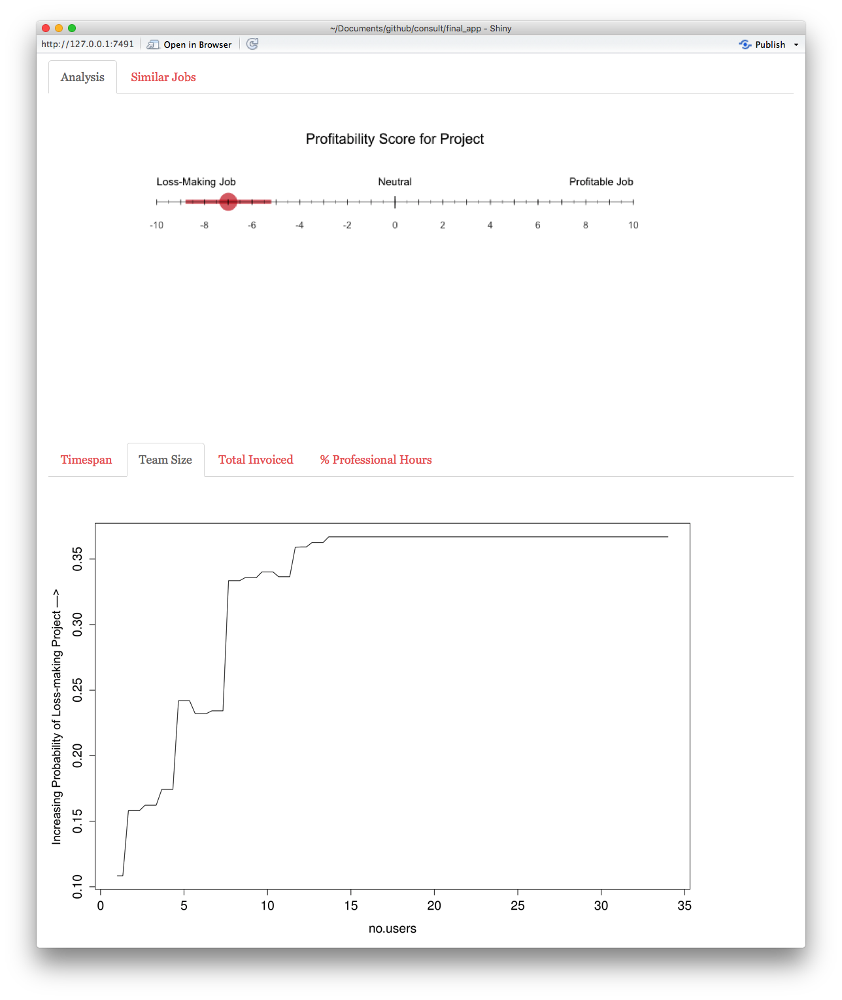
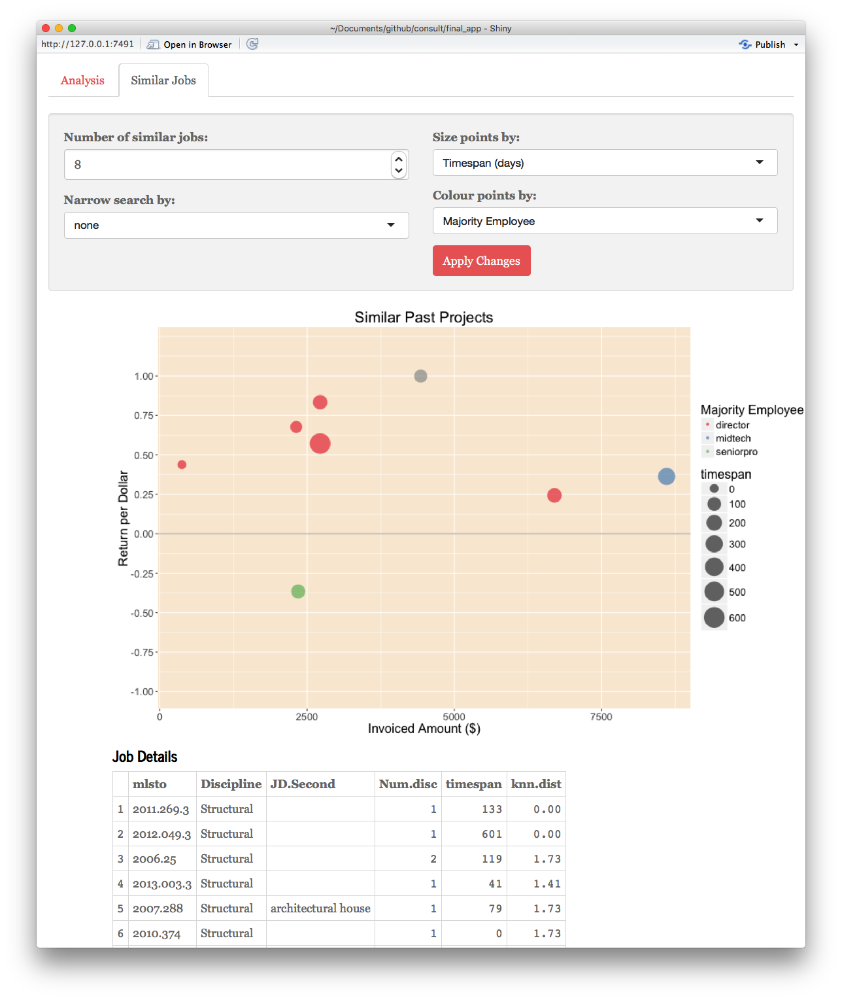
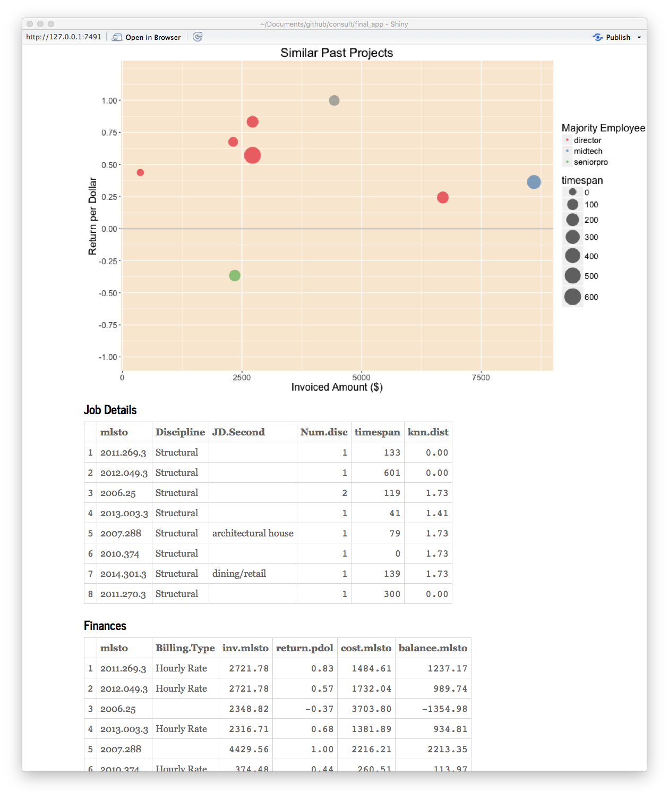

```{r, echo=FALSE, include=FALSE}

library('knitr')
library('ggplot2')
library("plyr")
library("dplyr")
library('magrittr')
library('reshape2')
library("rpart")
library('car')
library('e1071')
library('party')
library('randomForest')
library('RColorBrewer')
library('pwr')
library('scales')
library('purrr')


# detect OS
if(.Platform$OS.type == 'windows'){
        # setwd("C:/Users/n9232371/Documents/Consultbusiness/data")
        opts_knit$set(root.dir= "C:/Users/n9232371/Documents/github/consult/finalwriteup/report_data")
} else{
        # setwd("~/OneDrive/shared files/Bligh Tanner/masters/data")
        # setwd("~/Documents/github/consult/finalwriteup/report_data")
        opts_knit$set(root.dir= '~/Documents/github/consult/finalwriteup/report_data')
}

opts_chunk$set(fig.width=6.7, dpi = 300, warning = FALSE, message = FALSE, echo = FALSE, warning = FALSE)
```

# Keywords


# Abstract

Engaging in loss making jobs for fixed fees is a major problem in consulting, particularly in the competitive construction industry. This thesis investigates whether machine learning techniques applied to a company's passively collected internal data could help avoid loss making jobs or help tactfully choose when to enforce stricter contracts. It was found that in a specific decision framework, a case study's profits could be improved 9% by avoiding approximately 4% of projects. Alternative decision frameworks are also proposed and evaluated. The internal data collected by the case study company described each of their projects in terms of employee positions, fraction of project time completed by each employee, client characteristics, project characteristics (time span, hours, technical details) and invoicing history. Algorithmic methods such as Logistic Regression, Random Forests, Boosted Trees, Naive Bayes, and Bayesian Networks were applied as well as blended combinations of these methods. A decision scenario that rejected projects above a sequence of tested thresholds was run in order to find the optimal threshold for profit improvements. This process was repeated on hundreds of models built from different training subsets of the data in order to obtain a 95% statistical confidence interval of profit improvements. The blended Logistic Regression model outperformed other methods and produced a 95% confidence interval of 6.5 - 11.5% profit improvements. Further work is recommended to test user input estimation and user interface designs. The findings from this research have the potential to assist managers in reducing losses by highlighting risky projects and guiding project-based changes to fee structures.

# Table of Contents

# List of Figures

# List of Tables

# List of Abbreviations

**ANOVA** - Analysis of variance. A statistical test that can be applied to find whether there is a significant difference between the means of more than two groups. 

**AUC** - Area under the curve. In this project, the area refers to the area under an ROC curve. Areas greater than 0.5 indicate predictions performing better than random chance while an area of 1 indicates perfect predictions.

**B2B** - Business to business. Commerce transactions between two businesses.

**BIM** - Building information modeling. A digital representation of physical characteristics of an object or structure. 

**CBR** - Case based reasoning. A method of estimating by using the results of similar cases. 

**CLV** - Customer lifetime value. Prediction of the profit a customer will bring over the course of a business' relationship with the customer.

**CRM** - Customer relationship management. Refers to a common type of software used by businesses to record client and project details as well as employee time sheet records. Generally accessible to each employee in a company. 

**DA** - Discriminant analysis. Statistical analysis to predict a categorical response variable. 

**DAG** - Directed acyclic graph. A graph consisting of vertices connected by edges, where each edge directs a vertex to another vertex. The arrangement of the edges is such that a vertex cannot follow a path that loops back to itself. 
**ESS** - Error sum of squares. The sum of squared errors from a set of predictions.

**FN** - False negative. A case marked 'positive' in a data set is incorrectly predicted 'negative' by an algorithm.

**FNR** - False negative rate. The proportion of negatives that were incorrectly identified (false negatives).

**FP** - False positive. A case marked 'negative' in a data set is incorrectly predicted 'positive' by an algorithm.

**FPR** - False positive rate. The proportion of positives that were incorrectly identified (false positives).

**FWLS** - Feature weighted linear stacking. A linear combination of model results that is interacted with original variables. This allows certain models to be weighted heavier for certain values of the original features.

**IQR** - Interquartile range. A measurement of spread or variability for a continuous variable. When the data is ordered numerically and divided into four equally sized portions, the values that divide the portions are called quartiles (first, second, third and fourth quartiles). The first quartile has the highest value of the lowest quarter. The interquartile range is the third quartile value minus the first quartile.

**IT** - Information technology. The use of computers for storing, retrieving and processing information. 

**RMSE** - Root mean squared error. The square root of the mean of the ESS.

**ROC** - Receiver operating characteristic. An ROC curve plots the performance of a binary classification algorithm its scoring threshold is varied.

**TN** - True negative. A case marked 'negative' in a data set is correctly predicted 'negative' by an algorithm.

**TNR** - True negative rate. The proportion of negatives that were correctly identified (true negatives).

**TP** - True positive. The case where a case marked 'positive' in a data set is correctly predicted 'positive' by an algorithm. Generally, 'positive' is assigned to categories for which the use case needs to be alerted. 

**TPR** - True positive rate. The proportion of positives that were correctly identified (true positives).


# Acknowledgements

I would like to express special appreciation to my Principal Supervisor Professor Kerrie Mengersen. Thanks for extending a hand and giving me this opportunity as well as deftly guiding my work and welcoming me into your excellent research environment. Next, I would like to thank my Associate Supervisor Dr. Paul Wu for kindly and cheerfully working with me on the finer details of my research, giving up many hours of your time. Lastly, I would not have learned half as much without my colleagues in the BRAG group and ACEMS team.

# Publications

Cook, A., Wu, P., & Mengersen, K. (2015, September). Machine Learning and Visual Analytics for Consulting Business Decision Support. In *Big Data Visual Analytics (BDVA), 2015* (pp. 1-2). IEEE.

# Statement of Original Authorship

The work contained in this thesis has not been previously submitted to meet requirements for an award at this or any other higher education institution. To the best of my knowledge and belief, the thesis contains no material previously published or written by another person except where due reference is made.

Signed ................................
Date....................


# Introduction

Predicting how long it will take a person to do something is a notoriously tricky task. People make mental calculations of this sort every day - estimating how long it will take to drive to meet someone on time, how many tasks you can check off in a day, or how long it will take to cook a dish. As most people have experienced, these estimates can be particularly inaccurate if the task is new and difficult. These errors are trivial in everyday activities, but for consulting businesses that solve complex problems, similar time estimation errors determine their financial well being.  
 
Consulting businesses give expert advice to other professionals in exchange for a fee based on the amount of time their consulting staff spends on the project. The deliverable 'expert advice' is generally in the form of a document or a package of documents. A document could range from a 5-page report written by a single person to a sequence of hundreds of drawings assembled by a team of 10 over many years. Despite the range of possible deliverables, before any project commences, the client and consultant must agree on a fee, or at least a fee structure. The fee structure can be as creative as the engaged parties wish, but in fact tend to fit a few common models. Two examples are:

1. The client agrees to pay for the consultants' time by the hour until the task is complete (referred to as hourly rate) or 
2. The consultant offers a fixed fee to complete the project in full, regardless of time spent (referred to as fixed price or fixed fee). 

In each of these contract models, financial risk is assigned to one of the parties. In model 1, the client must pay for an unknown quantity of consultants' billable hours and in model 2 the consultants must complete the project for a fixed price while not knowing how much of their own time will be spent.

This thesis focuses on the risk taken by a consulting company when offering a fixed fee. Clients commonly seek fixed price quotes from several consultants before selecting one or negotiating further. Hence, quoted fees must be competitive. 

The way a consulting manager calculates a fixed price varies from industry to industry and even company to company. Typically a consulting manager has experience in the type of project they are quoting and, after reviewing the project details, can use a combination of intuition, comparison to past projects, and rules of thumb (such as a set fraction of the entire client budget for a large project). Such qualitative methods can result in profit margins, which ultimately depend on the skill (or luck) of the manager in predicting the amount of time a project demands. 

This thesis focuses on a single case study consulting company in the construction industry that has persevered through many fixed price projects that resulted in losses. A source of insight into the loss making projects was identified - twelve years of passively collected data that described each project in terms of their clients, invoice history, employee hours and technical details. Was it possible to find trends in what makes a project loss making and can these characteristics be identified before a fixed price is offered? Can these trends be modeled into a predictive algorithm, and if so, how could the outcomes become integrated into business decisions? Finally, if the predictive outcomes were integrated into decision-making, would they definitely improve the business' bottom line? These questions are explored in depth and answered over the course of this dissertation.

Due to the commercially sensitive nature of the data used, the source is not disclosed. Variables have been de-identified to ensure confidentiality is maintained.


# Problem Description

“It’s tough to make predictions, especially about the future” - Danish Proverb

In this chapter the research motivations are explained along with the goals of the project and the specific research hypotheses. Finally the contributions of this body of work are outlined along with the structure of the thesis.

## Research Motivation

### Problem Description

Project managers across many industries have always struggled with forecasting project costs. A study on large-scale infrastructure projects over the past seventy years revealed that cost forecasts consistently underestimated the cost of rail projects by an average of 44.7%, the cost of bridge and tunnel projects by 33.8% and the cost of road projects by 20.4% [@Flyvbjerg2007]. A study across 1471 IT projects showed that 27% of projects ran over budget, and one in 6 of those projects were more than 200% over budget [@Flyvbjerg2011]. Another review of 6 IT project surveys between 1984 and 1994 by @Molokken2003 revealed that 60-80% of IT projects encountered effort and/or schedule overruns, where the average overrun was by 30 to 40%. These statistics describe difficult conditions that can result in job losses, business bankruptcies, and government budget blowouts. A survey from @Moores1992 asked software managers whether they saw effort estimation as a problem, and 91% responded 'yes'.

Smaller consulting companies in competitive industries, such as the construction industry, experience similar difficulties in forecasting their project costs. They must offer appealing fixed prices in order to remain competitive and win projects. However, when these projects go over budget it negatively impacts the business in many ways. Employee morale deteriorates and employees may view themselves incompetent if they are responsible for the project's delivery. Employees also experience elevated stress attempting to complete underestimated projects within a disappearing budget and may compromise quality of work in exchange for speed. This is unfortunate if the only issue with the project was an under-estimated fee. Unprofitable projects also limit a business financially, hindering investment into marketing, training, and business development. The financial risk taken on fixed price projects may also discourage businesses from taking other, more calculated risks, such as expanding the business into a new area. Clearly, improving the prediction of project profitability would improve business growth and staff morale.

### A Wicked Problem

The challenge for consultants to reduce budget blowouts, in terms of hours spent, is not easily solved. Complex projects always differ from one another - even similar projects may end up demanding significantly different amounts of time. Although this is known, clients often request a fixed price before a project is awarded. If an hourly rate fee structure is proposed, clients in many industries can simply turn to another consultant willing to take the financial risks involved with fixed prices [@Pai2013]. Two strategies to guard against fixed price budget blowouts are detailed below along with their limitations.

A compromise between the hourly rate and fixed price structure is to track employee hours, and stop work once the fixed consulting fee has been exhausted. Then, negotiate further fees, or variations, with the client. This can either be agreed upon with the client beforehand or the consultant's internal strategy. If this strategy is proposed to the client up front, it is likely the client would again turn to another consultant who is willing to offer a fixed price. If this approach is the consultant's internal strategy, their financial risk may satisfactorily be reduced. However, the behaviour may cause friction between the client and the consultant, therefore reducing the potential for repeat business. In the event of hours inflating beyond expectation, consultants may choose to wear losses or endure marginal profits to preserve their client relationship. They may reason it is in their best interest to maintain a reliable, trustworthy reputation in their industry above creating financial friction. 

Another strategy for managing this risk is by stipulating a specific one-off variation opportunity in the contract. This applies to consulting work that falls under the client's larger project budget. The variation would specify a percentage fee of the overall project cost that can overrule the original fixed price. The purpose of this rule is to guard against the case where the project creeps in size, and the consultant finds themselves gradually undertaking more work and more work for the same price even though the client was happy to spend more on the overall project. This may account for some, or in the best case all, of their overspent time, although again a savvy client may turn to other consultants that agree to omit variation opportunities.

Clearly, there is not a straightforward contractual solution to reducing the financial risk taken on by consultant's who offer fixed prices in complex projects. In many industries, the reality of fixed price fee structures is unavoidable and businesses conform to survive.

### Current Fixed Price Estimation Methods

It has been established that estimating fixed price fees in consulting is a difficult task with unfortunate consequences if the price is estimated too conservatively. This project aims to mobilise a consultant's historic data describing profitable and loss making jobs in order to improve their fixed price setting practices. But what is the current method for estimating fixed prices or project costs? Is past data currently used in other cost estimation practices and to what degree of success? 
 
Unfortunately, limited research is available that documents the methods industry uses for complex-projects. However, two surveys are available: one from 2000 that covers construction project cost estimation, the other from 1992 and focuses on IT project effort estimation (which can be likened to fixed price estimation for consultants). The construction cost estimation study by @Akintoye2000 surveyed 84 UK construction contractors, ranging from small to medium to large, about their estimating practices. They found that the main method was breaking the project into detailed parts and summing up the cost of each item. The next two most popular methods were 'comparison with similar projects based on documented facts', and 'comparison with similar projects based on personal experience'. These can all be classified as experience based models [@Akintoye2000].

A survey by @Moores1992 of 54 software developing companies found that detailed project planning tools were used by most companies as opposed to cost estimation tools, suggesting that projects were priced based on an analysis of a detailed breakdown of tasks within a project. In the same survey, 91% of software companies cited cost estimation as a problem.

Both surveys indicated cost and effort estimation were performed via a detailed breakdown of the tasks required. Analysis of past project data was alluded to (comparison of similar projects) but a rigorous data analysis process was not common. Therefore it is worth investigating if a predictive model based on past data could improve the fixed price setting practice.

### Cost Estimation and Human Nature

Although the surveys indicated industry did not analyse past project cost data, the idea of using this data (in the same way) has been studied before. Research exists that tested people's estimation accuracy with and without comparative historic data with interesting results. This is summarised below along with the resulting data-driven models. 

@Lovallo2003 delved into the psychology behind why executives so often severely underestimate costs of larger projects such as manufacturing plant construction, mergers and acquisitions, large infrastructure and software development. Their theory stemmed from Kahneman's work on decision-making that won him the Nobel Prize for economics in 2002. His research argued that a person's natural optimistic view of their own skills leads to consistent underestimation of the time and risks involved in a project. A manager optimistically sees challenges in a project as something that can be overcome by the team's high skill level, and downplays or ignores the risk of problems that are out of the team's control. This is why it does not matter if the project is broken down to the highest level of detail for cost prediction; all complex projects are at risk of encountering a multitude of problems that the manager could never foresee. Each problem has a low chance of occurring, but in combination the risk is much greater [@Lovallo2003]. 

@Lovallo2003 called the practice of analysing a project based on project details without considering unforeseen risks the 'inside view'. A survey by @Moores1992 aligned with this theory and found the most popular response for the supposed reason for cost overruns was over-optimistic estimates (51%). This contrasts with an 'outside view' where a subject is analysed by comparing it to other subjects and disregarding specific subject details. For example, research has shown that if people make predictions about their skills after being exposed to an 'outside view' (a summary of other people's skills), their predictions are significantly more accurate [@Lovallo2003]. This 'outside view' can be applied to complex projects, and stipulates that the details of the current project should be ignored in favour of analysing outcomes of several similar projects. Mobilising the outside view in this way is called reference class forecasting [@Lovallo2003]. One method @Lovallo2003 recommended was to obtain correlation statistics from past similar projects - the correlation between the forecast cost and the actual cost. The correlation for the current project can then be estimated via a statistical model, which is then used to adjust the forecast cost made by detailed analysis (the 'inside view') [@Flyvbjerg2011]. As demonstrated in the surveys, @Flyvbjerg2011 found that managers rarely analysed data from similar projects even though it could significantly improve cost predictions. This discovery led the team to formally introduce 'outside view' methods into some institutions. 

The implementation of reference class forecasting began in project management for the first time in 2004. It was endorsed by the American Planning Association in 2005, and is now used in some governments and private companies in Europe, South Africa, and Australia. An example of the type of output from a reference class statistical model is a plot showing the relationship between the acceptable chance of cost overrun and the required uplift to the original forecast cost [@Flyvbjerg2011]. An example reading from the chart is as follows: "If the chance of a cost overrun of 20% is acceptable, the estimated cost should be increased by 55% from original calculations.". This builds past experiences of cost overruns into the initial cost estimation.

![This model was implemented by the British government for a rail project that was under completion at the time of publication [@Flyvbjerg2011]](images/lit_review/UKrail.JPG)

The visualisation presents a powerful communication tool for influencing decision makers and improving forecast cost accuracy, however, access to credible data for a sufficient number of projects can be a challenge [@Flyvbjerg2011]. Overall, the optimism bias theory credibly helps to explain the persistent problem of project cost underestimation.

### Further Reference Class Forecasting Models and Industry Uptake

Although Flyvbjerg's (2011) reference class forecasting theory and the psychology behind it was first published in 2003, predicting project costs using previous data has been researched for many preceding years and continues to this day. In this section, a brief overview of other reference class forecasting models is presented (they are reviewed in greater detail in the literature review) followed by an analysis of why industry has not yet adopted them. 

Most cost estimation or reference forecasting analytic models focused on software development and construction projects, along with some work on film projects. These analyses generally used information from 15 to 20 large projects and the data set summarised projects from around the world with different clients and teams. Applied mathematical methods varied from statistical Regressions to deep-learning Neural Networks [@Love2005; @Kim2004]. Most studies reported that their predictive models performed well and that Neural Networks were generally more accurate than Linear Regression.


#### Industry Uptake of Existing Models

Despite the predictive success in statistical and machine learning cost estimation models as well as the revealing outcomes from 'inside' and 'outside' view studies, there has been a lack of industry uptake. Two reports reviewing cost estimation in the software industry investigated reasons why data-driven forecasting models have not been translated to industry. The key causes were:

* A lack of a decision framework to support manager's use of the 'outside view' model [@Moores1992]
* A failure in marketing of the potential for the models to improve business outcomes [@Moores1992]
* The products of the research were not comprehensive enough to be used in industry [@Jorgensen2007]
* Expert judgment was not mobilised enough in the process of developing the tools and the resulting product felt disconnected to actual requirements [@Jorgensen2007]. 

Reports on other industries were unavailable, however the insights are general and may explain the lack of adoption in other industries (such as the construction industry). 

In the software industry it is also possible the problem of fixed price contract blowouts has been solved by an alternative contract structure, which has made cost estimation models unnecessary. In contrast to construction, IT projects are a relatively new practice and the industry has had success in trialing alternative contractual arrangements. Through experimentation, the Agile movement was developed. The method treats both cost and time as fixed quantities for a project, and any change or additional work can only be accommodated if another, less important requirement is excluded [@Badenfelt2011]. Furthermore, the project outcomes are continually adjusted and revised based on frequent progress review points that assess unexpected problems. The flexible upfront arrangement with clients has often been found to forge better long-term relationships [Cockburn2001]. This agile methodology suits the nature of software development work, where curtailing the scope of work is relatively straightforward. Also, since the industry is relatively young, the new methodology was able to sweep across the field and was shown to deliver better budget and product outcomes to clients [@Rasmusson2010]. 

Unfortunately, in other industries such as the construction industry, infrastructure and building projects are steeped in a traditional process, where contractual norms have developed over a much longer time period [@Badenfelt2011]. The industry is so large, broad and well established that it has inertia in the way projects are estimated, and contractually bound. Furthermore, the industry would struggle to take on an agile approach as the scope cannot be easily reduced as the project unfolds - the project must result in construction and building certification which implies a high-level of time, legal responsibility and due diligence.

This project aims to assist a company in the construction industry in managing problematic fixed price projects, since fixed price contracts can seem unavoidable. The blocks preventing industry adoption, such as providing a clear decision framework for how to implement the model will be carefully addressed.

### Case Study

The case study company is an engineering consulting company in the construction industry. In their profession, labour is the chief cost and the long traditional history of this industry mandates fixed price projects as the norm. In recent years, the size of losses from unprofitable projects equaled 25-30% of their profits from profitable projects. This demonstrates the magnitude of their cost estimation problem and the substantial room for improvement that a data-driven model may facilitate. 

Cost estimation is currently performed in the case study company by first carefully reviewing preliminary drawings where time costs for each task are estimated and summed by an experienced manager (the 'inside view'). This is often crosschecked with a value that is based off a percentage of the estimated final cost of construction (generally the client budget). No formal mathematical method of comparison to similar projects is performed. This is the case for a number of possible reasons: 

* Lack of time to interrogate past project data
* Clunky data availability offered by their database software
* Lack of awareness of similar projects performed by other managers

A Customer Relationship Management software package (CRM) is currently employed to collect and store project data. A CRM is a popular type of software used by businesses to record client and project details as well as employee time sheet records. In the case study business, the CRM is available to all employees over the company intranet, and each employee completes daily time sheets allotting their hours to certain projects. Additionally, technical information is recorded against each project as well and the CRM data stood as an untapped source of information within the case study organisation. It stores a rich variety of data including:

* Employee time sheet hours with dates
* Other project costs (taxis, printing)
* Client information/characteristics
* Client identification code
* Invoiced amounts for each project and dates
* Employee costs
* Employee charge out rates
* Project description

The CRM software readily provides simple output statistics, however, analytic capabilities were limited to:

* Simple scatter plots and bar charts of the raw data
* Summaries such as overall hours spent vs. the invoiced amount for each project

The company had a wealth of data but limited means to extract insight. This study exploits the CRM data by performing more sophisticated statistical analysis with the intention of building a predictive model to improve cost estimation. Thousands of past projects are available for analysis, as opposed to previous studies that used on average 15-20 cases and at most 300 [@Finnie1997; @Pai2013; @Shin2015]. This improves the potential for accurate predictions. If successful, the model also has higher potential for managerial uptake as the algorithm will be directly built and trained on internal company data. Managers could interrogate how the model outputs were calculated and relate to the actual projects used in the model or speak to a colleague that was involved. This may make the presented 'outside view' more relatable and have more potential to influence the final fee proposal.
    
### Case Study Limitations

The case study provides an opportunity to test whether passively collected CRM data can be mobilised into a predictive model to improve fixed price cost estimation. However, there are some limitations in the study including the size of the study, missing data, and errors in data entry. This section addresses how the limitations can be addressed either in future work or within the research framework. 

The most obvious limitation is that the work focuses on a single company in a specific industry, which limits the application of conclusions to a broader range of companies. First determining the optimum method and variables for this case and then testing them on future case study companies can overcome this.

Another limitation is the type of unavailable data. Information on overall costs of construction projects was scarce. This is relevant because managers sometimes price jobs based on the budget for the entire project, of which the consultant is a minor part. For example, engineers may moderate their fee by 1% of the entire project cost. Another piece of data not recorded was the external factors influencing the fixed price quote including known competition from similar firms.

The database also excludes detailed technical information about each project. Such details are found in the preliminary drawings describing the project (square meterage, number of storeys), as well as project summary documents provided by the client to enable a quote. However, this level of information actually contradicts the purpose of the 'outside view', the intention of which is to present similar projects without being over-influenced by finer details. Given the lack of detailed information describing the physical size of projects, it was not reasonable for an algorithm to predict the numeric fee. Instead, it was more logical to predict the profitability of a project i.e. 'return per dollar'. This measure represents the ratio of the project profit to business costs, and can easily be compared between projects of different sizes.

Finally, employees enter all CRM data manually. Because the data is input by people, it is susceptible to some error. Many errors were detectable during data cleaning, however it is possible that a low number of undetectable human errors exist in the data and marginally influence predictions. 

### Research Motivation Summary

Fixed price cost estimation for complex projects is a difficult task and when performed incorrectly, cause substantial financial losses to businesses and governments. Studies have explored human nature and our tendency to optimistically assess our capabilities with respect to a given task. In the case of cost estimation, the optimism can result in negative business consequences affecting employee morale and the capacity of a company to flourish and grow. Over the past few decades, significant research has been dedicated to creating predictive models that present the 'outside view' of a project. This was done by statistically comparing a new project to a collection of similar projects and their characteristics. It has been shown that these models improve cost estimation accuracy, however industry has not adopted them. Managers tend to predict costs based on intricate details of a project in favour of reference class forecasting. This may be due to poor marketing of the cost estimation tools, a lack of a decision framework in relation to the tools, and a lack of collaboration with industry during model development.


## Thesis aims

For the reasons explained above, the aim of this research is as follows:

**General Aim** Use statistical techniques to model the profitability of projects for consulting businesses using their internal CRM data. Research will focus on a case study Engineering consulting company that offers their expert advice (in the currency of time) to business clients. 
The project outcomes are intended to assist the business in predicting project profitability before engagement. Several statistical and machine learning techniques were tested, compared and refined.

**Hypothesis 1**
A statistical or machine learning model based on historical project data can predict the profitability of a new project with greater accuracy than a baseline predictor. A baseline predictor for this project is one that predicts the average of a numeric response variable for all cases or, if the response variable is categorical, randomly assigned categories for each case, where the proportion of assigned categories matches the true categorical proportions.

**Hypothesis 2**
The predictive model built from Hypothesis 1 can be shown to have a positive impact on the overall profit earned by the case study business. The overall profit is represented by the following equation:

$Overall\ Profit = Revenue\ from\ Project\ Invoices\ - (Employee\ Costs + Business\ Costs)$


## Thesis Contributions

In comparison to previous studies, this project advances the body of work on cost estimation in three ways: the data set is larger than other studies and sourced from a single company's CRM database, ensemble tree methods and model blending were tested, and the prediction results were integrated into a decision framework for the business. These points are outlined in more detail below.  

In past research, cost estimation data sets generally consisted of dozens of projects from a range of a companies and even countries. This thesis' case study only had access to the company's internal data but this contained over 2,000 past jobs - far more than the usual cost estimation study and with many more variables. Furthermore, the problem of cost estimation is applied to a consulting company in the construction industry, which differs from other studies in the construction industry that estimate actual construction costs. Consulting in the construction industry can be likened more to software development effort estimation although the nature of the work differs considerably.

In addition to addressing cost estimation with a different kind of data set, ensemble tree methods are applied which have been minimally tested on this problem. Ensemble tree methods combine hundreds or thousands of decision trees to make predictions. A single decision tree is a non-parametric machine-learned model built by progressively determining the best binary split to partition the data according to the response variable. For further explanation of the method behind decision trees and ensemble trees, three excellent sources are @Hastie2009, @Elith2008, and @Breiman2005. To date, Linear Regression, Neural Networks, Case Based Reasoning (CBR), and Support Vector Machines (SVM's) have been used to predict cost/effort even though ensemble tree methods can perform as well as Neural Networks and generally outperform Linear Regression [@Caruana2006]. Another benefit of ensemble trees is the output types available, such as partial dependency plots and variable importance plots that provide insight into the model's calculations. This contrasts Neural Networks and SVM's, which are 'black-box' predictors. Providing insight to a user is a major benefit as past research has demonstrated issues with user trust and uptake of models, even if the models predicted well. It is anticipated that using internal data will also improve trust and create tangible meaning for the user. Blending multiple machine learning and statistical models has also not yet been applied to the cost estimation problem and may improve predictions.

Finally, this study propels the predictive model one step further than other studies by analysing bottom-line profit improvements that could result from the research. A few possible ways to integrate model results into business decision-making scenarios are presented, and where possible, final profit increases are evaluated. This kind of thought experiment is designed to present a clear case for industry when evaluating if and how to adopt cost estimation models. 

## Thesis Structure

The next chapter, Chapter 3, is a thorough review of the literature to date that relates to this thesis. This covers work solving the cost-estimation problem, studies on statistical and machine-learning models in business applications, and a review of potential statistical and machine learning methods. 

Chapter 4 describes the method followed throughout the research process. It includes first how the data was obtained, the lengthy cleaning process, followed by variable importance analysis, variable selection, trials of selected predictive algorithms and problem constructs. The cost estimation problem was attempted first as a regression problem predicting 'return per dollar', followed by a simpler binary classification problem predicting profit or loss. Once the best methods were selected, they were blended in numerous ways, using both simple averaging techniques and sophisticated machine-learning algorithms. These were compared against individual models and the best constructs were selected. Finally the impact of the algorithm on the overall profits of the case study company was analysed via decision-making scenarios. Further applications were also considered.

The research outlined in the method was divided into four stages, each of which was assigned a chapter containing the results and discussion of that portion. Chapter 5 describes the variable selection process. Chapter 6 and 7 cover the results of the two ways of framing the cost estimation problem: using regression models and binary classification models. Chapter 8 shows the outcomes of model blending, and then Chapter 9 extends the predictive analyses into an overall profit analysis, as well as describing research limitations and future work.

The results section in each of the chapters listed above presents key charts and tables that progressively answer the research hypotheses: can a statistical or machine learning model based on a company's internal historical project data predict the profitability of a new project better than a baseline model? And would these predictions have a positive impact on the overall profits earned by the business? Then, a discussion finalises each chapter, where the results are examined more deeply and analysed in a broader context. The nature of the results are also debated in terms of how surprising they were, their impact on the research hypotheses and limitations as well as suggested future work. The final chapter, the Conclusion, summarises the findings of the project, how the research answered the hypotheses and how the work could be viably applied in industry.

# Literature Review 

Assessing outcomes of comparable past studies may impart how to best approach the problem and reveal shortcomings that can be improved upon. This chapter provides an overview of the literature describing early and current cost estimation methods. The most prominent machine learning and statistical methods shall then be reviewed followed by a summary of papers on more general business applications that have tried a wider variety of methods. Gaps in past research will also be highlighted.

## Project Cost Estimation Methods

The practice of estimating fixed fees is usually represented by the terms 'cost estimation' or 'effort estimation' in the literature. The bulk of research to date has been performed with project data in either the construction industry or software development. The different methods and outcomes in each of these industries are reviewed below. Finally a gap in the literature will be highlighted which this research addresses. 

### Cost Estimation in the Construction Industry

Research in the construction industry has primarily focused on predicting the final building cost of construction. Some studies reported surveyed cost estimation practices while others tested new methods such as building information modeling (BIM) analysis, CBR, and predictive algorithms. The cost estimation methods of detailed analysis (the 'inside view'), CBR, and predictive algorithms are reviewed in this section.

#### Detailed Analysis in the Construction Industry

Detailed analysis refers to the process of an engineer or builder in the construction team carefully reviewing construction drawings to sum the cost of materials, labour, machinery hire, overheads, and profit etc. [@Akintoye2000]. As referenced in the Research Motivation, Akintoye and Fitzgerald's [-@Akintoye2000] study found that this was the most popular method amongst contractors. 

@Elfaki2014 discuss how much detailed cost estimates for construction projects can vary from estimator (engineer) to estimator. This contributes to the lack of accuracy in predicting final costs of a project. They argue that an engineer's expertise is not documented or measured in any way and therefore their expertise and, in turn, their estimate is prone to subjectivity. @Shane2009 theorise that final cost can be subject to so many different unpredictable parameters, such as weather, unexpected ground conditions, duration or sub-contractor issues, that it is almost impossible to achieve an accurate cost prediction manually.

Groundbreaking methods into calculating construction costs by @Ma2014 mobilised data from building information modeling (BIM) models, although this is still technically a detailed analysis of the costs. The idea is to quantify the cost of building a structure directly from a three dimensional BIM model created by the design consultants (engineers and architects). Ma and Liu's [-@Ma2014] first trial was to automate the cost calculation of a reinforced concrete structure. They programmed their algorithm to intelligently establish construction techniques for each element, as architectural or engineering models do not provide this. From the construction technique and material, a cost was derived for each element. This was successful and @Ma2014 aim to further their work so that more construction information can be intelligently obtained from BIM models. A system like Ma and Liu's [-@Ma2014] would definitely accelerate the cost estimation process and reduce human error, however it is still an 'inside view' and could still deliver inaccurate estimates similar to detailed analysis by a person. The detailed view does not 'step back' and take into account setbacks in construction that may have affected past similar projects. There is potential for this innovation to be combined with an 'outside view' system.

Detailed analysis remains the most prevalent method for construction cost estimation despite the industry having a long history of projects running over time and budget using the same technique [@Shane2009]. Next, the method of detailed sums shall be compared to results from parametric algorithms and CBR ('outside view').


#### Statistical and Machine Learning Models in the Construction Industry

Dozens of studies have built machine learning and statistical models to predict construction costs. This section will first review the previous studies and most accurate algorithms and finally summarise industry uptake of the methods.

@Elfaki2014 completed a review of cost estimation research from 2004 to 2014. They found that artificial Neural Networks and SVM's were the most common machine learning techniques. These techniques also deal well with uncertainty, however lack technical justification for the decision maker (known as a black box predictor). Neural networks are also time consuming to train, and must be re-trained and re-tested with each additional piece of data [@Kim2004]. Nevertheless, Neural Networks and SVM's received significant attention in the 1990's for their ability to accurately predict construction costs with limited detailed information [@Shin2015; @Kim2004].

@Shin2015 pioneered the application of Boosted Trees to cost estimation in construction projects. This is surprisingly late given the rapid uptake of Boosted Trees over the past decade. In their study, data from 234 school building construction projects in Korea were used. Boosted trees were compared to Neural Networks and were found to predict costs slightly more accurately than Neural Networks, but not statistically significantly (p-value < 0.05). 

A notable amount of literature tested the predictive power of Multiple Linear Regression in the construction cost estimation problem. Often, Linear Regression was the only model assessed, without comparison to other methods such as Neural Networks, which first started appearing in literature in the 1990's [@Kim2004]. However, even post-1990, many studies focused on Linear Regression only. This may be because the technique is straightforward, easy to use and widely available in statistical packages [@Chan2005]. Some studies showed that Neural Networks outperform Regression, however other studies established they are approximately equal [@Kim2004; @Attalla2003]. @Dissanayaka1999 suggested that Regression models could be performed first to determine variable importance and condense the number of variables, and then Neural Networks could be used for better estimation. Boosted Trees may perform as well as Neural Networks while providing even more insight than Regression models because it is possible to produce partial dependency plots. These visualise the relationship between each variable and the response variable (cost). 

Regression models from different studies tended to use a wide range of variables, each of which influenced the models to varying degrees. This is likely because construction projects are multidisciplinary and involve many parties such as the clients, consultants, contractors and suppliers, [@Chan2005]. Chan and Park's [-@Chan2005] study on 87 building projects in Singapore included special, complex projects. Therefore, variables such as contractor's specialised skills, who the client was (public vs. private), the client level of experience, and the contractor's financial management highly influenced final cost of the project. Other studies found variables such as project complexity, duration, team experience, information availability, site requirements, and labour climate to contribute most [@Akintoye2000; @Trost2003; @Pinto1988]. As these studies obtained information from questionnaires, the available variables depended on the questions. Despite the differences in qualitative outcomes, the studies all generally reported their mean absolute error or a similar metric from the tested models, and results were generally positive. 

Similar result statistics are useful, however there is a gap in the literature rationalising which model industry should adopt, how to adopt it into a business, and how much loss can be reduced. This gap may explain why uptake of these algorithmic models is sparse, as indicated by Akintoye and Fitzgerald's [-@Akintoye2000] survey, despite 20 years of prior research. @Akintoye2000 hypothesised this could be due to a lack of knowledge about the techniques, doubts whether these techniques are applicable to the construction industry, and the availability of sound data to ensure confidence.

The literature on construction cost estimation does not acknowledge that dozens of consultants and sub-contractors contribute to a large project. Most consultants, such as engineers and architects, produce their own cost estimates for their effort that contributes to the project. Their contracts are often fixed price, with minimal room for movement, and they wear the risk of over-spending their time [@Harris1999]. Furthermore, the existing studies collected data from many businesses for a single study, which leaves a gap in research exploring a single contractor's history of projects at one time. 

#### CBR in the Construction Industry

CBR is a systematic method of expert judgment, where the decision maker manually compares similar projects from his or her experience [@Shepperd1996]. The idea is that in the case of a new project, similar projects are chosen, before generalisations about the data are made. This contrasts to algorithmic models that are built from the entire set of data [@Elfaki2014]. Research into the application of CBR to construction cost estimation began in the 1980's [@Kim2004]. The general procedure involves:

1. Storing a collection of projects with key variable values
2. Once a new project or case arrives, similar cases are retrieved. This can be achieved either algorithmically with a distance function applied to the variables, or manually by users reviewing past cases. The Nearest Neighbour algorithm has been used to find the distance between cases in previous studies. It is programmed to calculate the Euclidean distance in n-dimensional space between cases, where each variable is a dimension [@Kumar2007].
3. The cost of the new project is estimated by extrapolating characteristics of the similar cases to the new case. An experienced decision maker can also do this either algorithmically or manually.

A study by @Kim2004 compared CBR to Neural Networks and Linear Regression in construction cost estimation. For CBR, the ESTEEM software package algorithmically calculated the similarity of variables, weighted the variables using gradient descent, and deduced the cost using the most similar cases (the specific method for this last step was not explained). The discussion compared mean absolute error rates of the three methods and showed that CBR was more accurate than Regression, but less accurate than Neural Networks in estimating cost. Despite Neural Networks outperforming CBR, CBR maintained advantages over Neural Networks, which have been referenced in other studies as well.

Advantages of CBR include algorithmic efficiency as well as user engagement. In Kim, An, and Kang's [-@Kim2004] study, it was noted that CBR models were simple to update with new data in comparison to Neural Networks, which must be slowly re-trained and re-tuned. New cases also did not need to have every variable complete, which can occur often in 'real world' data. Neural Networks on the other hand require complete data. Another advantage of CBR is the ability for users to review chosen similar cases and make sense of the prediction, as opposed to Neural Networks [@Kim2004; @Elfaki2014; @Kumar2007]. One disadvantage is that accuracy can be highly dependent on the number of selected cases [@Elfaki2014]. Overall, CBR may provide prediction accuracies between regression and Neural Networks but the results can be justified by the user - a valuable asset.

CBR that is performed manually through personal experience, without the assistance of algorithms, was the second most popular method for construction estimation in Akintoye and Fitzgerald's [-@Akintoye2000] survey in the UK. This indicates it is quite an intuitive method that allows decision makers to cross check their detailed cost estimates, although an algorithmic version of CBR has not found success in industry. 

#### Summary of Cost Estimation in the Construction Industry 

In summary, research into cost estimation in the construction industry has tested a variety of methods ranging from detailed manual analysis, algorithmic models, and CBR. Neural Networks generally outperformed other methods, such as Regression and CBR, but had the significant disadvantage of being a black box. Alternative methods such as Boosted Trees have the potential to perform as well as Neural Networks and provide insight into the structure of the algorithm. This is true for CBR as well, although it has not been shown to predict as accurately as Neural Networks. There exists a gap in the research in ways to intelligently combine CBR with machine learning methods that could predict well, provide insight to the structure, and engage the user in reviewing similar projects. Also, as stated previously, there exists a gap in the application of cost estimating in the construction industry to smaller contributors to projects. These contracting companies face a similar problem in estimating their fixed fee. They could mobilise information in their internal project databases, as opposed to the current body of literature that used data from dozens of companies in one study.

### Effort Estimation in the IT Industry

In the software industry, the main component of cost is *effort* as opposed to the cost of building materials in the construction industry. A parallel can be drawn between software development effort estimation and consultants' effort estimation in the construction industry - which was highlighted as a gap in the previous section. Plenty of research has been dedicated to the problem of effort prediction, with methods that can be categorised similarly to the construction industry: detailed analysis, algorithmic modeling, and CBR.


#### Detailed Analysis in the IT Industry 

Similar to the construction industry, expert judgment or detailed analysis, is the most widely practised method for effort estimation [@Shepperd1996; @Molokken2003]. This is despite many years of research being dedicated to developing algorithmic models that, in the research context, outperform expert judgment. Another study by @Heemstra1992 found there was no evidence estimation accuracy improved when estimation tools were used. @Bergeron1992 similarly found jobs that used algorithmic models were actually associated with less accurate estimates. However, this trend may be coincidental due to a lack of cases where estimation tools were used [@Molokken2003]. The scarcity of real project evidence that algorithmic estimation tools improve estimations and an unintuitive mental jump could be reasons contributing to detailed expert analysis remaining the most widespread technique and mirrors what was found in the construction industry.


#### Algorithmic Methods in the IT Industry

This section assesses the details and performance of the algorithmic models in the IT industry, including their important variables, and gaps in the literature.

Multiple studies have shown that Neural Networks definitively outperform regression models in effort estimation, although Regression is the most popular method [@Finnie1997; @Pai2013; @Matson1993]. Interestingly, several studies have found that even if 15 or so variables are included, often only one variable contributes significantly to the model's accuracy: size [@Shepperd1996; @Finnie1997; @Pai2013]. Size can refer to the expected number of lines of code in the software package or function point, which refers to the amount of business functionality expected from the product. This is easier to guess correctly at the beginning of a project than lines of code, and therefore leads to more accurate predictions [@Finnie1997]. One study used a single variable approach (size) with a linear coefficient and an exponential coefficient as follows:

$$
\begin{aligned}
 effort &= \alpha*size^{\beta} \\
 \alpha &= productivity \ coefficient \\
 \beta &= economies \ of\ scale\ coefficient \\
 size &= estimated \ lines \ of \ code
\end{aligned}
$$

This model was compared to CBR, which outperformed the above model [@Shepperd1996]. 

There are disadvantages to algorithmic methods, similar to the construction industry. First, there are often not enough cases to create a good model, particularly if the cases must be from within the company [@Finnie1997; @Pai2013]. A study by @Mendes2004 demonstrated using 67 web projects that cross-company models were significantly less accurate than a within company model, so it is in the company's interest to create an in-house model. This means that effort estimation tools should be refined in-house and adapted by statistical experts to each company [@Shepperd1996].

Algorithmic estimation tools have not been successfully adopted by the IT industry. This may be because no model has proved to be outstandingly successful at consistently predicting required effort [@Finnie1997]. Again, Neural Networks were criticised for their inability to explain their results [@Finnie1997]. 

In comparison to the construction industry, infrastructure projects do not have a function point variable and need to utilise other information such as expected total project cost (which is notoriously hard to predict based on the previous section), client characteristics, and other project characteristics. 


#### CBR in the IT Industry

CBR applications have been researched using similar methodologies to the construction industry. In a study by @Shepperd1996, once the similar cases were narrowed down, Linear Regression was employed to predict effort for the new case. CBR was found to perform approximately equally to algorithmic methods such as Neural Networks. This contrasts results in the construction industry where Neural Networks performed better [@Shepperd1996; @Finnie1997]. It was also highlighted that CBR is intuitively similar to how an expert thinks about pricing projects  [@Finnie1997].


#### Summary of Effort Estimation in the IT Industry

Effort estimation in the software industry has followed a similar path to cost prediction of construction projects. Expert judgment via detailed analysis is still the predominant method for effort/cost estimation. Case based reasoning and algorithmic methods such as Neural Networks have found some success in effort estimation (at similar levels) but have not been successfully adopted by industry. It was again noted that CBR and visibility of model structure resonated more with decision makers. The software industry is unique in that agile methods of delivery are changing the contractual approach of consulting [@Badenfelt2011]. 

There is a need for research into algorithmic models that predict effort (and not construction cost) for consulting companies in the construction industry. For industry adoption, the models should reveal their predictive structure to decision makers and provide a decision framework that outlines how to integrate the predictive model in a way that optimises profits. 

### Summary Comparison between the Construction and IT Industry

As previously stated, there are many parallels and some contrasts in cost estimation research in the Construction industry vs. the IT industry. These have been summarised into a table below, which is coloured according to similarities and differences.


## Statistical and Machine Learning Methods

### Introduction

As stated, the aim of this project is to use statistical and machine learning techniques to model the profitability of projects. Several techniques will be tested and this section reviews a range of predictive algorithms that have been applied to business and social data. These vary from simple methods such as Linear Regression to complex, deep learning Neural Networks. The review of methods applied to the construction and IT industry highlighted the use of Linear Regression, Neural Networks, SVM's and in one case Boosted Trees, however research on other business problems utilised a wider range of methods. These included Naive Bayes, Random Forests, and machine learned Bayesian Networks. The following section presents an explanation of each method, their advantages and disadvantages and an example of a successful application. 

### Linear Regression

Linear Regression is one of the simplest and most popular statistical prediction methods. An equation for a line is learned, which is defined by a constant and coefficients multiplied by each explanatory variable. This can be mathematically represented by the equation below [@Hastie2009]:

$f(x) = \beta_{0} + \sum_{j = 1}^{p} X_{j} \beta_{j}$

Where 

$$
\begin{aligned}
X_{j}\ \textrm{represents the}\ j\textrm{th input variable} \\
\beta_{j}\ \textrm{is the coefficient or parameter being solved for} \\
\beta_{0}\ \textrm{is the y intercept}
\end{aligned}
$$

The most popular method to find the coefficients is to minimise the residual sum of squares (ordinary least squared method). The residuals represent the Y distance of each point from the line (predicted values), and the residual sum of squares is the sum of the squared value of each point's residual. It can be represented by the equation below [@Hastie2009]:

$RSS(\beta) = \sum_{i = 1}^{N} (y_{i} - f(x_{i}))^2$ 

Where 

$$
\begin{aligned}
\beta\ \textrm{represents the set of coefficients for a model} \\
N\ \textrm{is the number of points in a data set} \\
y_{i}\ \textrm{is the response variable value for the}\ i\textrm{th case in the data set} \\
f(x_{i})\ \textrm{is the predicted response variable value for the}\ i\textrm{th case in the data set}
\end{aligned}
$$

The reason for this method's popularity is that it is simple, provides stable predictions, and can be adapted for categorical variables [@Seng2010]. The integration of categorical variables is called Analysis of Variance (ANOVA) Linear Regression, which compares group mean variances within the categorical variables.

If structured correctly, Linear Regression results can show the importance of the explanatory variables. The variables must be first standardised to one another (i.e. scaled to the same mean and standard deviation). Then, their coefficients can be directly compared [@Putler2012]. The magnitude of the coefficients (the slopes) indicates how *much* a variable changes with the response variable. However, if two or more predictor variables are correlated, the values of their coefficients are unstable. More specifically, this means that if a model has two correlated variables, and is re-run with a slightly different set of data, the coefficients for the two variables may be quite different. This is because explanatory variables are assumed to be independent, and if variables are correlated, it breaks this assumption. On the other hand, correlated variables do not impact the predictive accuracy of the model [@Putler2012].

In Linear Regression, no assumptions are made about the distributions of the variables. Skewed explanatory variable distributions are acceptable but it is generally better to normalise them by, for example, taking the logarithm or square root of the variable. The reason for this is that the more extreme values from the skewed distribution may create high leverage points and influence the slope (variable coefficients) too strongly [@Chatterjee1986]. The distribution of the residuals on the other hand, should always be Gaussian with a mean of 0. This is because if modeled well, the regression equation should follow the shape of the data [@Hastie2009].

Unfortunately many real world phenomena do not have linear relationships, which can make it difficult to produce accurate results using this method [@Breiman2001b]. There are methods to model non-linear relationships such as including polynomial terms and interaction terms. For example, in the linear equation, as well as $X_{1}$, include the terms $X_{2} = X_1^2$ and $X_{3} = X_1^3$ to build a third degree polynomial. Interactions between explanatory variables can be modeled by including a term such as $X_5$ where $X_5 = X_4*X_1$. This versatility is advantageous, however it can be challenging to know which non-linear terms of which variables to include. Sometimes data cannot be closely modeled by any equation and this is where other non-linear non-parametric methods can outperform linear regression.

Despite the limitations of Linear Regression models, they have widespread business applications due to their simplicity and ease of application. Regression is used to predict risk in the finance and insurance industries, predict who to target in marketing exercises, and predict consumption spending in the field of economics [@Harrell2013]. Its simplicity and success in other applications make Linear Regression a good starting point for analysis and can serve as a performance benchmark against complex models.

### Logistic Regression

The ordinary least squared regression method described in the previous section cannot be applied to binary classification problems, where the objective is to predict the probability of an event occurring. Probability is a continuous response variable, however predictions from a linear regression would not be bound by 0 and 1. Instead, predicted values could reach further along the fitted line, outputting probabilities greater than 1 and less than 0 which is difficult to interpret. Also, residuals from linear regression should be normally distributed, but this is not possible when the response variable consists of only two values [@Lowry2016]. 

Nevertheless, the theory behind Linear Regression can be adapted to the prediction of probabilities pertaining to a binary response variable. First, a sigmoid function is assumed as the functional form of the probabilities against an example variable X. This is because it is pragmatic and works well: sigmoid functions can be bound by 0 and 1, and a logit transformation of the probability results in a linear relationship between the log odds and X. Refer to the equation below where *p* represents probability:

$\operatorname{logit}(p) = \log\left(\frac{p}{1-p}\right) = \log(odds)$


Because of the linear relationship, an equation can be fit to the log odds of the binary response variable against each of the explanatory variables using linear regression. Then, the linear equation describing the log odds can be transformed back to probability by taking the inverse log, i.e. the exponential and rearranging [@Macdonald1975]:


$$
\begin{aligned}
\log(odds) &= \beta_0 + X_1\beta_1 \\ 
\log\left(\frac{p}{1-p}\right) &= \beta_0 + X_1\beta_1 \\ 
-\log\left(\frac{1-p}{p}\right) &= \beta_0 + X_1\beta_1 \\ 
-\log\left(\frac{1}{p} - 1\right) &= \beta_0 + X_1\beta_1 \\ 
\log\left(\frac{1}{p} - 1\right) &= -\beta_0 - X_1\beta_1 \\ 
\exp\left(\log\left(\frac{1}{p} - 1\right)\right) &= \exp(-\beta_0 - X_1\beta_1) \\ 
\frac{1}{p} - 1 &= \exp(-\beta_0 - X_1\beta_1) \\ 
\frac{1}{p} &= 1 + \exp(-\beta_0 - X_1\beta_1) \\ 
p &= \frac{1}{1 + \exp(-\beta_0 - X_1\beta_1)}
\end{aligned}
$$


The result in a sigmoidal function bound by 0 and 1 that describes the probability of the binary response variable against X. The sigmoidal function originates from a linear fit of the log odds in the data. This transformation is visualised graphically below:

![Plot of log odds vs. an 'X' variable and probability vs. the 'X' variable. To convert log odds to probability, an exponential transformation is first made followed by the transformation from odds to probability [@Lowry2016].](images/lit_review/logreg.JPG) 
 

The result of this linear fit and non-linear transformation is a model that predicts the probability (between 0 and 1) that an input case will result in a 0 or 1 (i.e. success or failure) [@Moore1989]. Further tests must then be done to determine at what probability threshold a case would be predicted as 0 vs. 1. This would depend on the purpose of the predictive model, but an example would be the threshold that results in the highest number of correctly predicted 0's and 1's. 

If two variables are being used to predict a binary response variable, the linear equation for the log odds can be transformed into a linear boundary in the two variables' feature space. First, a probability threshold must be chosen; say this threshold is 0.5. The linear equation for log odds can then be rearranged as follows:

$$
\begin{aligned} 
\log(odds) &= \beta_0 + X_1\beta_1 + X_2\beta_2 \\ 
\log\left(\frac{p}{1-p}\right) &= \beta_0 + X_1\beta_1 + X_2\beta_2 \\ 
\log\left(\frac{0.5}{0.5}\right) &= \beta_0 + X_1\beta_1 + X_2\beta_2 \\ 
\log(1) &= \beta_0 + X_1\beta_1 + X_2\beta_2 \\ 
0 &= \beta_0 + X_1\beta_1 + X_2\beta_2 \\ 
X_2\beta_2 &= -\beta_0 - X_1\beta_1 \\ 
X_2 &= -\frac{\beta_0}{beta_2} - X_1\frac{\beta_1}{\beta_2} \\ 
\end{aligned}
$$

This results in an equation for a line in the $X_2$ vs. $X_1$ feature space, where points are classified in the response variable according to whether they fall above or below the line (above or below the threshold). An example of what this looks like graphically is shown below:

```{r log_reg_decboundary, fig.cap = c("Example Bivariate Decision Boundary for Probability Threshold = 0.5")}
set.seed(1234)

X1 <- rnorm(20, 1, 2)
X2 <- rnorm(20)

y <- sign(-1 - 2 * X1 + 4 * X2 )

y[ y == -1] <- 0

df <- cbind.data.frame( y, X1, X2)

mdl <- glm( y ~ . , data = df , family=binomial)

slope <- coef(mdl)[2]/(-coef(mdl)[3])
intercept <- coef(mdl)[1]/(-coef(mdl)[3]) 

ggplot(df, aes(x = X1, y = X2, colour = y %>% as.factor)) +
        geom_point(size = 2) +
        geom_abline(slope = slope, intercept = intercept, colour = "darkgray", size = 0.8) +
        theme(legend.position = "none") +
        labs(title = "Logistic Regression Decision Boundary in Bivariate Space")

```


Similar pros and cons exist for Logistic Regression as Linear Regression, however the interpretation of the linear coefficients is more complex in Logistic Regression. A coefficient represents the change in the log odds of the response variable for each unit increase in an explanatory variable. Therefore, taking the exponential of the coefficient is the change in odds of the response variable. If the change in odds was 2, then if the explanatory variable increased by 1, the response variable event would be twice as likely to occur. Similarly to Linear Regression, Logistic Regression is a good  benchmark to compare other binary predictive models due to its simplicity and speed. Many business problems have binary response variables, such as yes/no, male/female, buy/do not buy, success/failure, or survival/death [@Moore1989]. 

### Naive Bayes

The Naive Bayes method works by making conditional independence assumptions about the explanatory variables in order to simplify probability calculations for the response variable (the response variable must be categorical). To demonstrate the simplified calculation, consider a problem where Y is the response variable, and there are two explanatory variables, $X_1$ and $X_2$. If conditional independence is *not* assumed, the probability of $X_1$ and $X_2$ given Y is as follows:

$p(X_1 X_2|Y) = p(X_1|Y) \cdot p(X_2|X_1 Y)$

If conditional independence is assumed, the equation becomes:

$p(X_1 X_2|Y) = p(X_1|Y) \cdot p(X_2|Y)$

Therefore, if conditional independence is assumed, each variable's probability contribution can be calculated by looking at the probability of a variable's value given the response class only. This simplification can be favourably integrated into Bayes Theorem, which is shown below:

$p(A|B) = \frac{p(B|A) \cdot p(A)}{p(B)}$

Say the probability of 'yes' or 'no' (in a binary response variable Y) given the explanatory variables $X_1$ and $X_2$ is being sought. The equation above could be rewritten for both possible response categories:

$p(yes|X_1 X_2) = \frac{p(X_1 X_2|yes) \cdot p(yes)}{p(X_1 X_2)}$

$p(no|X_1 X_2) = \frac{p(X_1 X_2|no) \cdot p(no)}{p(X_1 X_2)}$

The aim is to find which category has a higher probability, which means the denominator can be dropped to simplify calculations. Because the denominator is the same for both equations, it does not affect the final ratio of the probability of 'yes' to the probability of 'no'. Also integrating the assumption of conditional independence, the equations can be written as follows:

$p(yes|X_1 X_2) = p(X_1|yes) \cdot p(X_2|yes) \cdot p(yes)$

$p(no|X_1 X_2) = p(X_1|no) \cdot p(X_2|no) \cdot p(no)$


These equations are simple to compute given the data, and the class with the highest probability can then be chosen [@Provost2013]. 

The advantages of this method are that the conditional independence assumption enables very fast calculations and predictions. The method can perform well in real world tasks because the assumption of independence does not significantly damage predictions. If multiple variables are actually related, the variables still separately direct the prediction in the correct direction. The correlated variables will double or triple their emphasis on the predicted response variable, however this does not necessarily impact classification accuracy because the final step is to choose the class with the *highest* probability [@Provost2013]. This is fine for ranking but the output probabilities are not accurate statistical probabilities [@Caruana2006]. Another disadvantage is that the distribution of numeric variables must be assumed (often Gaussian) in order to calculate the likelihood terms, and the data may not fit into these distributions neatly [@Caruana2006]. 

Example Gaussian probability densities of two response classes can be visualised on a bivariate feature space. The two normal distributions represent the probability of each class given values of the two explanatory variables (x and y axes):

![Plot of Gaussian probability density distributions of two response classes given two explanatory variables (represented by the x and y axes) [@Bulatov2010].](images/lit_review/NB_boundary2.JPG) 

Where the density functions intersect becomes the decision boundary between the two classes.

In one industry application, this classifier succeeded because of its ability to be refined incrementally with each piece of new data, as opposed to re-calibrating the entire model. Naive Bayes was used in a complex spam detection system where new spam emails or toxic text themes could be quickly added to the filtering model. Although the given example is different to cost estimation, the Naive Bayes method generally provides a good benchmark to compare against more complex models that should outperform it [@Caruana2006].


### Decision Trees/ Ensemble Trees

Decision trees are one of the simplest and most intuitive machine learning methods. There are several brands of basic decision tree algorithms including ID3, C4.5, CART, and CHAID with CART and C4.5 being the most popular [@Kabra2011]. @Kumar2007 recommended the CART algorithm as it is capable of solving both classification and regression problems whereas the remaining decision trees solve classification problems only. Single decision trees create intuitive rules that a decision maker can follow in real-life scenarios but also tend to overfit the data and provide low predictive accuracy [@Kabra2011; @Putler2012]. Ensemble trees were developed to solve this problem and several ensemble techniques are described in this section.

Decision trees have a different theoretical foundation to traditional prediction methods such as regression. They are created by a progression of binary splits of the data set that attempt to group similar response variable values. Before a split is made, each explanatory variable and each value within the explanatory variables is tested for how 'purely' it partitions the response variable into two subsets. For example, the explanatory variable 'gender' might split a response variable 'hair length' of a class of students into two subsets of students with more similar hair lengths. This similarity is called 'purity' and can be measured using several formulas. An example for regression (a problem with a numeric response variable) is [@Hastie2009]:

$Purity = SSN - (SSL + SSR)$

And

$SSN = \sum(y_i - \bar{y})^2$

Where 

$$
\begin{aligned}
SSN\ \textrm{is the sum of squared errors of a node (dataset before the split)} \\
SSL\ \textrm{is the sum of squared errors in the left dataset that resulted from the split} \\ 
SSR\ \textrm{is the sum of squared errors in the right dataset that resulted from the split} \\
y_i\ \textrm{is the}\ i \textrm{th response variable value} \\
\bar{y}\ \textrm{is the mean response variable value in the node}
\end{aligned}
$$

Other purity formulas also exist for categorical response variables such as Gini purity and information gain [@Hastie2009]. After the first split is made on the data set, each subset is split by another variable (or the same explanatory variable again) and so on resulting in final subsets of data with similar response variable values (high purity). If this process is visualised graphically, it is clear that non-linear relationships can be captured.

![Graphical illustration of non-linear splits derived from a decision tree with two variables [@Jeevan2015].](images/lit_review/dec_tree.JPG) 

Once the splitting rules have been learned, a new case is run through the tree from the top. It follows the path provided by which side of the binary split its explanatory variable values fall under and finds its way to an end node. The mean response variable value from the training data that ended up in that node is the predicted response value for the new case. Decision trees are easy to overfit on the training data. This means that if the splitting rules are continued until no more splits can be possibly made, when the test data is run through the tree, the predictions will be too closely aligned to the exact structure of the training data. Prediction rules need to generalise trends found in the training data. This can be managed in a single tree by using 'stopping rules' such as a minimum number of data in a final node or a minimum purity increase for a split to occur [@Perlich2003].   

As stated previously, single decision trees also suffer from low predictive accuracy and instability, so to combat these problems, ensemble tree methods were pioneered in the 1990's [@Breiman1996]. Three examples of these methods are bootstrap aggregating (bagging), Random Forests, and Boosted Trees. Bagging builds multiple trees from different training sample data sets (which are sampled from the full data set *with* replacement) and then combines tree results [@Breiman1996]. The method of combination is generally averaging numeric predictions or taking the majority rule for categorical variables. 

Random forests is an advanced form of bagging and builds on the idea of training multiple trees from the same data by sampling bootstrapped training sets with replacement. However, when creating each tree, a random subset of attributes (variables) is considered at each split. The reduced subset of attributes is resampled for each split in the tree. This allows dominant variables to be suppressed for a fraction of the splits, allowing the algorithm to explore signals in weaker variables. It also prevents the trees from becoming too correlated [@Breiman2001a]. 

Lastly, the boosted decision tree approach applies gradient descent theory to a series of decision trees. The trees are limited to a certain depth to maintain simplicity, and each tree models the residuals (or errors) of the preceding tree. By modeling the errors, misclassified cases are weighted higher than correctly classified cases and influence the structure of the latest tree more [@Hastie2009]. This increased weighting on errors is why the algorithm is called boosting. 

The boosting idea can be visualised in a simple scenario consisting of a single explanatory variable (shown on the x-axis) and response variable (y-axis). Each tree is limited to one split, and the first tree is shown below, where the vertical line is the splitting point:

![First tree in short progression of boosted trees [@Ihler2012].](images/lit_review/boost_tree1_.png) 

The horizontal lines indicate the mean response variable value in the left and right subset after the split. It is the value the first tree would predict for data that falls into each subset. The next tree is built on the residuals of the preceding tree. 
![Second tree modeling residuals in short progression of boosted trees [@Ihler2012].](images/lit_review/boost_tree2_.png) 

The y-axis represents the distance each point was from the predicted response value (horizontal lines) in the preceding tree. The new split is represented by the vertical line, which creates two subsets of data with more similar residual values. Again, the horizontal lines are mean residuals from the previous tree, which become the predicted residual for each point. The boosting algorithm combines the series of tree predictions. In this case, this is done by adding the predicted residuals from the second tree to the predicted response variable values of the first tree. Visually, the y values of the horizontal lines are added:

![Graphically combined sequence of two boosted trees [@Ihler2012].](images/lit_review/boost_add2.png)

The combination of tree predictions and residual predictions becomes the final predicted response values in boosted trees. The limited depth of each tree prevents overfitting at each stage and the combined result of up to thousands of trees is very powerful [@Elith2008]. The three methods of combining hundreds or thousands of trees turn decision trees into high performing, stable predictors. 

Further advantages of ensemble tree methods are numerous. Similarly to Linear Regression, the predictor variables in trees do not need to be transformed as no assumptions need to be made about the data's statistical distributions [@Louppe2014; @Radenkovic2010]. However, it is often wise to transform skewed distributions to achieve more even segmentation. Additionally, ensemble tree methods are faster than SVM's and Neural Networks but can perform just as well and even provide insights such as variable importance and variable relationships [@Sealfon2012]. Random Forests in particular have the benefit of being unaffected by noise in the data and have the capacity to handle a large number of variables [@Sealfon2012]. @Caruana2006 tested Boosted Trees, Random Forests, Neural Networks, SVM's, Logistic Regression and Naive Bayes on 11 binary classification problems and found that Boosted Trees performed best, followed by Random Forests. This demonstrates how ensemble tree methods are capable of competing with high-level machine learning algorithms.  

Although ensemble trees have numerous advantages it is just as important to understand their limitations. Trees are not built on a probabilistic framework, and therefore their results cannot be provided in this framework. For example, statistical confidence intervals for predictions are not available for standard ensemble methods [@Louppe2014]. Solutions for this problem will be addressed in the summary of this section as the problem occurs in several methods. Also, variable importance tables can be output by Random Forests and Boosted Trees, but are often biased towards variables with many categories. Another type of ensemble method, conditional forests, should be used to check variable importance [@Radenkovic2010]. Finally, the methods can also be prone to overfitting if not tuned carefully [@Louppe2014; @Caruana2006].

### Bayesian Networks

A Bayesian Network is a graphical probabilistic model that illustrates the conditional dependencies between variables in a data set. The model is visually represented by a directed acyclic graph (DAG) and is capable of linking the conditional dependency between any variable to another variable. Arcs or edges represent links in the DAG [@Heckerman1998]. The conditional relationships are Bayesian, where the probabilities in one node are conditional upon values in nodes directed towards it as well as preceding nodes. Refer to the simple example below:


If each variable, A, B, C, and D are binary categories, there are $2^4$, or 16 unique possible combinations of results and each variable is linked to each of the other variables with a conditionally dependency. The probability of each combination could be calculated using the chain rule for probabilities:

$p(ABCD) = p(C|ABD)\cdot p(A|BD) \cdot p(B|D) \cdot p(D)$

However, domain knowledge or reasoning through the data could indicate that some variables are conditionally independent from one another. Then the calculations could be simplified [@Barber2012]. For example, if B and D, A and D, and A and C are conditionally independent, the DAG would be:


Now, the dependencies that no longer exist can be deleted from the equation:

$p(ABCD) = p(C|BD)\cdot p(A|B) \cdot p(B) \cdot p(D)$

In this way, Bayesian Networks reduce computations required to find the probability of a unique combination given other explanatory variable values, while still taking into account many conditional dependencies that Naive Bayes, for example, cannot [@Barber2012]. Also, some equations for a combination are now clones of another combination and do not require recalculation. Calculating the conditional probability tables for each variable is still much more computationally expensive than Naive Bayes (as Naive Bayes is the simplest form of a Bayesian Network) and variables with many categories dramatically increase the expense [@Zhang2004].

Network relationships can be learned from the data, however this is not widely included as part of the suite of machine learning methods. The conditional variable dependencies are calculated from the data, which in turn can define the graph structure. Some conditional dependencies can be set before the structure is learned [@Barber2012].

Drawbacks of Bayesian Networks include the difficulty for them to process continuous variables. These demand sampling from conditional density models or complex algebra whereas categorical variables require comparatively simple calculations [@Hofmann1996]. It is therefore common to discretise continuous variables, which simultaneously decreases precision of that variable [@Kragt2009]. 

Bayesian networks have found success in combining deterministic models with observed data as well as expert knowledge. Conditional probability dependencies can be calculated from different data sources and separately input into the network. They are therefore excellent at combining knowledge from different origins, and then visually communicating results to decision makers [@Kragt2009]. Another benefit of Bayesian Networks as decision support tools is they allow the user to fix certain variable values, re-run the network and observe changes in probabilities. This is a kind of sensitivity testing that gives users a feel for whether the model makes sense. Popular applications of Bayesian Networks are modeling uncertainty in natural resource management and modeling complex business network structures such as airports [@Wu2013].

### Neural Networks

Neural Networks of the human nervous system inspired Algorithmic Neural Networks. In the human body, biological neurons receive electro-chemical input into their dendrites from the terminals of adjacent neurons. If enough electro-chemical input is received, the neuron will 'fire', which means a signal will be sent from the dendrite end, through the axon to its terminal. Its terminal then sends signals to adjacent dendrites of other neurons and the process propagates. Neurons are able to learn over time by strengthening the connections of adjacent neurons that frequently cause the next one to fire. This means the required firing threshold for the receiving neuron lowers in strengthened connections [@Putler2012].  

Algorithmic Neural Networks replace neurons with layers of nodes set out in the following structure:

![Layer structure of a Neural Network [@Karpathy2016]](images/lit_review/NN_structure.PNG)
 
A wide variety of neural network structures and dynamics exist, so a simple popular version is explained here. The first input layer is passive, and each input variable is passed through one input node. These nodes simply pass the input variable values to each of the nodes in the next layer, called a hidden layer. Neural networks may have any number of hidden layers with any number of nodes as selected by the analyst. Often however, a single hidden layer is adequate. Calibration for predictions is done in the hidden nodes, where each input variable is weighted then combined (similar to linear regression) to produce a single value. This is then transformed and assessed by a threshold function to determine if the hidden node should 'fire' to the next nodes. Once the signals and values have propagated to the final layer they are recombined to produce an output value, or a prediction [@Putler2012].

The algorithm learns from the data by starting with trial weights for each node. This produces a set of predictions from which errors are calculated. Then optimisation techniques are used to adjust the weights and reduce the error. This process can result in overfitting, so stopping rules such as regularisation strength should be used, however these details are outside the scope of this review [@Karpathy2016].

Because of the interwoven network of nodes, Neural Networks can model complex non-linear relationships. An example of a possible decision boundary in bivariate space is shown below:

![Non-linear decision boundary created by a Neural Network [@Karpathy2016]](images/lit_review/NN_bivariate.PNG)


Clearly, Neural Networks can mimic a flexible range of relationships, and if more nodes are added, more flexibility is available [@Putler2012]. A previously mentioned disadvantage is that the algorithm is a black box because the internal structure is too complex for interpretation. They also require a lot of training data relative to other methods. Despite these disadvantages, Neural Networks have found success in high-level tasks where the model structure does not need to be understood. These include hand writing recognition, vehicle control, and face recognition [@Haykin2004].

### SVM's 

SVM's are non-probabilistic learning algorithms that are typically used for binary classification, although multi-class and regression problems can be solved. The method works by geometrically determining the best decision boundary, called a hyperplane, between two classes in multi-dimensional space [@Byun2002]. A hyperplane is simply a plane in more than 3 dimensions, i.e. more than 3 explanatory variables. The simplest type of SVM resembles Logistic Regression because the hyperplane is a linear boundary, and like Logistic Regression, the category of future cases depends on which side of the boundary they fall. 

The method for finding the boundary, however, is different to Logistic Regression. The aim is to find the hyperplane with the widest clear margin between data points from the two categories, while allowing a certain number of misclassifications (this is usually optimised for the problem). To do this, the equation for the hyperplane is expressed as follows [@Fletcher2009]:

$\boldsymbol{w} \cdot \boldsymbol{x} + \beta_0 = 0$

Where $\boldsymbol{w}$ and $\boldsymbol{x}$ are vectors with lengths corresponding to the number of explanatory variables. For two variables, $\boldsymbol{w}$ would be $\begin{pmatrix}\beta_1 \\ \beta_2\end{pmatrix}$ and $\boldsymbol{w}$ would be $\begin{pmatrix}X_1 \\ X_2\end{pmatrix}$ [@Fletcher2009]. Expanding the dot product of these two vectors gives the equation for a line:

$\beta_1 X_1 + \beta_2 X_2 + \beta_0 = 0$

The plane is expressed with vectors because they can be defined such that $\boldsymbol{w}$ is perpendicular to $\boldsymbol{x}$. This aids optimisation calculations to find the hyperplane with the widest margin, i.e. two hyperplanes with the largest perpendicular distance between them that contains less than the allowable number of misclassified points [@Fletcher2009]. The plot below demonstrates this concept and has no misclassifications:

![Linear boundary with the widest clear margin between data points of different categories [@Provost2013].](images/lit_review/svm.JPG)

The hyperplanes at the boundaries of the margin are defined by the points closest to the margin. These points are called Support Vectors and during optimisation, these are the only points that matter in defining the final hyperplane position and direction [Auria2008].

The SVM concept can be adapted to nonlinear relationships by performing kernel transformations on the explanatory variables [@Auria2008]. There are several types of kernel transformations that can be applied, but the common aim is to add another dimension to the data points. This can enable a linear hyperplane to be found in multi-dimensional space that separates the response variable classes better [@Fletcher2009]. A simple example of this is shown below. The left plot shows two classes that cannot be cleanly separated with a plane. After a radial basis kernel transformation, the binary data in the right hand plot could be separated with a tilted linear plane:

![Data set before and after a radial basis kernel transformation for an SVM model [@Fletcher2009]](images/lit_review/SVM_kernel.PNG)

Advantages of SVM's include the ability to model nonlinear relationships in data, and that no assumptions about the distributions of the data must be made as the model is non-probabilistic. They are also known to be robust over different samples and perform well in high-dimensional feature space [@Auria2008]. On the other hand, the output is in the form of distance to the boundary (as opposed to probability) and results are not transparent (similar to Neural Networks) [@Caruana2006]. Also, SVM's can be very slow to train and sometimes not suitable for industry purposes [@Auria2008]. Because SVM's perform well in high-dimensional space and can form non-linear rules they have been applied to protein classification (medicine) and text and image recognition [@Byun2002].


### Summary

This section reviewed the advantages and disadvantages of statistical and machine learning techniques that have been successfully applied to business problems. These included Linear Regression, Logistic Regression, Naive Bayes, Decision Trees and Ensemble Trees, Bayesian Networks, Neural Networks, and SVM's. Linear/Logistic Regression and Naive Bayes are computationally very fast with a simple concept that make some parametric assumptions about the variable relationships, but work well as baseline models against which to compare complex models. In certain cases complex models outperform these simpler models, however it is important to compare both. 

Ensemble Tree methods are capable of performing as well as Neural Networks and SVM's and make no assumptions about the structure of the data, but provide insights into the model such as variable importance and variable relationships. Bayesian Networks are excellent for visually presenting the structure and reasoning behind the predictive model, however are very slow to train and have been minimally included in the machine learning literature compared to the other methods. This may be due to low awareness of learned Bayesian Networks or lower performance. Neural Networks and SVM's are excellent machine learning predictors but are slow black box algorithms. Because it is so important to engage decision makers with a model that can explain its results, these two methods are not appropriate for the effort estimation problem. 

None of the methods output statistical uncertainty or statistical confidence interval associated with each prediction. Understanding uncertainty should always be sought in decision-making be it from a confidence interval or sensitivity testing. One way to achieve this would be to build hundreds of models using the same method but based on different training divisions of the data. This would produce a range of results for each case, and a statistical confidence interval or classification probability can be calculated for each prediction. Another way for a decision maker to get a feel for uncertainty is to perform sensitivity testing on a prediction. This means the user would run a case through a model several times, each time altering one of the explanatory variables to test the degree of variation in the model predictions. Both strategies would give an idea of the confidence with which a model is outputting response values.

In conclusion, simple models such as Linear/Logistic Regression and Naive Bayes are good baseline models to implement, while Ensemble Tree methods and Bayesian Networks may handle bigger unstructured data better than the simpler models while providing insight to decision makers.


## Review of Statistical and Machine Learning Applications to Business Problems

Literature pertaining closely to the cost prediction topic has been reviewed in the first section of this chapter, however it is relevant to broaden the critique to advanced machine learning methods that have been applied to general business problems. This is to discover whether other methods have succeeded in the business literature that were excluded from cost estimation. The simpler statistical methods have been covered already, so the focus of this section is the machine learning prediction methods developed for business decisions. Popular applied topics include predicting stock fluctuation, customer churn analysis, fraud prediction, customer classification, market segment analysis, product success prediction, and recommendation systems (Seng & Chen, 2010). First, the performance of the advanced machine learning methods will be discussed, followed by a case study of employee-churn prediction. 

### Summary of Advanced Methods

@Kumar2007 performed a detailed review of statistical and machine learning techniques that were applied over 37 years in the context of bankruptcy prediction in banks. The most widely used model was Neural Networks, however Logistic and Linear Regression, decision trees, SVM's, discriminant analysis (DA), and statistical clustering techniques (such as K Nearest Neighbour) were also popular. It was found that DA and Linear Regression techniques were not preferred due to their low accuracy. The overall assessment was that SVM's outperformed Neural Networks (back propagation Neural Networks were used most extensively), which sometimes outperformed decision trees, and the rest of the methods were generally inferior. Although SVM's performed the best, as discussed, they are often complex and slow, requiring a great deal of memory [@Kumar2007]. In further support of SVM predictive performance, a study by @Davenport2007 concluded that many statisticians experienced in predictive machine learning algorithms agree that SVM's yield the highest predictive accuracy compared to other machine learning algorithms. 

When comparing Neural Networks to ensemble trees, @Kumar2007 found that Neural Networks and ensemble trees were both capable of out-performing the other, depending on the context. For example in financial credit scoring, a study by @Brown2012 found that Random Forests and Boosted Trees consistently outperformed Neural Networks in classification. Logistic regression also outperformed Neural Networks which may align with a theory that most credit scoring data sets are only weakly non-linear [@Brown2012]. This demonstrates how method performance can depend on the data set and the problem.

Kumar and Ravi's [-@Kumar2007] review also assessed ensemble techniques, which refers to combinations of two completely different algorithms, and found they can often outperform individual methods. For example, combining the contrasting advantages of Neural Networks and decision trees is a worthwhile ensemble technique. Tsai & Chiou's [-@Tsai2009] study combined these two methods after trialing each one. They were run successively with the Neural Network running first because it had a higher predictive accuracy in this case. Then, to resolve the notorious lack of explanatory qualities, decision trees were employed. The 81% of cases that were correctly predicted by the Neural Network were used to generate decision trees, and in turn decision rules that could be understood by decision makers [@Tsai2009]. This strategy is a promising way to benefit from the strengths of well performing complementary techniques.

### Employee Churn Case Study
 
Beside effort estimation, predictive business models in the literature generally focus on response variables external to the inner workings of a business such as product popularity, customer behaviour, or stock performance. There are far fewer studies that analyse problems affecting internal business decisions such as dealing with employees, teams, and clients. An exception is Saradhi & Palshikar's [-@Saradhi2011] study on employee churn, where 'churn' refers to the number of individuals moving out of a group within a certain time. @Saradhi2011 applied popular customer churn predictive models to employee churn - a novel application that focused internally on employees rather than externally on customers. The project tested three machine learning classification algorithms that have been commonly applied to customer churn. The associated costs of losing customers and finding new customers can be connected to the costs of losing staff and hiring new staff. 

Naive Bayes, Random forests, and SVM's were built. All three models performed at similar levels for overall accuracy at around 80% (Random Forests had the best results, followed by SVM then Naive Bayes). However, when the true positive rates (TPR, accuracy in  predicting employee resignations) were compared, the SVM model far out performed Random Forests and Naive Bayes by achieving 81% TPR vs. 51% and 55% respectively. This was attributed to the ability of SVM's to incorporate class penalties whereas the other methods were limited by the class imbalance problem [@Saradhi2011]. This means that SVM's had an effective method of increasing the importance of 'positive' cases which was advantageous because the data set was skewed towards the majority of employees who kept their job versus the minority who left (25% churn). It should be noted that the Boosted Tree ensemble method performs a similar task of weighting misclassified cases or outliers and it would have been worthwhile comparing this method to SVM's. Furthermore, Boosted Trees provide insight into the predictive model to the decision makers. It is noteworthy that their study proved employee churn models for customers could be translated to predicting internal churn of employees.

Another idea @Saradhi2011 adopted from customer churn analysis was the value models. Companies calculate customer lifetime values (CLV's) in order to structure which potentially churning customer's should be acted upon. Then the optimal number of customers to reach out to can be determined by optimising the cost of reaching out against preventing financial loss from churn. A system was developed for determining the value of each employee in terms of the importance of the projects they were on and their monthly chargeability. This allowed them to rank employees identified as 'high risk of churn' by value and provided a clear ranking for manager's to act upon. Managers could then start brainstorming actions to prevent high value, high risk employees from leaving. This extension of the study provided a comprehensive framework for how business managers could adopt their findings to improve business operations. It was a valuable addition that is absent from most cost and effort estimation research.

### Research Gap

Prediction studies on business problems found success in a similar suite of methods as cost estimation, but with much more attention given to ensemble tree methods. This study aims to explore this gap. The limited literature on work similar to Saradhi & Palshikar's [-@Saradhi2011] Employee Churn study highlights a gap in the application of predictive techniques that use internal data to model internal decisions. This is particularly relevant to consulting companies that have complicated internal processes necessary for each project. In this research, internal employee team structure as well as client records shall be used to aid prediction. 

## Literature Review Conclusion

The literature pertaining to the aim of this research project, cost prediction using internal consulting CRM data, has been extensively reviewed. Previous studies addressing the problem have generally been limited to prediction of construction costs for buildings/infrastructure and effort estimation for IT projects. The prediction models consisted of CBR, Linear Regression, Neural Networks and in one or two instances ensemble trees or SVM's. This leaves a gap in effort estimation for consulting companies in the construction industry in combination with trialing a broader range of prediction methods, and propagating the research into business adoption methods.

A comprehensive list of machine learning and statistical models were reviewed in the broader scope of business problem prediction. It was determined that Bayesian Networks and ensemble tree methods have potential to perform estimation as well as complex algorithms such as Neural Networks while providing insights into model structure. Strategies and research into how a business could integrate the model into decisions will be developed.


# Method

This section outlines the chosen methodology for fulfilling the research aim - predicting project profitability using internal company data and testing how much it improves the business' bottom line. The process of how the data was collected, cleaned, and how the predictive models were progressively built and tested is explained along with why the steps were taken. This section should enable an experienced practitioner to replicate the study.  

## Obtaining data

An assessment of the literature revealed that the capacity of internal time sheet data (extracted from a company's CRM software) to predict project profitability has not yet been tested in the context of consulting companies in the construction industry. Alternate sources of project data were considered including interviewing project team members, emails, accounting records, and project drawings and calculations. However the CRM data from this case study could be extracted in a spreadsheet format and housed a detailed account of time spent on each project (time sheet data) along with client information and invoicing records for the preceding twelve years. This source of data was not only the most accessible and suitable for statistical analysis, but had the potential to reveal information not typically investigated by the company. 

The twelve years of project data was extracted via the CRM software interface, which described 4,169 projects. Projects varied from total invoiced amounts of \$500 to over \$1,000,000 and were divided between four internal company disciplines. During data extraction, it was not clear whether the full twelve years were relevant to predicting future project profitability but this was determined later in the analysis.

Once the data was extracted from the CRM, an employee from the case study company performed the task of de-identification. This is an important step before research commences, as the privacy of project employees, clients, and project names must be removed for ethical reasons. In the case of employee names, professional titles replaced the names, and client codes replaced client names. Project names and addresses were removed, and a number identified each project. The resulting de-identified data consisted of three .csv files of different data structures, which are described in the next section.

## Cleaning and Variable Engineering

The data contained a rich source of project information and a lengthy process of cleaning the data was required. Then, potentially meaningful variables were engineered which could be tested alongside original variables. The three initial data sets described:

* Invoicing records: dated invoiced amounts for each project and whether the invoice had been paid or alternatively, written off.

    **Example Invoicing Data Structure** - Note data is fabricated 

| Job Number | Date Issued | Amount Invoiced (\$) | Amount Paid (\$) | Invoice Status |
|------------|-------------|-----------------|-------------|----------------|
| 1.2.300    | 2014/09/01  | 5,000         | 5,000     | Paid           |
| 1.2.300    | 2014/10/02  | 2,000         | 2,000     | Paid           |
| 1.2.300    | 2014/11/04  | 3,000         | 3,000     | Paid           |
| 1.2.300    | 2014/12/02  | 4,000         | 4,000     | Paid           |
| 1.2.300    | 2015/02/02  | 5,000         | 0         | Outstanding    |
| 1.2.400    | 2014/08/05  | 20,000        | 20,000    | Paid           |
| 1.2.400    | 2014/09/01  | 2,100         | 0         | Outstanding    |
| ...        | ...         | ...           | ...       | ...            |\
\\
\


* Time sheet entries: the number of hours spent on each project and on which day. Entries were input by individual employees, but names for each entry had been replaced with employee positions (such as mid-level technical)

    **Example Timesheet Data Structure** - Note data is fabricated 

| Date    | Hours | Charge Amount (\$)| Cost Amount (\$)| Created By | Discipline | Job No. | Reconciled | Scope       |
|---------|-------|---------------|-------------|------------|------------|---------|------------|-------------|
| 2014/09/01 | 4     | 640           | 400         | P12        | Civil      | 1.2.300 | Yes        | Concept     |
| 2014/09/03 | 4.5   | 720           | 450         | P12        | Civil      | 1.2.300 | Yes        | Preliminary |
| 2014/09/03 | 2     | 480           | 320         | P34        | Civil      | 1.2.300 | Yes        | Preliminary |
| 2014/09/08 | 7     | 1120          | 700         | P12        | Civil      | 1.2.300 | Yes        | Preliminary |
| 2014/09/09 | 1     | 160           | 100         | P12        | Civil      | 1.2.300 | Yes        | Preliminary |
| 2014/09/15 | 3     | 390           | 240         | P3         | Structural | 1.2.400 | Yes        | Site        |
| ...     | ...   | ...           | ...         | ...        | ...        |         | ...        | ...         |\
\\
\


* Project summary data: information describing each project such as client code, client contact code, discipline, subject, postcode, director code, and suburb

    **Example Project Summary Data Structure** - Note data is fabricated 

| Job Number | Job Address      | Director | Job Name    | Discipline | Post Code | Client | Project Engineer | Further Job Details.. |
|------------|------------------|----------|-------------|------------|-----------|--------|------------------|-----------------------|
| 1.2.300    | "Disguised"      | D1       | "Disguised" | Civil      | 4002      | C5030  | P12              | ...                   |
| 1.2.400    | "Disguised"     | D2       | "Disguised" | Structural | 4122      | C2000  | P24              | ...                   |
| 1.2.500    | "Disguised"     | D3       | "Disguised" | Water      | 4230      | C2045  | P30              | ...                   |
| 1.2.600    | "Disguised" | D2       | "Disguised" | Structural | 4004      | C3001  | P1               | ...                   |
| 1.2.700    | "Disguised"      | D3       | "Disguised" | Water      | 4570      | C3020  | P5               | ...                   |
| 1.2.800    | "Disguised"  | D3       | "Disguised" | Water      | 4222      | C4010  | P1               | ...                   |
| ...        | ...              | ...      | ...         | ...        | ...       | ...    | ...              | ...                   |\
\\
\


These three sources needed to be compiled into a single data set that detailed one project per row, as the model was to predict the overall profitability of a project. Before compilation could begin however, thorough cleaning was required where the data was plotted and assessed so that outliers could be visually or statistically discovered. Outliers were then investigated for data entry errors. Many such errors were encountered. For example, a common glitch in the data collection process translated a user entering a 123 kilometer drive in a car as 123 hours. Or an expense printing claim of $9.50 would be translated to 9.5 hours spent on that job. Once these errors were detected, they were discussed with the company directors and appropriate corrective action to the data was taken. Notes that a user had entered into the system could often correct mistakes in data entry. It is possible that some data entry errors were not detected and this is a problem that also must be dealt with during implementation of the model.

### Variable Engineering

Although dozens of variables were available from the initial data set, further descriptive variables were engineered to trial in the models. This was particularly advantageous in the invoicing data set and time sheet data set where a project could have thousands of rows of relevant data that needed to be converted into a single row per project. All variables would eventually be tested for variable importance and predictive power with respect to project profitability. Examples of these engineered variables include:

**Timesheet Data**

* Percent of hours performed by each professional role over the course of a project
* Time span of the entered project hours
* Percent of hours performed by 'professional' employees as opposed to 'technical' employees
* Position of the employee that completed the most hours on each project
* Percent of hours done by the majority contributor to a project
* Total cost of employee hours per project
* Total cost of external subcontractors or disbursements per project
* Total number of employees that entered hours on each project
* Mean number of hours per day entered on a project
* Number of disciplines active in a project 
\ 
\ 

**Invoicing data**

* Total amount invoiced and remunerated per project
* Mean invoice size per project. For example, if a project had four invoices totaling \$10,000, the mean invoice size would be \$2,500 for that project. This was done for all invoices sent to a client across all their projects and the mean was taken. This gives an indication of whether the client generally does fast paced big jobs, which would result in large monthly invoices for example, or small jobs with small monthly invoiced amounts.
* Client invoice frequency, which gives an indication of how much work the company does for that client. 
\ 
\ 

**Project Data**

* Text analysis of project descriptions detected a list of key words that could classify projects into 16 categories. This key word analysis was done in conjunction with a company employee and the resulting classifications were reviewed by the employee to ensure accuracy. For example, project descriptions containing the words 'residence', 'house', 'apartment', 'home', 'townhouse', 'unit', and 'dwelling' were classified as 'residential'
* Number of projects completed with each client and client contact

With the engineered variables, all three data sources could be represented in the single-row-per-project format. The three data sets were then combined and further variables were engineered using combinations of variables across the original data sets:

* Profit. Note the cost of employee hours includes a margin to account for the business overheads.

    $project\ profit = total\ invoiced\ amount - cost\ from\ employee\ hours$

* 'Return per dollar' as the measure of profitability 

    $return\ per\ dollar = \frac{project\ profit}{cost\ from\ hours}$

Besides the engineered variables, original variables included in the project summary data set were client industry, internal company discipline, job description, and post code. Once numerous potentially important variables were engineered, the most important ones could then be selected. This practice improves the accuracy of a model because unnecessary or irrelevant variables add noise to the prediction of target values. Variable selection also increases computational efficiency and simplifies understanding of the prediction structure [@Weisberg2005].

## Variable Selection

After variable engineering, the contribution of each variable to the predictive model was assessed. To evaluate variable importance, several models predicting 'return per dollar' were built using all explanatory variables. The models then output which variables contributed significantly or most improved results. Different types of predictive models have different methods of calculating variable importance and since the best predictive model was unknown, a few importance outputs were reviewed. These included one linear and two ensemble tree methods. However, before variable importance models were built, outlier cases were deleted because they are often the result of unusual events or errors in data entry.

### Outlier Deletion

Case study projects with extreme 'return per dollar' values could be the result of mistakes or special scenarios that the model is not intended to predict. Several methods could have been used for outlier detection including the distribution of the response variable, an analysis of high leverage cases, and cluster based methods. Guidelines for the first method were initially defined by Tukey, the inventor of the box plot [@Tukey1977]. He recommended investigating cases with response variable values sitting outside 1.5 x the interquartile range (IQR) from the upper and lower quartiles. 

Alternatively, defining outliers in terms of high leverage requires solving for statistical measures such as Cook's distance or DFFITS for each case. Cook's Distance is the scaled change of all predicted values resulting from the deletion of an observation using linear or logistic regression [@Nurunnabi2009]. In contrast, DFFITS measures the change in the predicted value of a single case when the case is left out of the regression model [@Nurunnabi2009]. Cluster based outlier detection involves clustering your data via unsupervised learning, and inspecting the cases with the highest distance to the centroid of their cluster [@Schubert2014]. For this project, Tukey's method was initially chosen so that the case study company would have a simple intuitive method to follow for excluding future outlier data points. A simple method was also appealing because the outliers would be reviewed with an employee so that their domain knowledge could interpret causes for outliers and refine the rules.


Upon review of the outliers with an employee, many projects that appeared wildly profitable were actually small jobs and high profitability ratios only indicated extra profits of a few hundred dollars. It was concluded that small job outliers most likely required so little time that busy employees did not bother writing down their hours for that job. Other bigger outlier projects had unrealistically low hours logged against them which could have been the result of data entry errors or errors from when the data was transferred across databases about 4 years prior to data extraction. Based on the employee's domain knowledge and assessment of the outlier cases, reasonable cut-off values for the range of 'return per dollar' values were revised. 

In summary, projects with 'return per dollar' values greater than 3 were removed and one project with a very low 'return per dollar' was removed because it contained incorrect invoiced amounts. 26 of the 36 outlier cases with a high 'return per dollar' were small projects worth less than \$4,000. This may indicate small projects are not suitable to predict due to time sheet entry habits on these projects, however after outlier deletion, 1,159 projects below \$4,000 remained in the data set. The prediction model would therefore still be applicable to small projects under \$4,000. 

### Variable Selection Methods

The three methods were anticipated to output different levels of influence for each variable. The tested methods were ANOVA Linear Regression, conditional inference forests (cForests), and Random Forests. It was expected that Random Forests would favour variables that had more categories, a well-known bias; which is also a bias that cForests have overcome [@Strobl2007]. ANOVA is based on linear theory, which contrasts conditional forest and Random Forest's more free-form structure. Therefore, it is beneficial to compare the methods' assessments of variable importance.

When running variable importance tests, the dependent variable must be clearly defined. For this problem, the response variable could be continuous or categorical i.e. *how* profitable a project was (continuous) or whether a project was profitable or not (binary classification). The continuous response variable, 'return per dollar', was chosen for the variable importance models as the *degree* of profitability also gives the binary classification (profitable or unprofitable).

#### ANOVA Variable Importance

ANOVA is closely related to linear fit models but incorporates the analysis of differences in group means (i.e. categorical variables) [@Lunney1970]. It is good practice to normalise numeric variables before analysis to minimise effects of any high leverage data points. ANOVA assumes linear relationships between explanatory variables and the response variable, which can be a disadvantage as real world data is not necessarily linear [@Breiman2001b].

In order to compare variable importance, two ANOVA outputs were assessed: the linear coefficients for each variable and the p-values for the coefficients [@Markham2016]. The coefficient does not indicate importance relative to the other variables because its magnitude reflects values within the variable. The sign of the coefficient however indicates whether the variable is directly or inversely related to the response variable. A significance test for whether the coefficient equals zero is performed on each coefficient and the p-value is reported. Therefore, if the null hypothesis is rejected (p-value < 0.05), changes in the explanatory variable are indeed related to changes in the response variable. P-values are a good indication of whether variables have a relationship with the target variable, however they do not necessarily rank importance. Precision of variable values can influence p-values; for example a variable with high precision will have a smaller p-value, whereas a variable measured roughly will have a higher p-value. This does not necessarily make the more precisely measured variable more important than the other. It is also true that with a dozen variables, chance alone can produce a variable with a p-value < 0.001 7% of the time [@Rice1989].

The p-value output from ANOVA models gives a good indication of which variables have a statistically significant relationship with the target variable. However, the values should not be used to rank the variables against one another, and significant p-values can occur by chance.
     
#### Random Forest Variable Importance

The Random Forest algorithm can produce a permutation variable importance for each variable as part of its output. Variable importance is represented as a score, which is calculated sequentially for each variable by comparing predictive accuracy between out-of-bag (OOB) data run through the trees without, then with a variable permutation (reordering). Since each tree is a bootstrapped sample of the complete data set, approximately 1/3 of the data is held aside as the OOB sample for each tree. It is passed through its partner tree and produces an unbiased estimate of error and in this case, is also used to estimate variable importance. After the original OOB sample has been run through the trees, a variable is permuted in all OOB samples and are run through all of the trees again. 

The purpose of permuting is to mimic the absence of that variable. Now the accuracy of the trees where the covariate has been permuted can be compared against the original Random Forest. For a categorical response variable, refer to the equation describing variable importance score below [@Breiman2005]:

$Raw\ VI(X_i) = \frac{\sum_{n = 1}^{ntrees} \left(C_{n} - C_{n,X_1} \right)}{ntrees}$

Where 

$$
\begin{aligned}
Raw VI(X_i) &= \textrm{raw variable importance for variable}\ X_i \\
ntrees &= \textrm{number of trees specified in the Random Forest} \\
C_n &= \textrm{Number of correctly classified cases in the nth tree using the OOB sample} \\
C_{n,X_1} &= \textrm{Number of correctly classified cases in the nth tree using the OOB sample} \\
&\qquad \textrm{with permuted values for} X_i
\end{aligned}
$$

If the accuracy of the permuted forest is much less than the original forest, then that variable was important. As shown in the equation, permutation importance scores are calculated from the mean decrease in accuracy over all trees for the permuted variable in the OOB samples [@Breiman2005].

These scores provide valuable insight because they represent the impact of each predictor variable individually as well as in multivariate interactions with other predictor variables [@Strobl2007]. However, a severe disadvantage is that the scores are not reliable when the variables differ in their numeric scales or their counts of categories. Also, the importance of correlated predictors is overestimated and the algorithm tends to favour variables that have many possible splits or many missing values [@Strobl2007]. The intuition behind this is that if a variable has more points to split the data, there are more opportunities for it to split the response variable favourably. However this does not necessarily indicate the variable predicts the response variable the most. Overall, the permutation importance is useful to compare variables in a non-linear environment and can include multivariate interactions, but overestimates the importance of variables with many categories and some numeric variables.
    
#### CForest Variable Importance

CForests are an alternative ensemble tree method that overcomes the aforementioned shortfalls of Random Forest scores. It is built from cTrees, which are decision trees based on a conditional inference framework. The key difference between cTrees and standard decision trees is that a significance test is used for splitting instead of a purity measure such as the Gini coefficient (which is centered around information gain). 

The procedure behind the significance test at each split in a cTree is as follows. To determine which explanatory variable should be used at each split, each variable is permuted in every possible way, and a correlation value is calculated between the tested variable and response variable, for each permutation. The unchanged variable correlation is then compared with the correlation values for all permutations of that variable. From this, a p-value for the true correlation value compared to the permuted correlation values can be calculated. The predictor variable with the lowest p-value is then selected as the splitting variable [@Hothorn2006]. Using an ensemble forest of these trees, variable importance is then calculated in the same fashion as Random Forests, via permuting a variable in the OOB sample, re-running the forest and comparing the decrease in response variable accuracy. Several sources recommend cForests variable importance methods because its statistical p-value tests at each split removes the bias present in other tree ensemble variable importance outcomes such as Random Forests (as discussed) and Boosted Trees [@Strobl2007; @Strobl2009; @Hothorn2006].

#### Variable Selection Summary

Limiting the predictive model to a concise set of meaningful variables reduces noise and improves predictions. Less variables and a simpler model is easier for stakeholders to understand [@Weisberg2005]. For these reasons, a subset of the most important variables was chosen before modeling. This was done by first eliminating outliers, then comparing important variables from ANOVA as well as Random Forests and cForests. It can be inferred from the literature that cForests would suit this project's data best as it is unbiased and not limited to linear theory [@Strobl2007]. 

 
## Model selection

Previous studies predicting profitability in software and construction projects were predominantly limited to case-based reasoning, regression and Neural Networks. There is a gap in testing other sophisticated machine learning algorithms that are as powerful as Neural Networks but provide insight into the reasoning behind predictions. Ensemble trees (Boosted Trees and Random Forests) and Bayesian Networks fit these criteria. Regression and Naive Bayes models were also included as simple baseline models. Complex models should be measured against simple models that can be built at a fraction of the computational cost. The complete list of models tested in this study is:

* Regression - baseline model
* Naive Bayes - baseline model
* Bayesian Network
* Random Forest
* Gradient Boosted Trees


Some models have limitations and required additional data processing steps such as normalising numeric variables (Bayesian Networks and Regression) and discretising continuous variables (Bayesian Networks). Discretisation was performed by generating a hierarchical dendrogram of each variable to visualise the clusters. Between four and six clusters were chosen and summarised to find the maximum and minimum values within each cluster. For example, the diagram below illustrates the hierarchical dendrogram for time span with 6 clusters boxed.

![Hierarchical dendrogram of the 'time span' variable with 6 clusters highlighted [@stats]](images/method/dendrogram.png) 

The number of clusters was determined both visually from the dendrogram and experimentally. Visually, the height of the dendrogram 'branches' indicates the change in 'tightness' of the data points to their cluster centroids as the number of clusters increases. Tightness in the case of Ward's method is the sum of squared distances of each data point to the centroid of its respective cluster (ESS). For example, the height of the top horizontal bar indicates the ESS for one cluster and the height of the second from top horizontal bar is the ESS for two clusters. The difference in the two heights indicates the improvement in ESS by adding a cluster [@Putler2012]. As more clusters are added, decreases in ESS are less significant and the aim is to choose the number of clusters at an optimal level in this process.  After initial comparisons of predictive methods had been trialed, the number of clusters for each discretised variable was re-assessed by trialing one more or one less cluster and comparing model output.

Once the number of clusters had been decided, each case was assigned a cluster label to replace its numeric variable. It was decided that for time spans and invoiced amounts, the discretised variables should be applied to all models (not just Bayesian Networks) because managers must guess these values initially when operating the model. It is easier for a manager to predict a time span category than the exact number of days a project will last. For example, a small job could be confidently assigned to less than three weeks and a large job could be assigned to 1.5 - 3 years.

The revised discretised categories for 'time span' and 'total amount invoiced' were as follows:

'Time span' Categories

* 1 day - 3 weeks
* 3 weeks - 2.5 months
* 2.5 - 9 months
* 9 months - 1.5 years
* 1.5 - 3 years
* More than 3 years

'Total Invoiced Amount' Categories

* \$100 - \$600
* \$600 - \$2,500
* \$2,500 - \$8,000
* \$8,000 - \$60,000
* \$60,000 - \$1.8m


Although five methods were being tested, the response variable (profitability) could be numeric or categorical, i.e.

* The 'return per dollar' of each project (numerical) or 
* Whether each project made a 'profit' or 'loss' (categorical)

This means the problem could be framed as either a regression or binary classification problem, and each predictive method could be applied to both. Since it was uncertain which framework would provide the most benefit, the models were built in both.


## Model Comparison

To compare the models, the root mean squared error (RMSE) statistic was used for regression models and the area under the receiver operating characteristic (ROC) curve (AUC) statistic was used to measure binary classification. 

The RMSE is a popular method for gauging numeric predictions and is represented by the equation below:

$RMSE =  \sqrt{\frac{\sum_{t = 1}^{n} (\widehat{y}_t - y_t)^2}{n}}$

Where 

$$
\begin{aligned}
n &= \textrm{number of data points} \\
\widehat{y}_t &= \textrm{predicted values of the response variable} \\
y_t &= \textrm{observed values of the response variable} \\
\end{aligned}
$$

An ROC graph visualises the curve from which an AUC score is calculated. Its two axes are the false positive rate (FPR) on the x-axis and true positive rate (TPR) on the y-axis. In this problem a 'positive' is a loss making job so a TP is a case when the model predicts a job will be loss making, and it did indeed lose money. A false positive (FP) is when the model predicts a job will be loss making but in reality it was profitable. These values are calculated as follows:

$$TPR = \frac{Count of TP}{Count of Positives}$$

$$FPR = \frac{Count of FP}{Count of Negatives}$$

Only predictions made on the test data should be entered into the equations above, therefore a model must be first created using a training set. The model can then make predictions on the test set. Binary class model predictions are probability values between 0 and 1, which cannot be entered into the equations above. In order to classify each case in the test set as 0 or 1, a probability threshold must be chosen. That is, if a probability threshold is chosen to be 0.6, each case in the test set can then be classified as 0 or 1 depending on whether its predicted probability is greater or less than 0.6. Once the 0 or 1 classifications have been assigned for a certain threshold, the TPR and FPR can be calculated for that threshold. This is plotted as a single point on the ROC curve, say point C. Refer the diagram below:

![Points with TPR's and FPR's as coordinates for different probability thresholds [@Provost2013]](images/method/ROC1.JPG) 

A model that is perfectly classified would have all positives correctly classified (1.0 TPR) and no incorrectly classified positives (0.0 FPR). If a model has a 1.0 TPR and 1.0 FPR (top right corner) it has correctly classified all positives at the expense of incorrectly classifying all negatives as positive. It is 'dumbly' classifying all cases as positive. If a model classifies 0.8 of its positives as TP but also 0.8 of its negative cases as positive it is 'dumb' in a similar way to the previous example. There is an 80% chance *any* case will be classified as positive. Therefore, a point that lies on the diagonal line classifies cases with the same capability as random chance. 

To plot the curve in an ROC, a series of points and their coordinates must first be calculated. This is done by choosing numerous threshold probability values between 0 and 1, then classifying each probability outcome in the test set as 0 or 1 based on the threshold value. Finally the TPR and FPR for that threshold point can be calculated which are the coordinates. Once enough points are plotted, a curve can be drawn. The closer the curve reaches toward the top left hand corner, the closer the algorithm is to perfectly predicting positive and negative cases at some optimal threshold. A curve that squarely reaches the top left hand corner would have an area under its curve (AUC) of 1. An AUC between 0.5 and 1 means the model is performing better than random chance (since the diagonal line represents a model randomly assigning positives to all cases at a certain rate and would have an AUC of 0.5).

![An ROC defined by data points calculated from 5 probability thresholds [@Provost2013]](images/method/ROC2.JPG) 


For binary classification, AUC is a more meaningful statistic than classification accuracy when the output is a probability that can be applied to the problem. The AUC indicates model performance across many thresholds while classification accuracy represents a single threshold. The AUC statistic is therefore useful in problems where cases can be ranked and a cut-off threshold that will optimise the rates of true positives (TP's) and true negatives (TN's) can be found [@Huang2005]. Note the 'probability' outputs from the models are not true statistical probabilities, but a score the model has assigned to a case using its own measure of certainty. 

In order to compare which models performed significantly better than others, an adequate sample size of results statistics is required. Using different data in the training vs. testing sets could produce multiple models, each providing a resulting test statistic (RMSE or AUC). 5 fold cross validation was used, which created 5 models, then the division of 5 folds was repeated using a different random seed to create another set of 5 training/testing data sets. Initially, 20 models of each method were created in this fashion. Then a two-sample power calculation was run using the two sets of 20 results to determine the sample size to achieve a statistical power of 0.8. Once the number of required samples was determined, more models were built via 5 fold cross validation to obtain additional results statistics. The highest performing models were advanced to the next stage where various methods of combining, or blending, methods were tested.


### Missing Data Imputation

All methods except gradient Boosted Trees and Naive Bayes could not handle missing data. Therefore, preliminary runs of each method used subsets of the data that had complete data. It was possible that if missing data was imputed, predictions from the models that were limited by missing data could improve. Also, a complete data set allows for complete sets of predictions from each method, and these predictions could then be blended to further improve results. The procedure behind model blending is addressed further in the next section. The imputed data set was compared to gradient Boosted Tree results since Boosted Trees can handle missing values and should perform equally well with imputed data. 

The MICE Random Forest method was chosen for imputation because it has been proven to work well with complex data sets [@Shah2014]. It first performs a standard Random Forest imputation of missing values in the full data set, which are treated as initial 'place holders'. The Random Forest imputation process will be explained in more detail later in this section. Next, the imputations for one variable are deleted and the remaining full variables are used to impute the missing values from the single variable. Random Forest is again used for the imputation. This is repeated for each variable and their initial 'place-holder' imputations are replaced by an imputation targeted at the single variable. This cycle is programmed to repeat five times for the full set of variables when using the 'mice' package, but can be increased [@Azur2011; @mice]. 

Random forest imputation is a complex process that works by first doing a rough imputation of the missing values (using averages and majority votes). Then a ten-tree forest is run to calculate proximities between all cases. Proximity between two cases is a measure of similarity and represents the number of trees in a forest where the two cases were assigned to the same end node in a tree. For each tree, the points can be run down the tree from the training or OOB sample. It can be represented by the equation below:

$Px_{i,j}  = \frac{1}{10}\ \sum_{n = 1}^{10} I(E_{n,i} = E_{n,j})$

Where 

$$
\begin{aligned}
Px_{i,j} = \textrm{proximity between datapoints}\ i\  \textrm{and}\ j \\
I(\cdot)\  \textrm{is the indicator function} \\
E_{n,i} = \textrm{is the end node that case}\ i\ \textrm{falls into in tree}\ n
\end{aligned}
$$

Once proximities are calculated for each pair of data points, missing values for a variable (say variable 'm') are filled. This is done for each data point by averaging the other complete 'm' values weighted by the proximity of the case representing each 'm' value to the current point.

The final imputed data set, which was created using the mice package and Random Forest imputation, was fed into a Boosted Tree algorithm. If similar predictive results were obtained using Boosted Trees imputed data and imputed data, the imputed data must be reasonable. The imputed data set was then trialed on the remaining methods and compared to unimputed trials.


## Model Blending

Several research groups involved in the high profile data science competition, Netflix Prize, developed sophisticated methods of model stacking, otherwise known as ensemble methods or model blending [@Sill2009]. In this document, the term 'blending' will be used to avoid confusion with ensemble tree methods. The idea behind model blending is to combine predictions from several models derived from different methods that have different theoretical foundations. In this way, the strengths of each method can be combined. Historically, in statistics this was called model averaging and since the 1990's research has shown that averaging results from different methods provides better predictive accuracy than any single model [@Madigan1994].

New methods of model blending were developed for the Netflix Prize that applied sophisticated machine learning techniques to big socially generated data. The prize-winning solution was a complex blend of sub-blends that interacted results of individual models with the original variables. When original variables are used in blending they are called meta-features [@Sill2009]. The multiple layers of blending gave incremental improvements in predictive accuracy, but the computational cost of all the complex layers did not justify the benefits for Netflix in practice and a simplified model was adopted. Therefore, in this project just a single layer of blending was trialed.

Six blending methods, ranging from simple to complex, were tested using predictions from the top performing individual models. These included simple averaging of the individual model results, building a Logistic Regression model using the individual model results only, a Boosted Tree model using individual model results only, feature weighted linear stacking (FWLS), Random Forests, and Boosted Trees. Where possible, these methods shall be expressed as equations in an example problem with three original explanatory variables, $X_1$, $X_2$, $X_3$, and two full sets of predictions from individual predictive models, $M_1$ and $M_2$, with a response variable $Y$. Values in $M_1$ and $M_2$ are probabilities between 0 and 1.

The first two models are simply the average, and weighted average of the three individual model predictions.

Simple Average:

$Y = \frac{1}{2} \cdot (M_1 + M_2)$

Simple Logistic Regression:

$Y = \beta_0 + \beta_1 M_1 + \beta_2 M_2$

The third method builds Boosted Trees from the individual models, i.e. using $M_1$ and $M_2$ only to predict $Y$ in a Boosted Tree model. The last three methods take advantage of potentially meaningful interactions between the individual models' predictions and meta-features. For example, if the $M_1$ model predicted profitability better than $M_2$ for projects in category $a$ of $X_1$, the blending model would take advantage of this interaction. $M_1$ would be weighted higher than $M_2$ for projects where $X_1 = a$. 

A simplified explanation of FWLS is as a Linear Regression where meta-features as well as model predictions from individual models are included as explanatory variables. Then, each meta-feature is interacted with each set of model results [@Sill2009]. A Logistic Regression is performed to weight each term's contribution to the final predictive accuracy and can be expressed for the example problem by the equation below:

$$
\begin{aligned} 
Y &= \beta_0 + \beta_1 M_1 + \beta_2 M_2 + \beta_3 X_1 + \beta_4 X_2 + \beta_5 X_3 + \\
\qquad \beta_6(M_1 \cdot X_1) + \beta_7(M_1 \cdot X_2) + \beta_8(M_1 \cdot X_3) +\\
\qquad \beta_9(M_2 \cdot X_1) + \beta_10(M_2 \cdot X_2) + \beta_11(M_2 \cdot X_3)
\end{aligned}
$$

Random Forests and Boosted Trees were also used to blend meta-features with output from the best models. Feature interaction is performed passively due to the nature of how trees are built. A split in a node determined by one variable is conditional upon the preceding split, which was based on another variable and so on. Random Forests and Boosted Tree models are difficult to express as equations, but for the example problem, $X_1$, $X_2$, $X_3$, $M_1$, and $M_2$ would all be included as explanatory variables to predict $Y$.  

The six blended model types were built on training and testing data sets multiple times using the same procedure used with the individual models. A single training set for a blended model must be built from the test results of the individual models. Therefore, five-fold cross validation was performed using each individual model to create a full data set as a compilation of test data results. The complete test data predictions were then added to the complete original data set, and training and testing data could be partitioned to test the blended models. A maximum of five blended models were created from a complete set of test results (built from the individual models), then a new set of test results were created for the next five blended models. This ensured the blended models were trained on a thorough mix of the complete data set.

20 models of each blending method were initially created. Then, a two-sample power calculation was performed to calculate the number of samples required to achieve statistical power of 0.8. The specified number of models was then developed so that the highest performing blended model could be tested against the others for statistical significance. The next step was to assess the blended models' performance in terms of improving overall profits for the company. This analysis differed from accuracy in predicting profitability, so several blended models as well as individual models were carried forward for this analysis.

## Profit Curve

Although predictive power of the final model was important, for the method to be integrated into a company's decisions, the effect on a business' bottom line was examined. This was done using a profit curve - a chart that plots the change in profit the company earns on the y-axis vs. the probability threshold on the x-axis. 

A simple approach was taken for this analysis, where projects with a probability to be a loss making job greater than the threshold were rejected entirely. Therefore all profits and losses from jobs above the threshold were discounted. An equation defining the change in profit as a percentage of the original profit using threshold rejection is shown below:

$\Delta\ Overall\ Profit\ \textrm{(%)} = \frac{\sum_{p = 1}^{N} I(Pr_p < threshold) \cdot Profit_p}{\sum_{p = 1}^{N} Profit_p} \cdot100$

Where 

$$
\begin{aligned}
I(\cdot) &= \textrm{the indicator function} \\
N\ &= \textrm{the number of individual projects that are being included in the analysis} \\
Pr_{p} &= \textrm{probability output from the algorithm for project}\ p \textrm{. Values are}\\
& \qquad \textrm{betweeen 0 and 1 where 1 is loss making)} \\
threshold &= \textrm{a chosen value between 0 and 1.}\ \Delta\ Overall\ Profit\ \textrm{is calculated for} \\
& \qquad \textrm{several}\ threshold\ \textrm{values which defines the profit curve} \\
Profit_p &= \textrm{profit for individual project}\ p
\end{aligned}
$$
 
If the threshold was zero, all jobs were rejected and the profit would be $0. If the threshold was 1.0, all jobs were accepted and the profit would be the same as the profit the company actually experienced since the data is a sample of historic projects. The aim was to find the optimal threshold point where saying 'no' to a job above that level would result in higher profits, because jobs that were likely to make a loss were being rejected. This chart will clarify what percentage of profit increase the company could expect by integrating the algorithm into decision-making. It also provides a clear way to implement the algorithm and promote industry uptake of the research.

Finally, since a profit curve is made from a single training/testing instance of the data, the curve varies with different divisions of the data. Therefore, in order to understand the uncertainty around the profit curve and to determine which blended or individual model performed statistically better than others, a large sample size of curves was required. Again, 20 curves of each method were built and a power calculation was performed to achieve a power of 0.8. This determined the required sample size, which was achieved by repeating 5-fold training/testing splits. This enabled the highest (optimal) threshold points of each curve to be statistically compared to one another. A 95% confidence interval could also be determined around the highest point on each curve. The final expected increase in profit and the percentage of projects to be rejected presented a clear scenario that the case study business managers could assess in terms of their business strategy.


## Method Conclusion

The procedure outlined in this section described how to statistically determine the best methods, including blended methods, for predicting project profitability. Furthermore, it was explained how the models could be statistically compared to each other in terms of improving the company's overall profits and to what certainty. The following chapters present results and the discussion from these steps.

<!-- In summary, to determine whether a  -->
<!-- * obtained data: 4169 jobs from a single case study company over 12 years. Data was de-dentified by an employee of the company -->
<!-- * the data was all from the company CRM. There were three chief sources: -->
<!--     * invoicing data -->
<!--     * timesheet data -->
<!--     * project summary data -->
<!-- * the data was cleaned from mistakes which were generally discovered as outliers  -->
<!-- * many new variables were engineered from the data, often by summarising time series data into a value that is relevant to a final data set of a single job per row -->
<!-- * variable selection: dozens of variables available which were condensed to the most important 10-12. variable importance methods were ANOVA, random forest, and cforests. the overlapping important variables were chosen first as well as some others -->
<!-- * 5 models were tested: baseiline: log reg, Naive Bayes. -->
<!-- * sophisticated ML: boosted reg, random frest, Bayesian networks -->
<!-- * best were comapred to a model averaged version -->
<!-- * Analysis of impact on bottom line for business if model is integrated into decision-making -->
<!-- * link: results -->


# Variable Selection

To create a high-performing model, only important variables were selected in order to reduce the effect of noisy explanatory variables and enhance simplicity and model comprehension. Initially there were 34 explanatory variables for the single response variable, 'return per dollar'. By the end of variable selection, only 11 remained. As stated in the previous chapter, three predictive methods were selected that output variable importance scores. These were Linear Regression, Random Forests, and cForests, which have unique theoretical foundations.

## Linear Regression

Linear Regression must be fed complete data sets but the case study data had a core set of only 13 complete variables (including the response variable). If an incomplete variable were added to the core variables, the 'complete' data set would shrink to the complete rows of the incomplete variable. If another incomplete variable were added, the complete set of data would shrink again. Therefore, to make the most of the available data, each incomplete variable was added to the core variables one at a time, where a Linear Regression model was built for each. That meant a model was made for each incomplete variable, resulting in 21 separate ANOVA models. The p-values for the F-statistic of each variable are plotted below. The core variables received p-values in all 21 models, while 'add.variable' represents the p-values for the unique additional incomplete variable in each model.

```{r, echo=FALSE, fig.height=4.7, fig.cap = c("P-values of ANOVA regression F-statistics which were used to interpret variable importance")}

plot.pvals = readRDS("AOV_varimp_plot.rds")

ggplot(plot.pvals, aes(x = mod.vars, y = p.val)) + geom_boxplot() +
        theme(axis.text.x = element_text(angle = 45, hjust = 1),
              panel.background = element_rect(fill = 'gray95')) +
        geom_hline(yintercept = 0.05, colour = 'red', linetype = 2) +
        scale_y_continuous(breaks = c(0, 0.05, .25, .5, .75, 1)) +
        labs(y = "P-Value of F-Statistic", x = "Explanatory Variables",
             title = "Summary of Variable F-Statistic P-Values from ANOVA Models")


```

The ANOVA models indicated that the following variables have a median p-value below 0.05 and therefore significantly contribute to the rejection of the regression null hypothesis:

* Number of employees on the project team (no.users)
* Percent of hours completed by a professional as opposed to technical employee (pc.pro)
* Business category of the client (Business) 
* Internal discipline (Discipline)
* Number of internal disciplines involved in the project (Num.disc)
* Time span of the project from first hours to final hours entered in time sheets (time span)
* Total amount invoiced for the project (inv.mlsto)

Four of the added incomplete variables (represented as 'add.variable') had F-statistic p-values below 0.05 in their ANOVA models:

* Client id (code.client)
* Internal project category (JD.Second)
* Position of the main professional working on the project, i.e. mid-level, senior etc. (ProjEng.Pos)
* Id of the main professional working on the project (code.ProjEng)

The variables listed above had p-values below 0.05, meaning the null hypothesis, that the continuous explanatory variables have no linear relationship with the response variable or that categorical variables have the same mean response values for each group, could be rejected. The important variable relationships found in linear ANOVA regression shall be compared to output from Random Forests and cForests below. 

## Random Forests

The Random Forest algorithm can process data sets with missing values, however it does so by automatically imputing those missing values [@randomForest]. This was not desirable in the early stage of variable selection. Instead, the completeness of the variables was assessed and it was decided that all variables with at least 2300 overlapping complete cases would be chosen. Additionally, the Random Forest algorithm cannot process categorical variables with more than 53 categories. This eliminated more variables and the resulting 'core' data set contained 15 variables and 2364 complete cases. Because of the Random Forest algorithm's known biases and limitations with numbers of categories, a briefer approach to variable importance analysis was taken in comparison to Regression and cForests. 

As explained in the Literature Review, each tree in a Random Forest is created with a bootstrapped training sample of the data. The random sampling means the results of each forest are slightly different. To cater for the variation in results, 10 forests were run and the mean rank of each variable was recorded. Variable importance output from a single forest is simply a ranked list of the variables where rank 1 indicates the most important variable:  

```{r, echo = FALSE}

#dataset created in var_select.rmd
rf.rank = readRDS("RF_var_rank_subbed.rds")
kable(rf.rank, format = 'markdown')

```

## CForest

CForests were also run using the core 15 complete variables with 2364 complete cases. Incomplete variables were added to the core variables individually, each with their own separate run. Variables with an unlimited number of categories can be included in the cForest function, which is an advantage over Random Forests [@Hothorn2006; @Strobl2007; @Strobl2008]. CForests compute a variable importance ranking which is a score relating to the reduction in error that the variable provides (a similar method to the permutation importance in Random Forests). The variable importance rankings for the core 15 variables were as follows:

```{r, echo = FALSE, fig.height = 4.5, fig.cap = c("Variable importance output from a cForest built from 15 core variables")}

cfor.varimp = readRDS("cfor_varimp.rds")
# how did pc.director sneak in there?
cfor.varimp = cfor.varimp %>% filter(! var == "pc.director")

ggplot(data=cfor.varimp, aes(x=var, y=imp)) +
        theme(axis.text.x=element_text(angle=45,hjust=1),
              panel.background = element_rect(fill = 'gray95')) +
        geom_bar(stat='identity') +
        labs(y = "Relative Variable Importance Value", x = "Explanatory Variables", title = "CForest Variable Importance Rankings of Complete Variables") +
        theme(panel.background = element_rect(fill = 'gray95'))


```


Four incomplete variables that were added individually ranked in the top 6 most important variables in their model:

* Percent of Hours completed by the main employee on the project (pc.majpos)
* Client id (code.client)
* Client contact id (code.contact)
* Project category (JD.Second)

Once several methods of variable importance analysis had been completed, the separate results were rationalised and final variables were selected for the predictive models.

## Variable Selection Results Summary

Based on the results of the three methods for variable importance, 11 explanatory variables were selected for predictive modeling. They are listed in the table below along with the methods that highlighted each variable as important (Random Forest = RF, cForest = CF):

| Variable Description                                                 | ANOVA | RF | CF |
|----------------------------------------------------------------------|-------|----|----|
| % of Hours Completed by a Professional-level Employee                | x     | x  | x  |
| Time span                                                             | x     | x  | x  |
| Number of Employees on Project                                       | x     | x  | x  |
| Amount Invoiced for Project                                          | x     | x  | x  |
| Business Category of Client                                          | x     | x  | x  |
| Project Category                                                     | x     |    | x  |
| Total Amount Invoiced from the Client - Past Jobs                    |       | x  |    |
| Discipline                                                           | x     |    |    |
| Position of Main Project Employee - new variable from ANOVA findings | x     |    |    |
| % of Hours by Main Project Employee                                  |       |    | x  |
| Billing Type (requested by case study company)                       |       |    |    |


## Variable Selection Discussion

The variable importance results from the three types of models: ANOVA Regression, Random Forest, and cForest showed more similarities than differences. All three models ranked five variables highly:

* Percent of hours by a professional
* Project time span
* Number of employees in project team
* Total amount invoiced
* Business category of client

This was not necessarily expected, particularly between ANOVA and the ensemble tree methods, because ANOVA measures linear relationships in contrast to non-linear ensemble trees. 

Random Forests favour variables that are numeric or have many categories and this held true for the analysis. Its 6 highest-ranked variables were numeric with one categorical variable, 'business category of the client', which had 28 categories. The two lowest ranking variables had only 4 categories. It was expected that cForests would rank the categorical variables with only 4 categories more fairly. This was the case with 'discipline' and it received a mid-level ranking. 'Business category of the client' and 'broad business type' however, were ranked similarly to Random Forests. 

The overall qualities of the higher ranked variables were not surprising, and were generally centered around who did how much of the work internally, client characteristics, project time span, and project category. It was expected that 'billing type' would play a more important role in predicting profitability as it describes the structure of the incoming fees. For this reason, and with advice from the case study business, the 'billing type' was kept in the model.

For IT software projects, the literature indicated size was the most important variable predicting effort, and in construction projects size was also often an explanatory variable. Size could mean size of a building or function point (level of functionality of the software) [@Shepperd1996; @Finnie1997; @Pai2013]. In this case study, profitability is the dependent variable, not total effort and the size variable plays a different role. Instead of predicting total effort, it is describing whether the size of a project correlates with how profitable the project is. The closest estimate of size in this case study is the 'invoiced amount' variable, which did rank as very important. The exact invoiced amount is difficult to guess before a project begins, and is part of the problem this study is addressing. Therefore, the 'invoiced amount' was binned into categories that a manager could much more confidently choose as an estimate. The other variables indicated as important in this study (including the number of employees on a project, client business type and percent of hours by certain types of employees) have not been strongly represented in the literature to date. This is because the variables were easily calculated from internal CRM data but would not be easily obtained from an external standpoint for projects across many companies or regions.

The 11 explanatory variables from table __ were progressed to the next stage where they were used to build the first set of predictive models. The outcomes of the regression and categorical models are summarised and discussed in the next two chapters.

# Regression Models

Prediction of 'return per dollar' as a regression problem was attempted first followed by prediction of profit or loss as a binary classification problem. Linear Regression, Random Forests and Boosted Tree methods were applied to both problems.

## ANOVA

In ANOVA, categorical and continuous explanatory variables are treated differently. For categorical variables, differences in the mean values and variances of the response variable in each group are tested. In contrast, linear relationships are examined between continuous explanatory variables and the response variable. The continuous variables were normalised to curb the effects of possible high leverage points, and logarithmic or cube root transformations were used for this. Trials of various variable interactions revealed that interactions between:

* total amount invoiced * percent of job by professional level employee
* project category * number of employees on the job

were statistically significant. Two types of ANOVA models were built. The first used only a 'core' list of 6 variables that were largely complete along with relevant interaction terms:

* Total amount invoiced 
* Discipline 
* Time span
* Team size
* % of hours completed by a professional level employee
* Client business category

The second method was developed to overcome the problem of missing data. When all variables were combined, only 15% of the project cases had complete data and therefore the ANOVA test would eliminate 85% of the data upon execution. Imputing the missing data was undesirable at that stage due to the volume of missing categorical data and an inability to ensure the imputed data did not adversely influence results. The second method was a complicated procedure that required dozens of models but allowed variables with missing data to be included. First, a project was randomly selected (a row in the data set) which would have certain variables complete. The data was then filtered for all projects that had at least the same columns complete, and an ANOVA model was built on this reduced data set. This method allowed variables with a larger proportion of missing data to be included while not attempting to analyse all variables at once. 

```{r insert_data}
# load function for determining number of required samples for 0.8 power
n.samples = function(data = results.core$diff, type.calc = 'one.sample', alt = 'greater'){
        if(type.calc == "one.sample"){
              d.calc = abs(mean(data))/sd(data)
              pow_pow = pwr.t.test(n = NULL, d = d.calc , sig.level = 0.05,
                                   power =.8, type = c(type.calc), 
                                   alternative = alt)
              return(ceiling(pow_pow$n))  
        }
        
        if(type.calc == 'two.sample'){
                d.calc = abs(mean(data[[1]])-mean(data[[2]]))/
                        (sqrt((sd(data[[1]])^2+sd(data[[2]])^2)/2))
                pow_pow = pwr.t.test(n = NULL, d = d.calc , sig.level = 0.05,
                                   power =.8, type = c(type.calc), 
                                   alternative = 'two.sided')
                return(ceiling(pow_pow$n)) 
        }
        
}

results.core = readRDS("reg_lm_core.rds")
# n.samples(data = results.core$diff)

results.A2 = readRDS("reg_lm.rds")
results.A2 <- dplyr::filter(results.A2, diff>-15)
# n.samples(data = results.A2$diff)


```


The results of the ANOVA models were assessed using the RMSE statistic of the 'return per dollar' predictions. These were compared against a baseline RMSE, which was the RMSE of the predicted 'return per dollar' values less the mean 'return per dollar' of all projects. For the core complete variables, the baseline RMSE using the mean 'return per dollar' was \$0.53 and for the random subset of projects the baseline RMSE ranged between \$0.51 and \$0.56.

$RMSE_b = \sqrt{\frac{\sum_{t = 1}^{n} (\widehat{y}_t - \bar y)^2}{n}}$

Where 

$$
\begin{aligned}
RMSE_b &= \textrm{baseline root mean squared error} \\
n &= \textrm{number of data points} \\
\widehat{y} &= \textrm{predicted values of the response variable} \\
\bar y &= \textrm{mean 'return per dollar' for all projects} \\
\end{aligned}
$$

Then, the RMSE from each model was subtracted from the baseline RMSE:

$\Delta\ RMSE = RMSE_b - RMSE$

If the models were effective, the RMSE should be lower for ANOVA model predictions, so the difference would be greater than 0. Below is a histogram of this difference across 50 models run on randomly sampled 75% train and 25% test sets using core variables only (method 1 ANOVA). Note, only `r n.samples(data = results.A2$diff)` samples (models) were required for a statistical power of 80% [@pwr].

```{r, fig.height = 4.3, fig.cap = c("Distribution of the difference in RMSE between ANOVA model predictions (built on 6 core variables) and a baseline predictor that uses the mean 'return per dollar' as its prediction. If the ANOVA model was effective, the difference should be greater than 0.")}

#plot histogram to show differences

results.core %>% ggplot(., aes(x =diff, y = ..density..))+ 
        geom_histogram() + geom_density() +
        labs(x = expression(Delta~RMSE), 
             y = "Density", title = expression(atop(paste("Density Plot of")~Delta~RMSE~paste("for 50 ANOVA Models"),Core~Variables~Only))) +
        theme(panel.background = element_rect(fill = 'gray95'))


```

A student t-test indicated $\Delta RMSE$ was significantly above 0 with a p-value of `r t.test(results.core$diff, alternative = "greater", mu = 0)$p.value %>% format(digits = 2)`. Therefore, the null hypothesis that the difference is less than or equal to zero can be rejected. In other words, the ANOVA model improved estimates of 'return per dollar' over using the mean 'return per dollar' to a statistically significant degree. However, the mean difference was only \$`r mean(results.core$diff) %>% format(digits = 1)`. Furthermore, the mean RMSE in 'return per dollar' was \$`r mean(results.core$final.RMSE) %>% format(digits = 2)`, which is unacceptably high. Almost 50 cents is a large error when the value is estimating the profit after spending \$1.

Results from 100 models using method 2, which captures incomplete variables, are shown below:

```{r, fig.height = 4.3, echo = FALSE, fig.cap = c("Distribution of the difference in RMSE between ANOVA model predictions (built on all variables) and a baseline predictor that uses the mean 'return per dollar' as its prediction. If the ANOVA model is effective, the difference should be greater than 0.")}

#plot histogram to show differences
results.A2 %>% ggplot(., aes(x =diff, y = ..density..))+ 
        geom_histogram() + geom_density() +
        labs(x = expression(Delta~RMSE), 
             y = "Density", title = expression(atop(paste("Density Plot of")~Delta~RMSE~paste("for 100 ANOVA Models"),All~Variables~Sampled))) +
        theme(panel.background = element_rect(fill = 'gray95'))


```

A student t-test indicated the difference was not significantly above 0, which is clear from the plot (p-value = `r t.test(results.A2$diff, alternative = "greater", mu = 0)$p.value %>% format(digits = 3)`). This method clearly performed poorly in comparison to the core variables. A reason for this could be that the mean number of cases in the data set was `r results.core$test.nrow[1]*4` for the core variables but averaged only `r (mean(results.A2$test.nrow)*4) %>% round(0)` for the sampled set of all variables. Overall, the Regression results from Linear ANOVA models were poor and the Random Forest algorithm was trialed next.

## Random Forests

```{r load_rf_results}
results.rf.core = readRDS("reg_rf_core.rds")
# n.samples(data = results.rf.core$diff)

results.rf2 = readRDS("reg_rf.rds")
# n.samples(data = results.rf2$diff)

```

Numeric predictions of 'return per dollar' were attempted first with core variables that were largely complete followed by a method of sampling a mix of core and less complete variables in every run (similar to the two ANOVA methods). The Random Forest parameters were first tuned using the caret package and the optimal values mtry = 5 (the number of randomly selected explanatory variables to consider at each split) and ntree = 500 (the number of decision trees to ensemble) were determined [@caret]. A density plot of 50 models of the core variables using different training/test sets is shown below. The plot was created using the same procedure used in the ANOVA models where the x-axis measures $\Delta RMSE$. Note, only `r n.samples(data = results.rf2$diff)` samples (models) were required for a statistical power of 80% [@pwr].

```{r, fig.height = 4.3, echo = FALSE, fig.cap = c("Distribution of the difference in RMSE between Random Forest predictions (built on 6 core variables) and a baseline predictor that uses the mean 'return per dollar' as its prediction. If the Random Forest model was effective, the difference would be greater than 0.")}

#plot histogram to show differences
results.rf.core %>% ggplot(., aes(x =diff, y = ..density..))+ 
        geom_histogram() + geom_density() +
        labs(x = expression(Delta~RMSE), 
             y = "Density", title = expression(atop(paste("Density Plot of")~Delta~RMSE~paste("for 50 Random Forest Models"),Core~Variables~Only))) +
        theme(panel.background = element_rect(fill = 'gray95'))


```

This plot shows a mean 'return per dollar' RMSE improvement of \$`r mean(results.core$diff) %>% format(digits = 1)`, which is the same as the ANOVA model. The p-value for the null hypothesis that the difference is less than or equal to zero is `r t.test(results.rf.core$diff, alternative = "greater", mu = 0)$p.value %>% format(digits = 2)` and could be rejected. Results from 100 Random Forest models using method 2 are shown below:

```{r, fig.height = 4.3, echo = FALSE, fig.cap = c("Distribution of the difference in RMSE between Random Forest predictions (built on all variables) and a baseline predictor that uses the mean 'return per dollar' as its prediction. If the Random Forest model is effective, the difference should be greater than 0.")}

#plot histogram to show differences
results.rf2 %>% ggplot(., aes(x =diff, y = ..density..))+ 
        geom_histogram() + geom_density() +
        labs(x = expression(Delta~RMSE), 
             y = "Density", title = expression(atop(paste("Density Plot of")~Delta~RMSE~paste("for 100 Random Forest Models"),All~Variables~Sampled)))+
        theme(panel.background = element_rect(fill = 'gray95'))


```

The p-value for these models and the aforementioned null hypothesis is `r t.test(results.rf2$diff, alternative = "greater", mu = 0)$p.value %>% format(digits = 2)`. The null hypothesis was rejected which contrasted the matching ANOVA test. On the right hand tail of the graph above, the RMSE is improved by almost \$0.20 but also worsens by over \$0.10 per dollar on the left tail. A density plot of the unaltered RMSE values for the models is shown below:

```{r, fig.height = 4.3, echo = FALSE, fig.cap = c("Distribution of RMSE's of 'return per dollar' from 100 Random Forest models built on random subsamples of the variables")}

#plot histogram of RMSE's
results.rf2 %>% ggplot(., aes(x =final.RMSE, y = ..density..))+ 
        geom_histogram() + geom_density() +
        labs(x = "RMSE", title = "Density Plot of RMSE for 100 Random Forest Models \nVariables Randomly Sampled",
             y = "Density") +
        theme(panel.background = element_rect(fill = 'gray95'))

```

Although the Random Forest algorithm performed better than ANOVA when incorporating less complete variables, the spread of RMSE for 'return per dollar' was wide and the mean RMSE was high (\$`r mean(results.rf2$final.RMSE) %>% round(2)`).

The two regression models predicting 'return per dollar' resulted in high mean RMSE's ranging from \$`r mean(results.rf.core$final.RMSE) %>% round(2)` to \$`r mean(results.A2$final.RMSE) %>% round(2)`. Example individual results from the ANOVA Linear Regression and Random Forest regression models can be found in the Appendix, section 11.1. The next section discusses possible reasons for the poor results and the decision to halt development of regression models. 

## Regression Models: Discussion

Both ANOVA and Random Forest models produced a similar lowest RMSE value, but performed differently when directly comparing models built on the same list of variables. Both methods predicted at best within an average of \$0.48 for the response variable, 'return per dollar', using either core variables or a sample of core and incomplete variables. Random Forest predictions were much more accurate than ANOVA's with a mix of core (almost complete) and less complete variables while Random Forest and ANOVA performed similarly with the core variables only. There was much less data available for training the models that used less-complete variables so it was interesting that Random Forest performed considerably better (RMSE of \$0.50 for Random Forest vs. \$2 for ANOVA). The main difference between ensemble tree methods and ANOVA is that ANOVA assumes linear relationships between variables (some of which are normalised) whereas trees are capable of capturing non-linear relationships. It is possible the less complete variables had non-linear relationships with the response variable. Random Forest is also an ensemble method while ANOVA is not. Each Random Forest is the average of 500 single trees, whereas each ANOVA model is a single model only. 50 Random Forest models produce improved overall performance.

If the best RMSE achievable at that point was \$0.48, what does that imply in terms of the business decision? The magnitude of the RMSE can be evaluated from the end-user's perspective (the manager who is proposing fees for new projects). To give a feel for typical project performance, refer to the plot below of historic 'return per dollar' values:

```{r, fig.cap = c("Distribution of 'return per dollar' for all projects")}

if(.Platform$OS.type == 'windows'){
        all8a<- read.csv('C:/Users/n9232371/Documents/Consultbusiness/data/all8a.csv' )
} else{
        all8a<- read.csv('~/OneDrive/shared files/Bligh Tanner/masters/data/all8a.csv')
}
ggplot(all8a, aes(x = return.pdol, y = ..density..)) + 
        geom_histogram() + geom_density() +
        labs(x = "Return per Dollar ($)", title = "Density Plot of Return per Dollar - All Projects",
             y = "Density") +
        theme(panel.background = element_rect(fill = 'gray95'))

```

The 95% confidence interval for this data is \$`r (mean(all8a$return.pdol)- qnorm(0.975)*sd(all8a$return.pdol)) %>% round(2)` to \$`r (mean(all8a$return.pdol) + qnorm(0.975)*sd(all8a$return.pdol)) %>% round(2)`. If a project returns \$0 for every dollar spent (return per dollar = \$0), the project has earned only enough to cover the cost of doing the project (salary costs and business costs). If the 'return per dollar' is -\$0.50, the project has earned enough to cover half of the costs of doing the job. Finally, if the 'return per dollar' is \$1, the project earned double what it cost to perform. Using this reasoning, if model predictions have an average error of \$.50 for 'return per dollar', this represents an error in revenue of half of the project cost. Unfortunately, this is clearly not informative enough to bring into the business decision-making process. 

Further regression methods could have been pursued, however Random Forest is a high-performing algorithm and was far from providing usable results. It is likely that either not enough data was available or that the given variables did not capably explain all the factors affecting 'return per dollar'. Each row of data is a project, which can take a few weeks or in some cases, years, to complete. Therefore, more data could not be easily accessed or created. It was decided binary classification should be pursued next as predicting whether a job will be profitable or not is a simpler task and could more effectively leverage the limited data.

This conclusion differs to case studies in the literature, which tended to predict total cost or effort as a regression problem [@Kim2004; @Chan2005; @Akintoye2000]. This is likely because a simple profit or loss prediction would not be useful for the way the problem was framed in the literature. The problem was to estimate costs better for project budgeting, without considering contract structure or the choice to not do a project at all. The case study company on the other hand may find a profit/loss binary prediction useful because they complete hundreds of small projects a year, and if risky projects are identified, the project could be rejected or have a conservative contract structure. If binary classification is successful, applications of the predictions must be explored along with contributions to the company decisions and profits. 

In summary, because of the poor results when predicting 'return per dollar', further development of regression models was deferred in favour of binary classification models. Binary classification is a simpler task than regression because it requires less precision. The challenge is how to gainfully apply the results to the business scenario.


# Binary Classification Models

The cost estimation problem analysed in the literature review had been translated to a profitability estimation problem and was finally converted to a binary profit/loss prediction. The predictive formula was re-structured so that the 11 explanatory variables predicted a new response variable: profitable/unprofitable projects. The original 'return per dollar' response variable was transformed by converting all 'return per dollar' values less than or equal to zero to 'loss making' jobs and 'return per dollar' values greater than 1 to 'profitable' jobs. The following section summarises results from the trialed methods.

## Results from Five Methods

The five prediction methods, Boosted Trees, Naive Bayes, Logistic Regression, Random Forests and Bayesian Networks, were initially built without imputing data, by using the maximum amount of data possible depending on the method. Boosted Trees and Naive Bayes are able to process data with missing values, so all data could be input [@gbm; @e1071]. Logistic Regression, Random Forest and Bayesian Networks require data sets without missing values so a subset of complete data was used. It was expected that Boosted Trees would perform best as they are known to have powerful predictive capabilities and can use incomplete data (i.e. could make use of all the data). For this reason, 4 x 5-fold runs of each method were performed (20 models each) and statistically compared against Boosted Trees' results. A power calculation was then used to calculate the number of runs required to achieve a statistical power of 0.8.

The models were compared using the AUC test statistic calculated from the ROC as this gives a good indication of model performance under binary classification [@pROC; @Putler2012]. An example plot of five ROC's built from 5-fold cross validation using the Boosted Tree algorithm is shown below.

Before the plot could be made, the Boosted Tree algorithm parameters were tuned to optimise the AUC outcomes. The caret package was used to tune the following parameters [@caret]:

* Shrinkage = 0.001
* Number of trees = 10,000
* Minimum terminal node size = 20
* Maximum tree depth = 5

<!-- image below generated from file rf_log_naiive_auc.rmd -->
<!-- lines 683 to 689 -->


![ROC's for five boosted tree models built on different train/test partitions of the data set [@pROC]](images/boosted tree/5_fold_ROC.png) 


In the plot above, the average AUC was 0.763, which indicated that altogether, taking into account a range of possible thresholds, the model was predicting profit/loss better than random chance (AUC = 0.5) but not perfectly (AUC = 1). 20 models and their resulting AUC statistics from each method were initially determined. These were used to calculate how many models were required to achieve a minimum statistical power of 0.8 when compared to the Boosted Tree results. The comparison of logistic regression required 100 models, while Random Forest required over 700 because the AUC distributions were close. Bayesian Networks and Naive Bayes did not perform as well and the power calculations revealed only 5 and 8 models were required respectively. Bayesian Networks were then dropped as Naive Bayes performed slightly better and were faster and simple enough to work as a baseline comparison to the higher-performing methods.

It was finally decided that Random Forest and Boosted Trees would likely not be distinguishable since the power calculation indicated that 700 models were required. Hence, 100 models of each method were built as calculated for Logistic Regression. This was achieved by performing 10-fold cross validation 10 times. The violin plot below summarises the AUC values produced by each method and the 'violins' are coloured according to whether the distributions significantly vary to Boosted Trees using a critical value of 0.05.

```{r reduced_violin, fig.height = 5.5, fig.cap = c("Violin plot vertically illustrating the distribution of AUC values from each of the methods when predicting profit/loss. Subsets of the data were used for Logistic Regression and Random Forests in order to provide datasets without missing values.")}

reduc.totAUC <- readRDS("reduc_df_auc.rds")

#significant difference??
index = c(1,3,4)
pvals = data.frame("method" = c('log','rf','naiive'), 'p_value' = NA)
for(i in seq_along(index)){
        pvals$p_value[i] = t.test(reduc.totAUC[[2]], reduc.totAUC[[index[i]]])$p.value %>%
                format(digits = 2) %>% as.numeric
}

signif = pvals %>% filter(p_value < 0.05) %>% .$method
reduc.totAUC = melt(reduc.totAUC)
reduc.totAUC$sigdiff = ifelse(reduc.totAUC$L1 %in% signif, TRUE, FALSE)


ggplot(reduc.totAUC, aes(x= factor(L1), y= value)) + 
        geom_violin(aes(fill = sigdiff, colour = sigdiff), alpha = 0.8) + 
        stat_summary(fun.y="mean", geom="point", colour = "gray30", shape =3) +
        stat_summary(aes(label = round(..y.., 3)), fun.y="mean",
                     geom="text", colour = "gray20", size =3, 
                     hjust = -.2, angle = 40, vjust = -.2
                     ) +
        scale_fill_manual(values = c('sienna1','navajowhite'),
                          name = "Significantly different from Boosted Trees") +
        scale_colour_manual(values = c('sienna1','navajowhite'),
                          name = "Significantly different from Boosted Trees") +
        labs(x = "", y = "Area Under Curve (AUC)",
             title = "AUC Distribution from 100 models of Each Method") +
        scale_x_discrete(labels = c("boost" = "Boosted Trees", 
                         "log" = "Logistic Regression",
                         "naiive" = "Naive Bayes", "rf" = "Random Forest")) +
        theme(legend.position = "bottom")
        

        
```


The AUC performance of Logistic Regression and the Random Forest algorithms cannot be statistically differentiated from Boosted Trees. 

Next, data imputation methods were trialed which would make the complete data set available to Logistic Regression and Random Forests. It was possible this would improve AUC results and the same process as above could be repeated. Imputation was done using the MICE method with Random Forest imputation [@mice]. Again, 100 models were required to achieve a power of 0.8 with respect to Boosted Trees, although this could not be achieved for Random Forest unless over 450,000 models were made.

```{r mice_violin, fig.height = 5.5, fig.cap = c("Violin plot vertically illustrating the distribution of AUC values from each of the methods when predicting profit/loss. Each method was fed the same imputed full dataset.")}


mice.totAUC <- readRDS("mice_df_auc.rds")

#significant difference??
index = c(1,3,4)
pvals = data.frame("method" = c('log','rf','naiive'), 'p_value' = NA)
for(i in seq_along(index)){
        pvals$p_value[i] = t.test(mice.totAUC[[2]], mice.totAUC[[index[i]]])$p.value %>%
                format(digits = 2) %>% as.numeric
}

signif = pvals %>% filter(p_value < 0.05) %>% .$method
mice.totAUC = melt(mice.totAUC)
mice.totAUC$sigdiff = ifelse(mice.totAUC$L1 %in% signif, TRUE, FALSE)

ggplot(mice.totAUC, aes(x= factor(L1), y= value)) + 
        geom_violin(aes(fill = sigdiff, colour = sigdiff), 
                    alpha = 0.8) + 
        stat_summary(fun.y="mean", geom="point", colour = "gray30", shape =3) +
        stat_summary(aes(label = round(..y.., 3)), fun.y="mean",
                     geom="text", colour = "gray20", size =3, 
                     hjust = -.2, angle = 40, vjust = -.2
                     ) +
        scale_fill_manual(values = c('sienna1','navajowhite'),
                          name = "Significantly different from Boosted Trees") +
        scale_colour_manual(values = c('sienna1','navajowhite'),
                          name = "Significantly different from Boosted Trees") +
        labs(x = "", y = "Area Under Curve (AUC)",
             title = "AUC Distribution from 100 Models of Each Method - Imputed Data") +
        scale_x_discrete(labels = c("boost" = "Boosted Trees", 
                         "log" = "Logistic Regression",
                         "naiive" = "Naive Bayes", "rf" = "Random Forest")) +
        theme(legend.position = "bottom")
```


Boosted Trees, Logistic Regression, and Random Forest all performed significantly better than the baseline algorithm, Naive Bayes, however none outperformed Boosted Trees. The results from each method using reduced data sets (to cater for missing values) alongside results using imputed complete data are shown below. 

```{r all_violin, fig.height = 4.6, fig.cap = c("Combined violin plots comparing AUC results for each method predicting profit/loss using subsets of data vs. the full imputed data set.")}

reduc.totAUC$Data_Source = "Original"
mice.totAUC$Data_Source = "Imputed"
combine.micer <- rbind(reduc.totAUC, mice.totAUC)

combine.micer$Data_Source <- factor(combine.micer$Data_Source, 
                                    levels=c("Original", "Imputed"))


ggplot(combine.micer, aes(x= factor(L1), y= value)) +
        geom_violin(aes(fill = Data_Source, colour = Data_Source)) +
        # stat_summary(fun.y="mean", geom="point", colour = "gray60", shape =3) +
        scale_fill_manual(values = c('sienna1','navajowhite'),
                          name = "Data Source") +
        scale_colour_manual(values = c('sienna1','navajowhite'),
                          name = "Data Source") +
        labs(x = "", y = "Area Under Curve (AUC)",
             title = "Comparison of Original Data vs. Imputed Data") +
        scale_x_discrete(labels = c("boost" = "Boosted Trees", 
                         "log" = "Logistic Regression",
                         "naiive" = "Naive Bayes", "rf" = "Random Forest")) +
        theme(legend.position = "bottom")
        
        
```

Summaries of an example model from each of the individual classification methods can be found in the Appendix, section 11.2. 

## Binary Classification: Discussion

Testing Boosted Trees, Random Forests, Naive Bayes, Logistic Regression and Bayesian Networks on the binary classification problem showed that Boosted Trees, Logistic Regression and Random Forests performed best (according to AUC). Bayesian Networks were not popular in the Literature and required discretised variables, so this algorithm was not expected to perform as well as more highly regarded methods (Boosted Trees and Random Forests). Naive Bayes and Logistic Regression were included as baseline models and it was expected that the more complex models would outperform these. Therefore it was surprising that results from 100 Logistic Regression models were not statistically significantly lower than Boosted Trees. 

A possible explanation for this, according to the literature, is that there was not enough data for the ensemble trees to learn the complex decision rules at which they excel. Trees tend to overfit the patterns in a smaller training set. Logistic Regression on the other hand is capable of only one decision boundary (which does not have to be parallel to the variable axes) and is not prone to overfitting [@Perlich2003]. This may explain Logistic Regression's comparatively high performance on the case study's small but complex data set.

Boosted trees, Random Forests and Logistic Regression all had mean AUC values between 0.756 and 0.767. The tests were repeated using imputed data and again the means sat in a similar range from 0.755 to 0.764. Many variables were categorical which are not particularly well suited for imputation. These included variables such as job category, percent of job completed by a professional level employee, and the position of the majority worker on a job. Therefore it is logical the AUC's did not improve, in fact they marginally reduced. The benefit of having an imputed data set that performs acceptably well is that each model is fed the full data set and therefore produces predictions for the full data set. Before, Random Forest and Logistic Regression models were limited to complete original data, which implied a reduced final data set. With complete sets of model predictions, the high performing models could be blended to test whether better predictions were possible. For this reason, the imputed data models were chosen to be progressed to the development of blended models. 

In summary, the individual binary classification models performed well above random chance (AUC = 0.5) and implementing a model is expected to improve a manager's ability to predict whether a new job will be profitable or loss making. Whether the model is worth implementing in the work place is dependent on the extent to which the algorithm would improve 'bottom line' profits for the business and if the model can affect decisions in practice. Results from model blending and overall profit impact are presented and discussed in the next chapter.

# Model Blending

## Blended Models

Blended models combine the predictions from each high-performing individual model to create averaged or 'blended' predictions. In this case, the Random Forest, Boosted Trees, and Logistic Regression models were chosen and as outlined in the method, 6 techniques for model blending were trialed ranging from simple to complex. The simplest method averaged the probability output (a number between 0 and 1) of all three models. The next two simplest methods consisted of building a Logistic Regression and Boosted Trees model from the three prediction model outputs only. Feature Weighted Linear Stacking (FWLS), Random Forest and Boosted Trees were also tested as blending methods in a more complex scenario where the predictions from each model became additional variables to the original explanatory variables (called meta-features in this context). The model predictions were interacted with each original variable so that models that performed more strongly under certain meta-feature states could be weighted as such. Some meta-features may have been dispensable in the blending process, so in order to maintain simple comprehensible models, a variable importance study was conducted again.

### Variable Selection: Blended Model

Explanatory variable assessments were completed and compared using cForests, Logistic Regression, Random Forests and Boosted Trees. CForests have the favourable characteristic of being unbiased, and the remaining methods are known to perform well with the data and were chosen for blending. The results are summarised in the sections below.

#### Variable Importance: cForest

```{r, fig.height = 4.5, fig.cap = c("Variable importance output from a cForest blended model. The results from the three best performing models were added as explanatory variables.")}

cfor.varimp = readRDS("cfor_blend_varimp.rds")
cfor.varimp <- mutate(cfor.varimp, var = revalue(var, c("norm.log" = "log.pred",
                                         "norm.rf" = "rf.pred",
                                         "norm.boost" = "boost.pred")))

ggplot(data=cfor.varimp, aes(x=var, y=imp)) +
        theme(axis.text.x=element_text(angle=45,hjust=1),
              panel.background = element_rect(fill = 'gray95')) + 
        geom_bar(stat='identity') + 
        labs(title = "CForest Variable Importance: Blended Model",
             x = "", y = "Variable Importance Score")
```

The cForest highlighted predictions from the Logistic Regression and Boosted Trees as the most important variables. This was followed by the results from the Random Forest model and the project team size, project category, total invoiced amount (category) and time span (category). 

#### Variable Importance: Logistic Regression

```{r}

log.varimp = readRDS("logblend.rds")
log.varimp = summary(log.varimp)$coefficients %>% as.data.frame
colnames(log.varimp)[names(log.varimp) %in% 'Pr(>|z|)']<-'P_value'
log.varimp = add_rownames(log.varimp)
log.varimp = log.varimp %>% filter(P_value <= 0.05) %>% 
        select(rowname, Estimate, P_value) %>% arrange(P_value)

# order levels
log.varimp$rowname <- factor(log.varimp$rowname,
                               levels= log.varimp$rowname)

#plot p-values
# ggplot(data=log.varimp, aes(x=rowname, y=P_value)) +
#         theme(axis.text.x=element_text(angle=45,hjust=1)) + 
#         geom_bar(stat='identity') +
#         labs(title = "LogReg variable importance: blend")


```

A logistic regression found the p-values from the following variables were significant in rejecting the null hypothesis for a p-value < 0.05:

Interaction terms between:

* Time span * results of logistic regression model
* Total amount invoiced * results of logistic regression model
* Total amount invoiced * results of Random Forest model
* Client Business type * results of Boosted Tree model 
\ 
\ 

As well as the following variables as individual terms:

* Total amount invoiced for the job
* Time span
* Team size
* Client business category
* Project category
* Results from each individual model 
\ 
\ 


#### Variable Importance: Random Forest

```{r, fig.height = 4.5, fig.cap = c("Variable importance output from a Random Forest blended model. The results from the three best performing models were added as explanatory variables.")}

rf.varimp = readRDS("rfblend.rds")
rf.varimp = importance(rf.varimp, type = 1) %>% as.data.frame
rf.varimp = add_rownames(rf.varimp)
rf.varimp = arrange(rf.varimp, desc(MeanDecreaseAccuracy))
rf.varimp <- mutate(rf.varimp, rowname = revalue(rowname, c("norm.log" = "log.pred",
                                         "norm.rf" = "rf.pred",
                                         "norm.boost" = "boost.pred")))
# order levels
rf.varimp$rowname <- factor(rf.varimp$rowname,
                               levels= rf.varimp$rowname)

#plot p-values
ggplot(data=rf.varimp, aes(x=rowname, y=MeanDecreaseAccuracy)) +
        theme(axis.text.x=element_text(angle=45,hjust=1),
              panel.background = element_rect(fill = 'gray95')) +
        geom_bar(stat='identity') +
        labs(title = "Random Forest Variable Importance: Blended Model",
             x ="", y = "Variable Importance Score")

```

Permutation importance by Random Forest rated all three prediction models highest followed by team size for the project, percent of hours done by the chief employee on the project, time span (category), project category, and client business type.

#### Variable Importance: Boosted Trees

```{r, fig.height = 4.5, fig.cap = c("Variable importance output from a Boosted Tree blended model. The results from the three best performing models were added as explanatory variables")}

boost.varimp = readRDS("boostblend.rds")
boost.varimp = add_rownames(boost.varimp)
boost.varimp <- mutate(boost.varimp, rowname = revalue(rowname, 
                                                       c("norm.log" = "log.pred",
                                         "norm.rf" = "rf.pred",
                                         "norm.boost" = "boost.pred")))
# order levels
boost.varimp$rowname <- factor(boost.varimp$rowname,
                               levels= boost.varimp$rowname)

#plot p-values
ggplot(data=boost.varimp, aes(x=rowname, y=rel.inf)) +
        theme(axis.text.x=element_text(angle=45,hjust=1),
              panel.background = element_rect(fill = 'gray95')) +
        geom_bar(stat='identity') +
        labs(title = "Boosted Trees Variable Importance: Blended Model",
             x ="", y = "Variable Importance Score")

```
Boosted Trees ranked output from all three individual prediction models highest (Logistic Regression was positioned first) followed by Project category, Client Business type, and time span (categorical).

#### Variable Importance Summary

Upon reviewing important variables ranked by cForest, Logistic Regression, and each method of model blending, the following variables were deemed important by at least two methods and were used in the development of blended models:

* All three results of prediction models, particularly logistic regression
* Project category
* Client business type
* Total amount invoiced for a project (category)
* Team size on a project
* Time span

Random Forests and Boosted Trees passively interact explanatory variables, but for Logistic Regression, these must be manually input. Only interaction terms with statistically significant p-values from the Logistic Regression were included in order to reduce noise.


### Comparison of Blended Models

Only three of the model blending techniques used the 6 variables determined above. These were FWLS, Random Forest, and Boosted Trees. The remaining 3 techniques used only the predictions of the three individual models. All six methods were compared against the original Logistic Regression model. Initially 100 train/test runs were performed for each blending method by running 20 iterations of 5-fold cross validation. Summaries of a single example model from each of the blending methods can be found in the Appendix, section 11.3. The AUC results of the 100 iterations are displayed below:

```{r blend_violin, fig.height = 5.5, fig.cap = c("Violin plot vertically illustrating the distribution of AUC values from each of the blending methods when predicting profit/loss. 100 models were built for each method.")}

auc.list <- readRDS("blend_auc2.rds")
means = lapply(auc.list, mean) %>% unlist
greater = means[means> means["orig.log"]] %>% names
auc.melt = melt(auc.list)
auc.melt$greater = ifelse(auc.melt$L1 %in% greater, TRUE, FALSE)


ggplot(auc.melt, aes(x= factor(L1), y= value)) + 
        geom_violin(aes(fill = greater, colour = greater), 
                    alpha = 0.8) + 
        stat_summary(fun.y="mean", geom="point", colour = "gray30", 
                     shape =4) +
        stat_summary(aes(label = round(..y.., 3)), fun.y="mean",
                     geom="text", colour = "gray20", size =3, 
                     hjust = -.2, angle = 40, vjust = -.2
                     ) +
        theme(axis.text.x=element_text(angle=40,hjust=1)) +
        labs(x = "", y = "Area Under Curve (AUC)",
             title = "AUC Distribution from 100 Blended Models of each Method") +
        scale_x_discrete(labels = c("boost" = "BT Blend", 
                         "log" = "FWLS", 
                         "average" = "Simple Average Blend",
                         "orig.log" = "Orignal LR", 
                         "rf" = "RF Blend",
                         "simp.boost" = "Simple BT Blend",
                         "simp.log" = "Simple LR Blend")) +
        scale_fill_manual(values = c('navajowhite','sienna1'),
                          name = "AUC Greater than Original Logistic Regression") +
        scale_colour_manual(values = c('navajowhite','sienna1'),
                          name = "AUC Greater than Original Logistic Regression") +
        theme(legend.position = "bottom")


```

The above plot shows that 4 methods had a higher mean AUC than the original Logistic Regression model: 

* the simple blended Logistic Regression 
* the simple average 
* and the two Boosted Tree models. 

To achieve a power of 0.8, a two-sample power analysis was performed on the 100 AUC results from each blended model against the AUC results from the original Logistic Regression. The boosted models required over 1000 samples while the simple averaged and simple Logistic Regression models required only 120. Therefore, 50 more iterations of the simple averaged and simple Logistic Regression models were performed. The Boosted Tree models would not achieve a statistical power of 0.8 with only 150 samples when compared to the original Logistic Regression and were therefore dropped from the next stage of analysis.

```{r}
#load results from 150 iterations
auc.150 = readRDS("blend_auc150.rds")

```


The results of the 150 iterations are shown in the plot below. Simple model averaging resulted in a p-value of `r t.test(auc.150[['orig.log']], auc.150[['average']])$p.value %>% format(digits = 2) %>% as.numeric` while the simple Logistic Regression blended model had a two-sample t-test p-value of `r t.test(auc.150[['orig.log']], auc.150[['simp.log']])$p.value %>% format(digits = 2) %>% as.numeric`.

```{r, fig.height = 5.5, fig.cap = c("Violin plot illustrating the distribution of AUC values from the best two blending methods when predicting profit/loss. 150 models were built for each method to achieve a statistical power of 0.8.")}


index = c(2:3)
pvals = data.frame("method" = names(auc.150)[c(2:3)], 'p_value' = NA)
for(i in seq_along(index)){
        pvals$p_value[i] = t.test(auc.150[[1]],
                                  auc.150[[index[i]]])$p.value %>%
                format(digits = 2) %>% as.numeric }

signif = pvals %>% filter(p_value<0.05) %>% .$method
auc.150 = melt(auc.150)
auc.150$signif = ifelse(auc.150$L1 %in% signif, TRUE, FALSE)


ggplot(auc.150, aes(x= factor(L1), y= value)) + 
        geom_violin(aes(fill = signif, colour = signif),
                    alpha = .8) + 
        stat_summary(fun.y = "mean", geom="point", 
                     colour = "gray30", shape =3) +
        stat_summary(aes(label = round(..y.., 3)), fun.y="mean",
                     geom="text", colour = "gray20", size =3, 
                     hjust = -.2, angle = 40, vjust = -.2
                     ) +
        theme(axis.text.x=element_text(angle=40,hjust=1)) +
        labs(x = "", y = "Area Under Curve (AUC)",
             title = "AUC Distribution from 150 Blended Models of Best Methods") +
        scale_x_discrete(labels = c( 
                         "average" = "Simple Average Blend",
                         "orig.log" = "Orignal LR",
                         "simp.log" = "Simple LR Blend")) +
        scale_fill_manual(values = c('navajowhite','sienna1'),
                          name = "AUC Significantly Greater than Original Logistic Regression") +
        scale_colour_manual(values = c('navajowhite','sienna1'),
                          name = "AUC Significantly Greater than Original Logistic Regression") +
        theme(legend.position = "bottom") 


```


The simple Logistic Regression blend and simple averaging of the individual models (Logistic Regression, Boosted Trees and Random Forests) gave virtually the same distribution of results, where both AUC distributions were significantly greater than the original Logistic Regression model. The p-values from the two-sample t-tests were `r pvals$p_value[1]` and `r pvals$p_value[2]` for simple average and simple Logistic Regression methods respectively. It was encouraging that blended models produced higher AUC values than the original Logistic Regression model, however for the case study business, the real measure of success is the model's impact on the business' overall profits. Higher AUC values did not guarantee more lucrative profit curves so several methods, including the original individual models as well as blended methods, were progressed to the profit analysis. 

## Blended Models Discussion

```{r blend_vs_initial}
auc.150 = readRDS("blend_auc150.rds")
mice.totAUC <- readRDS("mice_df_auc.rds")
compare.blends <- append(auc.150, mice.totAUC)

index = c(3,4,5,6)
pvals = data.frame("method" = names(compare.blends)[index], 
                   "mean_AUC" = map_dbl(compare.blends, function(x) round(mean(x),3))[index],
                   'p_value' = NA)

for(i in seq_along(index)){
        pvals$p_value[i] = t.test(compare.blends[[3]],
                                  compare.blends[[index[i]]])$p.value %>%
                format(digits = 2) %>% as.numeric
}

pvals[1,'p_value'] <- NA
pvals <- pvals %>% arrange(desc(mean_AUC))

new.levels = c("simp.log" = "SBLR",
               "log" = "Original Logistic Regression",
               "boost" = "Original Boosted Trees",
               "rf" = "Original Random Forest")

pvals <- mutate(pvals, method = revalue(method, new.levels))
names(pvals) = c("Method", "Mean AUC", "P-Value for t-test against SBLR")


```

The AUC distributions from the two best blended models, simple Logistic Regression and simple averaging, were statistically significantly higher than the AUC distribution of the original Logistic Regression model. Blended models improved the mean AUC from 0.759 to 0.77, which is an increase of `r ((0.77-0.759)/0.759) %>% "*"(100) %>% round(1)`%. The original Logistic Regression model was chosen for comparison because it was a fast baseline model that had an AUC distribution not statistically different to the other high performing original models. It was expected that model blending would improve predictions because it combined the strengths of individual models with different theoretical foundations. Next, the performance of different blended models is discussed. 

The trials of different blending methods demonstrated that again, the simplest methods worked best with the case study data. In this incident, averaging the results of the best three single models (Logistic Regression, Random Forests, and Boosted Trees) or taking a Logistic Regression of the three models outperformed more complex Boosted Trees, Random Forests, and Logistic Regression blends that facilitated interaction of the individual model results and original variables (meta-features). 

Simple blended models could perform better than complex methods if the data is not big enough for the complex models to learn the more intricate patterns at which they excel. This was observed in the single model methods (previous chapter) when Logistic Regression performed as well as Random Forests and Boosted Trees. There is limited literature on blended machine learning methods, however their success in the 2009 Netflix competition generated some publications. The Netflix data set comprised of almost 3,000,000 observations, so the size of the data could have enabled the success of complex blending methods such as FWLS [@Sill2009]. That being the case, it was still surprising that simple averaging of probabilities from the individual models performed almost as well as Logistic Regression. Logistic Regression's ability to weight the prediction variables while maintaining a simple model structure was expected to give an advantage over averaging. 

The blended Logistic Regression model did indeed weight predictions from the original models differently. A summary of the resulting coefficients from an example blended Logistic Regression model is shown in the table below.

| Model Results as Variable | Coefficient (Log Odds) | Odds  | Increase in Variable Input | Increases in Odds |
|---------------------------|------------------------|-------|----------------------------|-------------------|
| Logistic Regression       | 1.7223                 | 5.60  | 0.1                        | 56%               |
| Random Forest             | 1.4753                 | 4.37  | 0.1                        | 43.7%             |
| Boosted Trees             | 2.7943                 | 16.35 | 0.1                        | 163.5%            |

As displayed in the table, if the predicted probability from the original Logistic Regression model increased by 0.1, the odds of the blended model predicting a loss making job increased by 56.0%. This same interpretation can be made for the Random Forest and Boosted Trees values, which means the results from Boosted Tree models were weighted highest. Clearly, the weightings contrasted the equal weightings from the simple averaged model, yet their AUC results were similar. It was not clear why this was the case, however both simple models were compared again in the analysis of the impact each model could have on the company's overall profits. The analysis of overall profits did not directly relate to AUC measurements, so a range of models was carried forward for comparison. These included the three original individual models, three simple blended models and three complex blended models.

# Extended Analysis

This chapter first presents the full range of method results in terms of improvements to the case study's bottom line. A business decision making scenario was created so that profit curves based on the decision rule could be built and analysed. From the profit curves, optimal probability thresholds could be derived for each method (individual and blended methods). These threshold points allowed the probability output from each model to be converted to categorical output (profit or loss) which in turn could generate confusion matrix statistics for each method. The confusion matrix statistics are discussed after the profit curve results and discussion. Then, output from the method which produced the best profit curve was used to create two subsets of profitable and loss making projects. The characteristics of these subsets are compared and contrasted to gauge any overall trends. Finally, alternate ways of framing the business decision scenario are proposed.

## Profit Curve Analysis

The first research question, whether machine learning and statistical techniques can predict project profitability based on historic data, has been answered. The measure of profitability could not be modeled well, but simplifying the profitability prediction to a binary (profit/loss) model was successful and a mean AUC of 0.77 was achieved for the best blended model. This falls midway between a model that predicts perfectly (AUC = 1) and a model that predicts as well as random chance (AUC = 0.5). To answer the second research question, whether the model would improve the business' profitability, a profit analysis was performed. 

The predictive models output a 'probability' between 0 and 1 that each project will be a loss making job (where probability = 1 indicates a loss making job). The question then arises, at what probability would a decision-maker round the probability up to 1 or down to 0? And what business decision would then be made? To find the threshold point for rounding, an experimental business-scenario was tested. At a given threshold, all projects with probability outputs above the threshold were considered too risky, and were rejected. All profits and losses from these projects were forfeited, while the profits from the remaining jobs (below the threshold) were summed to give a revised total profit. 

```{r power_profit_curve}

# How to achieve statistical power of 0.8?
finance.plot = readRDS("plot_finance.rds" )
fin.summary.1 = finance.plot %>% group_by(threshold, method) %>% 
        summarise_each(funs(mean_profit_ratio = round(mean(.), 1), 
                            sd_prof_ratio = round(sd(.), 1)),
                       profit.ratio)

#for each method find max mean 
best.fin.1 = fin.summary.1 %>% group_by(method) %>% 
        filter(mean_profit_ratio == max(mean_profit_ratio)) %>% 
        arrange(desc(mean_profit_ratio))

#two sample power test between each method and its % data points at its threshold
finance.plot$threshold <- as.factor(finance.plot$threshold)
power.fin = finance.plot %>% filter(threshold == '0.55' & method == "average"|
                                    threshold == '0.6' & method == "orig.boost"|
                                    threshold == '0.75' & method == "orig.log"|
                                    threshold == '0.55' & method == "orig.rf"|
                                    threshold == '0.6' & method == "simp.log")

# test each sample against "average" because it's the best
# n.samples function is defined in 'draft.rmd'
index = c("orig.boost","orig.log", "orig.rf","simp.log")
ns = NULL
for(i in seq_along(index)){
        temp = n.samples(data = list(power.fin %>% filter(method == index[i]) %>% .$profit.ratio, power.fin %>% filter(method == 'average') %>% .$profit.ratio), type.calc = 'two.sample', alt = 'two.sided')
        ns[i] = temp
}
# ns

# orig.boost needs 6, orig.log needs 4, orig.rf needs 9 and simp.log needs 64 : ) do 100!

```

Using this logic, if the threshold was 0, all projects were rejected and the total profit would equal \$0. If the threshold was 1, all projects were accepted and the total profits would be the same as historical figures. This profit calculation was made on a range of thresholds between 0 and 1 at 0.05 increments. The total profits were plotted for each threshold and joined to make a profit curve where at the optimal threshold, the total profits were highest (refer plot below).

Profit curves for the three simple blended models as well as the three individual models were calculated. However, the total profit coordinates were based on probability outputs in test data sets. This means that the profit curve for the simple Logistic Regression blend (for example) would be different for different training/testing data divisions. In other words, the total profits at each point in the profit curve depend on the model parameters that were calculated using the training data and which projects were analysed in the test data. Therefore, the process of training a blended model, then calculating the profit curve from the test data, was repeated multiple times to create a distribution of profit curves for each method (blended and individual). 

To start, 10 curves for each method were calculated (using 2 x 5-fold cross validation). Two-sampled power calculations (for a power of 0.8) were performed between the results of each method (at their optimal threshold points) against the best performing method (simple Logistic Regression blend). For example, the optimal threshold for the simple Logistic Regression blended model was 0.55 while the optimal threshold for the original Boosted Tree model was 0.60. The 10 'total profit' values at these two thresholds were compared in the two-sample power calculation to determine the number of samples required to achieve a power of 0.8. Out of all the methods compared against the Blended Logistic Regression, the maximum required number of samples was 64, so 100 models of each method were built (20 x 5-fold cross validation).

The plot below illustrates the distribution of profit curves for each method, where the solid lines join the mean values at each threshold point. The grey ribbon illustrates the 95% confidence interval for the profit improvement ratio at each threshold point for the 100 models.

```{r profit_curve, fig.height = 6, fig.cap = c("Profit curves summarising results from 100 models of 9 methods: 3 simple blends, 3 complex blends, and the original 3 best methods.")}

finance.plot = readRDS("plot_finance_100_4.rds" )
finance.plot$method <- factor(finance.plot$method, 
                                    levels=c("average", "simp.log","simp.boost",
                                             "comp.boost","comp.rf", "FWLS","orig.log",
                                             "orig.rf","orig.boost"))

ggplot(finance.plot, aes(x= threshold, y= profit.ratio, colour = method)) + 
        # geom_point(alpha = 0.005, shape = 16, size = 1) + 
        geom_hline(yintercept = 100, colour = "darkgray", linetype = 2) + 
        geom_hline(yintercept = 0, colour = "darkgray", linetype = 1) +
        stat_summary(fun.y = mean, 
                     fun.ymin = function(x) mean(x) - 1.96*sd(x),
                     fun.ymax = function(x) mean(x) + 1.96*sd(x),
                     fill = "gray", geom= "ribbon", alpha = 0.7, colour = NA) +
        stat_summary(fun.y = mean, geom="line") +
        scale_y_continuous(breaks = seq(0,110, by = 20)) + 
        scale_x_continuous(breaks = seq(0,1, by = .2)) +  
        theme(legend.position = "none",
              panel.background = element_rect(fill = 'gray95')) +
        labs(x = "Probability Threshold", 
             y = "Ratio of Model Profit to Historical Profit (%)",
             title = "Profit Curve for Blended and Individual Models") + 
        facet_wrap(~method, 
                   labeller = labeller( method = c("average" = "Simple Average Blend",
                                       "orig.boost"= "Orig. Boosted Trees",
                                       "orig.log" = "Orig. Logistic Regression",
                                       "orig.rf" = "Orig. Random Forest",
                                       "simp.log" = "Simple Log. Reg. Blend",
                                       "simp.boost" = "Simple Boosted Tree Blend",
                                       "comp.boost"= "Complex Boosted Tree Blend",
                                       "comp.rf"= "Complex Random Forest Blend",
                                       "FWLS" = "FWLS"
                                       )))

```

Two blended models clearly outperformed the individual models as shown in the above plot with higher profit ratios as well as tighter confidence intervals. The table below denotes each models' optimal thresholds and the corresponding increase in total profits:

```{r profit_table}

finance.plot$method = as.factor(finance.plot$method)
# want mean and sd for each method at each threshold

fin.summary = finance.plot %>% group_by(threshold, method) %>% 
        summarise_each(funs(mean_profit_ratio = round(mean(.), 1), 
                            sd_prof_ratio = round(sd(.), 2)),
                       profit.ratio)
#for each method find max mean 

best.fin = fin.summary %>% group_by(method) %>% 
        filter(mean_profit_ratio == max(mean_profit_ratio)) %>% 
        arrange(desc(mean_profit_ratio), sd_prof_ratio) %>% 
        slice(1) %>% ungroup() %>% 
        arrange(desc(mean_profit_ratio), sd_prof_ratio)

best.fin <- best.fin %>% mutate(lower_bound_95CI = (mean_profit_ratio - 1.96*sd_prof_ratio)%>% round(1))
best.fin <- best.fin %>% mutate(upper_bound_95CI = (mean_profit_ratio + 1.96*sd_prof_ratio)%>% round(1))

kable(best.fin)
# saveRDS(best.fin, "best_fin.rds")

best.mean = best.fin %>% filter(method == "simp.log") %>% .$mean_profit_ratio
best.sd = best.fin %>% filter(method == "simp.log") %>% .$sd_prof_ratio
best.t = best.fin %>% filter(method == "simp.log") %>% .$threshold

```

The simple Logistic Regression blend performed best with the highest mean profit ratio of `r best.mean`% with a standard deviation of `r best.sd`%. This means that for the simple blended Logistic Regression model, if all jobs above the probability threshold `r best.t` were rejected, the profits would increase on average by `r best.mean - 100`% in comparison to historical profits.

For clarity, the plot for the simple blended Logistic Regression model is shown below:

```{r av_profit_curve, fig.height = 4.5, fig.cap = c("Profit Curve of the best performing method: the simple Logistic Regression blended method")}


ggplot(finance.plot %>% filter(method == "simp.log"), 
       aes(x= threshold, y= profit.ratio, colour = method)) + 
        geom_hline(yintercept = 100, colour = "darkgray", linetype = 2) + 
        geom_hline(yintercept = 0, colour = "darkgray", linetype = 1) + 
        geom_point(alpha = 0.1, shape = 16) +
        stat_summary(fun.y = mean, 
                     fun.ymin = function(x) mean(x) - 1.96*sd(x),
                     fun.ymax = function(x) mean(x) + 1.96*sd(x),
                     fill = "gray", geom= "ribbon", alpha = 0.7, colour = NA) +
        stat_summary(fun.y = mean, geom="line") +
        scale_y_continuous(breaks = seq(0,110, by = 10)) + 
        scale_x_continuous(breaks = seq(0,1, by = .1)) + 
        theme(legend.position = "none", 
              panel.background = element_rect(fill = 'grey95'),
              panel.grid.minor = element_blank()) +
        labs(x = "Probability Threshold", 
             y = "Ratio of Model Profit to Historical Profit (%)",
             title = "Profit Curve for Simple Logistic Regression Blended Model")

```


```{r}
# Results - over 5-pages, up to 20 pages
# 
# Guidelines:
# * Outlines what you found out in relation to your research questions or hypotheses, presented in figures and in written text.
# * Results contain the facts of your research. Often you will include a brief comment on the significance of key results, with the expectation that more generalised comments about results will be made in the Discussion section.
# 
# Which results to discuss
# * restate research questions and hypotheses. can we predict profitability? ofocurse you can make a prediction, 
# real question might be is it worthwhile for the business to engage in this activity? we will look at this as a bottom line analysis. acknowledge that it may be worthwhile for other reasons such as confidence and transparency in historic projects.
# 
# * bottom line analysis - run 1000 times to get confidence interval around the line.
#     * should the business adopt the model?
#     
# * to address the problem of trust and create insight to the past data - Nearest Neighbour algorithm. This also mimics the CBR approach
```


## Profit Analysis: Discussion

```{r}
simp.l <- readRDS("finance_average_model.rds")

```
<!-- comments on your results; -->
<!-- explains what your results mean; -->
<!-- interprets your results in a wider context; indicates which results were expected or unexpected; -->
<!-- provides explanations for unexpected results. -->
<!-- The Discussion should also relate your specific results to previous research or theory. You should point out what the limitations were of your study, and note any questions that remain unanswered. The Discussion CAN also include Conclusions/Future Research. -->

In this section, the results from the models that delivered the highest performing profit curves are reviewed first and analysed in a broader business context. Then, all the methods that produced profit curves are compared and possible explanations for differences are evaluated. 

### Examination of the Highest Profit Curves

Profit curves from the simple average blend and Logistic Regression blended models outperformed the complex blended models, which follows logically from their significantly higher AUC distributions. The simple average blended model produced a profit curve with an almost identical profit improvement (and standard deviation) to the Logistic Regression blend. As summarised in the previous section, the blended Simple Logistic Regression produced a `r best.mean-100`% increase in profit by rejecting jobs with a probability of loss over `r best.t`. In a business context, this means that if the company's yearly profits were \$1,000,000, the mean increased profit could be \$`r comma_format() ((best.mean-100)/100*1000000)` by rejecting all jobs with a probability higher than `r best.t`. In the data, projects assigned a probability higher than `r best.t` represent only `r ((simp.l %>% filter(mean.iter>best.t) %>% nrow)/nrow(simp.l)*100) %>% round(1)`% of all projects.

The plot below illustrates the relative profits and losses that sit within the range of probability levels, as assigned by the simple Logistic Regression blend. 

$Relative\ Profit_t = \frac{Profit_t}{\sum_{t = 1}^{n}\left|Profit_t\right|}$

Where

$$
\begin{aligned}
Profit_t &= \textrm{Profit from project}\ t\textrm{. Negative values indicate loss making projects} \\
n &= \textrm{Number of projects}
\end{aligned}
$$

The red line sits at the profit curve's optimal threshold point, 0.6, so projects greater than the threshold point would be rejected:

```{r, fig.height = 5.5, fig.cap = c("Distribution of projects according to the probability outputs from a typical simple Logistic Regression blended model. A bar graph of counts and relative profits are shown.")}

reject.plot <- readRDS('reject_plot.rds')

profs <- reject.plot  %>% .$balance.mlsto %>% abs %>% sum
simp.l2 <- reject.plot %>% filter(compare == 'full') %>% select(simp.log, balance.mlsto, inv.mlsto.log)
# simp.l2 <- mutate(simp.l2, invoiced.ratio = exp(inv.mlsto.log)/sum(exp(inv.mlsto.log))) 
simp.l2$profit.ratio <- ifelse(simp.l2$balance.mlsto>0, simp.l2$balance.mlsto/profs,
                              simp.l2$balance.mlsto/profs)
simp.l2 <- rbind(simp.l2,simp.l2)
simp.l2$faceter <- c(rep("hist", 2364), rep("profs",2364))
simp.l2$prob.bin <- cut(simp.l2$simp.log, seq(0,1,by = 0.05), labels = seq(.05,1,by = 0.05))


ggplot(simp.l2, aes(x = prob.bin)) + 
        facet_grid(faceter~., scales = "free_y",
                   labeller = labeller(faceter = c("hist" = "Count of Projects",
                                       "profs"= "Relative Profits and Losses"
                                       ))) +
        geom_bar(data = simp.l2 %>% filter(faceter == "hist")) + 
        geom_bar(data = simp.l2 %>% filter(faceter == "profs"),
                 aes(x = prob.bin, y = profit.ratio), stat = "identity") +
        # geom_bar(data = simp.l2 %>% filter(faceter == "inv"),
                 # aes(x = prob.bin, y = invoiced.ratio), stat = "identity") +
        labs(x = "Probability Score", 
             y = "",
             title = "Distribution of Project Counts and Project Profits Against Probability") +
        geom_vline(xintercept = 10.5, 
                   colour = hcl(h = 15, l = 65, c = 100), linetype = 1,
                   alpha = 0.8) +
        geom_hline(yintercept = 0, colour = "white", linetype = 1)
        theme(panel.background = element_rect(fill = 'gray95'))


```

As shown in the upper plot, a low count of projects fall above the optimal threshold for the simple Logistic Regression blend. The lower plot illustrates the relative profits (and losses for negative values) within each probability score bin, which are normalised by the sum of the absolute value of all profits and losses. The model has assigned low probability scores to profitable projects and high scores to unprofitable jobs well. The heights of the bars reduce from left to right, and loss making jobs dominate projects on the right hand side of the optimal threshold point. This is advantageous as these jobs would be rejected.

### Comparison of All Profit Curves

The tested profit curve models can be divided into three categories: original individual methods, simple blends of the individual methods, and complex blends of the individual methods that employed interactions with original features. All original methods did achieve improvements of profit at their optimal thresholds, but did not necessarily consistently improve profits across all cross-folded models. The shaded grey 95% confidence intervals in the profit curve plot shows that with the 100 sample models that were analysed, none of the lower bounds for the original methods' were above 100% on the y-axis. That is, it cannot be said with 95% confidence that the original methods' would produce a mean profit higher than historical profits in the given decision framework. This framework stated that projects higher than the optimal thresholds (jobs that are likely to be loss making) should be rejected. Clearly this level of certainty is not beneficial for the case-study business to adopt.


The complex blended models had mixed results. FWLS and Random Forests performed more poorly than the individual methods while Boosted Trees produced a marginally higher profitability ratio (`r best.fin %>% filter(method == "comp.boost") %>% .$mean_profit_ratio`%) but the lower bound of its confidence interval was `r best.fin %>% filter(method == "comp.boost") %>% .$lower_bound_95CI`%, i.e. not an improvement on original profits. 

The simple blended models performed much more favourably, as already discussed, particularly the simple average and Logistic Regression blends. The blended Boosted Tree's lower bound confidence interval was `r best.fin %>% filter(method == "simp.boost") %>% .$lower_bound_95CI`% at its optimal threshold point. This is not above 100%, and again does not make a convincing argument to the case study business. 

It is not clear why simple linear models and the averaging model outperformed ensemble tree blending methods. As previously stated, the ensemble trees may not have received enough data to adequately learn the complex series of rules they develop. It was also surprising FWLS was ineffective given the success it had in the Netflix Prize competition [@Sill2009]. The only differences between FWLS and the simple Logistic Regression (that performed best) were two additional explanatory variables and four interaction terms. The number of variables was not high for the amount of data since according to @Peduzzi1996, 10 events per explanatory variable or more avoids the risk of biased estimation of variable coefficients in Logistic Regression. The data contained 315 events per explanatory variable and did not pose that risk. Nevertheless, the additional variables must have added misleading noise to the model. 

The performance of the models so far has been evaluated in terms of the AUC statistics and profit improvements, however further insight into may be gained by reviewing confusion matrix statistics such as TPR's and FPR's.

### Profit Analysis Conclusion

To conclude, because of the promising AUC results, it was logical that the models translated into financial benefits for the company. The `r (best.mean-100)`% improvement in profits produced by the simple blended Logistic Regression is reasonable, and may be high enough to trigger further cost-benefit analyses and the development of a more comprehensive framework describing different decision scenarios.


## Categorical Predictions Analysis and Discussion

The probability thresholds derived from the profit curves enabled the numeric model probability outputs to be converted to categorical output: profitable and loss making projects. The final classification of projects drove alternative ways to review method performance. These include an analysis of TPR's and FPR's for the various methods as well as a review of project characteristics of rejected vs. accepted projects. Finally, alternate decision rules are proposed and considered.

### Comparison of Confusion Matrix Statistics from All Methods

To review method performance further, confusion matrix statistics were scrutinised. For each method, 100 full data sets of results were generated via 5-fold cross validation. Each data set of probability results differed to the next because of the random division into the five-fold data sets used for training and testing. For this analysis, nine full data sets of results were chosen that produced the mean profitability ratio at each of the nine method's optimal threshold points. These were deemed a 'typical' set of predictions for each method. Then, the confusion matrix for each set of results at their respective thresholds could be calculated. The plot below shows the breakdown of FN's and TP's on true loss making projects. If the project was predicted correctly as loss making, this was a TP, and the job was rejected (in the fabricated decision scenario). If it was predicted incorrectly as a profit-making job, this was a false negative (FN), and the project was completed, resulting in a loss for the business. 

```{r TP_plot, fig.height = 5, fig.cap = c("True positive and false negative rates for each method using a typical model from each - displayed as a bar graph.")}

conf.plot1 <- readRDS("report_data/conf_plot.rds")

#if model.pred = loss, this is TP
conf.plot1$model.pred <- ifelse(conf.plot1$actual == "loss" & 
                                       conf.plot1$model.pred == "loss", "TP", "FN")
# reorder levels in method to suit TP 
conf.plot1$method <- factor(conf.plot1$method, 
                           levels= conf.plot1 %>% filter(actual == "loss", model.pred == "TP") %>%
                                   arrange(desc(pc)) %>% .$method)

ggplot(conf.plot1 %>% filter(actual == "loss"), 
       aes(x = method, y = pc, fill = model.pred)) +
        geom_bar(stat = "identity", position = "stack", alpha = 0.7) +
        scale_fill_manual(values = c('red2','dodgerblue2'),
                          labels = c("FN: predicted as profit", "TP: predicted as loss"),
                          name = "Confusion Matrix Reference") +
        labs(x = "Method (Original or Blended)", y = "Percent of All Loss Making Projects (%)",
             title = "Breakdown of True Positives and False Negatives for Loss Making Jobs") +
        scale_x_discrete(labels = c("average" = "Simple Av",
                                      "orig.boost"= "Orig. BT",
                                      "orig.log" = "Orig. LR",
                                      "orig.rf" = "Orig. RF",
                                      "simp.log" = "Simple LR",
                                      "simp.boost" = "Simple BT",
                                      "comp.boost"= "Complex BT",
                                      "comp.rf"= "Complex RF",
                                      "FWLS" = "FWLS")) +
        theme(axis.text.x=element_text(angle=30, hjust=1),
              legend.position = "bottom")

```

Choosing the right probability threshold point is about finding the right balance point in an imperfect model. In this case, projects above a threshold point will include profitable and loss making jobs. The optimal point is where the savings from rejecting loss making jobs (TP's) most outweigh the lost profits from rejecting profitable jobs (FP's). All models were capable of different TP and FN ratios at alternate threshold points.

The plot above shows the complex Boosted Tree blended model has the highest TPR followed by the simple Logistic Regression blend and the simple averaged blend. All of these TPR's are below 25%, which shows it was not worth rejecting a large percentage of loss making jobs in comparison to the accompanying losses in rejected profitable jobs (FP's). This also implies the models were not able to cleanly divide loss making jobs from profitable jobs. 

A summary of predicted results on true profitable jobs is shown below at each method's optimal threshold point. If a job was predicted to be profitable, and was therefore accepted, it was classified as a TN. If a job was profitable but labelled loss making, the business would reject the job and forfeit the profits (FP). 

```{r TN_plot, fig.height = 5, fig.cap = c("TNR and FPR for each method using a typical model from each - displayed as a bar graph.")}

conf.plot <- readRDS("conf_plot.rds")

#if model.pred = loss, this is TP
conf.plot$model.pred <- ifelse(conf.plot$actual == "profit" & 
                                       conf.plot$model.pred == "profit", "TN", "FP")
# reorder levels in method to suit TP 
conf.plot$method <- factor(conf.plot$method, 
                           levels= conf.plot %>% filter(actual == "profit", model.pred == "TN") %>%
                                   arrange(desc(pc)) %>% .$method)

conf.plot$model.pred <- factor(conf.plot$model.pred, 
                           levels= c("TN","FP"))

ggplot(conf.plot %>% filter(actual == "profit"), 
       aes(x = method, y = pc, fill = model.pred)) +
        geom_bar(stat = "identity", position = "stack", alpha = 0.7) +
        scale_fill_manual(values = c('dodgerblue2','red2'),
                          labels = c("TN: predicted as profit", "FP: predicted as loss"),
                          name = "Confusion Matrix Reference") +
        labs(x = "Method (Original or Blended)", y = "Percent of All Profitable Projects (%)",
             title = "Breakdown of True Negatives and False Positives for Profitable Jobs") +
        scale_x_discrete(labels = c("average" = "Simple Av",
                                      "orig.boost"= "Orig. BT",
                                      "orig.log" = "Orig. LR",
                                      "orig.rf" = "Orig. RF",
                                      "simp.log" = "Simple LR",
                                      "simp.boost" = "Simple BT",
                                      "comp.boost"= "Complex BT",
                                      "comp.rf"= "Complex RF",
                                      "FWLS" = "FWLS")) +
        theme(axis.text.x=element_text(angle=30, hjust=1),
              legend.position = "bottom")

```

The complex Boosted Tree method had the highest TPR, but also had a high FPR. The increased number of FP's (i.e. rejected profitable jobs) offset the more accurate rejection of loss making jobs so much that the simple averaged blend and simple Logistic Regression blend outperformed it. The aforementioned simple blends performed similarly, with a higher than average TPR and average FPR in comparison to other methods. The complex Random Forest blend and FLWS both had lower TPR's than the simple blends but higher TN rates. In the end, the improved TN rate did not outweigh the lower TPR, i.e. the higher rate of accepting profitable jobs did not outweigh the lower rate of accurately rejecting loss making jobs.

All individual original methods used substantially lower TPR's at their optimal thresholds, while their TN rates were spread out. This means, as the trialed threshold values moved, and the TPR improved, the increasing lost profits from FP's was too great to justify a TPR higher than 4.6%. Blending the individual methods has made use of their unique strengths and seems to have clustered the probabilities of the actual loss making jobs more accurately towards 1, and the profitable jobs towards 0. This allowed for higher TPR's with lower FPR's at the blended methods' optimal thresholds.

### Review of Projects Rejected by Simple Logistic Regression

The profit curves and TP/FP rates give a good indication of overall performance of the methods, however an analysis of the characteristics of the predicted loss making projects can provide more detailed insight.

All below plots and comments summarise results from one simple blended Logistic Regression model. The results from this model were chosen because it represented the mean improvement in profits output by this blending method. The plot below illustrates how the ratio of profitable to unprofitable jobs compare in the full project population vs. the rejected projects.


```{r, fig.cap = c("Proportion of profitable and loss making jobs in the full data set of projects vs. the rejected projects only. Predictions from a typical simple Logistic Regression were used.")}

reject.plot <- readRDS('reject_plot.rds')

ggplot(reject.plot, aes(x = f.rpdol)) +
        geom_bar(aes(y = (..count..)/tapply(..count..,..PANEL..,sum)[..PANEL..])) +
        facet_wrap(~compare,
                   labeller = labeller(compare = 
                                        c("full" = "All Projects",
                                       "reject"= "Rejected Projects Only"))) + 
        scale_y_continuous(labels = scales::percent) +
        labs(x = "Project Performance", 
             y = "Relative Frequency",
             title = "Ratio of Profitable vs. Loss Making Projects") +
        theme(panel.background = element_rect(fill = 'gray95'))

```

Originally, 25% of projects were loss making. The model rejects a population of projects that are over 60% loss making. This represents a significant swing in proportions, but is not perfect. The class imbalance towards profitable jobs in the initial data set may have weakened the model's ability to classify losses. @Saradhi2011 took advantage of SVM's ability to adjust class penalties to address class imbalance, however SVM's were avoided because of their black box predictions in this work and the remaining methods could not accommodate class penalties. 

The plot below illustrates the monetary size of profits and losses from rejected projects. The coloured bands indicate different projects and it can be observed that the financial magnitude of rejected profits and losses vary greatly. They range from profits/losses of just \$`r reject.plot %>% filter(compare == "reject") %>% arrange(desc(abs(balance.mlsto))) %>% .$balance.mlsto %>% tail(1) %>% round(0)` to losses of \$`r reject.plot %>% filter(compare == "reject") %>% arrange(desc(abs(balance.mlsto))) %>% .$balance.mlsto %>% head(1) %>% round(-3) %>% format(digits = 2)`.

```{r, fig.height = 5, fig.cap = c("Proportion of the absolute value of profits and losses from profitable and loss making jobs in the rejected projects only. Colours are alternated between different jobs to indicate profit/loss magnitude. Predictions were from a typical simple Logistic Regression blended model.")}

ggplot(reject.plot %>% filter(compare == "reject") %>% arrange(desc(abs(balance.mlsto))), 
             aes(x = f.rpdol, y = abs(balance.mlsto), fill = mlsto)) +
        geom_bar(stat = "identity") + 
        theme(legend.position="none") +
        scale_fill_manual(values = rep(c('dodgerblue4', 'darkolivegreen1'), 59)) + 
        scale_y_continuous(labels = scales::dollar) +
        labs(x = "Project Performance", 
             y = "Cumulative Profits/Losses",
             title = "Magnitude of Profits/Losses from Rejected Projects") +
        geom_text(data = NULL, x = .5, y = 720000, size = 3, 
                  colour = "gray60", hjust = 0,
                  label = "Alternate Colours \nIndicate Different \nProjects")


```


The variable 'percentage of hours completed by a professional level employee' had an interesting contrast in the statistical distribution of all projects vs. the rejected projects (refer plot below).
    
```{r, fig.cap = c("Distribution of the percentage of hours completed by a professional level employee in the full data set of projects vs. the rejected projects only. Predictions from a typical simple Logistic Regression blend were used.")}

ggplot(reject.plot, 
             aes(x = pc.pro)) +
        geom_density() + 
        facet_wrap(~compare,
                   labeller = labeller(compare = 
                                        c("full" = "All Projects",
                                       "reject"= "Rejected Projects Only"))) +
        labs(x = "% of Hours Completed by Professional Level Employee", 
             y = "Density",
             title = "Density of Percentage of Hours by Professional Level Employees") +
        theme(panel.background = element_rect(fill = 'gray95'))

```

The model tended to accept projects that were completed 100% by a professional level employee and rejected more projects with 0-60% of hours by a professional employee. This could either indicate that professional level employees complete projects more efficiently or that the types of projects that do not require technical employees are more profitable.

The distribution of time spans of rejected projects differed significantly to the time span distribution of all projects. The chart below shows that proportionally very few short jobs were rejected, i.e. projects that lasted between 1 day and 2.5 months. These projects are likely small and may be easier to estimate fixed fees. A much higher relative proportion of projects lasting 1.5 - 3 years were rejected. They may face an opposite challenge to the small projects. On the other hand, large projects can provide long-term security for a small business and it is unlikely the company would want to reject them. It may make more sense to adjust the contract structure of large projects that have been highlighted as a risk. Alternate uses of the algorithm results are discussed in the next section. 

```{r, fig.cap = c("Proportion of each 'timespan' category for projects in the full data set vs. the rejected projects only. Predictions from a typical simple Logistic Regression blend were used.")}

reject.plot <- within(reject.plot, 
                         b.timespan.cbrt <- factor(b.timespan.cbrt, 
                                               levels= c("1d-3wk",
                                                         "3wk-2.5m",
                                                         "2.5m-9m",
                                                         "9m-1.5y",
                                                         "1.5y-3y",
                                                         ">3y")))

ggplot(reject.plot, 
             aes(x = b.timespan.cbrt)) +
        geom_bar(aes(y = (..count..)/tapply(..count..,..PANEL..,sum)[..PANEL..])) + 
        facet_wrap(~compare,
                   labeller = labeller(compare = 
                                        c("full" = "All Projects",
                                       "reject"= "Rejected Projects Only"))) +
        labs(x = "Timespan", 
             y = "Relative Frequency",
             title = "Relative Frequency of Project Timespans") + 
        theme(axis.text.x=element_text(angle=30, hjust=1),
              panel.background = element_rect(fill = 'gray95'))

```

The statistical distribution of 'return per dollar' in the rejected projects is skewed towards negative returns. This means the algorithm has identified a proportionally higher percentage of loss making projects, which is not surprising given previous results.

```{r, fig.cap = c("Distribution of 'return per dollar' in the full data set of projects vs. the rejected projects only. Predictions from a typical simple Logistic Regression blend were used.")}

ggplot(reject.plot, 
             aes(x = return.pdol)) +
        geom_density() + 
        facet_wrap(~compare,
                   labeller = labeller(compare = 
                                        c("full" = "All Projects",
                                       "reject"= "Rejected Projects Only"))) +
        labs(x = "Return per Dollar", 
             y = "Density",
             title = "Density Plots of Return per Dollar") +
        scale_x_continuous(labels = scales::dollar) +
        theme(panel.background = element_rect(fill = 'gray95'))

```    

    
There were a couple more revealing differences between the full set of projects and the rejected projects. The first was that rejected projects had disproportionately more projects with mid-level and senior-level technical employees as the main worker on a project. The second was that a comparatively high percentage of rejected projects were subdivisions, sewerage, or civil building works. 

The detailed analysis of rejected project characteristics gave insight into the nature of projects that are likely to be loss making as well as the accuracy of the algorithm. While it is interesting to observe characteristics of rejected projects, a complex combination of all the features (which is learned by the algorithms) contributes to the final probability of loss prediction.   

### Alternate Interpretations of Blended Model Results

Alternative strategies exist for how to deal with projects that are marked with a probability of loss greater than `r best.t`. For example, contracts for these projects could be changed to hourly rate contracts without exception. This means that each hour booked on the project will definitely be charged to the client for each stage of the project. Another example would be to increase fixed fees for projects above the threshold by a nominal percentage. However, this method seems less practical as the case study projects above `r best.t` would need to increase fees by 46% in order to generate a 15% profit. A proposed fee increase of that magnitude may not be as palatable as an hourly rate contract, but this depends on the project and client. Contracts could be adjusted in many other creative ways to reduce risk in high probability projects. The threshold of `r best.t` was optimised based on the accept/reject strategy but different actions could be developed for certain clients or project sizes via similar analyses of thresholds.    

### Categorical Predictions Conclusion

The confusion matrix statistics revealed that the most profitable method, the simple Logistic Regression blended model, was optimised at a threshold with a TPR of only `r conf.plot1 %>% filter(method == "simp.log", model.pred == "TP") %>% .$pc`% and a TNR of `r conf.plot1 %>% filter(method == "simp.log", model.pred == "FN", actual == "profit") %>% .$pc %>% .[2]`%. Despite the low TPR, it was higher than almost all other methods at their optimal threshold and produced notable improvements in profits to the business. Review of the rejected project characteristics were logical, and development of the user interface as well as some further data analyses must be completed before the model can be finally introduced into business decisions. These are described in the 'User Interface and User Engagement' and 'Limitations and Future Work' sections below. 


## User Interface and User Engagement

Industry's lack of uptake of cost estimation models was marked as a significant issue in the literature [@Akintoye2000]. Decision makers did not sufficiently trust the model output that were not directly connected to their experiences. In many studies, CBR had more traction than more accurate models because decision makers could justify the output. Clearly this is an important aspect of the study to address and could be managed at the point where the decision maker engages with the algorithm: the user interface. This interface should do two things well: 


* Communicate the model results practically and clearly
* Create trust via a connection to the user's experiences

User interfaces also allow input values to be tweaked and re-run so the decision maker can test different scenarios (active sensitivity analysis). A prototype user interface was developed using the Shiny package in R where a strategy was developed for how the input options and results would be communicated [@shiny]. 

 

The manager selects the characteristics that describe their new job in the top panel. Then once the 'Calculate' button is clicked, the blended Logistic Regression model works behind the scenes to generate a probability score between 0 and 1 where 1 represents a loss making job. This output is not intuitive to understand for a manager because the probability score does not represent a statistical probability, rather a score the algorithm generated using its own measures. The optimal threshold analysis found that scores below 0.6 should be classified as profitable jobs and scores above 0.6 are loss making. 

The scores were re-scaled to a more intuitive numbering system where scores between 0 and 0.6 were scaled between 0 and 10, and scores higher than 0.6 were scaled between 0 and -10. The shaded confidence interval was calculated from the distributed spread of probability outputs from the 100 models calculated in the Profit Curve Analysis. The 100 models gave 100 probability outputs for each project, and the 95% confidence interval for these outputs was calculated. A typical spread for the 95% confidence interval is shaded in the graphic, which is relative to the 'bin' that the score fell into (i.e. 6-8). This provides an intuitive feel for the model's uncertainty.

This graphic is an initial suggestion for how to communicate model results to industry. Many variations are possible, which could depend on how the business wants to act on the output; for example whether they plan to reject risky projects outright or adjust the fee structure. Additional methods built on top of the current model may be able to produce statistical probabilities instead of probability scores. This may be achieved using Bayesian methods such as Bayesian additive regression trees, however it is uncertain whether this would improve practical effectiveness.

Two strategies were adopted to facilitate user trust in the model's output: illustration of the model structure and a Nearest Neighbour graph. Algorithms were originally selected that could reveal their predictive structure by either variable importance and/or variable relationships. The first tab in the application displays several variable dependency plots extracted from a typical Boosted Tree model. Understanding the plot would require some training. The y-axis represents the probability a project will be loss making after taking into account average effects from variables other than the x-axis variable.

 

 


Secondly, the Nearest Neighbour algorithm is automatically run with the predictive model and its results are displayed in the second main tab. The aim was to provide the user with a cross check of the algorithm's results by finding projects with the most similar features to the one currently being assessed. This triggers memories from the user's past experiences on similar projects and promotes communication with other managers who delivered the 'Nearest Neighbours'. Some screen shots of the nearest neigbhour graphic are presented below.

 

 

 


Tables detailing specific details of the most similar projects are also provided below the chart:

 


The similar projects are calculated using a different method from the blended algorithm but it is important to have a form of cross-checking and to engage the user's own experiences. Further development and testing is required to assess how intuitive the results are for users to interpret, how much users trust the algorithm output given the variable plots and Nearest Neighbour charts, and finally how trustworthiness may be further improved.

## Limitations and Future Work

The `r (best.mean-100)`% improvements in profit sound promising, however it is important to consider limitations in the data and implementation process, which in turn motivates future research. This includes how accurately users of the algorithm would be capable of guessing input values and how to integrate new data into the model.

First, successfully estimating project variables is critical in translating this research into tangible business benefits. The data represents the company's records of *completed* projects so initially expected variable values were not documented. For example, if a project was originally expected to last 1.5 years but instead took 2 years, the company data only retains the two year time span. This prompts the question, how well could a user predict the variables before beginning a project? Uncertainty has been managed by binning variables such as 'total amount invoiced' and 'time span' to 5 or 6 broad categories (i.e. "1 day - 3 weeks", "3 weeks - 2.5 months", etc). However, two remaining categories: 'team size' and 'percent of project completed by professional level employees' were left as continuous variables. It would be interesting to test how well business managers could guess the aforementioned four variables at the start of a project. 


The process of initially guessing variable values and then checking them upon project completion is time consuming. However, it would be worthwhile integrating into the pre-existing data-collection system. When a new project is entered into the database, it could be mandated that the project manager guess the time-span (1 of 6 categories), total amount invoiced (1 of 5 categories), team size and percent by professionals. Over time, this estimation data could contribute to a revised version of the algorithm.

<!-- The strategy for updating the algorithm as new data is generated should be developed in future work.  -->
<!-- A lot of data cleaning in past data -->
<!-- need to build a pipeline of cleaning - only 11 variables now, not too hard -->
<!-- * re run algorithm monthly? does not take long, maybe 1 minute. -->
<!-- * repeat validation every few months -->


<!-- The Discussion section: -->

<!-- comments on your results; -->
<!-- explains what your results mean; -->
<!-- interprets your results in a wider context; indicates which results were expected or unexpected; -->
<!-- provides explanations for unexpected results. -->
<!-- The Discussion should also relate your specific results to previous research or theory. You should point out what the limitations were of your study, and note any questions that remain unanswered. The Discussion CAN also include Conclusions/Future Research. -->


# Conclusion

The objectives of this research consisted of a general aim and two research hypotheses, all of which have been fulfilled and tested. The findings made a significant contribution to the present body of literature and highlighted areas of future work that would refine the outcomes. 

The general aim was to use statistical techniques to predict the profitability of projects for a case study consulting business using their internal CRM data. This was rigorously completed by approaching the prediction of 'profitability' in two ways: as a regression problem predicting the degree of profitability and as a binary classification problem predicting either profit or loss. Several statistical and machine learning approaches were applied to both problems including Naive Bayes, Bayesian Networks, Linear Regression, Random Forests, gradient Boosted Trees as well as multiple methods of blending the individual models' output. 

Hypothesis 1 stated a statistical or machine learning model based on the CRM data could predict the profitability of a new project. Testing this hypothesis revealed that the degree of profitability (the regression problem) could not be accurately predicted but whether a job would be profitable or not (binary classification) could be predicted to a level significantly better than random assignment (AUC = 0.76). This was achieved by 3 individual methods while various techniques that blended the individual methods improved results further (AUC = 0.77). It is likely the simpler task of binary classification suited the complex yet small data set better.

Lastly, hypothesis 2 proposed that predictive models developed from hypothesis 1 could be shown to improve the overall profitability (bottom line) of the case study business. A range of probability threshold values were trialed for each method using a decision framework where projects scored below the threshold were accepted, while projects above the threshold were rejected. If a project was rejected, the profits and losses were forfeited, and the remaining accepted profits and losses were summed. Final results showed the simple Logistic Regression blend of the individual Logistic Regression, Random Forest and Boosted Tree models improved profits the most. The 95% confidence interval for these improvements was between `r best.fin %>% filter(method == "simp.log") %>% .$lower_bound_95CI - 100`% and `r best.fin %>% filter(method == "simp.log") %>% .$upper_bound_95CI - 100`% using a probability threshold of `r best.t` (approximately `r ((simp.l %>% filter(mean.iter>best.t) %>% nrow)/nrow(simp.l)*100) %>% round(1)`% of projects). 

These results contribute significantly to the research in cost estimation in three ways: the applied methods, the decision framework, and the appeal to user trust. Ensemble tree methods and blending had been applied minimally to cost estimation previously, even though ensemble trees provide insight into model structure while predicting at a similar level to Neural Networks. Next, previous studies have verified predictive accuracy but stopped short of how the algorithm would affect decisions and what the measured benefits would be. This study presented a clear framework for how a business could improve profits by applying the algorithm. Lastly, a prototype application was developed where insight into the model structure encouraged user trust  and a Nearest Neighbour chart presented an ‘outside view’ based on the company’s projects. Past surveys have reported that despite decades of promising research in cost estimation, decision maker's still mainly use an 'inside view' during fee estimation. Further work is required to test user confidence in the output.

Another topic identified for future research was to test how well managers estimate some numeric project input variables. In particular, time span, team size, total invoiced amount, and percentage of hours completed by professionals should be tested as these variables were calculated post project completion. Time span and total invoiced amount were discretised into wide categories, which should be easier for a manager to choose between.

Overall, this work has successfully built a mathematical blend of Logistic Regression, Random Forests, and Boosted Tree models, from a consulting company's internal project data. This blended model can predict whether a project will be profitable or not and in a reasonable decision framework, can guide managers in rejecting financially risky projects and improving profitability of the business.
    
# Appendix

Example results from a single model from each method. This is broken into the three main types of methods that were trialled:

1. Regression models
2. Classification models
3. Blended classification models

## Regression models

ANOVA Linear Regression and Random Forests were applied to profitability as a regression problem.

### ANOVA regression

Example summary of model built with core variables only:
```{r}

all8a = read.csv("all8a.csv")[,-1]

#function below outputs summary of model
final.output<- function(df=all8a, no.tests = 50, core = TRUE) {
        
        summary.tests = matrix(NA, nrow = no.tests, ncol = 3)
        
        for(i in 1:no.tests){
        
        if(core == FALSE){
        samp = sample.int(nrow(df), 1)                        
        #create sample df - use all variables that are complete from a sample row of data
        sample = df[samp,]
        sample = sample[,!is.na(sample)]
        vars= names(sample)
        vars = vars[! vars %in% c('mlsto','Year','return.pdol',
                                  'code.client', 'code.contact')]
        variables = vars
        } else{
                variables = c('inv.mlsto.log', 'Discipline', 'timespan.cbrt',
                              'no.users', 'pc.pro', 'Business')
        }


        #make reduced dataset with complete cases for all variables we want to use
        reduced = df[complete.cases(df[,variables]),]
        
        formula = paste("return.pdol ~ ")
        
        for(j in 1:length(variables)){
                formula = paste(formula, variables[j], sep= " + ")
        }
        
        if('inv.mlsto.log' %in% variables &
           'pc.pro' %in% variables){
                formula = paste(formula, 'inv.mlsto.log*pc.pro', sep= " + ")
        }
        
        if('inv.mlsto.log' %in% variables &
           'code.client' %in% variables){
                formula = paste(formula, 'inv.mlsto.log*code.client', sep= " + ")
        }
        
        if('JD.Second' %in% variables &
           'no.users' %in% variables){
                formula = paste(formula, 'JD.Second*no.users', sep= " + ")
        }
        
        samp_size = floor(0.75*nrow(reduced))
        create.train = base::sample.int(nrow(reduced), samp_size)
        train.df = reduced[create.train,]
        test.df = reduced[-create.train,]

        cats = c('code.client', 'code.contact', 'JD.Second', 'Business', 'majority.pos')
        for(k in seq_along(cats)){
                if(cats[k] %in% variables){
                test.df = test.df[test.df[,cats[k]] %in% unique(train.df[,cats[k]]),]
        }
        }

        final = aov(as.formula(formula), data = train.df)
        
        fit= summary(final)
        
        }

        return(fit)
}

final.output(df=all8a, no.tests = 1, core = TRUE)

```

Example summary of model built with all variables. Note that each model used a subset of all variables based on the available variables for a randomly selected project:

```{r}

final.output(df=all8a, no.tests = 1, core = FALSE)

```


### Random Forest

Example summary of model built with core variables only:

```{r}

final.rf.output<- function(df=all8a, no.tests = 50, core = TRUE) {
        
        summary.tests = matrix(NA, nrow = no.tests, ncol = 3)
        
        for(i in 1:no.tests){
        
        if(core == FALSE){
        samp = sample.int(nrow(df), 1)                        
        #create sample df - use all variables that are complete from a sample row of data
        sample = df[samp,]
        sample = sample[,!is.na(sample)]
        vars= names(sample)
        vars = vars[! vars %in% c('mlsto','Year','return.pdol')]
        variables = vars
        } else{
                variables = c('inv.mlsto.log', 'Discipline', 'timespan.cbrt',
                              'no.users', 'pc.pro', 'Business')
        }


        #make reduced dataset with complete cases for all variables we want to use
        reduced = df[complete.cases(df[,variables]),]
        
        if('code.client' %in% variables){
        sample = factor(sample(unique(reduced$code.client),size=53,
                                     replace=FALSE))
        reduced= reduced[reduced$code.client %in% sample,]

        reduced$code.client= factor(reduced$code.client)
        }
        
        if('code.contact' %in% variables){
        sample1 = factor(sample(unique(reduced$code.contact),size=53,
                                     replace=FALSE))
        reduced= reduced[reduced$code.contact %in% sample1,]

        reduced$code.contact= factor(reduced$code.contact)
        }
        
        formula = paste("return.pdol ~ ")
        
        for(j in 1:length(variables)){
                formula = paste(formula, variables[j], sep= " + ")
        }
        
        
        samp_size = floor(0.75*nrow(reduced))
        create.train = base::sample.int(nrow(reduced), samp_size)
        train.df = reduced[create.train,]
        test.df = reduced[-create.train,]

        cats = c('code.client', 'code.contact', 'JD.Second', 'Business', 'majority.pos')
        for(k in seq_along(cats)){
                if(cats[k] %in% variables){
                test.df = test.df[test.df[,cats[k]] %in% unique(train.df[,cats[k]]),]
        }
        }

        final = randomForest(as.formula(formula), data= train.df, mtry=5,ntree=500, importance=FALSE)
        

        
        }
        return(final)
}

rf.core <- final.rf.output(df=all8a, no.tests = 1, core = TRUE)

print(rf.core)
getTree(rf.core, 1) %>% head(20)
```


All variables:

```{r}
rf.all <- final.rf.output(df=all8a, no.tests = 1, core = FALSE)

print(rf.all)
getTree(rf.all, 1) %>% head(20)

```

## Classification models

Logistic Regression, Random Forests, Boosted Trees, Naïve Bayes, and Bayesian Networks were applied to profitability prediction as a classification problem (will a project be profitable or not?)

### Logistic Regression

Example summary output imputed data:

```{r}

# load imputed data
all10mice_f = read.csv("all10mice_May16.csv")[,-1]


#function for running models
test.roc <- function(dfs = c('all10mice_f'), seed = 100, mtrys = c(5), method = "log",
                     extra.var = NULL, mult = 1, x.folds = 10){
        
        auc<- rep(list(rep(0, length(dfs))), length(dfs))
        colours <- topo.colors(x.folds*mult)


        for(i in 1:length(dfs)){
                df = get(dfs[i])
                
                # mlsto is spinning errors, get rid of
                df = df[, !(names(df) %in% 'mlsto')]
                set.seed(seed)
                
                # create f.rpdol
                df$f.rpdol <- as.factor(df$b.rpdol)
                levels(df$f.rpdol)[levels(df$f.rpdol) == "0"] <- "profit"
                levels(df$f.rpdol)[levels(df$f.rpdol) == "1"] <- "loss"
                
                #set up 10 fold cv using caret function
                folds <- createFolds(df$f.rpdol, k = x.folds, list = T, returnTrain = F)
                #now have folds[[1]] through folds[[10]] list of rows to exclude
                
                #for Appendix just want one fold
                folds <- folds[[1]]
                
                if(mult > 1){
                        for(k in 2:mult){
                                set.seed(sample(1:1000,1))
                                folds.temp = createFolds(df$f.rpdol, k = x.folds, list = T, returnTrain = F)
                                folds = append(folds, folds.temp)
                        }
                }
                
                
                
                #if extra.var not found in names(df), change to NULL
                if(!is.null(extra.var)){
                        if(!(extra.var %in% names(df))) extra.var = NULL
                }

                
                #define formula for algorith methods, either rf, log, boost
                
                if(nrow(df) == 2364){
                        if(is.null(extra.var)){
                                formula <-"f.rpdol ~ Discipline + pc.pro + b.timespan.cbrt + no.users + b.inv.log + client.totinv.log + Business + majority.pos + pc.majpos.log + JD.Second + Billing.Type"
                                
                        }}
                
                if(method %in% 'boost') {
                        #no JD.Second
                        formula <-"b.rpdol ~ Discipline + pc.pro + b.timespan.cbrt + no.users + b.inv.log + client.totinv.log + Business + majority.pos + pc.majpos.log"

                }
                
                if(method %in% 'naiive') {
                        formula<- "b.rpdol ~ Discipline + pc.pro + b.timespan.cbrt + no.users + inv.mlsto.log + client.totinv.log + Business + majority.pos + JD.Second + pc.majpos.log + Billing.Type + JD.Second"

                }
                
                        
                        #turn predictors and response into 'ordered' variables for roc() to work
                        test<- df[folds,]
                        levels(test$f.rpdol) <- c('profit', 'loss')
                        test$f.rpdol <- ordered(test$f.rpdol)
                        
                        
                        if(method %in% 'rf'){
                                fit <- randomForest(as.formula(formula), data = df[-folds,], 
                                            mtry = mtrys[i], ntree = 1000)
                                pred <- predict(fit, test, type = "prob")
                                pred <- pred[,2]
                                
                        }
                        
                        if(method %in% 'log'){
                                fit<- glm(as.formula(formula), 
                                          data = df[-folds,], family = binomial())
                                pred <- predict(fit, test,
                                                type = "response")
                        } 
                        if(method %in% 'boost'){
                                fit <- gbm(as.formula(formula), data = df[-folds,],
                                           distribution = "bernoulli", n.trees = 10000,
                                           shrinkage = 0.001, interaction.depth = 5,
                                           n.minobsinnode = 20)
                                
                                pred <- predict(fit, test, n.tree = 10000, type = "response")
                        }
                        
                        if(method %in% 'naiive'){
                                fit<- naiveBayes( as.formula(formula), df[-folds,])
                                pred <- predict(fit, test, type = 'raw')
                                pred<- pred[,2]
                        }

                        
                        #pROC
                        pred.p <- pROC::roc(test$f.rpdol, pred)
                        
                        if (i == 1) {
                        plot.roc(pred.p, col = colours[i], print.thres = F)
                        
                        } else{
                        plot.roc(
                        pred.p, col = colours, add = TRUE , print.thres = F)
                        }
                        
                        auc<- auc(pred.p)
                        names(auc) = method
                        
                        

                
        }
        
        assign("auc.func", auc, envir = .GlobalEnv)
        assign("formula", formula, envir = .GlobalEnv)
        return(fit)
       
}

Log.Reg <- test.roc(dfs = c('all10mice_f'), seed = 100, mtrys = c(5), method = "log",
                     extra.var = NULL, mult = 1, x.folds = 10)
auc.func

summary(Log.Reg)

```

### Random Forest

```{r}

Rand.F <- test.roc(dfs = c('all10mice_f'), seed = 100, mtrys = c(5), method = "rf",
                     extra.var = NULL, mult = 1, x.folds = 10)
auc.func

Rand.F
summary(Rand.F)

```

### Boosted Trees

```{r}

Boost.T <- test.roc(dfs = c('all10mice_f'), seed = 100, mtrys = c(5), method = "boost",
                     extra.var = NULL, mult = 1, x.folds = 10)
auc.func

# Summary of the first tree in the boosted tree
pretty.gbm.tree(Boost.T) %>% kable

summary(Boost.T)

```


### Naive Bayes

```{r}

Naive <- test.roc(dfs = c('all10mice_f'), seed = 100, mtrys = c(5), method = "naiive",
                     extra.var = NULL, mult = 1, x.folds = 10)
auc.func

Naive

```

### Bayesian Network

[@Genie]

## Blended Models

6 different methods for blending were applied. Three were simple and 3 were complex as listed below:
Simple:

* Averaging
* Logistic Regression
* Boosted Trees

Complex:

* Logistic Regression
* Boosted Trees 
* Random Forests


### Simple Average

```{r}

if(.Platform$OS.type == 'windows'){

        source("C:/Users/n9232371/Documents/github/consult/functions.R")
} else{

        source("/Users/yam/Documents/github/consult/functions.R")

}

df.blend <- readRDS("dfblend.rds")

iter.auc <- function(mult =1, x.folds.iter = 5, 
                     methods = c("simp.log"),
                     df.iter = df.blend) {
        
        #create test and train set: 0.75/0.25
        pred.list <- vector(mode = "list", length = length(methods))
        names(pred.list) = methods
        
        #create model averaged column
        if("average" %in% methods){
        df.iter = mutate(df.iter, model.av = (log + rf + boost)/3) 
        }
        
        #set up 10 fold cv using caret function
        folds <- createFolds(df.iter$f.rpdol, k = x.folds.iter, list = T, returnTrain = F)
        #now have folds[[1]] through folds[[10]] list of rows to exclude
        folds <- folds[[1]]
        
                train = df.iter[-folds,]
                test = df.iter[folds,]
                
                if ("simp.log" %in% methods) {
                        print("simp.log")
                        fit <- glm(f.rpdol ~ norm.log + norm.rf + norm.boost,
                                   data = train,
                                   family = binomial())
                        
                        pred <- predict(fit, test, type = "response")
                        pred.list[["simp.log"]] = rbind(pred.list[["simp.log"]],
                                                        data.frame("index" = folds,
                                                                   "pred" = pred,
                                                                   "iteration" = paste("iter",ceiling(x.folds.iter), sep = "")))
                        
                }
                
                if ("simp.boost" %in% methods) {
                        print("simp.boost")
                        fit <- gbm(b.rpdol ~ norm.log + norm.rf + norm.boost, data = train,
                                   distribution = "bernoulli", n.trees = 6000,
                                   shrinkage = 0.0005, interaction.depth = 6,
                                   n.minobsinnode = 10)
                        
                        pred <- predict(fit, test, n.tree = 6000, type = "response")
                        pred.list[["simp.boost"]] = rbind(pred.list[["simp.boost"]],
                                                        data.frame("index" = folds,
                                                                   "pred" = pred,
                                                                   "iteration" = paste("iter",ceiling(x.folds.iter), sep = "")))
                        
                }

                
                if ("orig.log" %in% methods) { 
                        print("orig.log")
                        pred <- test$log
                        pred.list[["orig.log"]] = rbind(pred.list[["orig.log"]],
                                                        data.frame("index" = folds,
                                                                   "pred" = pred,
                                                                   "iteration" = paste("iter",ceiling(x.folds.iter), sep = "")))
                        
                }
                
                if ("orig.rf" %in% methods) { 
                        print("orig.rf")
                        pred <- test$rf
                        pred.list[["orig.rf"]] = rbind(pred.list[["orig.rf"]],
                                                        data.frame("index" = folds,
                                                                   "pred" = pred,
                                                                   "iteration" = paste("iter",ceiling(x.folds.iter), sep = "")))
                        
                }
                
                if ("orig.boost" %in% methods) { 
                        print("orig.boost")
                        pred <- test$boost
                        pred.list[["orig.boost"]] = rbind(pred.list[["orig.boost"]],
                                                        data.frame("index" = folds,
                                                                   "pred" = pred,
                                                                   "iteration" = paste("iter",ceiling(x.folds.iter), sep = "")))
                        
                }
                
                if ("average" %in% methods) {
                        print("average")
                        pred <- test$model.av
                        pred.list[["average"]] = rbind(pred.list[["average"]],
                                                        data.frame("index" = folds,
                                                                   "pred" = pred,
                                                                   "iteration" = paste("iter",ceiling(x.folds.iter), sep = "")))
                }
                
                if ("FWLS" %in% methods) {
                        print("FWLS")
                        fit <- glm(f.rpdol ~ norm.log + norm.rf + norm.boost + b.timespan.cbrt*norm.log + b.inv.log*norm.log + b.inv.log*norm.rf + Business*norm.boost + JD.Second + no.users,
                                   data = train,
                                   family = binomial())
                        pred <- predict(fit, test, type = "response")
                        pred.list[["FWLS"]] = rbind(pred.list[["FWLS"]],
                                                        data.frame("index" = folds,
                                                                   "pred" = pred,
                                                                   "iteration" = paste("iter",ceiling(x.folds.iter), sep = "")))
                }
                
                if ("comp.boost" %in% methods) {
                        print("comp.boost")
                        fit <- gbm(b.rpdol ~ b.timespan.cbrt + no.users + b.inv.log + Business + JD.Second + norm.log + norm.rf + norm.boost, 
                                   data = train,
                                   distribution = "bernoulli", n.trees = 6000,
                                   shrinkage = 0.0005, interaction.depth = 3,
                                   n.minobsinnode = 10)
                        
                        pred <- predict(fit, test, n.tree = 6000, type = "response")
                        pred.list[["comp.boost"]] = rbind(pred.list[["comp.boost"]],
                                                        data.frame("index" = folds,
                                                                   "pred" = pred,
                                                                   "iteration" = paste("iter",ceiling(x.folds.iter), sep = "")))
                }
                
                if ("comp.rf" %in% methods) {
                        print("comp.rf")
                        fit <- randomForest(f.rpdol ~ b.timespan.cbrt + no.users + b.inv.log + Business + JD.Second + norm.log + norm.rf + norm.boost,
                                            data = train, mtry = 3, 
                                            ntree = 1000, importance = TRUE
                        )
                        pred <- predict(fit, test, type = "prob")
                        pred <- pred[, 2]
                        pred.list[["comp.rf"]] = rbind(pred.list[["comp.rf"]],
                                                        data.frame("index" = folds,
                                                                   "pred" = pred,
                                                                   "iteration" = paste("iter",ceiling(x.folds.iter), sep = "")))
                }
                
                
        #pROC
                        pred.p <- pROC::roc(test$f.rpdol, pred)
                        
                        plot.roc(pred.p, col = "darkblue", print.thres = F)
                        
                        auc<- auc(pred.p)  
                        assign("auc.func", auc, envir = .GlobalEnv)

        
        return(fit)
        
}

simp.av <- iter.auc(mult =1, x.folds.iter = 5, 
                     methods = c("average"),
                     df.iter = df.blend)
auc.func

```


### Logistic Regression

#### Simple Blend

```{r}

simp.LR <- iter.auc(mult =1, x.folds.iter = 5, 
                     methods = c("simp.log"),
                     df.iter = df.blend)
auc.func
summary(simp.LR)

```


#### Complex Logistic Regression Blend

```{r}
complex.LR <- iter.auc(mult =1, x.folds.iter = 5, 
                     methods = c("FWLS"),
                     df.iter = df.blend)
auc.func
summary(complex.LR)

```

### Boosted Trees 

#### Simple Blend

```{r}
simp.boost <- iter.auc(mult =1, x.folds.iter = 5, 
                     methods = c("simp.boost"),
                     df.iter = df.blend)
auc.func
summary(simp.boost)

# Summary of the first tree in the boosted tree
pretty.gbm.tree(simp.boost) %>% kable

```

#### Complex Blend

```{r}
comp.boost <- iter.auc(mult =1, x.folds.iter = 5, 
                     methods = c("comp.boost"),
                     df.iter = df.blend)
auc.func
summary(comp.boost)

# Summary of the first tree in the boosted tree
pretty.gbm.tree(simp.boost) %>% kable

```

### Random Forest Complex Blend

```{r}
comp.rf <- iter.auc(mult =1, x.folds.iter = 5, 
                     methods = c("comp.rf"),
                     df.iter = df.blend)
auc.func
comp.rf
summary(comp.rf)


```


# References


